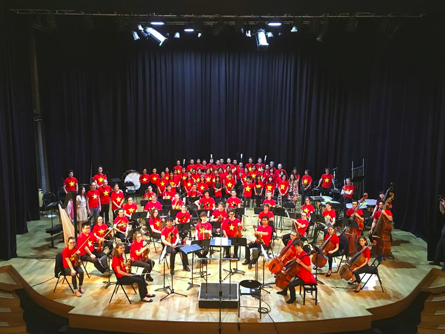
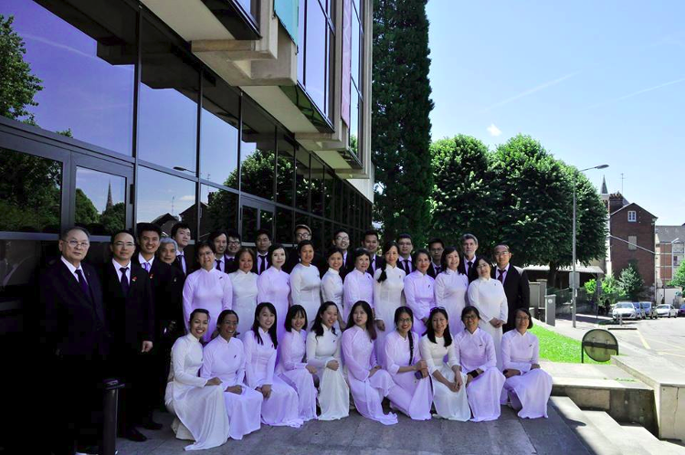

<!--
title: Kỷ niệm không quên
author: HH
-->
   

 Xuất phát: ga Paris St Laraze 19h25, đến: ga Rouen Rive Droite 20h45 thứ 5 ngày 07/07/2016”, lật chiếc vé tàu trên tay, Hiển – cậu bé 7 tháng của gia đình HCQH gần 7 năm tuổi nhìn dòng chữ với tâm trạng bồn chồn vì đã 19h kém mà con tàu RER anhvẫn chầm chậm dưới đường metro tối mờ trong lòng thủ đô Paris.  Cuối cùng hắn cũng thở phào khi con tàu dừng ở bến Auber, bước xuống nhanh chóng, hắn lách qua dòng người da trắng, da đen, da vàng… đa sắc tộc để lên con phố Amsterdam dẫn tới ga Saint Lazare, cùng với các anh chị em trong gia đình Hợp ca Quê Hương (HCQH), đến thành phố Rouen thu âm CD “tổ quốc yêu thương”, dự án âm nhạc đầu tay mà chú Tích Kỳ, cô Ngân Hà – 2 ng bạn đời, 2 ng đồng phụ trách dàn hợp xướng HCQH, đã nhen nhóm ý tưởng từ cách đây 2 năm, và cả gia đình HCQH đã hăng say tập luyện, chuẩn bị trong suốt 6 tháng trở lại đây. Đã 19h nhưng mặt trời vẫn chưa muốn nghỉ ngơi, nắng hồng nghiêng nghiêng với phương ngang lan tỏa khắp sân trước ga Saint Lazare, bừng lên nét rạng rỡ trên khuôn mặt của dòng khách du lịch và cổ động viên khi mùa bóng đá euro đang đi vào những trận bán kết hấp dẫn, căng thẳng. Dưới ánh nắng hồng đó, ga Saint Lazare, ga tàu bận rộn thứ 2 của châu Âu, càng sống động hơn với kiến trúc cổ kính kiểu Pháp, ẩn bên trong là những dịch vụ ăn uống, nghỉ ngơi, chờ đợi tiện nghi, hiện đại cho hành khách. Tự thống nhất với nhau từ trước, mọi thành viên trong HCQH tìm đến quán café Starbuck bên trong nhà ga, ở đó anh Tuấn, anh Chiến, em Hằng và em Kiều Anh đang chờ đợi các thành viên còn lại.

Vừa bước lên thang máy, vừa đọc tin nhắn của các anh chị em, Hiển rẽ ngang tìm đến sân trước cửa vào quán café, gặp em Kiều Anh, cô gái xinh xắn với nụ cười tươi, khuôn mặt trẻ trung, ăn ảnh, là thành viên mới trong bè alto của HCQH, cô sinh viên mảnh mai chạc tuổi 22, 23 mà Hiển chưa có dịp tiếp xúc và chỉ được nghe về khả năng chơi đàn piano và ca hát nhiều năm của em. Khả năng hát chuẩn của Kiều Anh được cả cô Xuân Oanh, người cô Bến Tre với nụ cười dịu dàng, duyên dáng trong bè alto, khen trong 1 buổi tập trước chuyến đi Rouen. Vì thế Kiều Anh nhận được sự tin tưởng nơi cô Ngân Hà và cô đã đề nghị em đi cùng HCQH cho dự án CD lần này. Mỉm cười rồi chào Kiều Anh, Hiển đến gần chỗ em Lệ Hằng và anh Chiến đang ngồi. Lệ Hằng tươi cười rồi 2 anh em vào quán mua đồ uống xua đi cái nóng Paris, còn anh Chiến ở lại bên ngoài chờ đợi và nhận tin nhắn của anh em, bè bạn. Gia đình HCQH đông đủ hơn khi anh Hà, anh Quân, anh Hiệp, anh Việt, chị Lâm, em Minh Anh, Minh, Nga, Đạt … lần lượt có mặt, người nọ đợi người kia rồi giữ dùm nhau hành lý trong khi chờ tàu khởi hành. 19h15, anh Quân, Hiển, Đạt giục nhau đi tìm cho đủ những thành viên đang trong Starbuck, tất cả nhắc nhở nhau cùng quyẹt vé và lên tàu. Bước lên từng toa tàu trong tiếng ầm ầm, tiếng hành lý, tất cả ổn định chỗ ngồi, không khí vui tươi cùng sự yên tâm hiện rõ trên khuôn mặt mọi thành viên. Chuyến tàu Paris – Rouen dần dịch chuyển, mang theo trong lòng những người con của HCQH, những chiến sĩ trong lĩnh vực âm nhạc đến với mặt trận nghệ thuật, sân khấu của nhạc viện Rouen, một chuyến đi với nhiều thử thách, khó khăn và có lẽ là chuyến đi khắc nghiệt nhất trong 6 năm qua của HCQH khi mà tính chuyên nghiệp, sự chính xác trong từng bản nhạc được yêu cầu khắt khe. Thử thách đó đã tạo ra không ít áp lực cho gia đình HCQH trong 6 tháng qua nhưng giờ đây khi ngày thu âm được đếm lùi từng giờ, thử thách đó cùng với tình yêu dành cho âm nhạc, cho con người đất nước Việt Nam trở thành động lực khiến mọi thành viên tự tin hơn, phấn khởi hơn. Những câu chuyện vui đùa, những tin nhắn động viên, điểm danh nhau mà người khơi mào là chuyên gia pha trò Phạm Đạt lan tỏa mọi toa tàu có mặt HCQH, xua đi sự lo lắng căng thẳng 15 phút trước của anh Quân,  xua đi sự gấp gáp của anh Việt khi tìm anh em, bè bạn ở những đường voie, xua đi những tin nhắn vội vã, bồn chồn liên tục trên fb của chị Lâm khi hỏi đia điểm tập trung của cả gia đình đồng thời cũng làm yên tâm em Minh Anh – thành viên cũ của bè bass và cũng là 1 pinanist tài năng của HCQH đã quay lại cho dự án CD theo lời đề nghị của anh Trần Mạnh Hà và cô Ngân Hà. 

Con tàu vùng Ile de France – Normandie dần đi ra khỏi Paris dưới ánh nắng hồng nghiêng nghiêng sóng sánh 2 bên thân tàu, băng qua từng con kênh, đồng cỏ, rừng cây, trang trại xanh mướt tiến về miền Tây Bắc nước Pháp, thong dong và đung đưa theo điệu nhạc, tiếng chơi bài, nhịp nói chuyện vui đùa về cuộc sống, về âm nhạc, về sở thích và công việc của các thành viên trong HCQH, con tàu đến Rouen lúc 21h15. Mệt mỏi sau 1 ngày học tập, làm việc gia đình HCQH chia nhỏ thành nhiều nhóm tìm đến các khu trọ mà cô Ngân Hà đã đặt sẵn. Rouen tối nay ngoài khu trung tâm gần nhà thờ và các quán ăn phục vụ không khí Euro thì các con phố khác đều yên tĩnh, thoảng nghe trong nắng có tiếng gió nhè nhẹ, man mát. Men theo con đường nhỏ đầy sỏi cát và gạch lát đã mòn theo năm tháng, anh Quân dẫn nhóm của mình về khu trọ riêng trong cùng tòa nhà với cô chú Ngân Hà, Tích Kỳ. Đến tận bây giờ, khi rảo bước cùng anh Huy, em Minh Anh trong bè bass, Hiển mới nhận thấy sự thiếu vắng em Mạnh, cậu em cao cao, hiền lành, dễ gần, dáng thư sinh mới quay lại tập cùng bè bass giúp cho bè bass hát tốt hơn và dày hơn. May mắn cho gia đình HCQH khi Mạnh vẫn sẽ sát cánh cùng anh em, bè bạn cho dự án CD nhưng em sẽ đến Rouen trong chuyến tàu muộn hơn vào tối nay. Còn lý do Mạnh đến muộn thì phải 2 ngày sau, trên chuyến tàu về Paris khi có dịp ngồi gần và nghe anh Hà kể lại, mấy anh em mới biết rõ rồi cùng với những câu chuyện bất ngờ, thú vị khác sâu trong lòng HCQH ngay trước chuyến đi khiến dòng cảm xúc trong Hiển dâng trào để rồi 1 tuần sau đó, hình ảnh gia đình HCQH choán đầy tâm trí hắn cùng với những ý văn, vần thơ ngay cả trong giấc ngủ. Đến khu trọ, mấy anh em bắt gặp giọng nói, nụ cười gần gũi, thân quen của cô chú Ngân Hà, Tích Kỳ khi đang ngồi nghỉ ngoài thềm. Chú Kỳ vẫn luôn vững vàng vượt qua mọi vấn đề sức khỏe để lái chiếc xe đưa người vợ thân yêu – cô Ngân Hà cùng những thành viên khác như em Hoàng, em Đăng – 2 bạn trẻ, 2 cổ động viên nhiệt tình sẽ âm thầm cổ vũ và ghi lại mọi khoảnh khắc trong 2 ngày tới cho HCQH, vượt hơn 200 cây số đến Rouen từ sáng hôm nay. Cô Ngân Hà đã ăn tối nhưng chưa nghỉ ngơi, cô vẫn tất bật với chuyện thu âm ngày mai, chuyện hóa đơn các khu trọ, chuyện ăn uống cho cả gia đình HCQH, … Mọi thứ từ nhỏ tới lớn đều do cô trực tiếp hoặc gián tiếp chăm lo như một người mẹ âm thầm hi sinh cho cả gia đình HCQH. Cùng với cô, chú, các thành viên khác như cô Bạch Mai, cô Tuyết Thanh, cô Thúy, cặp vợ chồng Pierre-Catherine, chị Hoàng Anh, chị Trân, em Bảo Linh… cũng đi ô tô đến Rouen và sẵn sàng cho thử thách ngày mai. Ngoài ra còn có chú Cảnh – một nhà quay phim, nhiếp ảnh chuyên nghiệp, với sự yêu mến dành cho HCQH, chú cũng một mình đến Rouen từ sáng để sẵn sàng lưu lại mọi kỷ niệm. Hành trình thuận buồm xuôi gió từ Paris đến Rouen của cả gia đình HCQH hứa hẹn sự khởi đầu suôn sẻ cho dự án CD. Tối nay thành phố Rouen chào đón tiếng cười, giọng nói, giọng hát của gia đình HCQH còn âm thanh của dàn nhạc Rouen dưới sự chỉ đạo của nhạc trưởng Claude đã ngân lên và sẵn sàng từ hôm qua khi ông cùng với kĩ sư âm thanh Christhophe hướng dẫn dàn nhạc thu trước nhạc nền cho 1 số ca khúc của HCQH. Chào nhanh cô chú, anh Quân và Minh Anh cùng cả nhóm tìm đến khu fan zone gần nhà thờ trung tâm thành phố Rouen để ăn tối và hòa cùng không khi bóng đá khi trận bán kết Pháp – Đức sắp diễn ra, ở đó họ sẽ gặp lại anhViệt, anhChiến, anhHiệp bên khu trọ khác. Cùng gặp nhau trong 1 quán ăn nhanh, tinh thần phấn khởi, hào hứng cho dự án CD của mấy anh em như 1 luồng gió mới thổi thêm và hòa vào không khí cổ vũ của người dân Rouen. Tối nay Pháp đã vượt qua Đức 1 cách thuyết phục nhờ thiên thời, đia lợi, nhân hòa. Hy vọng ngày mai với cùng điều kiện tương tự đó, HCQH sẽ vượt qua chính mình, vượt qua những khắt khe trên từng bản nhạc để thu âm thành công dự án CD. Trở về các khu trọ khi mà không khí vui sướng của người dân Pháp tràn ngập các nẻo đường, những người con của HCQH chuẩn bị nghỉ ngơi để dành sức cho ngày mai. Lúc này em Mạnh trong bè bass cũng đã kịp đến Rouen và hòa cùng anh em. Về đến phòng, Hiển vừa ngồi nghỉ thì tiếng gõ từ bên phòng của Minh Anh, Mạnh, Hoàng, Đăng hỏi mượn bàn là để chuẩn bị chu đáo và đẹp đẽ nhất cho buổi thu âm ngày mai. Không khí tắm rửa, chải chuốt, là quần áo từ phòng Minh Anh – phòng mà mấy anh em gọi đùa là phòng của 4 người đẹp trở nên nhộn nhịp, gấp gáp hơn lan tỏa sang phòng của Hiển và anh Huy. Không khí chuẩn bị về cả nội dung và hình thức cũng nhộn nhịp không kém bên các khu trọ khác khi bên khu anh Tuấn, khu em Lệ Hằng, mọi thành viên cùng xếp các bài theo thứ tự vào tập bài hát rồi đánh tên, đánh số cho dễ tìm. Hơn thế, trong lúc xếp bài Duy Tâm đã xoay sở khéo léo khi đệm đàn piano qua ứng dụng trên điện thoại giúp anh Dũng và anh Tuấn tập bài “Ca ngợiTổ Quốc  ”, chiếc áo dài trắng Việt Nam cũng đẹp hơn dưới bàn tay đang là của các cô gái xinh đẹp trong HCQH. Bên khu trọ khác, các anh Chiến, Việt, Hiệp ngồi trước màn hình thư giãn để chuẩn bị tâm lý tốt cho ngày mai. Anh Hiệp – anh trưởng bè tenor thường giản dị, dễ gần qua những chiếc áo phông trong những buổi tập của HCQH, tối nay cũng chu đáo, chau chuốt hơn khi hỏi mượn bàn là các anh chị em khác để sáng mai qua sớm chuẩn bị cho kịp. Đã gần 12h đêm nhưng tinh thần phấn khởi đó vẫn tiếp tục và được chia sẻ liên tục, chóng mặt qua tin nhắn theo nhóm trên facebook để động viên lẫn nhau, lên dây cót tình thần cho nhau. Hai buổi thu âm sắp đến gần theo từng giờ như những kì thi đại học hay tốt nghiệp đại học, kì thi quan trọng trong cuộc đời của mỗi con người và đêm nay những người con của HCQH như những sĩ tử với sự phấn khởi, tự tin, quyết tâm và cả lo lắng đan xen. Đêm nay khi người dân Pháp ko ngủ vì hạnh phúc, tự hào khi đội tuyển quốc gia của họ vào chung kết Euro thì những người con của gia đình HCQH ngay cả khi đã đi nằm nghỉ cũng khó có thể ngủ hoặc thậm khí không thể ngủ ngon khi nghĩ về dự án CD ngày mai. Cùng chung tình trạng đó là chú Tích Kỳ và cô Ngân Hà, chú Kỳ đã phải nhờ tới nhiều liều thuốc, nhiều loại thuốc để chống lại những cơn đau hay khó thở, khi cơn đau giảm đi thì cũng là lúc phản ứng phụ của thuốc nổi dậy khiến khớp và đầu gối chú đau, cùng với sự lo lắng cho bè bass, cho đàn con của HCQH chú lại có 1 đêm trắng. Cô Ngân Hà ngoài nỗi lo cho dự án CD đeo đẳng suốt 6 tháng qua, giờ lại thêm lo lắng hơn trước tình hình sức khỏe của chồng.

8h sáng thứ 6 ngày 8/7, bình minh đã lên từ sớm phả vào thành phố Rouen nằm chênh vênh bên bờ sông Seine thơ mộng, tất cả mọi thành viên trong HCQH tỉnh giấc và tự chuẩn bị cho mình bữa sáng từ đồ ăn mà chị Trân – người chị nhiệt tình trong bè soprano đã rất cẩn thận, chu đáo mua từ Paris và vận chuyến đến Rouen. Rảo bước trên các con phố quanh co rồi các đại lộ lớn trong lòng Rouen, từ các khu trọ khác nhau, gia đình HCQH tập trung về nhạc viện Rouen lúc 9h sáng giờ địa phương. Tìm đến phòng thay đồ, Hiển bắt gặp hình ảnh các cô chú, cách anh chị em đang chỉnh lại trang phục, ai đó ngắm mình trước gương trong tà áo dài trắng truyền thống rồi mỉm cười, ai đó khoác lên chiếc áo vest, ai đó nhờ ai khác thắt dùm ca vát. Hôm nay tất cả đều xinh hơn, đẹp hơn qua bộ đồng phục: nữ áo dài trắng còn nam quần âu, vest – bộ đồng phục truyền thống của gia đình HCQH, cùng với hình ảnh giọt máu đỏ - biểu tượng cho tinh thần của HCQH được dán trên tập bài hát, hay trên huy hiệu đính bên trái ngực mỗi thành viên mà chú Kỳ vừa hân hoan, phấn khởi phát cho mỗi anh chị em. Khi vừa xong khâu hình thức, gia đình HCQH tập trung ngay vào nội dung, vào việc sắp hàng ngũ theo chỉ đạo của cô Ngân Hà, vào việc khởi động miệng và giọng hát qua sự hướng dẫn của Bảo Linh. Vẫn nụ cười, giọng nói và ánh mắt một mí dễ thương đó, cô em út của HCQH làm mẫu để mọi người biết cách lấy, giữ, đẩy hơi từ bụng, từ hông rồi hát từ nhiều vùng khác nhau trong khoang miệng, kể cả những vùng gần mí mắt hay cao trên đầu với độ cao và nhịp hát tăng dần. 

9h30 sáng khi tất cả đã sẵn sàng thì cũng là lúc nhạc trưởng Claude bước ra từ sân khấu, ông nở nụ cười với lời chào “Bonjour” rồi mời HCQH vào phòng thu âm. Hôm nay dàn nhạc Rouen và dàn hợp xướng sẽ cố gắng làm việc từ 9h30 đến 20h để thu 6 trong 11 ca khúc bao gồm: Ca ngợiTổ Quốc  ,Tổ Quốc  gọi tên mình, Việt Nam quê hương tôi, Tình em biển cả, Du kích sông Thao và Tiếng hát người chiến sĩ biên thùy. Bước vào phòng thu trong không khí trang nghiêm, HCQH được ông Claude, ông Christhophe và các nhạc công trẻ trung của nhạc viện Rouen chào đón nồng nhiệt qua ánh mắt đầy mến khách và nụ cười thân thiện. Chưa kịp ngồi ấm chỗ, Hiển đã bị ấn tượng và choáng ngợp trước không gian âm nhạc chuyên nghiệp, khép kín nhưng thoáng đãng, hiện đại nhưng cũng cổ điển, sang trọng của âm thanh, ánh sáng và cách bố trí các micro theo nhóm, các nhạc cụ trong phòng thu. Từ trên cao những khối đèn đẹp lung linh với ánh sáng hồng đỏ pha trộn, tập trung chiếu vào sân khấu nơi nhạc trưởng Claude đứng rồi đến khoảng 30 nhạc công và hơn 30 thành viên của HCQH đứng cuối sát với những tấm thảm màu đen chạy vút lên cao. Đối diện là khán đài 2 tầng phủ 1 màu đỏ - màu của sự cuồng nhiệt và đam mê khiến các khán thính giả có thể cảm nhận rõ nét nhất từ nhiều góc độ. Trên khán đài đó, hôm nay có mẹ của chị Đồng Ngọc Linh đến theo dõi và cổ vũ con gái, có chú Cảnh đang say sưa chụp ảnh và ghi hình, có em Hoàng, em Đăng và chồng conc của cô Xuân Nam cũng đang cổ vũ và lưu lại mọi khoảnh khắc cho người thân và cho cả HCQH. Không để mất thời gian, nhạc trưởng Claude bắt đầu hướng dẫn dàn nhạc và hợp xướng với ca khúc đầu tiên “Ca ngợiTổ Quốc  ”. Theo điệu vẩy tay của ông Claude, luồng âm thanh của rất nhiều nhạc cụ cùng vang lên sống động, mạnh mẽ cùng với luồng ánh sáng của phòng thu dội thẳng vào con tim trước khi vọng lên trí óc của người thưởng thức, của tất cả các thành viên HCQH. Ấn tượng đặc biệt sâu sắc về nhạc trưởng Claude là khuôn mặt của ông, đôi tai lớn và rộng hơn người thường, đôi tai dành riêng cho âm nhạc hướng ra xa nhiều phía để nắm bắt và tổng hợp âm thanh từ giọng hát của nhiều bè hay từ nhiều nhạc cụ khác nhau. Cùng với đôi tai là ánh mắt nhìn xuyên thấu tâm hồn người đối điện, vầng trán  cao, rộng khiến ông có thể tập trung, sáng tạo tối đa khi điều khiển cả dàn nhạc và dàn hợp xướng, khi cần sửa đổi trong các bản nhạc. Lần đầu gặp ông Claude, hẳn không ít người nghĩ ông là người rất khắt khe trong công việc, trong cuộc sống và cũng có phần “dữ dằn” nhưng sự thực hoàn toàn trái ngược, ông luôn nở nụ cười động viên khi phát hiện lỗi hát chưa tốt của từng bè trong HCQH hay lỗi của từng nhạc công, đôi khi ông pha chút hài ước xua đi sự căng thẳng mệt mỏi hay những câu nói lịch sự, nhẹ nhàng khi thay vì nhắc HCQH đừng chỉ chăm chú nhìn lời bài hát, ông nói các bạn hãy hát như thuộc lòng, hát bằng trái tim (chantez par le coeur). Sau nhiều lần chỉnh sửa uốn nắn từng bè rồi hát đi hát lại với dàn nhạc, “Ca ngợiTổ Quốc  ” – bài hát với nhịp điệu nhẹ nhàng và thắm đượm tình yêu thương đã được thu thành công. Chất lượng của mỗi bản nhạc không chỉ được đảm bảo bởi nhạc trưởng Claude Brendel mà còn được đảm bảo, nhất trí về mặt trường độ, cao độ, khả năng hòa hợp với dàn nhạc bởi kỹ sư âm thanh Christhophe Mazzella. Tốt nghiệp học viện âm nhạc Paris danh tiếng, ông Christophe đã có hơn 20 năm thâm niên với hơn 50 dự án CD do ông thực hiện cho các đối tác nổi tiếng như Sony hay TV5Monde. Ẩn trong con người mảnh khảnh đó là khối óc tập trung, đôi tai âm nhạc tuyệt vời và sự bền bỉ khi ông rất bận rộn nhưng vẫn dành thời gian ưu ái nhất định cho HCQH. Nhắc đến tên ông, bất cứ một dàn nhạc hay dàn hợp xướng chuyên nghiệp nào cũng phải lo lắng, áp lực trước thái độ làm việc nghiêm túc, tỉ mỉ và khắt khe của ông, nỗi lo lắng, áp lực đó tăng lên nhiều hơn với dàn đông ca không chuyên như HCQH. Nhưng hôm nay thay vì hình ảnh một kĩ sư bắt và sửa lỗi nghiêm khắc trên từng nốt nhạc, ông Christophe như 1 người bạn và đứng cùng HCQH qua cách ông trực tiếp xuống sân khấu căn chỉnh, chọn ví trí cho các micro rồi ông nở nụ cười thân thiên động viên các bè trong gia đình HCQH. Phòng cách làm việc chuyên nghiệp của ông còn được thể hiện thông qua những yêu cầu phù hợp cho từng đối tượng: với dàn nhạc chuyên nghiệp Rouen, là một sự đòi hỏi chính xác tuyệt đối đến từng nốt của các nhạc cụ, còn đối với dàn hợp xướng không chuyên HCQH thì đó lại là tinh thần làm việc nghiêm túc và bầu không khí thoải mái.

Ca khúc đầu tiên đã được thu âm thành công khiến HCQH tự tin và phấn chấn hơn nhưng khó khăn lại ùa đến khi thiếu đi sự đóng góp của anh Lê Quốc Việt cho những ca khúc tiếp theo. Anh Việt – người anh cả của bè tenor dù ở tuổi 37, 38 vẫn luôn hoạt động sôi nổi trong phòng trào văn hóa, văn nghệ của hội sinh viên VN tại Pháp. Anh hát rock, hát nhạc trẻ, nhạc cách mạng rồi chơi cả đàn guitar cho nhiều hội, người anh mà hầu như tất cả các bạn trẻ đều biết đến như một nghệ sĩ bán chuyên. Nhưng hôm nay thật không may khi anh ốm rồi ho và không hát tiếp được, anh vội ra ngoài tìm thuốc đồng thời tránh không để ảnh hưởng tới việc chung của HCQH. Thương và cảm thông cho anh Việt, các anh em trong bè tenor quyết tâm hơn để thu âm ca khúc thứ 2 “Tổ Quốc gọi tên mình” khi mà tất cả cùng chầm chồ, cổ vũ anh Tuấn bước lên, đứng giữa trung tâm 4 bè để thực hiện phần solo. Anh Tuấn hát tốt sau một vài lần khi mà anh nhạy bén tiếp thu ý kiến giữ hơi, kéo dài cho đủ trường độ và vào cho đúng trong những đoạn solo của nhạc trưởng Claude. “Tổ Quốc gọi tên mình” là một ca khúc dài gồm nhiều đoạn phải lên cao, đòi hỏi nhiều sức lực của người hát, chính vì vậy đôi khi trong tiếng nhạc, tiếng hát thử đã có chút ít tiếng sủi bụng vì đói và mệt của 1 vài thành viên. Bằng nghị lực của tất cả, ca khúc đang đi về cuối và mọi thành viên lại hít sâu, nín thở, im lặng tuyệt đối chờ điệu vẩy tay xuống kết thúc bài của nhạc trưởng Claude. Trong giây phút đó, lồng ngực căng lên, những năm tháng cắp sách tới trường ùa về trong Hiển, đặc biệt là những khoảnh khắc lặng im nhìn lá cờ đỏ sao vàng bay phấp phới và cùng lắng nghe quốc ca, cảm xúc tự hào, thiêng liêng khó tả về Tổ Quốc mà bây giờ hắn lại có dịp được cảm nhận nơi đất khách quê người. Sự tự hào và thiêng liêng theo đúng tinh thần mà bài hát thể hiện cũng là thông điệp mà HCQH gửi tới bạn bè quốc tế rằng :  Hoàng Sa và Trường Sa đã và sẽ mãi mãi là của Việt Nam. Việt Nam chúng tôi không bao giờ đánh đổi điều đó bằng bất cứ giá nào.

Thời gian đang trôi về giữa trưa, HCQH cùng dàn nhạc tiếp tục thu âm ca khúc “Việt Nam quê hương tôi” của nhạc sĩ Đỗ Nhuận với nhịp hát nhẹ nhàng du dương như những cơn gió thổi qua từng hàng dừa, khóm tre. Dù không biết đọc tiếng Việt nhưng qua tựa đề, 1 vài lời dịch và nhịp điệu, nhạc trưởng Claude thấm trong mình ý nghĩa và cảm xúc của từng bài hát, ông khuyên HCQH nên thổi hồn vào và hát thật tình cảm ca khúc này bằng cách hát nhỏ, khép miệng ở những đoạn vocalise, luyến láy và thả giọng tinh tế ở một số từ cuối câu cho hợp lý. Dàn nhạc trẻ Rouen với nhiều thành viên đa sắc tộc cùng với dàn đồng ca quê hương gồm 4 thế hệ người Việt tại Pháp và cả các người nước ngoài đang thở, im lặng cùng 1 nhịp theo động tác vẩy tay của nhạc trưởng Claude. Khi tay ông thả xuống và câu nói “ổn”, “ok”, “tuyệt vời” hay “hoàn hảo” của kĩ sư âm thanh Christophe vang lên, ai cũng thở phào nhẹ nhõm. Khép lại nửa ngày làm việc khẩn trương và hiệu quả, mọi thành viên tập trung ra khu vườn nhỏ trong lòng nhạc viện Rouen tận hưởng bữa trưa đậm đà hương vị Việt Nam qua thịt gà, thịt bò, thịt lợn xào cùng với cơm và rau để lấy lại sức, nghỉ ngơi chuẩn bị cho việc thu âm chiều nay lúc 14h30. Để có được bữa trưa đầy đủ cho hơn 60 thành viên, anh Bình, chị Linh – 2 vợ chồng trẻ, chủ một quán ăn Việt tại Rouen đã phải rất cố gắng, tất bật chuẩn bị từ hôm qua. Chị Linh dù đang mang trong mình đứa con thân yêu sớm chào đời vẫn nhiệt tình xào nấu rồi xếp gọn trong từng hộp để anh Bình gửi đến và làm ấm lòng HCQH, để đứa con tinh thần của HCQH ra đời suôn sẻ.

14h30 chiều, nhạc trưởng Claude lại là người đầu tiên thục giục mọi thành viên vào vị trí để thu âm 3 ca khúc tiếp theo. Ông luôn vững vàng đứng trên bục chỉ huy nhịp nhàng, ông đã đứng như vậy suốt buối sáng hôm nay và sẽ đứng trong cả chiều nay và ngày mai. Hơn ai khác, ông chính là người cần được mọi người động viên và khuyên nghỉ 1 chút nhưng hoàn toàn ngược lại, ông luôn chủ động cho các bè ngồi xuống nghỉ khi chưa thu âm hoặc đang tập cho bè khác. Nhìn phong cách làm việc say mê với sự bền bỉ không tưởng cùng những động tác vẩy tay phấn khích theo cảm xúc của bản nhạc, HCQH thấy mình thật may mắn và càng khâm phục, quí mến, trân trọng những đóng góp chân thành của ông. Chiều nay, mọi thành viên sẽ thay đổi trang phục, một sự thay đổi không nhiều nhưng để lại ấn tượng mạnh mẽ, đặc biệt với những người con đất Việt. Trong phòng thu bây giờ là một rừng cờ đỏ sao vàng khi các thành viên khoác lên mình chiếc áo phông mang hình quốc kỳ Việt Nam. Càng tự hào hơn khi chính ông Claude đã chủ động đề nghị với cô Ngân Hà về việc dàn nhạc mặc cùng đồng phục cờ đỏ sang vàng với HCQH.

Ca khúc thứ 4 với tựa đề “Tình em biển cả” được HCQH dàn dựng khéo léo, độc đáo nhưng rất tự nhiên, như 1 câu chuyện tình yêu trong cuộc sống vậy. Ban đầu 2 bè nữ và nam sẽ hát riêng để cuối cùng hòa hợp với nhau, để có được tất cả những nét đẹp trong giọng nữ và giọng nam. Ngồi trên khán đài thưởng thức ca khúc, Hiển không thấy mình hụt hẫng mà trái lại, hắn thấy mình may mắn khi được ghi nhận không khí làm việc ở nhiều hoàn cảnh, nhiều góc nhìn khác nhau khi là người trong cuộc đứng hát, khi là khán giả. Ở lượt hát đầu tiên, người nghe cảm nhận sự mãnh liệt, cao vút qua giọng cô Bạch Mai, sự truyền cảm của cô Xuân Nam, cô Thúy, chị Trân, em Quỳnh Nga, Diệp Minh, Lệ Hằng và sự tinh tế qua giọng Bảo Linh. Không kém phần đẹp đẽ, khi ở lần 2 là sự trầm vang anh Hà, em Minh Anh và Mạnh bên bè bass cùng sự nhẹ nhàng, bay bổng của các anh em tenor. Sự du dương, dạt dào tình cảm, êm đềm như 1 lời ru của ca khúc cộng với sự mệt mỏi từ chính bản thân khiến 3 anh em Việt, Huy, Hiển trên tầng 2 khán đài ngủ từ lúc nào không biết.

Ở ca khúc thứ 5 “Du kích sông Thao” với nhiều đoạn nhịp hát khác nhau, lúc da diết, lúc trầm hùng bi tráng, lúc sôi động, hừng hực nhạc trưởng Claude tiếp tục hướng dẫn và sửa cho cả 4 bè. Bè bass khi cô Ngân Hà bận không thể trợ giúp cũng đã độc lập hát, thống nhất với nhau về nốt và nhịp để vào chuẩn và ngân đủ. Với sự hướng đẫn của ông Claude, bè tenor biết cách hát nhấn vào những nốt phù hợp để tạo nên sắc thái tinh tế cho bài hát theo nhịp đàn piano của Duy Tâm. Duy Tâm sát cánh cùng bè bass trong các ca khúc trước, giờ phải tách ra để đệm đàn piano cho đoạn 2 trong ca khúc. Nét căng thẳng hiện rõ trên khuôn mặt khi phải đệm lại nhiều lần cho khớp với dàn nhạc nhưng với tài năng âm nhạc của Duy Tâm, em đã làm tốt, và « Du kích sông thao », bài cuối cùng của ngày đầu tiên, cũng được thu âm thành công.

Trời Rouen đang trôi dần về chiều tối khi mà người dân nơi đây sắp tan ca, trở về nhà tận hưởng tối thứ 6 nghỉ ngơi nhưng trong sân khấu nhạc viện Rouen, âm thanh của dàn nhạc và giọng ca của HCQH vẫn vang lên qua ca khúc “Tiếng hát người chiến sĩ biên thùy” gồm 4 chương. Nhạc trưởng Claude cùng cô Ngân Hà thống nhất thu âm chương 1, 2 và 4 còn chương 3 với phần solo của anh Hiệp để lại cho ngày mai. Nhớ lại những hướng dẫn cách đây 1 tuần của ông Claude tại Paris, HCQH dù thấm mệt vẫn cố gắng hát đúng nhịp, giữ tốc độ hát nhanh như những bước chân băng rừng, băng đèo trong chương 2 và chương 4 nhưng cũng không kém phần tha thiết, tình cảm như trong chương 1. Đứng cuối bè tenor, anh Chiến vẫn vang lên giọng hát hào sảng, tự tin như những gì anhthể hiện trong cả ngày hôm nay và các buổi tập ở Paris. Đôi khi anh hát chưa chuẩn nhưng sau khi được các anh khác góp ý, anh tự sửa và hát đúng. Sự tự tin hiếm có của anh Chiến lan sang các anh em khác như Hiển – người hát chưa tốt trong bè tenor, hát nhỏ và thậm chí không dám hát những đoạn không chắc và những đoạn không lời. Cuối cùng mọi nỗ lực của cả dàn nhạc và dàn đồng ca được đền đáp xứng đáng khi nghe lời nhận xét “tuyệt vời” cùng sự nhất trí trong xúc động của ông Christophe. Khép lại ngày thu âm đầu tiên thành công, gia đình HCQH hài lòng nhưng không chủ quan vì biết rằng khó khăn vẫn chờ đợi vào ngày mai. Cảm ơn và chào tạm biệt nhạc trưởng Claude cùng kỹ sư âm thanh Christophe và các nhạc công, mọi thành viên HCQH trở về các khu trọ rồi chuẩn bị tập trung về bên cô Ngân Hà để ăn tối, nạp năng lượng cho ngày mai đồng thời thắt chặt tình đoàn kết, quan tâm nhau trong gia đình HCQH qua việc ăn bánh, chúc mừng sinh nhật em Quỳnh Nga. Quỳnh Nga – cô gái trẻ trung, vui tươi, tốt bụng và hát rất tốt trong bè soprano của HCQH đã đưa cho anh Hiển chiếc bánh để ăn giữ sức chiều qua, cô gái có nét duyên thầm mà anh Hiển kịp để ý khi ngồi cạnh em trong lúc em ngủ trên chuyến tàu đến Rouen. Nhìn Nga ngủ, anh Hiển thấy trong mình cảm giác bình yên, thấy nhẹ nhõm. Trở lại với không khí vui vẻ trong sinh nhật của em khi mà mọi người đang chia sẻ chiếc bánh thơm ngon, chiếc bánh mà sáng nay anh Quân đã lặng lẽ lùi lại phía sau các anh em trên đường đến nhạc viện và rẽ vào 1 cửa hàng rồi đặt mua vào buổi tối, làm quà sinh nhật bất ngờ cho Quỳnh Nga. Cùng chung vui với mọi người, cô Ngân Hà vẫn không quên những việc cần chuẩn bị cho ngày mai, cả ngày hôm nay cô vẫn luôn tất bật như vậy, trong khi hát và thu âm cô vẫn để ý điện thoại để tiếp đón đại diện các bên như anh Sơn bên thông tấn xã, anh Tuấn bên báo nhân dân, bác Bằng bên đại sứ quán và bác Vượng bên trung tâm văn hóa Việt Nam đến để cổ vũ và đưa tin về dự án CD, thậm chí cô còn tự thu âm những ca khúc mà HCQH đã hòa hợp cùng dàn nhạc Rouen. Cô luôn là người thức dậy sớm nhất nhưng cũng là người ăn muộn nhất và lên giường nằm nghỉ muộn nhất trong gia đình HCQH. Khi màn đêm buông xuống, chia tay cô chú, đàn con của HCQH lại chia nhau về từng khu trọ nghỉ ngơi, tự tin và lạc quan vào buổi thu âm ngày mai gồm chương 3 bài Tiếng hát người chiến sĩ biên thùy cùng 5 bài còn lại: Đất nước bên bờ sóng,Tổ Quốc  yêu thương, Lướt sóng ra khơi, Hồi tưởng, Thành phố ngàn năm văn hiến.

   

Ngày thu âm thứ 2 diễn ra không có gì thay đổi nhiều về khung giờ so với ngày thứ nhất. 9h30 sáng sau khi khởi động giọng hát, HCQH lại chỉnh tề trong trang phục truyền thống và vào vị trí thu âm ca khúc “Đất nước bên bờ sóng”. Ở ca khúc này nhạc trưởng Claude đã sáng tạo thú vị, hợp lí khi ngắt đi một số đoạn vocalise của tất cả các bè để giọng solist của Bảo Linh được sáng hơn, rõ hơn và tinh tế như một cô ca sĩ chuyên nghiệp. Ca khúc tiếp theo với tựa đề “Tổ Quốc yêu thương” (chủ đề của CD), tất cả mọi người đắm chìm trong cảm xúc tha thiết yêu thương Tổ Quốc Việt Nam. Bản phối dàn nhạc hợp xướng của Trần Mạnh Hùng đã thực sự làm hoàn hảo ca khúc vốn đã rất đẹp cả về ca từ lẫn giai điệu của nhạc sĩ Hồ Bắc. Chính điều đó làm cho không ít thành viên Hợp Ca rơi nước mắt khi cất tiếng hát. Sau khi thu âm chương 3 bài Tiếng hát người chiến sĩ biên thùy với nhịp hát nhẹ nhàng, tha thiết cùng chất giọng solo đầy tình cảm của anh Dương Phú Hiệp, dàn nhạc và dàn hợp ca cùng chuyển sang bài tốp ca nam “Lướt sóng ra khơi” – ca khúc được đánh giá là 1 trong những bản thu âm thành công nhất của dự án CD lần này khi mà ông Claude và Christophe liên tục điều chỉnh để bản phối đạt được hiệu ứng âm thanh tốt nhất bên cạnh đó qua cảm nhận của cô Bạch Mai – giọng ca đầy kinh nghiệm trong cộng đồng người Việt tại Pháp thì sự hòa hợp giữa các anh em trong bè bass và tenor đã đạt đến mức độ nhuần nhuyễn như chỉ một giọng ca. Kết thúc buổi sáng làm việc căng thẳng, hiệu quả tất cả lại được nạp năng lượng qua món bò bún chả giò quen thuộc mang đậm hương vị Việt. Chỉ qua 2 ngày làm việc, HCQH không chỉ giới thiệu cho những người bạn Pháp âm nhạc Việt Nam mà còn cả ẩm thực Việt Nam. Bên cạnh đó những thành viên của HCQH và các nhạc công trẻ cũng có dịp giao lưu thể thao qua môn đá cầu, môn thể thao Việt xa lạ nhưng đầy hấp dẫn các bạn trẻ Pháp, môn thể thao mà có bạn ví von như badminton à pied. 

Buổi chiều làm việc cuối cùng bắt đầu bằng ca khúc kinh điển Hồi tưởng. Nét đặc biệt trong ca khúc này là có sự hòa thanh của 4 thế hệ người Việt Nam tại Pháp theo lời của chú Tích Kỳ qua sự góp mặt của nhóm thiếu nhi Âu Việt. Các em được sinh ra ở Pháp, nói tiếng Pháp nhưng đã rất cố gắng hiểu và hát tiếng Việt, cảm nhận sâu sắc lịch sử đất nước, con người Việt Nam. Đây chính là một phần tương lai của cộng đồng người Việt tại Pháp, là sự kết hợp giữa nét đẹp Việt-Pháp hay rộng hơn là nét đẹp phương Đông và phương Tây. Sau phần thu riêng của các em thiếu nhi là đến phần ghép với các anh chị và cô chú trong HCQH. Có thể nói đến thời điểm này sự mệt mỏi, xuống sức đã được thể hiện rõ trong giọng ca của các thành viên tenor với đoạn solist của mình. Lần lượt các nốt sol rồi fa đều không đạt được đúng cao độ khiến ông Claude và ông Christophe nhiều lần đề nghị thu đi, thu lại. Anh Quân sau một hồi gắng sức cho đoạn cuối của bài hát đã gần như mất giọng, Đạt cũng đành bỏ cuộc khi không thể lên tới sol. Có lẽ sự xuống sức của 2 soliste này đã ảnh hưởng không nhỏ đến sự tự tin của 2 soliste còn lại: anh Tuấn và anh Hiệp. Có những lúc cả khán phỏng như im lặng theo dõi phần trình diễn của 4 soliste và thỉnh thoảng Hiển bắt gặp những ánh nhìn âu lo của các thành viên khác như anh Dũng hay Bảo Linh. Có thể nói đoạn solo trong hồi tưởng của 4 soliste như một trận chung kết bóng đá căng thẳng, kịch tính, họ chính là 4 người đội trưởng, 4 ngôi sao và đây là giây phút cả tập thể cần họ tỏa sáng nhất. Cuối cùng, đáp lại sự cổ vũ, sự kỳ vọng, niềm tin của tất cả, 4 giọng ca đã hoàn thành trọn vẹn nhiệm vụ của mình trong tiếng thở phào cùng những tràng pháo tay rộn rã của cả gia đình HCQH và dàn nhạc Rouen. Nốt sol đã được chuyển tải 1 cách trọn vẹn bằng kĩ thuật giọng gió. Hy vọng các tenor sẽ tiếp tục duy trì phong độ này cho thử thách cuối cùng: ca khúc “Thăng Long – ngàn năm văn hiến”. Đây là giây phút thể hiện rõ nhất tinh thần đoàn kết và hỗ trợ lẫn nhau trong HCQH, đặc biệt là ở bè tenor, khi các giọng ca chủ lực đã xuống sức thì cũng là lúc những nhân tố mới như anh Chiến, anh Dũng trở thành chỗ dựa vững chắc cho cả bè. Trên tinh thần đó, đoạn soliste đẹp nhất của bè tenor – đánh dấu bằng 1 nốt fa đã được hoàn thành tốt đẹp. Đúng 20h, cả dàn nhạc, dàn hợp ca và các khán giả cùng đứng lên như một rừng cờ đỏ, vỗ tay chúc mừng lẫn nhau, khép lại 2 ngày làm việc khẩn trương, căng thẳng và hiệu quả. Tất cả những thành viên trẻ của HCQH như những thí sinh vừa thi xong kì thi cuối cùng, cậu em Phạm Đạt phấn khích ngỡ mình cầm sách trên tay, muốn tung lên không trung ăn mừng. Cùng với những tràng pháo tay là nụ cười hân hoan trong trong mắt nhau của nhạc trưởng Claude, kỹ sư âm thanh Christophe, dàn nhạc Rouen và gia đình HCQH. Hòa chung với không khí đó, Hiển vỗ tay đều và giòn hơn nhưng đôi khi hắn khựng lại, ánh mắt trầm tư cố dấu cảm xúc, ngược dòng thời gian trở về 2 tuần trước, hắn nhớ tới những giọt nước mắt của Bảo Linh, nét mặt căng thẳng của anh Quân hay giọng nói mạnh mẽ, đầy lo lắng của cô Ngân Hà sau giây phút tranh luận mà nguyên nhân xuất phát từ việc hắn cùng một hai anh em tenor khác hát chưa đúng nốt. Cảm động trước sự cố gắng, giúp đỡ của các thành viên, hắn trân trọng, quí mến gia đình HCQH hơn. Nghĩ về những giọt nước mắt bất lực lăn trên 2 má ửng hồng của Bảo Linh, hắn thấy thương cô em út của HCQH. Khẽ nhìn Bảo Linh từ xa rồi rón rén đến gần, miệng ấp úng hắn chỉ nói được đôi lời động viên: “Cô giáo uống nước, ăn bánh đi, rồi lát nữa lại hướng dẫn các anh tiếp nhé, bọn anh hứa sẽ cố gắng”. Quá khứ giống như kẻ pha trò và thích trọc ghẹo tương lai vậy. Ở 1 thời điểm nào đó, ta sẽ mỉm cười vì những giây phút ta đã khóc cùng nhau, khóc vì nhau nhưng cũng ở 1 khoảnh khắc nào đó, ta lại bật khóc vì những năm tháng ta đã được bên nhau, được gần nhau và vui cười với nhau. Tạm gác lại dòng chảy tương đối giữa buồn, vui, nụ cười, nước mắt, quá khứ và tương lai vì ngày hôm qua đã đi xa chỉ còn để lại những bài học, kinh nghiệm để áp dụng vào ngày mai nhưng ngày mai hãy còn chưa đến, vậy thì hãy sống trọn vẹn, hết mình để nâng niu giây phút của ngày hôm nay.  Trên tinh thần đó, những tràng pháo tay tiếp tục giòn giã và kéo dài khi cô Ngân Hà cảm ơn sâu sắc ông Claude, ông Christophe cùng dàn nhạc Rouen. Đáp lại tấm chân tình đó, ông Claude cũng không quên chúc mừng và cảm ơn HCQH vì những nỗ lực phi thường trong 6 tháng và 2 ngày qua, vì đã đem lại cơ hội hợp tác cho dàn nhạc Rouen. Ông cũng phấn khởi kể lại những cột mốc liên quan đến ông và âm nhạc Việt Nam trong 6 năm qua, những cột mốc tạo nên mối thiện cảm và sợi dây liên hệ giữa ông cùng các học trò và HCQH để có được dự án CD như ngày hôm nay. Tiếp tục bài phát biểu cảm động đó, ông cảm ơn và mời kỹ sư âm thanh Christophe xuống sân khấu. Ông Christophe nhấn mạnh và ghi nhận sâu sắc những đóng góp của nhạc trưởng Claude khiến tất cả đều long lanh ánh mắt cảm phục. Ông cũng không quên chúc mừng HCQH vì đã đạt được sự chính xác nhất định, sẽ được chấp nhận bởi công chúng khi mà thước đo chuẩn mực chính là đôi tai của ông và nhạc trưởng Claude. Hơn hết, ông cảm động vì tinh thần, vì cái hồn mà HCQH thổi vào trong từng ca khúc, cái hồn đó xuất phát từ sự đam mê, từ con tim, từ sự khổ công tập luyện của HCQH, thậm chí nó còn lớn hơn và đẹp hơn rất nhiều so với các dàn nhạc chuyên nghiệp khi mà họ chỉ tập trung được ít ngày trước khi diễn, lên sân khấu đôi khi chỉ hát và hát theo thời vụ, theo sự chạy xô của chương trình. Chính nghị lực của HCQH cùng cái hồn trong từng ca khúc đã chạm tới đáy lòng, tới những cung bậc cảm xúc cao nhất của ông Christophe để rồi sau đó trong những dòng mail đầy cảm động gửi HCQH, ông hứa sẽ tinh chỉnh tối đa những ca khúc để sớm bàn giao cho HCQH vào tháng 10 tới.

Trong khi đợi các thành viên giúp dàn nhạc Rouen thu dọn sân khấu, cô Ngân Hà đã kịp gửi lời mời ăn tối cùng HCQH đến nhạc trưởng Claude và kỹ sư Christophe. Tối nay họ và HCQH sẽ gần nhau hơn, hiểu nhau hơn và các thành viên trong gia đình HCQH sẽ có cơ hội được giao lưu học hỏi nhiều hơn từ 2 ông. Tạm biệt nhạc viện Rouen gia đình HCQH không quên lưu lại kỉ niệm qua những tấm hình trước cửa vào nhờ sự nhiệt tình của chú Cảnh cùng các cổ động viên khác. Cũng nhờ chú, em Hoàng, em Đăng, anh Sơn bên báo nhân dân, … mà trong 2 ngày nay HCQH đã lưu lại được rất nhiều khoảnh khắc đáng nhớ qua những bức ảnh, những video, những bài phỏng vấn của chú Kỳ, cô Ngân Hà, chị Liễu, … Trang kỉ niệm của HCQH cũng tự dày lên khi các cô gái xinh đẹp như Diệp Minh, Bảo Linh, Lệ Hằng, Kiều Anh, Hồng Nhung, Quỳnh Nga, Đồng Linh… hay các cô trẻ trung như cô Thúy… tự chụp cho nhau trong trang phục áo dài và áo phông cờ đỏ, sao vàng. Trở về các khu trọ rồi nhanh chóng tập trung bên cô Ngân Hà để cùng ăn tối, những bước chân của HCQH nặng trĩu, thấm mệt nhưng tâm trí thì hoàn toàn thoải mái và vui sướng. Buổi tối liên hoan xả gánh nặng, áp lực của HCQH chắc chắn sẽ tưng bừng những khu trọ vắng vẻ trong lòng thành phố Rouen. 21h30, không khí ăn tối của cả gia đình HCQH trở nên náo nhiệt hơn khi chào đón nhạc trưởng Claude và kỹ sư Christophe. Tất cả các thành viên đều muốn trò chuyện và giao lưu với 2 ông nhưng không gian ngoài thềm nhà không cho phép. Chú Kỳ, cô Ngân Hà, các cô chú khác cùng 1 số thành viên chính đại diện ăn tối cùng 2 ông trong khi đó tất cả các thành viên trẻ chuẩn bị tinh thần rảo bước sang khu trọ rộng rãi của anh Tuấn khi mà chương trình về một buổi tối “quẩy bung cảm xúc” đã được lên kế hoạch trước bởi đạo diễn Minh Anh. Giờ đây trong mắt Hiển, Minh Anh không chỉ là pianist tài năng của HCQH qua lời kể của anh Quân mà còn là 1 cậu em Hà Nội dễ gần, dễ thương, nhiều tài lẻ và biết cách pha trò. Chính Minh Anh trong lúc bận rộn khi thu âm vẫn cố gắng mua rượu, đồ uống, hoa quả để cùng các chị em làm tiệc coktail tối nay. Khu trọ nhà anh Tuấn chưa bao giờ vui như thế khi hết nhóm chơi uno rồi tú miền Nam, tú miền Bắc … reo hò. Không khí đó có chút của quán bar hay hộp đêm Paris, có chút giống cảnh gia đình quây quần và có nét giống những hội cờ bạc, tôm cua cá trong những ngõ nhỏ của vùng quê Bắc bộ vào những ngày tết Nguyên Đán. Trong khi thả mình vào cuộc chơi, HCQH vẫn không quên quan tâm lẫn nhau khi anh Hiệp bất ngờ nhận được chén rượu nồng chúc mừng sinh nhật. Vừa uống, vừa ngượng ngùng, khuôn mặt anh đỏ lên, ngộ nghĩnh và trẻ trung hơn rất nhiều so với độ tuổi ngoài 30. Không chỉ có bây giờ, khi thong thả mà ngay cả trong lúc tất bật cho việc thu âm, gia đình HCQH vẫn luôn thể hiện tinh thần đó. Hôm qua trong giây phút nghỉ ngơi, mọi thành viên vẫn kịp đàn và hát chúc mừng sinh nhật Quỳnh Nga, trước đó anh Quân dù biết sẽ đến nhạc viện muộn vẫn lùi lại, tự mình đặt bánh sinh nhật cho Nga hay cách đây 1 tháng trong 1 buổi tập tại Paris, anh Chiến dù nhà rất xa vẫn âm thầm mua bánh chúc mừng sinh nhật anh Dũng trong bè tenor khiến cho cả HCQH bất ngờ, xúc động. Những hành động lặng lẽ, chân thành đó thiết thực hơn rất nhiều những tin nhắn chúc mừng hời hợt khi vô tình biết sinh nhật ai đó trên facebook hay twitter,… Thậm chí tình yêu thương, quan tâm lẫn nhau đó còn quan trọng hơn cả việc thu âm khi mà chiều nay, cô Hà sẵn sàng đặt tập bài hát xuống, vội vã ra ngoài tìm chú Kỳ đang khó thở, cầm tay rồi cùng đi với chú vào trong sân khấu. Nắm tay và bước đi bên vợ, chú Kỳ dù ở tuổi hưu trí, vẫn mỉm cười như anh thanh niên khi tình yêu chớm nở. Hình ảnh cô chú cầm tay nhau cùng đi vào sân khấu như một nét phảy lãng mạn trong bức tranh mà HCQH đang vẽ bằng chính giọng hát của mình. Hình ảnh đó nếu ai để ý, hẳn sẽ vui lây, sẽ thấy hạnh phúc, may mắn thay cho chú Kỳ khi trong suốt đường đời luôn có sự sát cánh của người vợ đảm đang, giàu tình yêu thương, luôn luôn chịu đựng và nhường nhịn, người phụ nữ Việt Nam truyền thống gần như không thể tìm thấy ở thời bây giờ khi mà cái tôi, sự chiều chuộng, toan tính và thậm chí cả sự vất chất hóa được ưu tiên đẩy lên rất cao. Trở lại với không khí vui như hội của những người con HCQH, đêm đã sang 2h sáng ngày chủ nhật, thấm mệt rồi kiệt sức, Hiển cùng anh Huy – người đồng đội trong câu lạc bộ bóng đá BK trở về khu trọ của mình. Men theo những con phố ngoằn ngoèo, lờ mờ trong ánh đèn đỏ, cuộc sống về đêm trong lòng thành phố Rouen bình yên trở nên sống động và đầy cám dỗ đến từ những bóng hồng 2 bên đường. Gạt sang 1 bên những suy nghĩ tò mò về nét đẹp phương Tây xa lạ đó, để chỉ giữ lại trong tâm trí hình ảnh chiếc áo dài Hà Nội, Huế, Sài Gòn mà các cô, các chị em HCQH đã diện trong 2 ngày qua, 2 anh em tiến thẳng về khu trọ. Đến tận lúc này, chú Kỳ cùng cô Ngân Hà và 2 ông Claude, Christophe vẫn đang ngồi trò chuyện. Chú Kỳ đã cắt nghĩa cho 2 ông hiểu hơn về mục đích của dự án CD, ngoài đam mê và tình yêu dành cho âm nhạc, cho đất nước Việt Nam, những ca khúc về biển đảo cũng là tiếng nói riêng của HCQH về việc bảo vệ chủ quyền biển đảo, tiếng nói của những người Việt Nam chân chính, xuất phát từ trái tim chứ không do chính phủ Việt Nam hay bên thứ ba thúc giục. Tiếp đó, những câu chuyện về đời sống, về âm nhạc, … được 2 bên chia sẻ tới tận hơn 3h sáng. Cùng lúc đó, bên kia khu trọ anh Tuấn, các thành viên trẻ tiếp tục cuộc vui đến tận 4, 5h sáng.

Đêm thứ 7 mệt mỏi vì vui chơi và trò chuyện trôi đi nhanh chóng, thành phố Rouen lại đón ánh nắng hồng lên sớm, hòa cùng những cơn gió mát. Tiết trời đẹp, thuận lợi cho giao thông cũng là lời chào tạm biệt của thành phố Rouen với HCQH. 12h trưa, sau khi giải quyết các chuyện bên lề của dự án CD: hóa đơn nhà trọ, tiền đặt đồ ăn, … cô Ngân Hà, chú Tích Kỳ và các đoàn đi ô tô của HCQH trở lại Paris. Các thành viên trẻ còn lại cũng khẩn trương trả phòng và tập trung về ga Rouen Rive Droite, đợi chuyến tàu về Paris lúc 14h25. Cảm ơn và chào tạm biệt cô chủ nhà người Pháp mến khách, nhiệt tình, tốt bụng nhóm của anh Quân tìm đến khu vực nhà thờ, ở đó họ sẽ đợi các thành viên khác ăn trưa rồi cùng hướng về ga. Để tăng thêm thú vị và cùng vượt qua chính mình, trong khi chờ đợi, 5 anh em: Quân, Huy, Hiển, Minh Anh, Mạnh lại chơi uno, trò chơi như con dao 2 lưỡi khi người đầu tiên và cuối cùng về mặt điểm số phải tìm cách tiếp xúc thân tình với 1 thành viên nữ và 1 thành viên nam khác trong HCQH. Không may đứng cuối, Hiển phải tìm cách thân mật với anh Hà hơn, hắn lo lắng khi nghĩ anh sẽ trách mắng ở cái tuổi 26 mà vẫn chơi những trò trẻ con, ngớ ngẩn. Để giữ lời hứa với anh em, bạn bè, hắn cố gắng tìm mặt tích cực của vấn đề rồi mạnh dạn chạy lên trên bắt chuyện với anh. Hoàn toàn bất ngờ với cách ứng xử người lớn, mềm dẻo qua câu từ chối nhẹ nhàng của anh, 2 anh em trở nên hiểu nhau hơn để rồi từ đó Hiển thấy may mắn khi đứng cuối trò uno vì trong chuyến tàu về Paris, hắn được anh Hà kể lại ít nhiều những câu chuyện hậu trường của HCQH. Đến giờ, lý do cậu em Mạnh đến Rouen muộn đã được làm sáng tỏ, trước chuyến đi Mạnh báo với anh Hà ý định rút lui vì sức khỏe không cho phép sau ca mổ ruột thừa vừa mới qua. Căng thẳng và băn khoăn khi 1 bên là sức khỏe, là lời khuyên nghỉ ngơi của bác sĩ, 1 bên là tình cảm, trách nhiệm dành cho HCQH và lời hứa với anh Hà, Mạnh đã quyết định bỏ qua sức khỏe của bản thân để xuống Rouen sát cánh cùng bè bass. Trách nhiệm và bản lĩnh đó thật không dễ kiếm ở độ tuổi 22 của 1 cậu sinh viên mảnh khảnh, điều đó thật đáng quí và đáng trân trọng. Không chỉ có vấn đề sức khỏe của Mạnh, chính anh Hà cũng đã căng thẳng mệt mỏi trước áp lực công việc khi phải trả lời hàng trăm mail mỗi ngày, sát ngày thu anh bị cúm và mất giọng. Bằng tinh thần trách nhiệm của người anh trong lĩnh vực ngoại giao, anh không ngần ngại yêu cầu những liều thuốc vắc xin nặng từ bác sĩ để lấy lại sức lực và giọng hát cho dự án CD. Cùng với tình hình sức khỏe của chú Kỳ, bè bass đứng trước nhiều khó khăn, có thể ảnh hưởng rất lớn đến chất lượng của 11 ca khúc. Nhưng một lần nữa, họ lại chiến đấu như những chiến sĩ để biến những khó khắn đó trở thành sự tự hào của HCQH khi trong 2 ngày qua bè bass hát chuẩn và tốt trong từng ca khúc. Tiếp tục dòng chia sẻ của anh Hà, Hiển cũng biết được anh Tuấn trong bè tenor đã đau amidan sát ngày thu, ảnh hưởng trực tiếp tới chất giọng trong và cao của anh. May mắn thay, anh vẫn cố gắng đến với Rouen để hoàn thành những đoạn soliste và hát trong bè tenor. Khó khăn trên mặt trận văn nghệ là vậy, HCQH còn gặp những khó khăn lớn hơn trên mặt trận tư tưởng, mặt trận ngoại giao khi có lúc tưởng trừng chuyến đi bị hủy bỏ vì suy nghĩ, quan điểm khác nhau giữa các thành viên, giữa HCQH và các bên liên quan, khi chưa thể dung hòa được những cái tôi lớn giữa HCQH và các đơn vị khác hay những cái tôi đầy cá tính bên trong nội bộ HCQH. Nhưng bằng cách ứng xử hiểu người, hiểu ta, “lạt mềm buộc chặt” của cô Ngân Hà, chú Tích Kỳ và anh Trần Mạnh Hà, con tàu HCQH lại tiếp tục ra khơi thuận buồm xuôi gió trong dự án CD. Nghe đến đây mấy anh em đều xúc động và thấu hiểu câu nói của anh Hà: “Chuyến đi Rouen lần này để thu CD là một dự án không tưởng của HCQH”. Đong đưa theo nhịp kể chuyện cuốn hút của người anh trung niên, khả kính, con tàu băng qua những con kênh rồi đi ra xa vùng Normandie gồm mây, núi, đồng bằng và sông nước đan xen tiến về Paris lúc 16h.

Chuyến đi Rouen cho dự án CD đã thành công trọn vẹn trên nhiều phương diện, qua chuyến đi này HCQH đã vượt qua chính mình, đã học hỏi và ngày càng tiến bộ nhiều hơn trên con đường nghệ thuật. Để có được thành công đó, cả gia đình HCQH đã phải đánh đổi rất nhiều trong nửa năm qua, bằng cả mồ hôi, nước mắt, những cơn đau, những đêm mất ngủ, sự lo lắng, chỉ đạo tập luyện đến kiệt sức và khàn giọng hay những hi sinh về khung thời gian cho gia đình, cho những sở thích cá nhân khác của tất cả các thành viên. Cùng với nghị lực của gia đình HCQH là sự giúp đỡ chân tình, hiếm có của nhạc trưởng Claude và dàn nhạc học viện Rouen cùng kĩ sư âm thanh Christophe. Bên cạnh đó HCQH cũng ghi nhận sâu sắc sự cổ vũ, động viên của các mạnh thường quân như Đại sứ quán, lãnh sứ quán Việt Nam tại Pháp, trung tâm văn hóa, thông tấn xã và báo nhân dân cùng những khán giả riêng.

Chuyến đi Rouen trên thực tế đã khép lại nhưng dòng chảy cảm xúc và kỉ niệm về nó thì vẫn còn mãi trong tâm trí mỗi người con của HCQH, để ai đó khi ngồi viết bài tổng kết mà ngỡ như một lá thư chân thành chất chứa nội dung là tình yêu của HCQH dành cho âm nhạc, cho con người, đất nước Việt Nam, là tiếng nói bảo vệ chủ quyền biển đảo Hoàng Sa và Trường Sa của những người con đất Việt chân chính, để khi chìm trong giấc ngủ, dòng chảy cảm xúc lại nảy nở qua những ý văn, vần thơ:  
“Mừng vui không nói nên lời.  Thư theo cánh gió, phương trời xa xăm”.

Paris, tháng 7/2016.

***Vào đây tham khảo thêm - Les autres articles***
  
* [TongKetThuCD](/#post/2016-07-11%20TongKetThuCD)

* [Hoi Nghi Dien Hinh Tien Tien](/#post/2012-10-24%20%20Hoi%20Nghi%20Dien%20Hinh%20Tien%20Tien)   

* [Báo Nhân dân](http://www.nhandan.com.vn/chinhtri/item/30104502-hop-ca-que-huong-the-hien-tinh-yeu-dat-nuoc-qua-cd-dau-tay-to-quoc-yeu-thuong.html)

