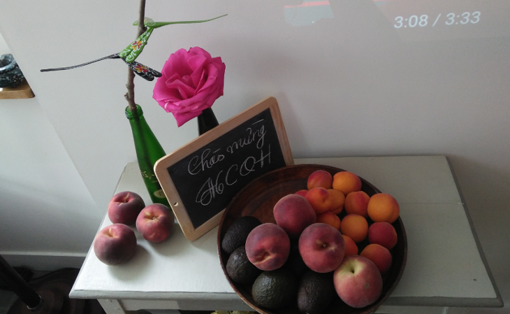

<!--
title: Chia tay một thành viên bè Soprano
author: Nguyễn Tích Kỳ
status: completed
-->
 

**Thành viên Lâm Lê của bè Soprano sẽ rời Hợp Ca Quê Hương trong một thời gian vì lý do riêng. Chiều thứ 7 hôm qua, một bữa tiệc tại nhà riêng của Lâm đã được tổ chức trong không khí ấm cúng của gia đình Hợp Ca Quê Hương. Chúc Lâm luôn hạnh phúc, thành công và sớm quay lại với bè Soprano của Hợp Ca. Sau đây là thư của chú Tích Kỳ viết sau bữa tiệc.**

-*-*-

 Các em thân mến,

Tôi còn nhớ cái thời xa xưa ấy, mỗi lần hoa phượng nở rộ sân trường là dấu hiệu của một sư chia tay cận kề, tuy chỉ tạm biệt nhau thôi. Nhưng vẫn trong khung cảnh kẻ còn ở lại, người đi nơi khác. Dịp cho những trang nhật ký thấm thêm giòng nước mắt, những vần thơ bay bay nhẹ theo chiều gió ân tình.

Đấy chưa kể đến những khúc hùng ca của những kẻ "xếp bút nghiên... mong xác trong da ngựa bọc thân thế trai..." hùng tráng và hương phấn quá nhỉ. " ...Trong những chiều hoàng hôn rực đỏ, từ giã quê hương ra đi…" cái "chủ nghĩa lãng mạn cách mạng" đó đã thấm vào xương máu cuả một thế hệ hoa lửa.

Hôm nay, em "Lâm Sop" tổ chức tại nhà em, nhân dịp Hợp ca Quê Hương mới hình thành giai đoạn 1 của CD đầu tay. Và chủ yếu em"Lâm Sop" muốn đánh dấu một khoảng thời gian "chung đường" với Hợp ca Quê Hương.

Vì lý do sức khỏe em "Lâm Sop" tạm ngưng một thời gian. Cầu mong sẽ ngắn hạn. Hẫng hụt quá, sẽ thiếu vắng một người chân chất, năng nổ, vui vẻ và dễ gần.

Buổi gặp mặt hôm nay có tất cả các em mới cũ, có một vài trường hợp đã đi nghỉ hè.
 

Trở lại 2 ngày chung sống đầy thử thách tại Rouen, tất cả chúng ta đều bị thời gian và công việc rất chi tiết chi phối, và xuất phát cũng từ đó, vài đụng chạm chủ quan phát sinh do ý tưởng cầu toàn về công việc mà thôi, và cũng có thể nói một cách khách quan sự nhận diện cá nhân giới hạn về kĩ năng và về tập luyện.

Chú hy vọng với sự đoàn kết và gắn bó với tập thể, chúng ta sẽ vượt qua chướng ngại nhất thời, đặt sự trường tồn của Hợp ca lên cao nhằm hướng về phía trước một cách nhiều hứa hẹn hơn, và không bao giờ quên chúng ta chỉ tồn tại và lớn lên ở trong lòng dân tộc, kim chỉ Nam của chúng ta sẽ luôn luôn là Đoàn kết Đoàn kết và Đại Đoàn kết.

 

Chúc các em một cuối tuần và một dịp hè đầy hứa hẹn.

Antony 31.07.2016

chú TK  

