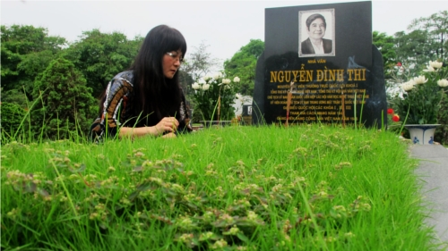
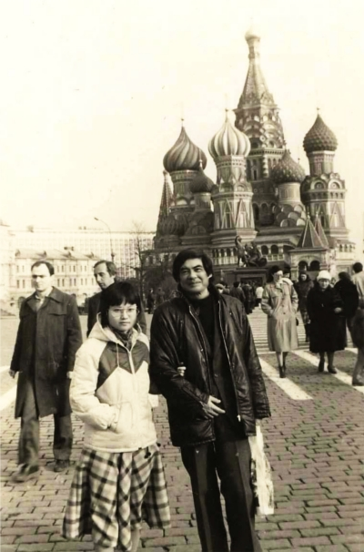
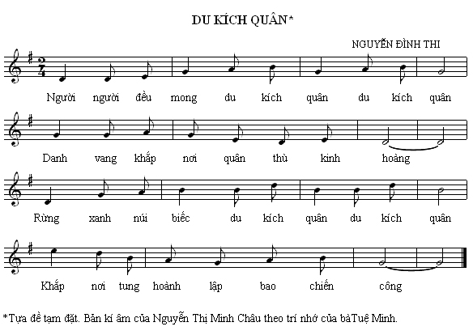
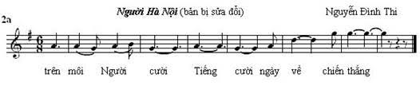
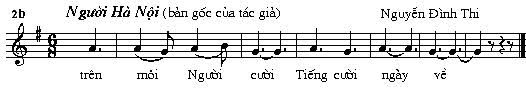

<!--
title: "Người Hà Nội" ơi...
author: Nguyễn
status: completed
-->
    

***Tác phẩm đi cùng thời gian "Người Hà Nội” của cố nhạc sĩ Nguyễn Đình Thi, một tác phẩm kinh điển đã gắn liền với sự ra đời của Hợp Ca Quê Hương. Lần đầu tiên Hợp ca Quê Hương trình diễn tại UNESCO "Kỷ niệm 1000 năm Thăng Long-Hà Nội".***

***Hợp ca Quê Hương xin giới thiệu bài viết của tác giả Nguyễn Thị Minh Châu Chủ biên của Hội Nhạc Sỹ Việt Nam nhớ về cố nhạc sĩ Nguyễn Đình Thi.***

----

*Ông có những bài ca để đời ngày ngày vang trong tiếng nhạc hiệu của các đài phát thanh truyền hình suốt mấy thập niên qua. Ông có những vở kịch dồn nén tính kịch không chỉ trong nội dung mà còn ở ngay số phận lận đận của chính vở diễn.*

*Ông có những tiểu thuyết mang nặng buồn vui của một đoạn đường lịch sử, những bài thơ đẹp chất thơ và sâu tính triết lí mà không cần phải nương dựa vào âm vần hoặc khuếch trương con chữ… Phải, ông có thể xưng danh nhiều “nhà”, song card visit của ông chỉ vỏn vẹn một từ: Nhà văn.*

**Bố và con**

-Bố viết Người Hà Nội ở hình thức gì hả bố?

-Bố không biết! Thế con nghĩ nó là gì?

-Sao giờ bố không viết bài hát nữa?

-Viết nhạc phải học con ạ. Không học thì đừng viết nữa, mà bố bị lỡ mất cơ hội học nhạc rồi… Hồi xưa có hai vợ chồng người Pháp muốn nhận bố làm con nuôi đưa về Pháp học nhạc. Nếu cuộc đời xoay sang hướng ấy thì có lẽ bây giờ đã có một nhạc sĩ Nguyễn Đình Thi nhỉ.

-Bố có chắc ông nhạc sĩ Nguyễn Đình Thi ấy còn nói được tiếng Việt không?

-Ừ, cuộc đời cũng lạ, nếu thế đã chẳng có những lúc lang thang trên đường phố kể chuyện đời cho con như thế này.

Mới đấy mà đã ba mươi năm kể từ những chuyến công du của ông ở nước ngoài, để con bé sinh viên là tôi được nghe ông nói chuyện đời trên quãng đường bố con ngược xuôi tiễn nhau: lúc đầu con đưa bố về khách sạn, rồi bố lại tiễn con ngược về kí túc xá mà chuyện vẫn chẳng dứt, chỉ tạm dừng với lời hứa “rồi bố sẽ kể dần cho con nghe”.

Mới đấy mà đã tròn mười năm chúng tôi mất bố...

Nói về ông, trước hết tôi không thể bỏ qua một nỗi niềm canh cánh trong lòng: ông là người cha đỡ đầu, người bố dượng mà tôi gần gũi và chịu ảnh hưởng nhiều hơn cả bố ruột. Ông là sự bù đắp vô giá cho tình phụ tử mà số phận đã cướp mất trong tuổi thơ của tôi. Vậy mà hơn một lần tôi đã nói với bố:

-Ở nhà bố là bố của con, nhưng ra đường con không phải là con của bố. Bố đừng giận nếu có lúc con không dám nhận con là con bố. Bố đừng buồn vì nhiều lúc con cứ ước bố là “người bình thường” để không ai biết bố là ai.

Ông thở dài: “Bố hiểu”.

Và bố không kịp “kể lại cho con tất cả” vào cassette như đã định để tôi đừng e ngại viết về ông, nỗi e ngại bị coi là kẻ “bắt quàng” cho đến giờ tôi vẫn khó vượt qua, rồi lại tự cảm thấy có lỗi với bố.

Bài viết theo "đơn đặt hàng"  của Liên hiệp các hội VHNT cho lễ tưởng niệm 10 năm ngày ông mất là cơ hội giảm bớt phần nào cảm giác có lỗi ấy chăng?

  

**Một tác giả không xưng danh nhạc sĩ**

Dù chỉ ghé chơi vào lúc nền nhạc mới còn quá non trẻ, chàng trai tuổi đôi mươi đã kịp để lại dấu ấn đến chính mình cũng không ngờ.

Nhìn từ góc độ chuyên ngành: Diệt phát xít là một trong những thí dụ tiêu biểu thời tiền khởi nghĩa cho thể loại hành khúc quần chúng, dễ phổ cập, hình thức nhỏ; còn Người Hà Nội là khởi đầu cho thể loại trường ca mang tính nghệ thuật, hình thức lớn, đòi hỏi kĩ thuật biểu diễn cao.

Nói về hiệu quả xã hội: sinh ra trong thời điểm lịch sử, cả hai bài hát không chỉ đầy ắp tính thời sự và mà còn là những tác phẩm có sức sống bền lâu. Diệt phát xít vừa ra đời đã được quảng đại quần chúng đón nhận như một vũ khí tinh thần trong khởi nghĩa tháng Tám năm 1945. Giai điệu hào hùng ấy không ít lần lại cất lên trong các tác phẩm giao hưởng hợp xướng, như Lửa cách mạng của Trần Ngọc Xương, Hồi tưởng của Hoàng Vân, Bất khuất của Đỗ Dũng. Người Hà Nội lần đầu tiên vang lên trên đài phát thanh kháng chiến năm 1947 qua giọng hát của chính tác giả, lần đầu tiên trình diễn trên sân khấu quốc tế năm 1951 trong Liên hoan Thanh niên thế giới tại Berlin. Cả hai luôn có mặt trong các lễ kỉ niệm trọng đại và chương trình nghệ thuật lớn ngót bảy chục năm qua.

Cả hai đều minh chứng cho một điều: bản năng tài hoa cộng với cảm xúc chân thành có thể tạo nên ca khúc bất hủ. Những lời ca tưởng như tự nhiên, nhưng là được chắt ra từ đời thật. Nhờ những mẩu chuyện không đầu không đuôi của bố mà tôi tìm thấy ông trong câu hát.

“Nào nhà tù, nào trại giam biết bao nhiêu nhục hình”. Tôi như thấy ông trong hình ảnh cậu thiếu niên tuổi 17 tay nắm chấn song sắt luôn miệng hát ca. Có người chỉ nghe giọng hát, nhìn bàn tay trên cửa sổ trại giam biết người tù còn quá trẻ đã thốt lên: “Tôi thương cậu lắm!”.

“Hà Nội cháy khói lửa ngập trời”. Tôi nhìn bằng con mắt của ông -người thanh niên làm nhiệm vụ cách mạng vào đêm trước sinh nhật thứ 22 của mình đã lặng người từ trên cầu Long Biên hướng về phía trời Hà Nội rực đỏ. Ông bảo giá mà phần phối khí có được tiếng nhạc cụ gõ “ùng ùng” như đại bác chen vào câu hát “Hà Nội hồng ầm ầm rung”.

Ông còn là tác giả lời thơ của không ít tác phẩm thanh nhạc, trong đó nổi tiếng nhất là hai ca khúc trữ tình của hai ***“ông Hoàng”*** trong lĩnh vực phổ thơ: ***Nhớ*** của Hoàng Vân và ***Lá đỏ*** của Hoàng Hiệp, còn công phu đồ sộ nhất là hợp xướng ***Đất nước*** của Đặng Hữu Phúc.

Dù không bao giờ xưng danh nhạc sĩ, nhưng ông là tác giả luôn được các nhà sử nhạc nhắc tên trong giai đoạn hình thành hành khúc cách mạng và ca khúc trữ tình. Thực ra ông còn có mặt trong cả hài khúc: bài ***Con voi*** được chính tác giả hát lần đầu trong một cuộc liên hoan văn nghệ thời chống Pháp để khích lệ pháo ta vào chiến dịch, sau này ***NSND Trần Hiếu thường biểu diễn gộp chung với bài hát cùng tên của nhạc sĩ Nguyễn Xuân Khoát.***

***Còn một hành khúc nữa mà chính tác giả cũng suýt quên bẵng, tôi muốn nói đến bài hát không tên, tạm gọi là Du kích quân.*** *Mẹ tôi thuộc bài này khi còn rất nhỏ, có lẽ vào khoảng thập niên 40. Sau này mẹ thường vừa nấu ăn vừa hát những bài xửa xưa. Một lần tình cờ nghe “chương trình ca nhạc” của mẹ, bố ngạc nhiên: “Sao em cũng thuộc bài đó?”. Sau đây là bản nhạc tôi ghi lại theo trí nhớ của mẹ, biết đâu ai đó còn nhớ và bổ sung thêm thông tin liên quan*  [thí dụ 1].

   

***Xin để Người Hà Nội đúng như của Người Hà Nội***

Tôi muốn dành thêm vài dòng cho riêng Người Hà Nội, một tượng đài âm thanh, một biểu tượng nghệ thuật của Thủ đô. Ai cũng biết Hà Nội được nhắc tên trong hàng trăm ca khúc, nhưng ít ai để ý rằng lần đầu tiên hai tiếng “Hà Nội” xuất hiện trong lịch sử ca khúc Việt Nam là ở Người Hà Nội. Cũng từ đây chuỗi tên gọi cả xưa và nay ***“Thăng Long - Đông Đô - Hà Nội”*** đã trở thành motif truyền thống được lặp lại trong nhiều ca khúc của các tác giả thuộc thế hệ khác nhau.

Còn về hình thức âm nhạc - điều mà tôi từng hỏi bố cách đây ba mươi năm, tôi đã tự trả lời như sau trong cuốn sách mà tôi mượn câu hát của bố làm tiêu đề Đây Thăng Long, đây Đông Đô, đây Hà Nội… (Viện Âm nhạc, 2009) :  Sự nối tiếp liên tục các câu, các đoạn khác nhau đã đưa bài hát vượt ra khỏi hình thức đơn giản của một ca khúc phổ thông. Lúc tựa như câu chuyện ngẫu hứng được kể theo kiểu ballade, lúc lại có chút gì đó gần với lối sắp đặt các mảng màu tương phản trong suite, kết cấu tự do này thường được xếp vào thể loại trường ca - dạng bài hát dài hơi được ưa chuộng đặc biệt ở giai đoạn kháng chiến chống Pháp.

Các đoạn nhạc ở đây khác nhau về nhịp điệu (4/4, 2/4 và 6/8), tốc độ (vừa phải và nhanh), điệu tính (trưởng và thứ) và sắc thái tình cảm (sâu lắng - thiết tha và hào hùng - ngợi ca…). Như một dòng sông nhiều khúc, giai điệu đi qua đoạn mở đầu ngâm ngợi lai láng, rồi trôi theo nhịp sống rộn ràng, và từ đó hòa vào nhịp đi của hành khúc ngày Tuyên ngôn độc lập. Sau những nhịp giãn chậm, dòng chảy lại dâng lên cao trào và cuốn vào khí thế chiến đấu, rồi đi tới đoạn kết nhịp nhàng uyển chuyển trong vũ điệu ngày chiến thắng trở về. Đoạn kết mang trạng thái tinh thần hân hoan như chủ đề Niềm vui trong Giao hưởng số 9 của Beethoven, người mà bố tôi từng coi như người thầy đầu tiên dẫn dắt ông vào lĩnh vực sáng tác văn học nghệ thuật.

Chính đoạn kết này bố tôi đã khẩn thiết nhắc đến vài lần trước lúc hôn mê.

*Trong xu thế cách mạng của thời chống Mĩ, có lẽ các ca sĩ cảm thấy chưa thỏa đáng với mấy nhịp cuối hiền hòa trong Người Hà Nội, nên họ đã đẩy giai điệu câu cuối lên âm khu cao và kết bài ở nốt cao nhất (g2) [thí dụ 2a]. Từ đó về sau, câu kết khẳng định tinh thần quyết thắng cứ đeo dính lấy bài hát này trong các chương trình biểu diễn, mặc dù tác giả cho đến những ngày cuối đời nằm trên giường bệnh vẫn nhắc đi nhắc lại mong muốn của mình là trả lại cho Người Hà Nội câu kết đúng nguyên bản với cảm xúc dịu dàng, lâng lâng về một ngày mai đẹp như mơ*  [thí dụ 2b].

  
  

Thay vì để ca sĩ khoe giọng hát, đây là nơi mà tác giả trao cho người phối khí cơ hội ***“nói”*** được nhiều hơn điều mà ông muốn nói.

Mười năm trôi qua, không lẽ vẫn chưa đến lúc giới nhạc thực hiện ý nguyện của một Người Hà Nội đã khuất?

8-4-2013

(10 ngày trước ngày giỗ lần thứ 10 của nhà văn Nguyễn Đình Thi)  

----------------------------------------------------------------------------- 
***Dưới đây là mail của chú Tichky trách nhiệm HCQH - gửi tới tác giả Minh Châu:***  

Thân gửi Chị Minh Châu,  

*Tình  cờ, tôi được đọc bài viết của Chị về bản Hợp xướng kinh điển "Người Hà Nội" của cố  nhạc sỹ Nguyễn Đình Thi và tâm tình Cha con của Chị đối với Ông.  Tôi rất xúc động, càng xuôi về hướng hoàng hôn của cuộc đời, tôi càng nhận thấy giá trị của "tình người" là tất yếu, ngoài ra chỉ là phụ đề của cuộc sống, thưa Chị.*
 
*Như Chị đã biết, "Người Hà Nội" là bản hợp xướng kinh điển Việt Nam đầu tiên mà Hợp ca Quê Hương trình diễn, đã vang vọng qua cầu truyền hình Paris/ Hà nội /Luang Prabang nhân dịp chào mừng đại lễ 1000 năm Thăng Long-Hà Nội năm 2010.* 

*Rất tiếc tại thời điểm đó,Hợp ca Quê Hương chỉ biết version 2a mà Chị đề cập trong bài viết. Xin hứa với Chị, trong tương lai Hợp ca Quê Hương sẽ trở về bản gốc 2b.*

*Thân chúc Chị nhiều may mắn tốt lành.*

Nguyễn Tích Kỳ    
Hợp ca Quê Hương
 
Paris 2016

- ***Vào đây tham khảo thêm - Consulter les autres articles***

  