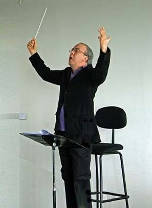

<!--
title: Một người bạn lớn của Hợp ca Quê hương đã ra đi. 
author: Hop ca Que Huong
status: completed
-->

**Một người bạn lớn của Hợp ca Quê hương...ra đi**
 

***Một người bạn lớn hương từ những ngày đầu thành lập của Hợp ca Quê hương , Nhạc trưởng Jorge Lozano, vừa qua đời.*** 

***Jorge là chỉ huy hợp xướng và chỉ huy dàn nhạc kỳ cựu của UNESCO.*** 

***Năm 2010, Jorge đã cùng Hợp ca Quê hương, Dàn nhạc giao hưởng và hợp xướng UNESCO dàn dựng tác phẩm hợp xướng Người Hà Nội. Đó cũng là lần đầu tiên Hợp ca Quê hương được hát với dàn nhạc giao hưởng và tiến hành thu thanh, ghi hình chuyên nghiệp. Tác phẩm đã được phát sóng liên tục trên các kênh VTV4, VTV1 và VTC trong dịp kỷ niệm 1000 năm Thăng Long-Hà Nội và để lại dấu ấn đậm nét trong lòng khán thính giả.*** 

***Hợp Ca Quê Hương***  
***23.03.2017*** 
     

***Vào đây tham khảo thêm - Les autres articles***

* [2013-04-10 UNESCO & VTV4 2010](/#post/2013-04-10%20UNESCO%20&%20VTV4%202010)

* 