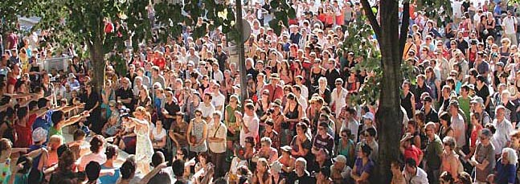
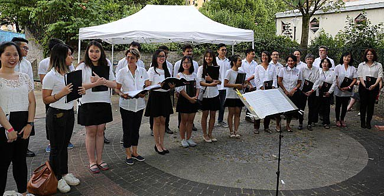
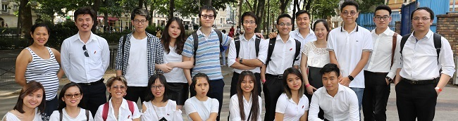
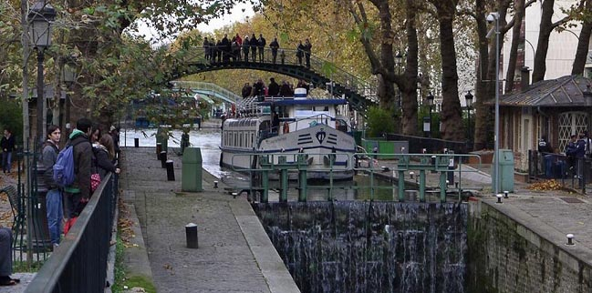
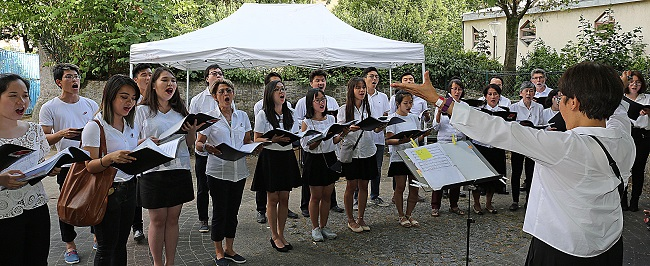

<!--
title: Sự kiện khó quên tại Canal St Martin-Voix sur berges
author: Tich Ky Nguyen
status: completed 
-->
***Sự kiện khó quên tại Canal St Martin-Voix sur berges.***

***Tôi nhớ Ban tổ chức thông báo "- Với đe dọa khủng bố có thể, sẽ có sự thay đổi địa điểm trình diễn và yêu cầu những tập thể, Hợp xướng phải đến sớm để thủ tục kiểm tra trước khi vào điểm diễn"***
 
  
   ***Một trong nhiều điểm trình diễn ngày lễ hội Voix sur berges***

Nghe và xem lại buổi trình diễn HCQH tại Voix sur berges tôi rất xúc động đến ngỡ ngàng. Được xem lại những tấm hình ghi không gian, trạng thái và nơi diễn. Chỉ còn 20' đến lượt HCQH trình diễn mà đa số các em chưa có mặt. Chị Nhạc Trưởng Ngân Hà lo lắng đến dạ dày bị quặn đau. Tôi thì thật vô dụng, sau khi đưa Ngân Hà và một em đến Quai Gemmap, đảo xe đi tìm chỗ đậu, tất cả các bãi đậu xe lân cận họ đều ngưng sinh hoạt, nơi nơi từng tốp lính lính đi tuần tiễu vì Chính Phủ Pháp áp dụng chương trình Vigipirate ngừa khủng bố. 
Tôi đi vòng gần, vòng xa, đến gần Bastille thì mới có chỗ đậu. Xa nơi diễn hơn 3km, với trạng thái sức khỏe của tôi, đi bộ ít nhất cũng mất hơn 1 tiếng chưa kể lúc về thì làm sao ? đành cắn răng thông báo lỗi hẹn với đồng đội.

   

10' trước giờ trình diễn các em có mặt đầy đủ, 
vì di chuyển bằng phương tiện công cộng, xe buýt, tàu điện ngầm bình thường "nó" đã quá tải mà nay còn bị
Vigipirate, khi có hiện vật khả nghi trên đường, tàu phải ngưng hoạt động nhằm kiểm tra thực hư. 
Các em tất bật đến tụ điểm trình diện, chỉ còn vài ba phút để dặn dò, luyện thanh và sắp xếp vị trí cho từng em. Thế là ai giữ hồn người ấy, đúng với tinh thần "dã chiến" có bao nhiêu chơi bấy nhiêu, chơi hết mình.

     
 
Kìa ai đấy, có em đã "lết" đến cổ vũ đồng đội với cái bụng sắp đến ngày sanh em bé, thương quá. Có em đã xin nghỉ dài hạn, đi chơi qua nơi tập thấy thiếu Ténor, liền "xung phong" và hôm nay cũng có mặt. Rất cảm ơn các em, chú rất trân trọng.
 
*Hồi tưởng lại cái thời mà Cha Anh gồng gánh như đi họp chợ nào nhạc cụ, nào dụng cụ đưa về mảnh đất đầu làng chuẩn bị văn nghệ cho dân làng, cho đơn vị ngày mai tiếp tục lên đường chiến đấu.Tiếng hát át tiếng bom là thế đấy.  
Hôm nay...đa phần các em đến với HCQH vui là chính. Tôi vẫn nghĩ dần dần mầm tinh thần "tự hào dân tộc" sẽ đâm chồi nẩy lộc.* 

***Một vài hiểu biết về Canal St Martin***

Năm 1802 thời đại Napoléon Bonaparte có quyết định xây dựng Canal St Martin đến tháng 11 năm 1821 thành lập Cty Sông Cống Paris và vài năm sau Canal Saint-Martin được Charles X khánh thành ngày 4 tháng 12 năm 1825.
Canal St Martin vốn thuộc về sông Seinne uốn dài nhiều cây số. 
Khởi thủy Canal St Martin là một công trình thủy lợi dẫn tải nước ngọt cung ứng cho Paris từ năm 1825.  
Đặc điểm của Canal St Martin có 2 cầu xoay tháo nước cho giao thông với độ vênh là 25m.

    
   ***Một khúc của Canal St Martin khi tàu thuyền qua lại chờ tháo nước âu của độ vênh.***

Thời thịnh vượng của Canal từ thế kỷ XIX đến giữ thế kỷ XX ngoài việc chuyển tải nước ngọt cung cấp quanh năm cho Paris còn có thuyền bè ngược xuôi chuyển tải đến trung tâm Paris nông sản và vật liệu xây dựng. Cũng vào thời đó, hai bờ St Martin cũng là điểm dạo chơi, hò hẹn, thậm chí pí-níc của người dân thành thị. 
Năm 1970 Paris có đề án dẹp Canal St Martin để xây dựng một đường xa lộ xuyên Paris với 4 làn đường. Nhưng đã gặp nhiều phản ứng bất lợi. Dẹp đề án này.
Sơ bộ về Canal St Martin là như vậy.

	Sự kiện Voix sur berges xuất phát từ ý tưởng dùng sự kiện làm tăng thêm vóc dáng, sức sống văn hóa cho người dân Paris, lân cận, và dần dần lan rộng đến cả khách vãng lai. 

Vâng, đây cũng là dịp mà ta có thể suy ngẫm thêm. 
Thủ đô ta có không gian quanh Hồ Gươm, có Hồ Tây và đường Thanh niên nối đến vườn Bách Thảo, phố phường cây cao bóng mát. 
Huế có nhiều không gian trong nội thành cỏ mọc xanh rêu. Hai bên bờ sông Hương còn nhiều nơi kêu gọi trí óc tưởng tượng. 
Miền Nam ta có đường Nguyễn Huệ, có bến Bạch Đằng. Không thiếu nơi có thể khơi dậy sự kiện văn hóa-văn nghệ quần chúng rất đa dạng v.v...

 
 
	Một lần nữa, tôi nghĩ, không có thành công nào sáng giá hơn thành công nào. 
Mọi thành công đều phải xuất phát từ tâm huyết, và tinh thần biết người biết ta. 
Và ngày mai luôn phải tốt đẹp hơn hôm nay.
 
***Các em đừng quên sự kiện mới đang chờ chúng ta ngày 23 tháng 09 tại Versailles.***

Chúc các em vui và mạnh khỏe.

Paris 28.06.2017

TK

