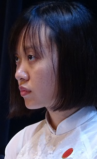

<!--
title: Một em sắp lên đường rời HCQH
author: TichKy Nguyen
status: completed  
-->
   

***Một em trong HCQH sắp lên đường rời HCQH.***
  
Cô chú rất ngỡ ngàng và mừng vui khi Lệ Hằng thông báo muốn đến chào Cô chú trước khi lên đường về Việt Nam lập gia đình và sẽ tiếp bước ra nước ngoài lập nghiệp.
 
***Lệ Hằng đã đến với HCQH năm em 18 tuổi đồng hành cùng HCQH từ quảng trường của Đại sứ quán của ta tai Paris ngày 02.09.1009 và cũng từ đó...tuy có gián đoạn một khoảng thời gian vài ba năm, vì tập trung vào sự nghiệp học hành.***

***Gia đình HCQH là thế đấy, đến và đi từng đợt như sóng biển trùng dương.* 
*Cô Chú hy vọng những năm tháng đồng hành. HCQH đã đem lại cho Lệ Hằng niềm vui, ý thức được giòng chảy âm nhạc thuần Việt.*** 

***Giòng chảy đó, đã góp phần vào công cuộc chinh phục từng tấc đất, giòng sông, vòm trời, vủng biển "không gì quý hơn Độc Lập Tự Do" của hôm nay và ngày mai.***
 
Cô Chú chắc chắn với một một tâm hồn nhạy cảm sẵn có và sự ứng sử tử tế của Lệ Hằng, em sẽ luôn gặp muôn điều may mắn, 
Cô Chú và HCQH chúc em tiếp tục thành công trên mọi nẻo đường.

Antony 13.07.2017

Chú Tích Kỳ
Cô Ngân Hà

   