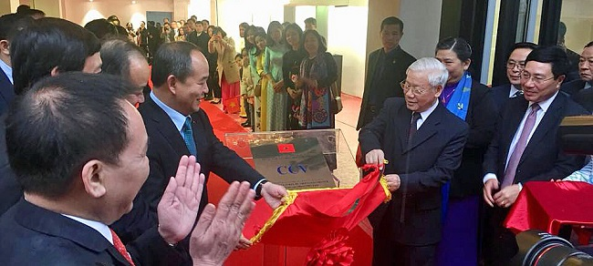
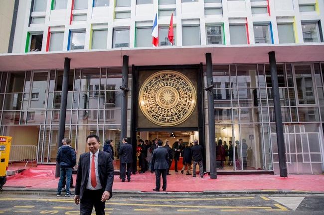
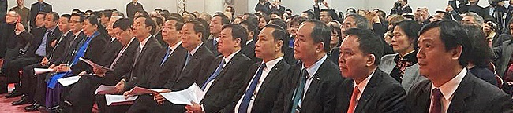
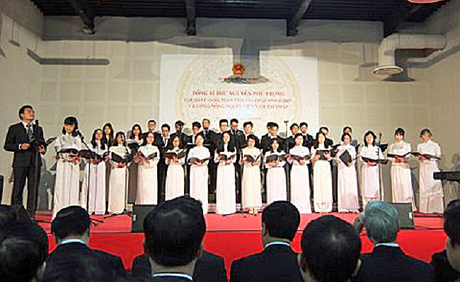
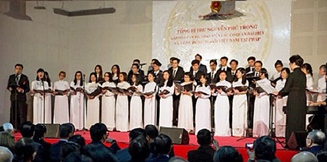
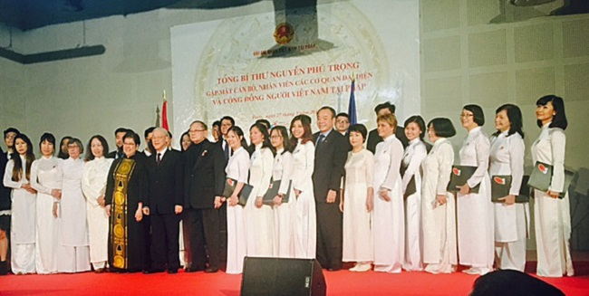

<!--
title: Khánh Thành Trung Tâm Văn Hóa CCV đổi mới & Đón tiếp TBT Nguyễn Phú Trọng  
author: TichKy Nguyen
status: completed
-->
   

Các em thân mến,

Trên con đường 10 năm tuổi. HCQH mới hoàn thành một sự kiện "sống mãi với thời gian". 
Khánh thành Trung Tâm Văn Hóa CCV đổi mới dung tích. HCQH rất hãnh diện và vinh dự nhưng rất lo lắng vì chưa bao giờ được trình diễn trước một đoàn bao gổm nhiều lãnh đạo cấp cao 3 ngành Viet nam và TBT Đảng Cộng Sản Việt Nam.

  
              
Cảm nhận khi nhìn vào mặt tiền Trung Tâm Văn Hóa CCV mới đổi dung tích, với mặt Trống Đồng khổng lồ biểu hiện dấu ấn thiêng liêng của Cha Anh, tôi không cầm được cảm xúc bộc phát. Đây rồi, biểu tượng của dân tộc, tôi liên tưởng ngay đến chương hai của trường ca Người chiến sỹ biên thùy " Băng rừng băng đèo ta vẫn đi, cho dù dốc đèo ta vẫn đi".
 
Tôi thầm cảm ơn "êkíp" trách nhiệm đã hoàn thành "sứ mệnh" trong điều kiện "dầu sôi lửa bỏng". 

                   

Bước vào trong, đi đến phòng đa năng tôi không muốn nói nơi này đã được hoàn chỉnh một cách tuyệt đối và sẽ làm vừa ý mọi người. Nhưng tôi chỉ biết rằng, từ nay về sau cộng đồng sẽ có một sân khấu của chúng ta trong Trung Tâm Văn Hóa CCV tại kinh đô ánh sáng Paris. Chỉ giản dị thế thôi, và tự hào không kém

                   

Trở lại HCQH, với sự kiện dồn dập từ đầu năm 2018.  
Vừa mới hoàn thành Tết Nguyên Đán Mậu Tuất 2018 tại Baltard HNVNTP, tuần sau đó bước sang sự kiện giúp Enfance partenariat tại thị trấn Versailles gây quỹ giúp đỡ bản làng miền Tây bắc và cô nhi viện Vũng Tàu tiếp nối ngay sau đó với sự kiện khánh thành Trung Tâm Văn Hóa CCV.
HCQH đang đứng trước thay đổi liên tục ngày giờ trình diễn, cũng như luyện tập dồn dập, rất căng thẳng . 
Tôi nghĩ đến các em đang gặp nhiều khó khăn nhằm giải quyết và dung hòa thời gian trong công việc làm ăn, học tập. Tôi rất áy náy, nhưng cũng rất vừa lòng vì các em đã quán triệt được những yếu tố cần thiết và cảm thông những gập gềnh đi đến buổi trình diễn hôm nay,  hơn lúc nào các em đoàn kết.

   

                    

HCQH chụp ảnh lưu niệm cùng Tổng bí thư Nguyễn Phú Trọng tại Trung tâm Văn hóa Việt Nam tại Pháp

Thân chúc các em HCQH một cuối tuần tốt lành.
 
Tích Kỳ

Paris 28.03.2018
