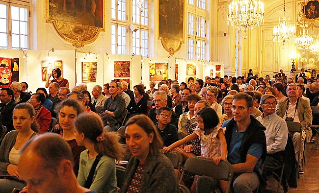

<!--
title: Sau sự kiện Versailles sept 2017
author: Tich Ky Nguyen
status: completed
-->

***Sau sự kiện Versailles sept 2017***

   

Các em thân mến,

Mặc dù với sự cố bất ngờ của đường giao thông đến Versailles.
Theo đúng yêu cầu các em đã có mặt đúng giờ tại Mairie de Versailles. 
Một lần nữa các em chứng minh tinh thần trách nhiệm, lúc cần có.

Lực lượng của HCQH hiện nay bao gồm 8 phần 10 là các em "mới toanh" chưa có kinh nghiệm sân khấu. Với một lượng thời gian tương đối ngắn và nơi tập không được cố định như thời gian trước.

   

Các em đã hết mình "mưa nắng" với HCQH. Chú rất trân trọng.
(Trung Tâm Văn Hóa sẽ hoàn chỉnh vào cuối năm 2017, hứa hẹn một nơi tập khang trang). 

Ban tổ chức hôm nay bao gồm - Đại Sứ quán VN và Trung Tâm Văn Hóa VN - Đại diện du lịch VN và Ban điều hành Thị trấn Versailles cùng các vị khách quý và quần chúng của Hội Enfance Partenariat Viet Nam  đã nồng nhiệt tiếp đón buổi trình diễn hôm nay và Ban tổ chức Enfance Partenariat Viet Nam  chuyển đến các em sự ngưỡng mộ và lời khen chân thành, mặc dù họ chẳng hiểu một câu tiếng việt.

 

Hôm nay, các em đã đặt hết tình cảm vào buổi trình diễn một cách rất thuyết phục, đã thổi hồn vào bài hát một cách chân thật, truyền cảm đến độ làm "nổi da gà" cho người nghe (phản ảnh của khán giả).

•	4 bè của HCQH đã thể hiện đặc sắc những nét son của tác phẩm, Cô chú rất hãnh diện về sự việc này... bù cho nỗi  thầm lo trong mỗi chúng ta.
•	Tốp ca của 4 em Đạt-Minh-Trâm-Dũng và M.Anh đã chuyển tải tiết mục dân ca rất tài tình. Hòa âm cân đối với một âm hưởng độc đáo.

•	Tiếc là thời gian không cho phép các em trình diễn T'rang Ngô trong trang phục đồng bào miền thượng. Đành hoãn lại dịp khác. Nhóm đã giao lưu với bài "Ma Normandie" đã gây ấn tượng sâu sắc. 

•	Khán giả rất cảm hứng khi Minh Anh giớ thiệu cây Đàn Bầu đa năng và độc đáo của cây đàn bầu, và đã giao lưu với bài Ma solitude.

•	Chú không thạo về thời trang áo dài. Nhưng có thể nói là nhà thiết kế Cát đã biết dung hòa văn hóa ăn mặc Âu - Á hợp khẩu vị của khách và bên cạnh đó nghệ nhân tranh sơn mài Khương Hạnh đã giới thiệu một loạt tranh sơn mài rất độc đáo.
Quay lại vài ba ngày trước.
Trong "buổi tập đặc biệt",  hôm thứ sáu 22.09.2017 tại HF MUSIC STUDIO 14ème, đều nhận thấy rằng Cô ở trạng thái rất căng thẳng. Vì lý do đơn giản " Ngày mai HCQH sẽ trình diễn tại Versailles " mà HCQH chưa sẵn sàng 100/100. Có người nghĩ rằng "Thế là được rồi" , dĩ nhiên với cái nhìn chủ quan xuề xòa thì hẳn được. Nhưng thực tế ta phải "ngắm" xa hơn mục tiêu, vì điểm đến cuối cùng là phải đáp ứng đúng chờ mong thầm kín của khán - thính - giả và sự trưởng thành có thể của HCQH.
• "Không có một trình diễn nào quan trọng hơn trình diễn kia " Tất cả đều có tầm quan trọng đặc thù của nó.

Những lý do cẩn nhất quán :
•	Tôn trọng tác phẩm và tác giả mà ta tôn vinh vì mục tiêu của HCQH là duy trì sự trường tồn và định hướng của tác phẩm đã từng nhịp bước theo xu hướng dưng nước và giữ nước của dân tộc.
•	Phổ biến rộng rãi và chất lượng nền văn hóa Hợp xương còn non trẻ của chúng ta nói chung và HCQH nói riêng. Chỉ có hình thức duy nhất = tập luyện miệt mài.
•	Phải hình thành một công việc xứng đáng với sự đam mê của mỗi chúng ta, của mỗi khán-thính-giả đã đến với HCQH. Hơn thế nữa phải xứng đáng với tinh thần đóng gớp của những tổ chức, tập đoàn bạn vì họ luôn ủng hộ và cổ vũ nhịp bước của Việt Nam .
•	 Cuối cùng khi ta đem chuông đi đánh xứ người phải có tinh thần hoàn thiện công việc 200/100  ? và không nên tự mãn với bất kỳ thành công nào.

Chú muốn nhấn mạnh về góc độ yêu cầu của Hội Hội Enfance Partenariat Viet Nam. 
Họ yêu cầu tất cả mọi thành phần có mặt -Ban tổ chức - HCQH - Nhóm trình diễn thời trang- nhóm họa sỹ đến với tinh thần đóng góp. 
Lý do, để Hội Enfance Partenariat Viet Nam có thêm phương tiện mua được nhiều máy may tặng cho đồng bào vùng sâu miền Trung du Bắc Việt Nam.
Nghĩa cử đáng được tôn vinh

26.0 9. 2017 
Chú TK

