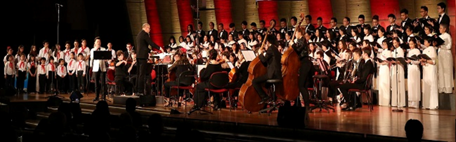
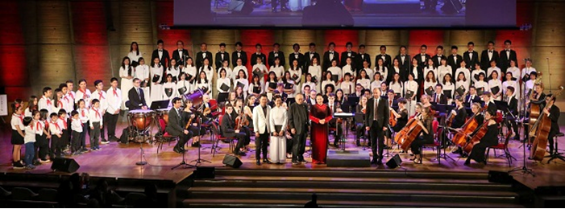

<!--
title: Không nói nên lời
author: TichKy Nguyen
status: completed
-->

Hành động "không nói nên lời". Bình dị mà thấm sâu vào lòng người là thế đó.

Em là người của Hợp Ca Quê Hương ( HCQH)  giai đoạn Một 
Khi đó HCQH còn chằng chịt khó khăn về tổ chức, nhân sự phức tạp linh tinh. tập thể còn lưa thưa chỉ vỏn vẹn 15 thành viên. Nơi tập thì nay đây mai đó hi. Đã hơn 3 năm tụ điểm tập luyện vẫn chưa trùng tu xong.
Từ 2009 bước sang 2011. 
Sau 2 năm sinh hoạt với HCQH và sau khi tốt nghiệp, em đã lên đường về Việt Nam lập nghiệp. 
Năm tháng nhẹ nhàng trôi, chúng tôi vẫn tiếp tục duy trì tình bạn, tình người. 

Hôm nay ... Em đã xuất hiện đột ngột tại nhà tôi, hỏi ra mới biết là em chỉ sang Paris vì muốn có mặt khi HCQH tròn 10 tuổi và thăm bạn bè giai đoạn Một.  Em không phải đại gia chỉ có thu nhập của một cán bộ, đã kí kóp dành dụm vé bay. Bình dị thế thôi. Không ồn ào ầm ỹ. Cảm ơn ân tình. 
Tôi lặng nhìn em, thấm thía tình người, tình bạn và thầm nguyện cầu em có mặt chia sẻ trong CD sắp tới.
Tôi thấm thía 2 chữ "đồng đội" thầm cảm ơn những em cựu trào đã trở lại góp sức dịp HCQH 10 tuổi và cũng góp sức ráo riết chuẩn bị chào đón Đoàn Quốc Hội Việt Nam chính thức thăm nước Cộng Hòa Pháp và cộng đồng Người Việt Nam tại Pháp.
  
Chỉ còn vài ngày nữa tại quảng trường Unesco. Dàn HCQH và sẽ được hân hạnh sánh vai với Dàn Nhạc Giao Hưởng vùng Normandie trình diễn một chương trình chào mừng Đoàn Quốc Hội Việt Nam chính thức thăm nước Cộng Hòa Pháp theo lời mời của Thủ Tướng Macron Pháp.  Nhân dịp này Đoàn trao tặng Hội Người Việt Nam tại Pháp huân chương Lao Động hạng nhất.  

Xin thông báo : Buổi trình diễn văn nghệ đã thành công trên mong đợi.

* Đoàn Cán Bộ cao cấp Nhà nước và CT Quốc Hội Nguyễn Thị Kim Ngân trao tặng thưởng Huân chương Lao Động hạng nhất cho Hội Người Việt Nam Tại Pháp,duy trì và tôn vinh tinh thần hữu nghị giữa Cộng hòa Pháp và Việt Nam. 
Đoàn rất ấn tượng sự hợp tác hữu hiệu giữa Hợp Ca Quê Hương và Dàn nhạc giao hưởng vùng Normandie đã thành công trên lãnh vực văn nghệ trong khung giao lưu văn hóa quốc tế.

* Cán Bộ chuyên môn của Đại Sứ Quán Việt Nam tại Công Hòa Pháp và Đại Sứ Đặc Mệnh Toàn Quyền Nguyễn Thiệp cũng rất ấn tượng và hãnh diện về sự đóng góp thàn công của HCQH. 

* Ca sỹ Vũ Thắng Lợi từ Việt Nam đến cũng rất ấn tượng đã hát với HCQH có ân cần dặn Cô chú chuyển lại lời chào đến các anh chị em HCQH và hy vọng trong tương lai sẽ có cơ hội hợp tác nữa. 

* Không quên nhắc đến 2 em MC chương trình là em Ngọc Trâm và em Ngọc Trung rất chững chạc, nghiêm túc và mạch lạc giới thiêu Chương trình trong khung cảnh đặc biệt của buổi lễ hội này. Cảm ơn hai em

* Những buổi tập cuối không dư thừa, đúng không các em ? 

  * Ténor cần phát huy hơn nữa, tuy những em cựu trào rất thuộc bài, rất theo dõi Nhạc trưởng và hát khá to nhằm "kéo" các em "yếu" thế (của hôm nay sẽ là đầu tàu của ngày mai). 

  * Bass tố chất tuy có nhưng chưa phát huy được như ý muốn. Tuy có những em đã trở về tiếp sức cho đồng đội, nhưng chưa thực hiện được rõ nét điều này. 
Cảm ơn các em.

  * Alto và Sop tiến bộ rõ nét, và tôi rất ngạc nhiên về âm hưởng cao trào và sự theo dõi nhạc trưởng rất chuẩn mực của các em Nữ. 
Cảm ơn các em.

  * Điểm nhấn, các cháu thiếu nhi sinh trưởng và lớn lên tại Pháp có tiến bộ phát âm tốt, rõ nét, rèn luyện tốt. Vâng, còn vài năm nữa là các cháu gia nhập hàng ngũ lớn rồi. 
  * Riêng các cháu nhí nhỏ đang ở độ tuổi "háo động" đã phải đứng "bất động" mà hơn nữa phải thuộc bài, đi ra đi vào rất nghiêm túc và hát đuổi những điểm nhấn lệch, đúng nơi đúng chỗ rất giỏi. 
Cảm ơn các cháu (và xin ghi công những phụ huynh đã kiên trì hướng dẫn, đôi khi còn nghĩ ra những phương pháp độc đáo đặc biệt cho các cháu tập luyện riêng tại nhà nữa)  Không yêu quê hương, tôn trọng tập thể thì làm sao chuyển tải được tinh thần này trong hình thức giáo dục các cháu. 
Một lần nữa Cảm ơn các phụ huynh.

Thành công này là một thành công tập thể.  Tự mãn sẽ dẫn giắt đến ngõ cụt.  
Nói chung chúng ta đã góp phần thực hiện một chương trình văn nghệ rất thành công. 
Chân thành cảm ơn Nhạc trưởng Claude Brendel và Dàn Giao Hưởng Rouen.

* Tiếp nối phần sau đó : Đoàn văn công đến từ Hà nội đảm nhiệm với nhiều tiết mục độc đáo, trình diễn áo dài thời trang v.v... 
Đoàn sẽ lên đường rời Paris ngay vì sẽ trình diễn tại Miền Nam nước Pháp. 
Chúc Đoàn thành công tốt đẹp.

Tích Kỳ    
Antony 03.04.2019

