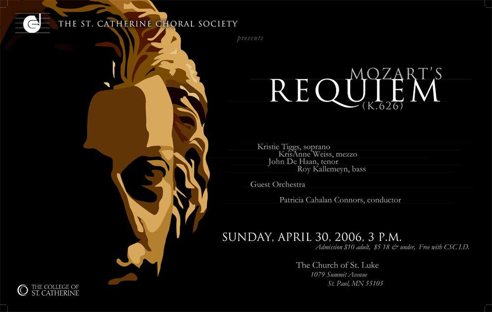

<!--
title: Giao lưu Hợp Xướng quốc tế tại Paris
author: Ngân Hà
-->

Tổ chức bởi [Hiệp hội âm nhạc Paris](http://academie-de-musique.com/) và những người bạn

**Mở cửa: 9:30 am – 7:00 pm**

**Nhà thờ thánh Madeleine**

Place de la Madeleine  
75008 Paris
<iframe src="https://www.google.com/maps/embed?pb=!1m18!1m12!1m3!1d1312.1872939954703!2d2.324523377909992!3d48.87013524217981!2m3!1f0!2f0!3f0!3m2!1i1024!2i768!4f13.1!3m3!1m2!1s0x47e66e32f5011cef%3A0x5ff753fc9448c2b6!2sL&#39;%C3%A9glise+de+la+Madeleine!5e0!3m2!1sen!2sfr!4v1441201132075" width="600" height="450" frameborder="0" style="border:0" allowfullscreen></iframe>

# Giá vé

* Bán lẻ: 25 eur
* Theo nhóm: 19 eur 