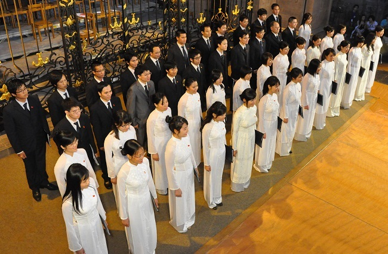
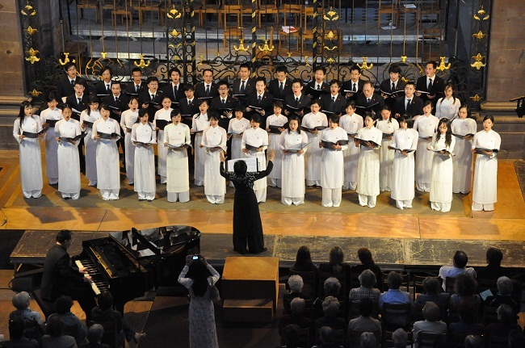
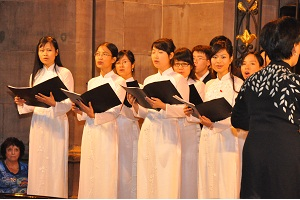
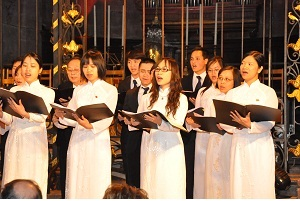

<!--
title: Hợp ca Quê hương tỏa sáng tại liên hoan âm nhạc quốc tế FIMU 2010
author: Dương Phú Hiệp
status: completed
-->

*Trong ba ngày từ  22 đến 24 tháng 5 vừa qua tại Belfort, miền đông nước Pháp, đã diễn ra Liên hoan Âm nhạc Quốc thế FIMU 2010 – (Festival International de Musique Universitaire). Đây là liên hoan âm nhạc quốc tế uy tín, có quy mô lớn, được tổ chức vào tháng 5 hàng năm với sự tham gia của hàng ngàn nhạc sỹ, ca sỹ, ban nhạc, dàn nhạc thuộc nhiều thể loại và phong cách âm nhạc khác nhau đến từ khắp nơi trên thế giới. Phần đông các nghệ sỹ tham gia trình diễn là các sinh viên đang theo học tại các trường âm nhạc, văn hóa và nghệ thuật. Từ tổng số gần 600 hồ sơ đăng ký, ban tổ chức FIMU 2010 đã chọn được 130 đoàn nghệ thuật đến từ 30 nước, trong đó có Pháp, Đức, Ý, Tây Ban Nha, Nga, Hungary, Mỹ, Mexico, Trung Quốc …, tham dự và trình diễn trong suốt 3 ngày đêm trên 14 sân khấu lớn tại Belfort, thu hút hơn 75 ngàn lượt khán giả. Với sự hiện diện của ban Hợp ca Quê hương, một dàn hợp xướng Việt Nam trên đất Pháp (xem link cũ trên báo Đất Việt), lần đầu tiên Việt Nam có đoàn hợp xướng tham dự liên hoan âm nhạc FIMU với cờ đỏ sao vàng tung bay trên xứ sở âm nhạc Belfort. Tham dự vào phần liên hoan dành cho dòng nhạc thính phòng cổ điển, Hợp ca Quê hương đã trình diễn các tác phẩm hợp xướng dàn dựng cho bốn bè, đó là Du kích sông Thao của Đỗ Nhuận, Người Hà Nội của Nguyễn Đình Thi, Trống cơm, hai tác phẩm nước ngoài lời Việt là Tổ quốc tươi đẹp (trích từ vở opera Nabucco của Verdi) và Bình minh ca (nhạc phim Poltergeist), và một bài hát tiếng Pháp là cerf-volant (cánh diều, nhạc phim Les Choristes). Trao đổi với chúng tôi trước chuyến đi, bà Nguyễn Ngân Hà, trưởng đoàn Việt Nam tham dự FIMU 2010 kiêm chỉ huy hợp xướng, cho biết «với một chương trình được biên tập cân đối và hài hòa như vậy, Hợp ca Quê hương mong muốn được tự hào giới thiệu với bạn bè bốn phương một số tác phẩm kinh điển của nền âm nhạc cách mạng Việt Nam, muốn những giai điệu dân ca thân quen nhất của Việt Nam, thông qua nghệ thuật hợp xướng, sẽ được bạn bè quốc tế đón nhận thật nồng nhiệt, đồng thời bằng các tác phẩm nước ngoài lời Việt, đoàn Việt Nam muốn bạn bè và đồng nghiệp của mình từ khắp nơi được thưởng thức một chút hương vị lạ, hương vị Việt Nam, trong những món ăn tinh thần đã rất đỗi quen thuộc của họ ». Và quả  thật, thông điệp của đoàn Việt Nam đã được gửi trọn vẹn tới khán thính giả của liên hoan. Ngay từ khi đặt chân tới Belfort, dàn hợp xướng trên 50 thành viên với các thiếu nữ trong tà áo dài trắng truyền thống thướt tha, duyên dáng và các nam thanh niên trong trang phục dạ hội sang trọng, ngực đeo huy hiệu Tổ quốc, đã thu hút sự chú ý đặc biệt của các đồng nghiệp và những người tham dự liên hoan. Nhưng đặc biệt hơn cả chính là sự ngưỡng mộ và tán thưởng mà tổng số gần một ngàn khán giả đã dành cho họ trong suốt hai suất diễn tại nhà thờ lớn Saint Christophe và nhà hát Granit của Belfort. Chỉ huy hợp xướng Ngân Hà, nghệ sỹ piano kiêm chỉ đạo nghệ thuật Nam Anh và các thành viên Hợp ca Quê hương đã không cầm được nước mắt mỗi khi hợp xướng hát đến những cao trào « mai đây cùng sóng đưa ngày về » (Du kích sông Thao) hay « tiếng cười ngày về chiến thắng » (Người Hà Nội) khiến cả khán vòng như vỡ òa trong những chàng pháo tay không dứt của khán giả. Nhiều khán giả, do không còn chỗ ngồi đã buộc phải đứng đợi bên ngoài nhà hát chỉ để được bắt tay và chụp ảnh lưu niệm với các thành viên đoàn Việt Nam. Ngay sau phần biểu diễn của Hợp ca Quê hương, ông Christian Coulon, Chánh văn phòng thị trưởng, đặc trách các vấn đề văn hóa và thể thao của thành phố Belfort đã tới ôm hôn bà Ngân Hà và xúc động nói « trước đây tôi không thể tưởng tượng được rằng có một ngày tôi sẽ được nghe chính người Việt Nam hát các ca khúc kinh điển trong nền âm nhạc của các bạn tại các nhà thờ và nhà hát của chúng tôi ». Chạy đến chúc mừng các đồng nghiệp Việt Nam, các nghệ sỹ hợp xướng của Đức, Pháp và Hà Lan đã chia sẻ « các bạn đã chinh phục được chúng tôi vì các bạn đã biết tận dụng thật xuất sắc thế mạnh của mình : ngôn ngữ Việt Nam ». Tờ nhật báo Le Pays xuất bản tại các thành phố Belfort, Héricourt và Monbéliard đã chạy hàng tít lớn trên chuyên trang văn hóa « Hương vị Việt Nam tại Belfort 2010 » với lời bình luận ấn tượng « hôm qua Hợp ca Quê hương của Việt Nam đã trở thành đoàn nghệ thuật được yêu thích nhất khi nhà thờ lớn Saint Christope đã không thể còn một chỗ trống ».*

  

*Nhiều người sẽ  không khỏi ngạc nhiên khi biết rằng Hợp ca*

*Quê hương là một câu lạc bộ nghệ thuật Việt Nam trên đất Pháp ra đời cho tới nay mới chỉ vừa tròn một năm, và FIMU 2010 là sự kiện âm nhạc quốc tế đầu tiên họ được tham dự. Đây là dàn hợp xướng quy tụ những sinh viên, nghiên cứu sinh, công chức quốc tế là người Việt Nam đang sống, học tập và làm việc tại Paris và các vùng phụ cận, trong số họ chỉ có rất ít thành viên được qua đào tạo tại các trường âm nhạc chuyên nghiệp. Tuy nhiên ở họ đều có chung sự thành công nổi bật trong học tập và công tác, đều có chung niềm say mê với nghệ thuật hát hợp xướng và có chung tình yêu với quê hương Việt Nam. Trong suốt một năm qua, bằng việc miệt mài luyện tập vào mối cuối tuần và thường xuyên có mặt trong các sự kiện văn hóa của Việt Nam tổ chức tại Paris, Hợp ca Quê hương đã từng bước tự hoàn thiện, từ các khâu tổ chức cho tới kỹ thuật chuyên môn. Cho tới nay, ngoài sự ủng hộ về mặt tinh thần của các cơ quan, ban ngành và các nghệ sỹ tên tuổi, các sinh viên, công chức trong Hợp ca Quê hương hoàn toàn phải tự túc trang trải tất cả các chi phí sinh hoạt, kể cả việc tham dự liên hoan âm nhạc FIMU 2010 vừa qua. Vậy điều gì đã giúp họ theo đuổi sở thích và nuôi dưỡng đam mê của mình? Để lý giải điều này, xin được mượn lời tâm sự của một thành viên Hợp ca Quê hương được viết trên trang web của Nhóm này tại địa chỉ www.hopcaquehuong.org, như sau : « bằng niềm đam mê cháy bỏng của mình với âm nhạc và nghệ thuật hợp xướng, mỗi thành viên của Hợp ca Quê hương hãy thắp sáng trong mình niềm tin mãnh liệt rằng khi ta có Quê hương là ta có tình yêu, khi ta có tình yêu là ta có âm nhạc … Khi ấy, chẳng những chúng ta sẽ thăng hoa cùng tác phẩm mà chắc chắn chúng ta sẽ truyền được mọi cảm xúc tới người nghe, người xem. Và khi đó chính là lúc chúng ta chạm tới vinh quang và thành công … » Với thành công tại FIMU 2010, quả thực họ đã làm được điều họ mong muốn. Lần đầu tiên tự nguyện « mang chuông đi đánh xứ người » và tiếp thị văn hóa cho đất nước, các thành viên của Hợp ca Quê hương đã thực sự trở thành những sứ giả thiện chí của văn hóa Việt Nam.*

**Onusien Tran, từ  Paris**
