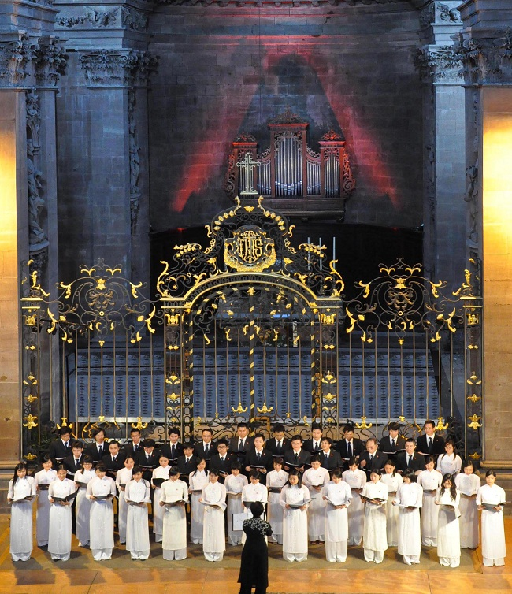

<!--
title: FIMU (Festival international de musique universitaire) một chuyến đi.
author: Nguyễn Ngân Hà
status: completed
-->

## ***Một chuyến đi ...***

Đúng với châm ngôn **« Đem chuông đi đánh xứ người »**. Trước khi lên đường đi dự Festival **FIMU** (**F**estival **I**nternational de **M**usique **U**niversitaire) đã ra đời từ 25 năm nay tại Belfort thuộc vùng Franche-Comté. Tổng kết của Festival Fimu năm 2009 đã có 230 buổi hòa nhạc  – trên 14 không gian sân khấu và quảng trường  – bao gồm 27000 nhạc công và ca sĩ của 30 quốc gia tham dự  – 130 đội hình bao gồm dàn nhạc, hợp xướng, tốp ca và những ban nhạc nhẹ  –  thu hút được hơn 75.000 người đi xem.

Hợp Ca Quê Hương rất hồi hộp, lo lắng về sự đón nhận của người nghe đối với những thiên trường ca kinh điển của nền ca nhạc Cách mạng Việt Nam. Hơn nữa, hai tiếng Việt Nam còn rất xa lạ đối với người vùng này, chưa hẳn đã gây ấn tượng.

  

  

*Photo Foltzer*                                             

Người đến nghe sẽ là 100% người nước ngoài, họ là thành phần yêu thích âm nhạc và rất biết thưởng thức nghệ thuật hát hợp xướng, nhất là nghệ thuật phong cách hàn lâm.

*Photo Foltzer* 

Từ lúc ra đời đến nay Hợp Ca Quê Hương chỉ trình diễn trong khung cảnh rất « sân nhà ». Tuy đã tham gia những lễ hội quan trọng, nhưng tính chất còn rất quốc gia. Hôm nay, « Đem chuông đi đánh xứ người », đứng giữa không gian nhà thờ lớn Saint-Christophe, thường lệ nơi đây dành cho những dàn nhạc thính phòng hoặc dàn hợp xướng tiêu biểu. Tại sao? Vì hầu hết hệ thống truyền âm trong nhà thờ đều tuyệt diệu, do vậy người ta thường sử dụng nó, vì hòa trộn trong một không gian yên tĩnh, một bầu không khí hiền hòa, uy nghiêm và trầm lặng . Tăng sáng sắc thái và giá trị của những tác phẩm được trình diễn tại nơi đây.

*Photo Foltzer* 

Hầu hết các em trong ban HCQH rất ngỡ ngàng vì chưa bao giờ hát trong khung cảnh này, tưởng rằng nhà thờ chỉ là nơi dành cho tín đồ đến cầu nguyện.

  

*Photo Foltzer*

Trước một sàn khán thính giả có trình độ và sành điệu, chúng tôi rất hồi hộp, cảm nhận trong cái nhìn tuy rất thiện cảm của họ, nhưng họ sẽ không tha thứ một vấp váp nghệ thuật nào, từ sự tạo hình của Hợp xướng, tác phong của từng cá nhân và ngôn ngữ khi giao tiếp. Thế lời giới thiệu sẽ phải như thế nào, cho hợp tình hợp lý. Vì chúng ta sẽ trình diễn những bài trường ca cách Mạng, truyền tải thăng trầm của dân tộc Việt Nam . Giờ chót chúng tôi thay đổi ý tưởng, yêu cầu chị nhạc trưởng Ngân Hà đảm nhiệm phần giới thiệu, với lời lẽ nhẹ nhàng, mạch lạc mà ấn tương đúng phong cách giản dị của chị,  có lẽ sẽ đáp ứng hơn.

Ngay từ khi chị Ngân Hà cất tiếng : «Thân chào khán thính giả Festival Fimu». Một lời giới thiệu bình dị, chân thành, tự phát đi thẳng vào lòng người nghe, chị giới thiệu làn điệu dân ca và những tác phẩm nghệ thuật của một thời nay đã trở thành kinh điển, chúng đã nói lên : chúng tôi là một dân tộc yêu chuộng hòa bình, mặc dù đất nước của chúng tôi đã trải qua nhiều thử thách, và hãy còn nhiều vết thương chưa lành. Tôi cảm thấy một luồng hơi ấm vô hình thấm vào tâm não, một tinh thần quyết thắng vươn cao, vang vọng từ  “Du Kích Sông Thao của Đỗ Nhuận” đến “Người Hà Nội của Nguyễn Đình Thi”.

Chúng tôi đã chuyển tải đến thảm người đang trang nghiêm nghe một tình yêu không tính toán. Dư âm của nốt nhạc cuối cùng chưa tắt, có em trong hàng ngũ Hợp Ca vì cảm động, đã không kiềm chế được nước mắt. Tôi rất cảm thông và rất hiểu.

*Photo Foltzer*

Chúng tôi nghĩ rằng, tuy nghệ thuật hát Hợp xướng của Hợp ca Quê Hương hãy còn khiêm tốn, nhưng tình yêu quê hương bỏng cháy đã giúp chúng tôi giới thiệu đến bạn bè quốc tế một khía cạnh độc đáo của văn hóa Việt Nam và chia xẻ cùng với họ tình cảm này.       

Tràng pháo tay kéo dài hầu như không muốn ngưng, thông báo với chúng tôi là thông điệp này đã đến tai người nghe.

Trên đường về, chúng tôi tự nhủ. « Không được tự mãn, còn phải cố gắng nhiều hơn nữa ».

*NTK*

*Belfort 24/05/2010*

