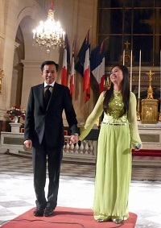
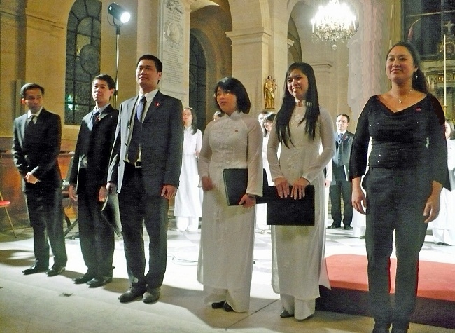

<!--
title: Đêm giao hưởng Pháp ủng hộ các nạn nhân da cam tại St Louis des Invalides 18 / 11 / 2010.
author: Nguyễn Tích Kỳ
status: completed
-->

 
**Phối hợp với Ủy ban vì làng hữu nghị Vân Canh của Pháp
và Phòng ký ức di sản và tài liệu của Bộ Quốc phòng Pháp
tại St Louis des Invalides 18 / 11 / 2010.**
 
Tối 18-11, tại Bảo tàng quân đội Pháp ở thủ đô Paris, trong khuôn khổ kỷ niệm 1.000 năm Thăng Long Hà Nội, Ủy ban vì làng hữu nghị Vân Canh của Pháp phối hợp Phòng ký ức, di sản và tài liệu của Bộ Quốc phòng Pháp tổ chức buổi biểu diễn ca nhạc và hòa nhạc ủng hộ các trẻ em của làng hữu nghị Vân Canh. Buổi hòa nhạc tổ chức ở trong nhà thờ Saint Louis bên cạnh điện Invalid, nơi đặt mộ của Hoàng đế Napoleon.
 
**Đêm giao hưởng Pháp ủng hộ các nạn nhân da cam
Vietnam Plus – 19/11/2010 21:27
Theo phóng viên TTXVN tại Pháp, trong khuôn khổ triển lãm của Bảo tàng Quân đội Pháp “Hà Nội, 1000 năm trường tồn,” tối 18/11, Ủy ban Pháp vì Làng hữu nghị Vân Canh đã tổ chức đêm nhạc từ thiện tại nhà thờ Saint-Louis des Invalides ở Paris với sự tham gia của Dàn nhạc giao hưởng Cận vệ Cộng hòa và Hợp ca Quê hương.**

Đêm nhạc được tổ chức dưới sự giúp đỡ của Cục Di sản và Bảo Tàng và Bộ Quốc phòng Pháp, nhằm quyên góp ủng hộ các nạn nhân chất độc da cam tại làng Vân Canh, Hà Nội.

Tham dự đêm nhạc có Đại sứ, Trưởng Phái đoàn Việt Nam bên cạnh UNESCO Văn Nghĩa Dũng, ông Louis Cador, Giám đốc Học viện quốc gia Invalides, Tướng Philippe Schneider, Chỉ huy đội Cận vệ Cộng hòa, cùng gần 450 khán giả là bạn bè Pháp và bà con người Việt đang sinh sống và học tập tại Pháp.

Trong đêm diễn, khán giả đã được thưởng thức các bản concerto và giao hưởng của các nhạc sỹ cổ điển như Carl Philipp Emanuel Bach, Errol Girdelstone cho sáo và dàn nhạc do Nhạc trưởng Francois Boulanger, nghệ sỹ sáo Jean Ferrandis cùng dàn nhạc giao hưởng danh tiếng này thể hiện.

Khán giả cũng có dịp được biết đến dòng nhạc cách mạng và dân ca Việt Nam qua cách thể hiện độc đáo của Hợp ca Quê hương với các bài “Người Hà Nội,” “Du kích sông Thao,” “Trống cơm.”

Không giấu nổi niềm tự hào, chị Nguyễn Ngân Hà, chỉ huy dàn hợp ca, tâm sự: **“Đây là một sự kiện đầy ý nghĩa, thể hiện tình hữu nghị Việt-Pháp vì đêm nhạc là sự phối hợp giữa một dàn nhạc chuyên nghiệp, lâu đời của Pháp với một dàn đồng ca trẻ của các bạn Việt Nam tại Pháp, biểu diễn tại một địa danh lịch sử nổi tiếng, cùng hướng về hoạt động thiết thực hàn gắn vết thương chiến tranh tại Việt Nam.”/.**
 
(TTXVN/Vietnam+)
 

**Lăng Hoàng đế Napoléon tại nhà thờ Saint Louis des Invalides. Paris.** photo Tuyết & Nam & Nga   

 

  

**Cảm tưởng sau buổi trình diễn 18.11.2010 tại St Louis des Invalides**

Các em thân thương,
Chú tự kiềm chế, không viết ngay cảm nghĩ sau buổi trình diễn tại nhà thờ Saint Louis des Invalides. Vì chú chờ hai thông tin :
Trong bản thông tin thời sự bằng tiếng Pháp của TV4 lúc 21g30 (giờ Paris) BTV Kiều Anh có tường trình sự kiện về Hợp ca Quê Hương tại nhà thờ Saint Louis des Invalides ở Paris ngày 18 /11/ 2010.
Chiều hôm nay 19 /11 / 2010 đích thân Bà trách nhiệm của nhà thờ Saint Louis des Invalides đã điện thoại cho Cô. Trước hết, cảm ơn sự tham gia của Hợp ca Quê Hương và sau đó thông báo là nhà thờ đã nhận được nhiều tiếng vang rất tốt về cuộc trình diễn của Hợp ca Quê Hương.
Bây giờ chú có thể yên tâm viết vài hàng tâm sự.
Chú trân trọng chia xẻ với các em H.Phương / M.Hương / M.Phượng / Trọng Dũng / Mạnh Tân / Hà Diệp / Thu Hiền / Hiền Lương / Thanh Hiền thành công của buổi trình diễn HCQH tại nhà thờ Saint Louis des Invalides. Tuy các em ở phương trời xa mà lòng vẫn đau đáu nhịp theo từng bước hành quân của Hợp ca Quê Hương. Điều này,  làm chú xúc động vô cùng, nó biểu hiện sự đoàn kết, thương yêu, đùm bọc nhau.
Chú không quên những em,  H.Đăng / P. Hiệp / V.Long – Thúy / T.Anh / M.Thu bé / N.Lâm / V.Anh/ H.Hậu / Q.Hiển / D.Hưng / T.Hùng / T.Mỹ / H.Thu / Q.Việt / T.Huyền / T.Cảnh / P.Hùng / M.Chính / N.Lân / Đ.Mai / T.Nhung  ngày đêm sát cánh bên Cô chú chắt chiu từng chi tiết, bảo đảm cho buổi trình diễn này thành công. Những em H. Nam / Q.Tùng tuy mới là lần đầu cũng không ngần ngại lao vào khuân vác âm thanh ánh sáng, ghi hình ảnh, cả em L.Tuyết và em Q.Nga cũng chuyển thành nhiếp ảnh. Chú cảm động vô cùng, khi đọc trên nét mặt mỗi em nét băn khoăn của giờ phút trước khi xuất trận. Chú cảm nhận thấy trên từng nét mặt, có phảng phất điều gì lo lắng.
Nhìn mỗi em, chú thầm áy náy « chúng nó ngoan thế, tại sao đôi khi mình lại la mắng chúng nó, mình để sự cầu toàn ngự trị qúa đáng ». 
Em T.Tâm sau màn trình diễn solo, đã tất tưởi thay đồng phục trắng, khiêm tốn hòa mình vào dàn hợp ca. Hai em H. Châu và V.Ngọc tuy đã thấm cái tác phong của pianistes chuyên nghiệp nhưng vẫn bị không khí hừng hực của Hợp ca Quê Hương níu kéo.
Còn các em như Q.Nga suốt thời gian hăng say cần cù luyện tập, đến giờ phút chót công việc không cho phép tham gia, cũng tất bật sau giờ công sở, vội vàng « phi đến » chỉ để ủng hộ và chụp ảnh cho đoàn. Còn nhiều em mà chú chưa ghi tên, chú xin lỗi và xin hứa với những em « mới toanh » chưa lên sân khấu lần này. Lần sau chúng ta sẽ toàn đoàn đầy đủ.
Hôm nay cô không chảy nước mắt như khi giới thiệu bài « Du kích Sông Thao » như ngày nào tại festival Fimu. Cô đã đưa dắt HCQH « đi vào bài hùng ca » một cách bình dị, sống lại những ngày đầu khi Sông Thao nổi sóng chống kẻ thù. Rồi đến bài Hà Nội hào hùng bất khuất đi vào cuộc kháng chiến trường kì, đến ngày thắng lợi.
Đất nước của chúng ta là thế đấy.
 
Trong lòng chú, tự hào về Hợp ca Quê Hương dâng trào như bất tận.
Chúng ta nhẹ nhàng khép lại một trang sinh hoạt mới của Hợp ca Quê Hương và xin hứa trong tương lai sẽ thành công nhiều hơn nữa.
 
NTK
Antony 20/11/2010