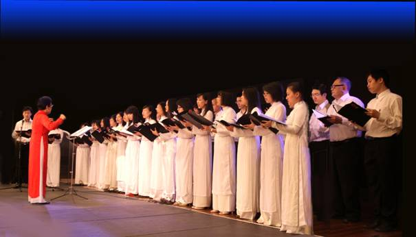

<!--
title: Thư gửi mẹ
author: Nguyễn Tích Kỳ
status: completed
-->

*Kính thưa Mẹ,*  

*Thế là cũng hơn ba năm từ khi con sang Pháp rồi, mẹ nhỉ? Cuộc sống bên này nhộn nhịp quá, con chừng như chẳng đếm nổi thời gian. Năm qua, tháng qua, công việc nối nhau kín đầy cuốn sổ tay nho nhỏ. Nhiều khi con cứ tưởng như thời gian chỉ ngừng trôi vào mỗi dịp cuối tuần, lúc con được tự do xếp lịch ăn ngủ và giải trí cho bản thân, mẹ ạ.
Paris có đến hơn ba ngàn sinh viên Việt Nam, với đủ các kiểu hội hè, tổ chức, nhóm bè bạn khác nhau. Dạo này con cũng chăm chỉ tham gia các hoạt động của sinh viên hơn. Thỉnh thoảng cuối tuần con có những dịp đi họp nhóm với các anh chị Tiến sĩ, đi dạy học cho học sinh Pháp, hay đi nghe các hội thảo chuyên đề do các nhà khoa học hàng đầu tổ chức.*   

*Điều khiến con vui ấy là được chứng kiến và tham dự các sự kiện tập thể, nhờ thế tăng cường giao tiếp và sự tương tác với mọi người, đồng thời cũng giúp con hiểu hơn về xã hội nơi này, nhất là cộng đồng sinh viên Việt Nam. Nhưng niềm vui lớn nhất của con có lẽ là mỗi chiều thứ bảy, con lại được đi hát ở Hợp Ca Quê Hương. Con chưa kể với mẹ nhỉ ? Hợp Ca Quê Hương là một ban hợp xướng “bán chuyên nghiệp” do chính người Việt gây dựng nên, biểu diễn những ca khúc Việt Nam đến với những người bạn Pháp. Do cô Ngân Hà và chú Tích Kỳ khởi xướng, với niềm đam mê âm nhạc, cô chú đã tập hợp được đông đảo thành viên để tạo nên một dàn hợp xướng với quân số lên tới gần trăm người. Thành viên chỗ con thì phức tạp lắm, có những bác đã nghỉ hưu, các anh chị đã đi làm, tụi sinh viên như bọn con cho đến cả bọn học phổ thông nữa. Quan trọng là những ai có niềm yêu tiếng Việt cùng với dòng nhạc Cách Mạng, tất cả đều có thể tham gia. Con thuộc loại gần như trẻ nhất ở đó mẹ ạ, tuy nhiên con thấy ở đây ai cũng trẻ hết. Mặc dù hoàn cảnh mỗi người một khác nhau, nhưng khi đến Hợp ca thì tất cả chỉ biết có âm nhạc mà thôi. Có những người sở hữu một vốn kiến thức đồ sộ về âm nhạc, lại có những người, mặc dù không chuyên, lại có giọng hát đẹp mê ly. Nhưng một khi đã vào dàn hợp xướng rồi, thì mỗi giọng hát tưởng như một màu vẻ khác nhau, lại hòa chung làm một như chúng được sinh ra trong cùng môt mái nhà. Quá trình tập luyện cũng gian nan lắm mẹ ạ. Thời gian đầu tiên, gần như cô Ngân Hà phải tập lần lượt cho từng người một, sửa từng nốt, từng chỗ ngân và lấy hơi, nhất là với những thành viên nghiệp dư như con của mẹ.*

*Rồi đến lúc hát chung, con lại hát sai hết cả ! Cứ phải vài ba tuần, tập đi tập lại, lẩm nhẩm câu hát những khi ở nhà thì mới dần quen được. Nhưng một khi đã hòa nhịp được với mọi người, đó quả là kỳ tích. Mặt mũi ai nấy đều hớn hở, sao mấy chục người lại có thể hát đều và đẹp thế nhỉ. Những lúc đó con cũng thấy tự hào đến phổng mũi ấy chứ ! Vui nhất là những lúc được mời đi biểu diễn. Các bạn nữ mặc áo dài trắng, còn các bạn nam bận complet đen, vừa thể hiện tính chuyên nghiệp mà vẫn mang đậm bản sắc văn hóa dân tộc.*

*Lúc đó là lúc tất cả như nín thở chờ phút Nhạc trưởng phất tay để bắt đầu. Tất cả cùng chăm chú quan sát từng chỉ huy lên xuống, to nhỏ, nhấn giọng hay lấy hơi của cô Ngân Hà. Để rồi khi bài hát kết thúc và nhận được những tiếng vỗ tay động viên của khán giả, con cảm nhận dường như tất cả mọi người đều nở một nụ cười mãn nguyện. Thành viên của hợp ca, từ nhạc trưởng đến các pianist Thế Anh, Minh Anh và solist Thanh Tâm, Quốc Việt, Phú Hiệp, Trung Mỹ tuy chỉ là nghiệp dư, không qua trường lớp đào tạo âm nhạc cơ bản, nhưng ai có thể dạy được tình yêu cơ chứ ! Mỗi một lần biểu diễn là một lần con được thấy trái tim mình rung lên vì hai chữ Thiêng Liêng, vì niềm tự hào và tình yêu Tổ Quốc, yêu tiếng Việt trong sáng, đẹp đẽ lạ kỳ.*

*Con nhớ mẹ từng bảo con, âm nhạc là thứ ngôn ngữ chung duy nhất của loài người. Giờ con mới hiểu và mới thấy điều đó rõ hơn bao giờ hết. Chính tiếng hát quê hương đã mang những người con xa xứ đến gần với nhau, cho dù còn chưa biết họ biết tên.*

*Ấm áp làm sao mỗi dịp cuối tuần, con tìm lại được hình bóng quê hương mà con xa cách đã bấy nhiêu năm trong mỗi ánh mắt nhớ mong và trong tiếng hát tri ân đến cội nguồn.    Thôi, thư đã dài, con xin tạm ngừng bút. Sắp đến giờ con đi tập hát rồi mẹ ạ. Con gửi mẹ tấm hình bọn con chụp ở lần biểu diễn gần đây, con đứng ở (đâu đó ….) đấy ạ. Mẹ trông con của mẹ đã thành người lớn chưa ?*

*Con của Mẹ*

*Tác giả bài  “Thư gửi Mẹ”  không đưa tên.*

*HCQH trình diễn tại Créteil 14.11.2011*

*Ảnh HCQH*

