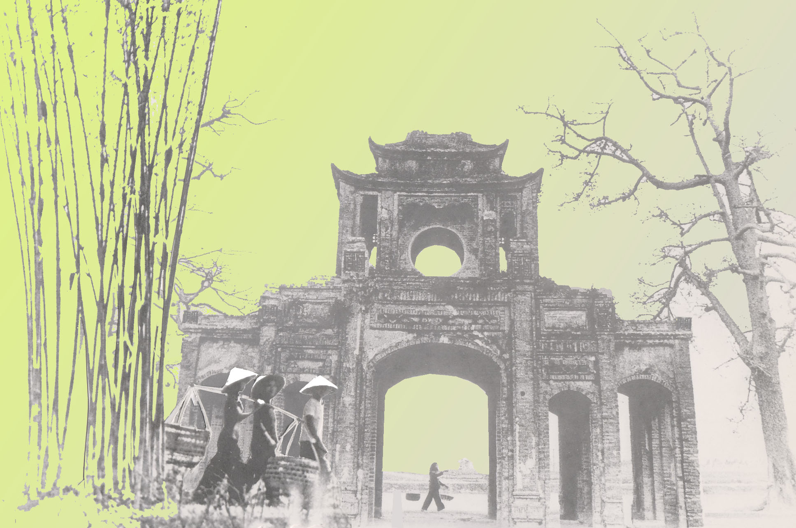

<!--
title: Tản mạn về cái hay của tiếng Việt qua tác phẩm của Đặng Hữu Phúc
author:  
status: completed
-->

*L.V. Beethoven từng nói: “Âm nhạc cao hơn mọi triết lý và mọi sự khôn ngoan”*

Gửi Hợp ca Quê Hương!

Có lẽ từ rất lâu rồi, có thể tính từ ngày đầu tôi đặt chân sang nước Pháp để tiếp tục sự nghiệp học tập mà bao sinh viên trẻ mới ra trường đều đeo đuổi. Ngót nghét gần 4 năm – ngót nghét quãng thời gian tưởng như dài mà lại vô cùng ngắn ấy – cực hiếm hoi tôi “động” đến văn chương, thơ ca, âm nhạc Việt Nam. Lý do thì nhiều vô kể nhưng có lẽ, cuộc sống du học chẳng “màu hồng” như người ta vẫn tưởng nên làm gì có thời gian để mà dành cho những “góc lặng” trong tâm hồn cơ chứ? Học – làm thêm – thi cử -  học – làm thêm – thi cử. Ba từ ấy vô hình trở thành một chu kỳ bó buộc hầu hết du học sinh. Tôi cũng nằm trong vòng xoay ấy. Đôi khi giật mình vì vốn tiếng Việt của mình mai một dần và cũng lên gân tự nhắc mình rằng: “phải quyết tâm lấy lại thói quen đọc văn, đọc thơ Việt Nam đi. Cứ thế này thì tiếng Pháp cũng chẳng giỏi mà lại mất vốn tiếng mẹ đẻ”. Ấy thế mà vẫn khó thực hiện!. Đến đây, xin gửi lời cảm ơn chân thành đến Hợp ca Quê hương! Cám ơn bạn nhiều nhé! Bạn sẽ bảo tôi vô duyên tự yên đi cám ơn không đâu. Nhưng tôi có lý do chứ! Vì sao? Với tôi, cám ơn không phải vì bạn cho tôi cơ hội thể hiện đam mê ca hát – vì tôi chẳng có đủ thời gian để tập đều đặn với mọi người, cũng như tôi tự biết giọng hát của tôi không đủ tự tin để hát những ca khúc viết riêng cho hợp xướng. Cũng không phải vì bạn cho tôi cơ hội để được gặp gỡ, giao lưu với cộng đồng người Việt ở Paris. Chỉ bởi một lẽ duy nhất mà có lẽ với nhiều bạn, nó rất bình thường nhưng với tôi, nó có ý nghĩa như tôi được sống lại thời thơ bé để uống cạn bầu sữa căng đầy của mẹ! Vì bạn cho tôi được yêu hơn nữa tiếng Việt của mình qua các tác phẩm âm nhạc!

Tôi yêu lời tất cả các ca khúc mà mọi người đã cùng hát – mỗi bài với một tình yêu khác nhau. Nhưng yêu nhất là hai tác phẩm của Đặng  Hữu Phúc được phổ thơ của Phan Đan: **“Trăng chiều”** và **“Tiếng mùa xuân”**! Bạn sẽ hỏi tôi sao không phải là “Tổ quốc ta” hùng tráng, linh thiêng? Sao không phải là “Du kích sông Thao” với những khúc “đục”, khúc “trong”? Sao không phải là “ Trường ca Sông Lô” trầm mặc và hào hùng? Hay sao cũng không phải là  “Người Hà Nội”? v.v… Tôi cũng không biết giải thích vì sao, chỉ biết rằng có lẽ bởi cả ca từ và nhạc điệu trong hai tác phẩm ấy đủ ma lực khiến tôi phải đào bới trong các kiểu tình yêu để dành tặng một cách vô thức cho hai nhạc phẩm ấy thứ tình sâu đậm nhất! Thứ tình yêu khiến tôi thấm thía, ngẩn ngơ và ước muốn được đắm mình mãi ở trong đó! **‘Trăng chiều”** có lẽ là một trong những bài hát tiếng Việt đẹp nhất, đẹp từ nhạc cho tới ca từ. Tôi yêu cái “nắng chưa kịp tàn, nắng buông dịu dàng từng tia nắng mong manh”. Chỉ cần đọc câu nhạc ấy lên thôi là đã thấy trước mặt cả một mặt hồ nước mênh mang ngập nắng chiều – cái thứ nắng nhè nhẹ, rất tình và rất riêng của mùa thu Hà Nội. Chẳng cần phải nói rằng “chiều rồi, nắng tắt rồi và trăng đang lên kìa em!”. Chỉ một câu ngắn gọn “chiều dâng trong mắt, vầng trăng dịu êm”, Phan Đan đã gói trọn được cả không gian và thời gian của hai người yêu nhau.   Chắt lọc những mĩ từ rất tinh xảo- không phải ai cũng có thể viết về mùa thu nhẹ nhàng, tha thiết mà có thể gửi gắm được tình yêu tinh tế và có chiều sâu với những cung bậc cảm xúc đa chiều như Phan Đan. Và Đặng Hữu Phúc đã “nhạc hoá” chất thơ ấy trong đứa con tinh thần của mình một cách xuất sắc!   Thật không ngoa nếu như nói rằng: **“Trăng chiều”** chính là bức phác thảo xuất sắc nhất về mùa thu Hà Nội với hương hoa sữa nồng nàn, với chút gió se lạnh, với ráng chiều vàng ruộm và trăng non mới nhú trên Hồ Tây. Với cả anh, cả em! Với “Tiếng mùa xuân”, ca sĩ Ái Vân đã rất thành công khi biểu diễn nhạc phẩm này từ những năm 80. Tuy nhiên, bản mà tôi có trong tay và bản Ái Vân hát có một sự khác biệt nho nhỏ – nhưng cũng đủ làm nên một sự thay đổi lớn về nội dung biểu cảm. Hai câu đầu trong phần thể hiện của Ái Vân : ““Rụng lá trong vườn động gió ngoài khơi Đợt sóng xô bờ đọng ngấn bờ xa” Trong bản của chúng ta: “Rụng lá trong vườn động gió ngoài sông Đợt sóng xô bờ đọng ngấn phù sa” Đã có sự chuyển biến từ không gian rộng lớn của biển cả (với khơi xa) sang một không gian hẹp hơn của dòng sông (liệu có phải là sông Hồng?). Như vây, dụng ý của nhà thơ là gì? Có lẽ nào sự khác biệt kia  khiến “Tôi  biết em qua vùng mênh mông nhớ” trong phiên bản thứ hai đã làm giảm đi cái “mênh mông nhớ” ấy? Tôi sẽ không đi sâu vào khai thác hình ảnh này nữa để tránh tuột mất cảm xúc của những dòng nhạc thơ tuyệt hay phía sau. “Làm cánh ong vàng làm tiếng mùa xuân Làm nắng êm đềm làm quãng đường mưa Tôi dẫn em sang miền quê yên tĩnh Mặt trời, mặt trời sáng Giấc mơ vòm cao nụ cười sáng Đoá hoa tình yêu” Chỉ biết thốt lên “sao ca từ lại đẹp đến như thế”. Thật khó có thể hình dung tại sao Phan Đan có thể đặt các từ ngữ vào một trò chơi chữ “hay lạ lùng” đến vậy! Tác giả lấy hình ảnh “cánh ong” để nói lên “tiếng mùa xuân”. Đâu cần phải thô thiển và dài dòng “con ong vỗ cánh vo ve, tiếng vo ve tạo nên âm thanh mà chúng ta vẫn thường nghe thấy chúng trong các vườn hoa của mùa xuân” thì  mới nói lên được mùa xuân!. Rồi nhà thơ lấy “nắng êm đềm” đặt cạnh “quãng đường mưa” để tạo nên sự tương phản rất đỗi trữ tình! Chưa dừng lại ở đó,  trò chơi chữ thú vị này dẫn ta đến phía cuối bài hát với “miền quê yên tĩnh”. “Miền quê yên tĩnh” ấy có phải là bờ vai rộng lớn của anh, là sự chở che bao bọc cho em để đem đến cho em sự bình yên suốt cuộc đời? Có thể lắm chứ vì chỉ ở chốn bình yên, rộng lớn, ta mới thấy “mặt trời sáng”, ta mới thấy “nụ cười sáng” của em!. Chỉ khi cảm thấy được hạnh phúc vô bờ bến, ngừơi con gái mới nở nụ cười mãn nguyện trên môi để người con trai nhìn nụ cười ấy là “đoá hoa tình yêu”. Đâu phải chàng trai nào cũng có đủ tinh tế để viết ra được những lời thơ bay bổng cảm xúc dành tặng cho người con gái mình yêu như người nghệ sĩ này! Chất thơ nồng nàn kia sẽ bớt nồng nàn hơn nếu như không được đắm mình vào sóng nhạc mà Đặng Hữu Phúc đã trau chuốt và đầy dụng ý khi phổ thành ca khúc. Bạn hãy nghe bản “romance” này do Ái Vân hát và thả mình vào tiếng sáo, tiếng piano và tiếng violon da diết để tự cảm nhận nhé. Không bàn đến tài năng không thể phủ nhận của nhạc sĩ về tính nhạc, cả hai nhạc phẩm của Đặng Hữu Phúc được phổ nhạc từ lời thơ của Phan Đan đều với tựa đề về thiên nhiên nhưng tôi thấy ở tầng sâu của chúng là những cảm xúc rất người được diễn tả vô cùng tinh tế qua một ngòi bút có thể được ví như bậc thầy về ngôn từ. Trong xã hội phát triển với sự ảnh hưởng của trào lưu văn hoá phương Tây, âm nhạc Việt đang rất thiếu những nhạc phẩm với ca từ đẹp như những tác phẩm này. Mong muốn những thành viên của Hợp ca sẽ biết chắt lọc những nhạc phẩm đẹp nhất để lưu giữ vì chỉ có những sáng tác ấy mới có thể nuôi dưỡng vĩnh cửu tâm hồn của mọi người và để biết yêu thêm và yêu mãi quê hương mình thôi. Xin được kết thúc tản mạn ở đây bằng hai câu thơ trong truyện Kiều. Nếu ai đã đọc truyện Kiều của Nguyễn Du thì ắt hẳn sẽ bị ám ảnh bởi tài “cầm chương” của Thuý Kiều. Dù mọi sự so sánh đều là khập khiễng nhưng tôi xin được làm phép so sánh  ở đây để thể hiện cảm xúc như thế đối với hai nhạc phẩm của Đặng Hữu Phúc.  Hai câu thơ này trích trong đoạn Hồ Tôn Hiến – tuy chỉ là một quan võ, có rất nhiều hiểu biết về nhạc, vậy mà nghe tiếng đàn của Thuý Kiều hay đến nỗi mê luôn cả nàng Kiều. “Nghe càng đắm, ngắm càng say Lạ cho mặt sắt cũng ngây vì tình”

Cám ơn nhà thơ Phan Đan, cám ơn nhạc sĩ Đặng Hữu Phúc đã sáng tạo hai  tác phẩm đẹp quá đỗi! Cám ơn vì đã là người Việt Nam và đã viết nên những bản nhạc tuyệt đẹp bằng tiếng Việt nam.

Cám ơn Hợp ca Quê Hương đã cho chúng tôi được giao thoa và “trò chuyện” với những bản nhạc để đời ấy! Chúc bạn của tôi một tuổi mới với nhiều thành công mới trên con đường cảm nhận âm nhạc Việt Nam và tiếng nói quê hương.!

Joyeux anniversaire! Paris,

17 tháng 03 năm 2012

Hoàng Anh

Người ghi nhận: Hà My

