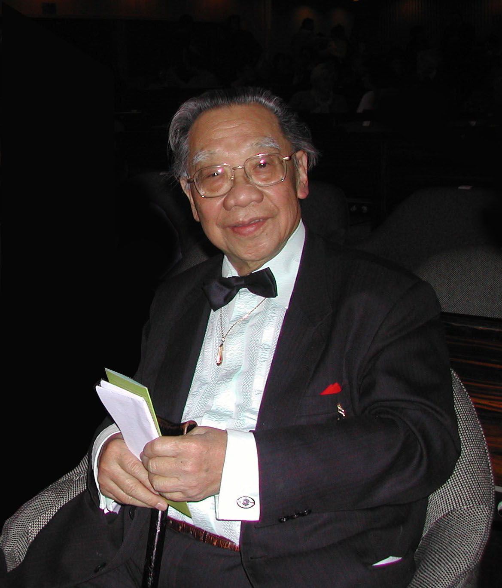
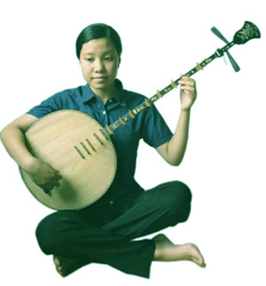
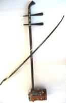
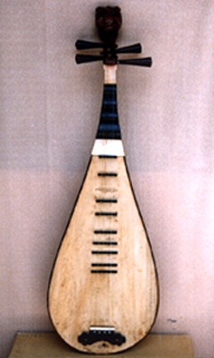
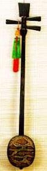
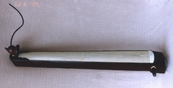

<!--
title: NGHỆ THUẬT ĐỜN CA TÀI TỬ TRONG KHÔNG GIAN VĂN HOÁ NAM BỘ
author: Nguyễn Tích Kỳ
status: completed
-->

***GS TS Trần Văn Khê*** (Bài gửi Hà Nội)*

  

*Lời mở đầu :*

*Đờn ca tài tử là một sinh hoạt văn nghệ thuộc loại thính phòng (một nghệ thuật do một nhóm nhỏ nghệ sĩ biểu diễn cho một nhóm nhỏ thính giả, không gian ấm cúng của một căn phòng trong tư gia, chớ không phải trong một hội trường lớn, hay trên một sân khấu hoành tráng cho đông đảo thính giả).* 

Theo nhiều tài liệu nghiên cứu thì đờn ca tài tử bắt nguồn từ Ca Huế. Nghệ sĩ Đờn ca Huế trong phong trào Cần Vương đã rời miền Trung vào Nam. Trên đường đi họ dừng chân ở Quảng Bình, Quảng Trị, Quảng Nam. Từ đó tiếng đờn, giọng ca xứ Huế mang thêm chút hương vị xứ Quảng như điệu “Lưu thuỷ tục giang” qua giai đoạn “Lưu thuỷ Quảng” mới trở thành “Lưu thuỷ đoản” miền Nam ; “Phú lục Huế” chuyển hơi thành “Phú lục Quảng”, rồi khi vào Nam bài “Phú lục chấn” chỉ còn đôi chút của “Phú lục Huế”. Tiếng đờn miền Trung khi vào miền Nam không còn giữ nguyên chất mà đã thay đổi rất nhiều, có bài bản còn trùng tên, nhưng giai điệu đã khác xa, điển hình như 2 bài “Nam Ai Huế” và “Nam Ai miền Nam”. Quan sát môi trường, con người và nếp sống miền Nam, chúng ta sẽ rõ tại sao bài bản không còn giữ được chuẩn, đó là do người đờn, người ca không muốn giữ nguyên si bài bản như thầy đã dạy, mà luôn có đôi nét thêm thắt thay đổi, tô điểm, đưa một chút ‘ta’ vào trong ‘chúng ta’ Nam bộ là tên gọi phía cực nam Việt Nam, thay cho tiếng gọi Nam kỳ, sau khi nước nhà thống nhứt, là một vùng đất đỏ basalte nặng trĩu phù sa, một vùng chằn chịt kinh rạch, sông ngòi, vùng mà trước kia hoang dại “ma thiêng nước độc”, một “nơi nhiều sông rạch bùn lầy, muỗi kêu như sáo thổi, đỉa lội lầy như bánh canh”. Những người Việt từ miền Bắc xa xôi, miền Trung kinh kỳ, đến đây lập nghiệp, một vùng đất mới, đồng ruộng phì nhiêu, một vựa lúa, một vườn trái cây, có nhiều sản vật phong phú, đa dạng, nên *“đến đây thì ở lại đây, trăm năm bám rễ, xanh cây không về”*. 

Họ là những người “tứ chiến” năng động, nhạy bén, dám nghĩ, dám làm, sẵn sàng tiếp nhập với dân bản xứ, giản dị, cởi mở, hào hiệp, hiếu khách, có một nền dân ca dồi dào, với nhiều câu ca dao trữ tình, câu hò điệu lý duyên dáng, bài vè dí dỏm, một nền nhạc lễ bắt nguồn từ nhạc cung đình miền Trung, giản dị hoá, dân gian hoá, rất độc đáo với “Phe Văn, Phe Võ”, với tiếng trống “đánh sáng, đánh tối”, “tiếng âm, tiếng dương”, tiếng “bồng” sôi động, bồng hai, bồng ba, bồng thét, “tiền bần hậu phú”, đã tạo nên một không gian văn hoá Nam bộ đặc thù, phát triển không ngừng đến ngày nay. 

Do lòng luôn luôn thương nhớ cội nguồn, nên mặc dầu trong đờn ca tài tữ có rất nhiều điệu, nhiều giọng, nhiều hơi,nhưng các các điệu các hơi diễn tả nỗi u buồn, được người ca và người nghe thích thú, say mê trong diễn tấu, miệt mài trong thưởng thức.

***Định nghĩa chữ « đờn tài tử »:***

Phần đông khi nhắc đến Đờn Tài tử thì cho rằng lối nhạc đó không sâu sắc chuyên nghiệp mà mang tính cách giản dị của dân gian hay « a ma tơ » ( theo cbnữ Pháp « amateur »| của những người nghiệp dư. Thực ra “Tài tử” có nghĩa là người có tài (dập dìu tài tử giai nhân … Tài tử giai nhân tế ngộ nan). Người đàn Tài tử không dùng nhạc Tài tử làm kế sinh nhai. Khi nào thích đàn thì họp nhau tại nhà một người trong làng rồi cùng nhau đàn chơi, ai biết đàn ca cũng có thể tham gia được. Dầu vậy mà trình độ nghệ thuật của đàn Tài tử không thấp. Ngược lại, họ thường tập luyện rất công phu, phải theo thầy học từ chữ nhấn, chữ chuyền, rao sao cho mùi, sắp chữ sao cho đẹp và tạo cho mình một phong cách riêng. Muốn trở thành người đàn Tài tử đúng nghĩa phải trải qua thời gian tập luyện khá công phu.

**Sự thành hình nghệ thuật đờn ca tài tử**

Đến cuối thế kỷ 19, khi có phong trào CầnVương, một số nghệ nhân, nghệ sĩ vào Nam lập nghiệp, đem theo truyền thống đờn ca Huế như các cụ : Nguyễn Liêng Phong, Nguyễn Tòng Bá, thường gọi là ông Tư Bá dạy đờn nguyệt (trong Nam gọi là đờn kìm), đờn tranh ; ông Phạm Đăng Đàn, cư ngụ tại Vĩnh Long chuyên dạy đờn độc huyền (đờn bầu) ; cụ Trần Quang Thọ (nhạc công cung đình Huế, ông cố nội của tôi) dạy đờn tỳ bà. Trong Nam có rất nhiều người học, không những người giai cấp thượng lưu, thầy thông, thầy ký thích học và tấu đờn ca tài tử, mà những ngưởi nông dân chân lấm tay bùn sau những ngày lao động ngoài đồng áng, hay người chèo thuyền trên sông, những chuyến đò ngang, đò dọc, đều thích học và biểu diễn đờn kìm, đờn cò hay thổi sáo trúc. Tất cả những người học luyện đờn ca không phải để mưu sống mà để thoả thích nhu cầu sinh hoạt văn nghệ, mình đờn cho mình nghe, cho bạn bè, người thân, kẻ thích nghe, không lấy tiếng đờn làm kế sanh nhai, nên cách đờn đó được mang danh là “đờn ca tài tử”.Vì vẫy nên có thể nói đờn ca tài tữ hình thành từ “ca Huế” một loãi nhạc truyền thống nghệ thuật” có thể nói là “bác học” lại Mang nặng tính các “truyềjn thống dăn gian”. Tại các tỉnh miền Đông và miền Tây, có những gia đình và những “nhóm chuyên đờn ca tài tử”. Trong giới nhà nghề ai cũng biết danh những người đầu đàn (thường được gọi là “chủ soái”) và các môn sinh thành công, sau này tiếp tục truyền bá nghệ thuật đờn ca tài tử, tgheo phong cách và lề lối của Thầy. Nhưng không thể gọi là “trường phái” được.

Nhóm nhạc miền Đông bao gồm 3 tỉnh Biên Hòa, Gia Định, Định Tường, nổi tiếng nhứt là cụ Nguyễn Quang Đại, thường được gọi là ông Ba Đợi, và một số học trò tài ba của ông như : Sáu Thới, Bảy Nhỏ, Tám Hạnh, Cao Quỳnh Cư, Cao Quỳnh Diêu, Sáu Thoàn, Chín Chiêu, Năm Tịnh, Năm Khiết, Ba Đồng, Năm Quýnh, Năm Cần, Giáo Thinh, Cao Hoài Sang. Nhóm đã cải biên các bài bản của ca nhạc Huế để tạo ra những bài bài phù hợp với quan điểm thẩm mỹ của miền đất Nam bộ. Nhóm không chủ trương sáng tác nhiều bài bản, chỉ sắp xếp chung một số bài bản tiêu biểu có cùng hơi điệu. *Sự sắp xếp nầy đã hình thành 4 loại bài bản tượng trưng cho 4 điệu Bắc, Nam, Hạ, Oán, chỉ gồm có 20 bài bản* mà giới nhạc tài tử gọi là 20 bản Tổ đã đại diện đầy đủ hơi điệu đờn ca tài tử.

Ông đã dạy nhạc nhiều nơi và dạy nhiều học trò gồm đủ thành phần công nhân, nông dân, trí thức, nhứt là tại miệt Cần Giuộc, Cần Đước, dấu ấn của ông để lại rất rõ nét. Ông lấy vợ sanh con, dạy rất nhiều học trò thành danh như các ông Sáu Thoàn (cò), Chín Chiêu (kìm), cô Sáu Giỏi (kìm), cô Bảy Lung (tranh), ông Xã Năm (tiêu), Năm Tịnh (tranh, tỳ bà), Hai Bầu (cò), Năm Khiết (thân sanh cô Tư cầu Mồng Gà, một ca sĩ nhạc tài tử nổi danh lúc bấy giờ), Bảy Đờn, Mười Bầu, Bảy Vô (nhạc sĩ tham dự Vạn Quốc Bác Lãm Hội Paris, Pháp Quốc 1900), Tám Ra, Mười Lăng, Chín Kỳ, Năm Cần, Cả Cương, Tư Chợ … Trong khoảng thời gian rất ngắn, không hổ danh là một nhạc công của triều đình, ông đã đào tạo cho vùng Cần Đước, Cần Giuộc thuộc tỉnh Long An nhiều ban nhạc tài tử có căn cơ bài bản vững chắc và nhiều thầy đờn có ngón đờn tài ba đi làm thầy dạy nhạc khắp miền lục tỉnh. Trong khuôn khỏ bài nầy, tôi không thể kê khai”tất ca” các nhóm, các “chủ soái” , mà chỉ nói rõ tiểu sử của vài nhạc sư, nhạc sĩ mà tôi biết rõ Nhạc sư Nguyễn Vĩnh Bảo :

Anh Vĩnh Bảo sinh năm 1918 (Mậu Ngọ) tại làng Mỹ Trà, quận Cao Lãnh, tỉnh SaĐéc (nay thuộc tỉnh Đồng Tháp), trong một gia đình nho học, lại rất ưa nghệ thuật đờn ca. Thân phụ của anh là cụ Nguyễn Hàm Ninh, một đông y sĩ biết đờn tranh, kìm, cò, gáo và hát bội. Những người anh của anh, đặc biệt là anh Ba đờn kìm, xến rất hay được nhạc sư Sáu Tửng khen ngợi. Anh Hai Phát có tiếng đờn tam rất đặc biệt và trong băng nhạc đờn ca tài tử của Nam Bình thực hiện có bản ‘Lưu thuỷ trường’ trong đó Vĩnh Bảo đờn tranh, Hai Phát đờn tam. Con cái trong nhà được sống trong bầu không khí nhạc cổ truyền. Lúc lên 6 tuổi, Vĩnh Bảo đã rất đam mê và có khiếu về âm nhạc nên bất cứ gặp cây đờn nào, sau một thời gian mò mẫm anh đều sử dụng được, ngoại trừ sáo và tiêu. Anh lại rất khéo tay, lúc 10 tuổi anh đã tự đóng một cây đờn cò, vì trong nhà anh có người giúp việc biết nghề thợ mộc. Anh đã từng học đờn với nhiều nhạc sư lành nghề như thầy Hai Lòng (Vĩnh Long), Sáu Tý, Năm Nghĩa (Trà Ôn), … nhưng đi đâu, khi nghe một thầy đờn nào có ngón đờn hay, anh có thể bắt chước được. Anh thường nói rằng anh có đến mấy trăm người thầy, vì anh theo quan điểm của người Việt là ‘nhất tự vi sư, bán tự vi sư’. Nhưng gia đình anh chú trọng sự đào tạo văn hoá cho các con, nên ngoại việc học đờn, anh phải học chữ. Anh đã theo học lên cấp Trung học và rất rành Pháp ngữ, sau này anh tự học thêm Anh ngữ, Hán học và biết sử dụng nhiều thứ tiếng. Các gánh hát cải lương, hát bội khi lưu diễn đến Cao Lãnh thường được thân phụ anh tiếp đãi nồng hậu. Những đông y sĩ, nhà thơ, nhà văn hay các nhạc sư đều có ghé nhà anh. Những bực tiền bối trong ca nhạc Huế khi vào Nam lúc có phong trào Cần Vương, truyền nghề cho những người mộ điệu trong miền Nam như cụ Lý Tòng Bá (ông Tư Bá), Phạm Đăng Đàn, Nguyễn Quang Đại (ông Ba Đợi) và ông Nội tôi cụ Trần Quang Diệm (nổi tiếng về tiếng đàn tỳ bà ở Vĩnh Kim) cũng có ghé nhà anh. Mặc dầu anh học văn hoá ở trên Cao Miên (nay là Campuchia) nhưng anh có dịp liên lạc với nhiều nhạc sĩ đờn tài tử khắp lục tỉnh, anh quen thân với cậu Năm của tôi là ông Nguyễn Tri Khương, thường hoà đờn với nhau và khi ông Năm Khương lên Sài-gòn đóng phim, có khi tạm trú ở nhà của anh Vĩnh Bảo. Anh cũng có dịp nghe thân phụ tôi là Trần Quang Triều (Bảy Triều) đờn kìm trên dây Tố Lan, do cha tôi tự chế, nhờ đó anh nắm được những cách nhấn nhá đặc thù và ngày nay anh là người đờn kìm trên dây Tố Lan giống tiếng đờn của cha tôi nhứt. Anh Vĩnh Bảo đã lăn lộn trong giới tài tử cải lương từ lúc nhỏ, liên tục đến tuổi cao, là người đã gặp gỡ nhiều thế hệ nghệ sĩ cải lương tài tử. Anh là một người duy nhứt có thể viết lại lịch sử của đờn ca tài tử một cách đầy đủ và chính xác. Anh là người đầu tiên tham gia việc phát hành dĩa hát về đờn ca tài tử. Năm 1938 anh được háng dĩa Beka mời đờn cho cô Ba Thiệt ca (chị của cô Năm Cần Thơ). Trong dĩa đó Nhạc sư Năm Nghĩa ở Trà Ôn đờn tranh, Ba Cần đờn kìm, và anh Vĩnh Bảo đờn gáo. Anh cũng được mời đi đờn khắp nơi và lúc Bác sĩ Phạm Kim Tương tổ chức hàng tuần những buổi họp về đờn ca tài tử anh đều có mặt. Nhờ BS Phạm Kim Tương gởi những cuộn băng ghi âm mấy buổi hoà nhạc đó cho tôi bên Pháp thưởng thức mà tôi khám phá được tiếng đờn thần diệu của anh. Ngoài ra, anh Vĩnh Bảo được mời dạy môn đàn tranh, cùng lúc với các nhạc sư, nhạc sĩ Chín Kỳ (Nguyễn Văn Kỳ), Hai Biểu, Chín Trích, Hai Khuê, Bảy Hàm khi trường Quốc gia Âm nhạc được thành lập. Sau đó, anh được trường cử làm trưởng ban cổ nhạc miền Nam. Anh chẳng những đờn hay mà có cách dạy học trò với phương pháp sư phạm, lại còn biết đóng đờn, những cây đờn anh đóng có âm thanh rất tốt. Anh là người đầu tiên cải tiến cây đờn tranh từ 16 dây đến 17 dây, sau này đến 19, 22, 24 dây để khả năng biểu diễn được tăng lên. Anh sửa hình thức con nhạn cho vững vàng hơn, dễ dàng cho những người nhấn nhá sâu sắc mà không bị lật nhạn.

Đến năm 1972, anh được mời đặc biệt sang Trường Đại học Carbondale (Southern Illinois Mỹ) với tư cách giáo sư thỉnh giảng để dạy âm nhạc truyền thống Việt Nam, đặc biệt là cách đóng đàn tranh. Cùng đi chuyến đó có tôi, được mời giảng về Lý thuyết âm nhạc truyền thống Việt Nam. Nhạc sĩ Phạm Duy giảng về Dân ca Việt Nam, lúc đó tôi có dịp gặp anh hàng ngày liên tục trong hai tháng. Anh tặng tôi một cây đờn tranh cỡ nhỏ, mặt đàn làm bằng cây ngô đồng, tiếng kêu rất tốt. Đồng thời, ngang qua anh tôi tiếp cận được với những sự thay đổi trong cách đờn ca tài tử và chính nhờ anh tôi không còn ‘lạc hậu’ trong cách diễn tấu những bài bản xưa. Tôi về Pháp trước. Khi anh mãn nhiệm kỳ, tôi mời anh trước khi về Việt Nam ghé nước Pháp, vừa tham gia giảng dạy Âm nhạc Việt Nam tại Trung tâm Học nhạc Đông phương (CEMO Centre d’Etudes de Musique Orientale) do tôi làm Giám đốc, vừa đi biểu diễn Âm nhạc tài tử Việt Nam tại nhiều nơi. Tôi giới thiệu anh cho GS Emile Leipp (Giám đốc Viện Thanh học Trường Đại học Paris 7) và anh đã cùng GS Emile Leipp trao đổi kinh nghiệm về cách đóng đàn. GS Emile Leipp rất ngạc nhiên vì anh không theo học chánh qui môn Thanh học (Acoustique) mà có nhiều hiểu biết rất sâu sắc về môn này. Ông Chares Duvelle (Giám đốc Cơ quan xuất bản dĩa hát về Âm nhạc truyền thống của nhiều nước trên thế giới, sau khi dự buổi hoà nhạc đờn ca tài tử do tôi tổ chức tại Đại học Sorbonne đã đề nghị với tôi mời anh Vĩnh Bảo và tôi thực hiện một dĩa đờn ca tài tử miền Nam Việt Nam. Sau buổi ghi âm tại phòng thu của Đài phát thanh Pháp, ngoài tiền thù lao đã định trong hợp đồng, ông Chares Duvelle ký thêm một ngân phiếu đặc biệt để cám ơn anh Vĩnh Bảo, một người nghệ sĩ đã cho ông thưởng thức một buổi hoà nhạc xuất thần với tiếng đờn huyền diệu của anh. Dĩa hát 33 vòng rất được thính giả đón nhận nồng hậu và đến năm 1994 (tức hơn 20 năm sau) hãng dĩa cho tái bản dưới dạng CD, thì năm đó dĩa này được bán với số lượng cao nhứt và Tạp chí Diapason chuyên môn về dĩa hát tặng cho dĩa này danh hiệu Diapason d’Or (một loại giải thưởng như huy chương vàng của Tạp chí).

Mỗi lần tôi về nước, khi có một sinh hoạt đặc biệt như những buổi nói chuyện chuyên đề về đờn tranh tại Cung Văn hoá Lao động Tp.HCM, Trường Đại học dân lập Hùng Vương hay trên những chương trình văn nghệ của truyền hình, anh đã sẵn sàng cộng tác với tôi trong những chương trình đó. Mặc dầu tuổi cao anh vẫn tiếp tục dạy đờn cho những người mộ điệu trong nước và ngoài nước, đặc biệt anh là người nhạc sư độc nhứt dạy đờn cho các sinh viên đang sống tại các nước Âu Mỹ ngang qua máy vi tính và được học trò các nơi thương yêu kính nể. Và Nhạc sư Vĩnh Bảo cũng là người còn nhớ nhiều nhứt tên tuổi và lý lịch của những nghệ sĩ trong giới đờn ca tài tử. Trong nước và trên thế giới anh nhiều lần được tôn vinh, nhận được các giải thưởng có giá trị như Giải Đào Tấn, Huân chương của Bộ Văn hoá Thông tin Pháp với cấp bực cao (Officier de l’Ordre des Lettres et des Arts). Anh đáng được xem là một ‘hậu tổ’ của đờn ca tài tử Nam bộ. Khuôn khổ bài tham luận không cho phép tôi ghi lại đầy đủ chi tiết về tiểu sử của rnhững bực thầy danh tiếng trong truyền thống đờn ca tài tử, tôi chỉ nhắc lại một vài nhân vật đặc biệt để góp phần vào việc viết lại lịch sử đờn ca tài tử miền Nam như tiểu sử của ông Nguyễn Tri Khương làng Đông Hoà, ông Bảy Triều (Vĩnh Kim – Tiền Giang), ông Tư Triều (Cái Thia), ông Trần Quang Quờn (thầy Ký Quờn – Vĩnh Long). Những nghệ nhân khác đã được nhắc tới ngang qua những thiên khảo cứu của các chuyên gia như Trương Bỉnh Tòng, Nguyễn Đăng Hưng, Trần Hữu Trang, Trần Quang Hải, hay đã được tôn vinh tại Bạc Liêu như ông Cao Văn Lầu.

Tại Tiền Giang ngày nay (tức là Định Tường) có hai gia đình nổi tiếng trong giới đờn ca tài tử. Tại làng Vĩnh Kim, ông Cố tôi là Trần Quang Thọ, chuyên dạy đờn tỳ bà, đã truyền nghề lại cho người con là Trần Quang Diệm (tức ông Năm Diệm, ông Nội tôi) nổi danh với cây đờn tỳ bà ; Ông Nội tôi có hai người con là cô Ba Trần Ngọc Diện (trong khai sanh lỗ bộ ghi sai là Trần Ngọc Viện) chuyên đờn tỳ bà, đờn tranh và cha tôi là Trần Quang Triều (được biết với tên ông Bảy Triều) chuyên đờn kìm, đờn cò, đờn độc huyền, tiếng đờn kìm rất gân guốc. Cha tôi lại còn chế ra cách lên dây đờn kìm mà ông đặt tên là dây Tố Lan, dùng để đờn hai bản “Văn thiên tường” và “Tứ đại oán”. Dây Tố Lan đặc biệt ở chỗ không lên dây như hò nhứt (hai dây đài tiếu cách nhau một quãng 5) và dây hò tư (cũng gọi là dây oán, hai dây đài tiếu cách nhau một quãng 4) mà hai dây hò tiếu cách nhau một quãng bảy thứ (hò-oan). Theo lời thuật lại của nhiều nghệ nhân, trong đó có nhạc sư Vĩnh Bảo, thì cha tôi có người yêu tên là Tố Lan, một hôm đi chơi về nhớ người yêu, lấy đờn kìm ra đờn thì đờn bị tuột dây, ông không lên dây lại, để y như vậy và đờn bản “Tứ đại”, nghe rất mùi, nên ông thích và đặt tên cách lên dây đó là dây Tố Lan. Tiếng đờn độc huyền của cha tôi nỉ non, ai đã từng nghe cha tôi đờn độc huyền, bắt chước tiếng đào thán cũng đều cho là thần tình.  Trong làng Đông Hoà lân cận, có gia đình của ông Ngoại tôi là Nguyễn Tri Túc, chuyên đờn kìm và đờn cò, ông rất say mê âm nhạc, đã cùng học đờn với ông Ba Đợi. Tuy có tiếng đờn điêu luyện, mà ông Ngoại tôi ít khi hoà nhạc, chỉ thích thưởng thức nhạc và chăm lo cho hai người con trai là cậu Tư Nguyễn Tri Lạc và cậu Năm Nguyễn Tri Khương trở thành những người lão thông đờn ca tài tử. Ông cho các cậu tôi học cỡi ngựa, bắn giàn, bắn súng, học đờn tài tử và nuôi nghệ sĩ tài tử trong nhà để hai người con từ sáng đến chiều luôn được thầy ở bên dạy dỗ. Cậu Tư Nguyễn Tri Lạc chuyên đờn cò và là một trong những người đầu tiên biết sử dụng đờn violon mà cậu gọi là đờn vua-Gia-Long. Cậu Năm Nguyễn Tri Khương sử dụng được nhiều nhạc khí, loại nào đờn cũng tài, đặc biệt nhứt là thổi sáo, tiếng sáo của cậu vi vu, lảnh lót, thổi bài bản Việt Nam rất ngọt ngào, mà thổi nhạc Trung Quốc cũng tuyệt vời. Khi cậu Năm tôi ngồi ở nhà thổi chơi những bản Tàu như “Liễu Thuận Nương”, “Mạnh Lệ Quân” xuất thần đến nỗi những người Trung Quốc ở chành lúa bên cạnh bỏ cả công việc làm chạy đến ngồi nghe một cách say mê. Ông Ngoại tôi còn có một người con là cậu Mười Nguyễn Tri Ân, chuyên thổi ống tiêu và biết đờn kim, thích đờn mandoline, vì có 2 người anh tài nghệ vượt bực nên cậu Mười thường ngồi nghe hơn là biểu diễn, chỉ có lúc ngồi một mình cậu Mười Ân mới đờn kìm hay thổi tiêu, ít thích đờn vào bản mà chỉ rao cả giờ đồng hồ để thả hồn theo tiếng nhạc.

Ở làng Vĩnh Kim, ông Nội tôi được xem là một chủ soái, tôi vẫn còn nhớ rõ hồi tôi mới lên 5, mỗi khi ông Nội tôi tổ chức hoà đờn tại nhà, bà con lối xóm và người mộ điệu từ các làng lân cận như Bàng Long, Long Hưng đều kéo tới nghe rất đông, đến nỗi có lần họ chen lấn làm ngã vách tre của nhà tôi. Thường hai gia đình Trần Nguyễn hay tổ chức hoà đờn chung với nhau (cô Ba tôi đờn tranh, cha tôi đờn kìm, cậu Tư đờn cò, cậu Năm thổi sáo) được dân làng đón nhận rất nồng hậu.

Ở làng Đông Hoà, sau khi ông Ngoại tôi qua đời, cậu Tư Nguyễn Tri Lạc là người chịu trách nhiệm mỗi năm tổ chức vào ngày mùng 2 Tết một buổi hoà nhạc cho gia đình và lối xóm đến nghe chung vui ngày Tết, mà cũng là một dịp ‘khai đờn’ đầu năm như những văn nhân ‘khai bút’, thường thì họp tại nhà cậu Tư, mà gia đình tôi gọi là nhà lớn. Cậu Tư tôi đờn cò, có khi đánh trống nhỏ, nhịp cho bài hạ ; cậu Năm tôi thổi sáo ; anh Hai Phụng (trưởng nam của cậu Tư) đờn tỳ bà ; anh Năm Mỹ Ca đờn violon ; chị Sáu Hường – chị Bảy Trang đờn tranh và tôi được danh dự đờn kìm, Trạch (em tôi) có giọng tốt nên lãnh phần ca.

Ở làng Cái Thia, có ông Nguyễn Tống Triều, tục gọi là ông Tư Triều, ông qui tụ một nhóm đờn tài tử rất được hâm mộ, với nhiều nghệ sĩ tài hoa như ông Chín Quán đờn độc huyền, Mười Lý thổi tiêu, ông Bảy Vô đờn cò, cô Hai Nhiễu (con gái ông Tư Triều) đờn tranh và có giọng ca rất ngọt. Trong nhóm của ông Tư Triều còn có cô Ba Đắc cũng là người ca hay, ông Tư Triều nổi tiếng đờn kìm xuất sắc, đến nỗi ông Diệp Văn Cương (thân phụ ông Diệp Văn Kỳ, chủ nhiệm tờ báo Thần Chung) là người thích nghe đờn tài tử, ông đã nói : *“Sau khi nghe tiếng đờn kìm của Tư Triều, tiếng đờn tỳ của ông Năm Diệm, thì tôi không còn muốn nghe bất kỳ tiếng đờn của ai khác”.*

Về sau, cụ Vương Hồng Sển, một người rất sành điều về đờn ca tài tử và cải lương đã viết lại trong quyển “52 năm cải lương” như sau : *“Chẳng qua vì cụ Diệp Văn Cương chưa nghe được tiếng đờn của Bảy Triều, tôi đã nghe qua cả 2 tiếng đờn của Tư Triều và Bảy Triều, tôi nhận thấy rằng tiếng đờn của Bảy Triều có phần trội hơn”.*

Ở miền Tây, tại tỉnh Vĩnh Long có ông Trần Quang Quờn, làm ký lục và thường được biết dưới tên thầy Ký Quờn, cậu Năm tôi (Nguyễn Tri Khương) có liên hệ với thầy Ký Quờn và nhóm học sinh của ông, đã cho tôi biết rằng thầy Ký Quờn mặc dầu rất sành về đờn ca tài tử cổ truyền, nhưng là một người có óc cầu tiến, nên thầy đã chế tạo ra những nhạc khí mới và đặt những bài bản mới, thầy đã chế ra một loại đờn khảy, hình dáng giống đờn mandoline mà nhỏ hơn, có 4 dây tơ, thầy đặt tên là ‘tiểu ba tiêu’, ba tiêu theo truyện Tàu, là cây quạt của bà La Sát dùng để dập tắt lửa của Hoả Diệm Sơn và một loại đờn lớn hơn một chút thầy đặt tên là ‘đại ba tiêu’ ; thầy cũng chế ra một cây đờn có 4 dây tơ kéo cung, hình dáng giống như cây đờn cenlo của phương Tây, tiếng đờn rất trầm, thầy đặt tên là ‘đại đồng minh’ ; một cây đờn giống như đờn gáo cổ truyền, có 2 cần 2 gáo ghép lại đặt tên là ‘song thương’ ; thầy lại chế ra loại đờn bầu có 2 bầu và 2 dây gắn trên một thùng đờn lớn gấp 2 đờn độc huyền, đặt tên là ‘trùng đồng’. Những nhạc khí này được quần chúng chú ý vì có nét mới lạ, nhưng theo tôi đó không phải là sự sáng tạo, mà chỉ phỏng theo các loại đờn đã có. Nhưng 6,7 năm sau thế hệ học trò của ông không truyền lại cách đờn cho những người khác và không có ai sử dụng các loại nhạc cụ đó, tức là không được quần chúng chấp nhận.  Thầy Ký Quờn còn cải tiến cả cách ký âm, hiện tôi có lưu 1 bản ký âm cổ của ông mà cậu Năm tôi còn giữ lại được, cách ký âm này khó đọc và khó học hơn cách ký âm hò xự xang xê cống, nên cũng chỉ có thế hệ học trò của thầy Ký Quờn sử dụng, sau này không còn ai biết đến nữa. Thầy Ký Quờn còn sáng tác một số bản mới đặt tên bằng chữ Hán, trong đó có 11 bài theo hơi Bắc vui tươi : ‘Hiệp điệp xuyên hoa’ (bầy bướm hút nhuỵ hoa), ‘Thanh đình điểm thuỷ’ (chuồn chuồn đáp trên mặt nước), ‘Kim oanh trịch liễu’ (con chim oanh đậu oằn trên cành liễu), ‘Sông cưu đối ngữ’ (hai con chim cưu hót đối với nhau), ‘Anh võ năng ngôn’ (con chim anh võ biết nói), ‘Cơ mưu khoát thử’ (con mèo đói rình bắt con chuột), ‘Tước dược’ (chim se sẻ nhảy nhót), ‘Cứ hổ báo nhập trọng địa’ (con cọp và con beo bước vào trong trọng địa), ‘Tróc mã’ (bắt ngựa), ‘Ốc thủ’ (nắm tay nhau), ‘Đàm tâm’ (nói chuyện tâm tình). Có 2 bài hơi Nam : ‘Đông hoàng’ (phong cảnh mùa Đông – nhưng đờn theo hơi Nam Xuân), ‘Thu thinh’ (tiếng Thu – theo giọng Nam Ai). Hai bài theo hơi Oán : ‘Thừa nhan’ (gặp gỡ nhau), ‘Hàn huyên’ (ấm lạnh). Hai bài hơi Ai Oán : ‘Dạ bán chung thinh’ (nửa đêm nghe tiếng chuông), ‘Tẩu lẫn phi oanh’ (lần theo ánh sáng của con đôm đốm). Về các bản nhạc thầy Ký Quờn dựa theo nhưng hơi trong đờn tài tử mà sáng tác : hơi Bắc, hơi Nam, hơi Oán. Nhưng nhịp điệu thì theo hát bội như bài ‘Tẩu lẫn phi oanh’ hơi buồn mà nhịp mau như bài ‘Nam tẩu’ trong hát bội ; bài ‘Tróc mã’ nhịp điệu rộn ràng như điệu khách tẩu mã. Học trò của thầy thì hoà đờn các bản này theo phong cách đờn tài tử, nhưng khác với tinh thần của phong cách đờn tài tử là thầy bắt phải đờn y khuôn sáng tác của thầy, không được thay đổi một chữ.

Năm 1920, thầy Ký Quờn lập ra một dàn nhạc để học trò đờn ca bài bản mình sáng tác, nhưng cũng có ý muốn canh tân hát bội. Năm 1921, ông Huỳnh Trí Phú nảy ra ý lập một gánh hát bội với đào kép toàn thiếu niên khoảng 15,16 tuổi, ông thuê đào kép hát bội danh tiếng dạy cho các em hát nam, hát khách và đóng tuồng theo hát bội, nhưng ông không sử dụng dàn ngoài như trong các hát bội thường, mà dùng nhạc của thầy Ký Quờn. Khi đào kép hát Nam Xuân thì nhạc đờn bài ‘Đông hoàng’, hát Nam Ai thì đờn bản ‘Thu thinh’, hát Khách Tẩu thì đờn bản ‘Khoá mã dương tiêu’, đánh giặc thì đờn “Bát thủ liên hoàn” 8 bản liên tiếp, lựa trong bài bản hơi Bắc. Thầy Ký Quờn bỏ rất nhiều tiền đóng đờn mới để dạy học trò, bắt tập luyện rất công phu.

Tháng sáu âm lịch năm 1921, gánh hát Huỳnh Trí Phú ra mắt khán giả tại rạp Moderne, khán giả nghe nói có dàn nhạc mới nên hiếu kỳ muốn xem dàn nhạc hơn là xem hát, đến chật rạp hát. Sau 3 đêm diễn đông nghẹt khán giả, ông Huỳnh Trí Phú rất vui và cho rằng sáng kiến của ông đem lại kết quả tốt, nhưng thầy Ký Quờn đắc chí cãi lại *khán giả đến đông như vậy là để xem nhạc khí và nghe bài bản mới của tôi chứ không phải để xem đào kép nhỏ của ông*. Ông Huỳnh Trí Phú giận quá nên quyết định đêm sau không dùng dàn nhạc của thầy Ký Quờn nữa, gánh hát không còn thu hút được khán giả như trước nên ít lâu bị rã gánh. Dàn nhạc của thầy Ký Quờn không có cơ hội biểu diễn cho công chúng nên cũng bị rã. Giá như ông Huỳnh Trí Phú và thầy Ký Quờn không vì một chút tiểu khí, kết hợp với nhau thì có lẽ bài hát và nhạc cụ của thầy Ký Quờn sẽ còn sống được lâu hơn. Không thể kể hết những nghệ nhân, nghệ sĩ trong giới tài tử trước đây, các nghệ sĩ ở chung một vùng thường họp nhau lại thành một nhóm như : nhóm đờn tài tử Cần Đước, Tiền Giang, Hậu Giang, miền Đông, miền Tây … chứ không phải là nhiều trường phái khác nhau.

Trong giới nhạc sĩ đờn ca tài tử đến những năm gần đây, mọi người đều nhớ tên những danh cầm : Đờn tranh thì có Hai Biểu, Ba Dư, Sáu Quý, Bảy Bá, Chín Vân, Chín Kỳ, Vuỹ Chỗ, nổi bật nhứt là nhạc sư Vĩnh Bảo, mà theo tôi tiếng đờn ngọt ngào, duyên dáng, bay bướm, sâu sắc khó ai bằng. Đờn kìm có tiếng đờn của ông Mười Tiễng gân guốc – Mười Đờn chân phương – Sáu Tửng sắp chữ rất hay, có những câu đờn mắc mỏ – Năm Cơ rất lanh ngón – Ba Tu đờn kìm hoàn hảo, lại giỏi cả đờn tranh, đờn cò – Năm Vinh đờn kìm theo xưa, có sáng tác bài mới, được biết là “Hận Nam oan”Năm Vĩnh, đờn kìm tay trái được giới tài tử phong là Vua đờn kìmmdây hò 5. Guitar phím lõm có nhạc sĩ Văn Vỹ danh tiếng như cồn. Văn Vỹ đờn tam. Đờn xến rất hay.Sau này tiếp tục có nhạc sĩ Hai Giỏi và nhiều nhạc sĩ trẻ trong giới tài tử cải lương. Đờn Giutar Hạ Uy Di có Thanh Kim, và sau nầy Hoàng Ân. Violon có Mười Còn, Hai Thơm. Đờn cò có Tư Huyện,Út Tị, Ngọc Sáu, Chín Trích, Mười Phú. Đờn tam xưa chỉ có Hai Phát, ngày nay có Nhứt Dũng. Đờn tỳ bà có ông Giáo Thinh, Hai Khuê, sau này có Hoàng Cơ Thuỵ Ống sáo, ống tiêu có Tư Huyện. Gần đây có nhiều nhạc sĩ trẻ đờn nhiều cây và có nhiều người có tiếng đờn rất đặc sắc như Hoàng Cơ Thuỵ đờn được cò, kìm, nhưng hay nhứt là tranh và tỳ bà – Thanh Hải cũng rành nhiều loại đờn, đặc biệt là giutar phím lõm, violon – Minh Thành đờn bầu, cò, kìm – Văn Hai đờn tranh, kìm, giutar phím lõm – Văn Môn đờn kìm, giutar phím lõm – Nhứt Dũng sử dụng thành thạo nhiều loại đờn, đặc biệt nhứt là đờn tam, sến, cò và kèn, trống, bồng trong phe võ của nhạc lễ – Huỳnh Khải cũng đờn được nhiều nhạc khí trong truyền thống đờn tài tử, đặc biệt nhứt là đờn kìm – Hải Phượng đờn tranh, độc huyền, ngoài ra còn đờn được tỳ bà, tam thập lục, t’rưng. Hải Phượng, Huỳnh Khải, Minh Thành tuy xuất thân từ Nhạc Viện,nhưng có thọ giáo các bực Thầy đờn tài tử.Các cháu ít đờn cung với các nghệ sĩ chuyện nghiệp. Nhưng tôi có dịp đờn chơi với các cháu, nên có thể cho rằng các cháu là những nghệ sĩ trẻ có tinh thần và phong cách đờn ca tài tử. Trong những năm gần đây có thêm được một số tài năng trẻ được phát hiện qua các cuộc thi và liên hoan tài tử khắp miền Nam.Bùi Trọng Hiền tuy là một nhà nghiên cứu xuất sắc về Cồng chiêng Tây Nguyên , biết rõ về các bộ môn nghệ thuật truyền thống miền Bắc như Ca trù, Chầu Văn,Quan họ nhạc Phật giáo, lại còn lăn lộn với các nghệ sĩ trẻ đờn ca tài tử biết đờn bầu, đờn tranh heo phong cách tài tử, theo tôi cũng là một nghệ sĩ đờn ca tài tử trẻ. Còn nhiều nghệ sĩ trẻ trong giới tài tử, hay cải lương mà tôi không được biết. Theo tôi biết hiện nay chỉ có nhạc sư Vĩnh Bảo là còn nhớ rõ tên tuổi, tiểu sử của rất nhiều nghệ nhân, nghệ sĩ đờn ca tài tử khắp miền Nam.

**Những nhạc khí dùng trong truyền thống đờn ca tài tử.**

Trước kia ở miền Trung thuộc loại “ngũ tuyệt”, gồm có:

  

**1 Cây đờn kìm (đàn nguyệt)**, thùng đờn bằng gỗ quí, mặt và lưng đờn bằng cây tùng, hai dây tơ, 8 phím trúc.
 

**1 cây đờn tranh**, mặt đờn bằng gỗ ngô đồng  thành đờn bằng gỗ trắc hay cẩm lai, đờn có dây sắt (trước kia bằng dây tơ, rồi dây cước) nằm trên 16 “con nhạn” chia dây đờn làm hai phần : bên mặt để các ngón tay cai, tay trỏ, khảy đây, đánh song thanh, hay (sau nầy có thêm ngón giữa, khảy bằng móng tay của nhạc công hay móng   ngà, móng đồi mồi, móng nhựa hay móng sắt), bên trái để các ngón trỏ, giữa và áp út bàn tay trái tô điểm các chữ nhạc bằng các thủ pháp cơ bản, mổ, rung, nhấn. 

  
**1 cây đờn cò** có ống đờn bằng gỗ hình ống, một mặt bịt da trăn, có con ngựa nhỏ bằng tre đỡ hai dây do cung kéo, bả cung nằm giữa hai sơi dây, chính giữa có “khuyết đờn” bằng dây dùng để chỉnh dây, đổi bực, có tiếng đờn “vuốt ve nên lời dịu ngọt” .   

  
**1 cây đờn tỳ bà** (thùng hình phân nửa trái lê, bốn dây lên theo chữ đờn Tồn, xàng xề, lìu (tiếng đờn Tồn, Tang, Tôn, Tính, Tòng, Lan, Mai, Trúc) tay trái khảy dây đờn, đánh song thanh đánh chữ đôi, “phi” (bằng 4 ngón tay út, áp út,ngón giữa ngón trỏ bàn tay mặt khảy tuần tự) tay trái “nhấn”, “hưởng”, “chầy” . 

  
**1 cây đờn tam**, thùng tròn, nhỏ, dẹp mặt đờn, lưng đờn bịt bằng da trăng, cần đờn dài không có phím, 2 nhạc khí nầy trong Nam ít được thông dụng và thương được thay thế bằng cây đờn xến (trước kia có 3 dây, nay còn hai dây có phím đầy đủ cho các chữ đờn Hò, xự, (y) xang, xê, cống, (phan) liu. 

  
**hoặc cây đờn độc huyền** (đờn bầu 1 dây, khảy đúng nút giao động để tạo “bồi âm”, có cần bằng tre mềm hay bằng sừng, để làm cho dây đờn dùng, thẳng, thay đổi cao độ của tiếng bồi âm.

Theo truyền thống đờn ca tài tử, ít khi nhạc công **độc tấu** mà thường thì “**song tấu** đờn kìm và đờn tranh có tiếng thổ pha với tiếng kim, hay **tam tấu** (kìm tranh, cò). Đôi khi có ống sáo ngang hay ống tiêu thổi dọc. Từ khoảng năm 1930 có thêm những cây đờn phương Tây, như violon, mandoline khoét phím, ghi-ta măng-đô, ghi-ta Hạ-uy-di, ghi-ta Tây Ban Nha được nhạc công Việt sửa lại bằng cách khoét sâu khoảng giữa hai phím đờn ghi-ta và gọi là “ghi ta pím lõm”, những nhạc khí nầy, nói rất “trung thực, chính xác” ngôn ngữ âm nhạc truyền thống Việt Nam.

Khác với truyền thồng ca nhạc thính phòng, ca trù miền Bắc, ca Huế miền Trung trong đó tiếng ca quan trọng hơn tiếng đờn. Trong đờn ca tài tử dàn đờn quan trọng hơn tiếng ca. Người nghe chú trọng vào chữ đờn nhấn có gân, cách sắp chữ, sắp câu duyên dáng, cách xuống câu, đến xang, đến hò, đến xề, ngọt ngào uyển chuyển, cách đờn câu thòng, câu nhồi, câu lợi bay bướm, đa dạng. Nhưng tiếng ca cũng không kém phần quan trọng. Người ca phải biết nói lối, ngâm thơ và phải biết vô bài nhứt là biết xuống hò khi vô bài Vọng cổ. Người ca không phải chỉ có ca nương, như trong truyến thống ca trù hay ca Huế, mà người ca có thể là nam hay nữ. Nhiều giọng ca nam được tôn vinh : Út Trà ôn, Thành Được, Thanh San, Hữu Phước, không những trong những vở cải lương, mà trong các băng dĩa đờn ca tài tử như băng Nam Bình I, II, III.

**Một buổi đờn ca tài tử**. Những bạn đồng điệu, thường gặp nhau và cùng hoà đờn ca tài tử. Ngày xưa, bắt đầu, bằng những bản đờn, bài ca điệu Bắc, hơi Bắc, (thường là bài Lưu Thủy trường, Phú lục chấn, hay ba bài Bắc ngắn, Lưu Thủy đoản, Bình bán vắn, Kim Tiền) chuyển sang hơi Quảng, (Khốc hoàng thiên, Xang xự líu, Sương chiều, hay đờn Tây Thi Quảng) hơi Nhạc, hơi Hạ (Ngũ đối Hạ, Xàng Xê), rồi chuyển qua Điệu Nam, hơi Xuân, hơi Ai qua Đảo Ngũ cung). Và lúc chót bao giờ cũng qua đến hơi Oán, Ai Oán, và Vọng cổ. Người nghe thường thích nghe những điệu buồn hơn những bài vui.

Một buổi đờn ca tài tử không theo một chương trình sắp đặt trước. Anh em gặp nhau, cao hứng muốn đờn bản gì thì tất cả đồng ý hoà với nhau.

**Những nét đặc thù của nghệ thuật đờn ca tài tử.**

**1. Rao :**

Trước khi vào bản thuộc hơi nào, nhạc công đờn ca tài tử luôn có câu rao theo hơi đó. Câu Rao theo truyền thống miền Nam khác hẳn với những bài Dạo của miền Trung, những bài này Dạo khách, Dạo nam có một nét nhạc cố định, học trò học rồi mỗi lần trước khi vào bài thì đờn những câu dạo theo Thầy dạy mà không thay đổi. Câu rao miền Nam phóng túng hơn nhiều. Mỗi người thầy có một cách Rao, lúc đầu dạy học trò, thì học trò đờn theo thầy, nhưng khi học trò đến một mức nghệ thuật tương đối khá cao, thầy cho phép học trò tạo những câu rao đặc biệt cho mình.      

Người đờn khi bắt đầu Rao, một mặt dẫn người thính giả đi lần vào điệu, vào hơi để nghe bản đờn. Đồng thời khi Rao cũng là lúc thử cây đàn có phím nào chênh lệch hay không, dây đàn cứng quá hay mềm quá không, để lúc biểu diễn nhờ chữ nhấn mà làm cho tiếng nhạc hoàn chỉnh hơn. Giống như người kỵ mã trước khi cỡi ngựa biểu diễn cần phải biết chứng con ngựa mình đang cỡi.

Trong lúc Rao người đờn có thể đem ra thể nghiệm những câu rao mình vừa sáng tác có được thính giả tán thưởng hay phê bình chi không. Đồng thời, cũng là một cách phô trương những ngón đờn đặc biệt mà người đờn thường tìm tòi để tạo ra. Nhiều bực thầy có những cách Rao đa dạng, phong phú, được người nghe thích hơn lúc vào bản. 

Ngang qua câu Rao, người thính giả sành điệu có thể nhận thức được tánh tình của người đờn. Có tiếng Rao thanh tao, đài các, có tiếng Rao ô trọc, tục tằn, có tiếng Rao khiêm tốn, cũng có tiếng Rao xấc xược (ngày xưa thường bị đánh giá là có tiếng đờn ‘hỗn’ quá).

**2. Cách tô điểm chữ nhạc :**

Mỗi chữ nhạc đều phải được tô điểm bằng những thủ pháp đặc biệt cho mỗi cây đàn, nhưng mỗi chữ đàn trong các hơi, có những cách tô điểm đặc thù, tức là bó buộc chứ không phải tuỳ hứng như :

2.1. **Trong thang âm hơi Bắc :** những chữ xự – cống phải rung, hò – xang – xê mổ

2.2. **Trong thang âm hơi Quảng :** thì ngược lại xự – cống phải mổ, hò – xang – xê rung

2.3. **Để đờn hơi Xuân :** cách tô điểm chữ xang là quan trọng nhứt, đi từ xang vuốt lên xê, có thể lên gần chữ cống non (thường trong nghề gọi là xế), trở về xang.

2.4. **Để đờn hơi Ai :** chữ xang rung lúc đầu, vuốt nhẹ lên hơi xê mà không trở về xang.

Do đó, chúng ta thấy rằng trong nghệ thuật đờn ca tài tử có 4 cách đờn chữ xang thật đúng mới thể hiện được các hơi một cách rõ ràng : hơi Bắc vui vẻ, hơi Quảng rộn ràng, liến thoắng, hơi Xuân êm đềm thanh thản, hơi Ai, hơi Oán buồn thảm.

- Rung cũng có nhiều cách, cách rung chữ xang để thể hiện hơi Ai trong đờn tài tử khác cách rung chữ xang trong khi đờn bản ‘Nam Bằng’ hay ‘Nam Ai Huế’.

- Nhấn cũng có nhiều cách, khi nhấn nhẹ, dịu dàng, khi gân guốc, rắn rỏi.

Đôi khi tay mặt khảy dây đờn, những ngón tay của bàn tay trái bịt trên dây đờn, tiếng đờn kìm thì dùng chữ ‘tịch’ (tồn tang tịch tồn tang), mà trong đờn tranh gọi là chữ ‘tích’ (trong Nam Xuân có chữ ‘xể tích’). Khi đánh giá một nhạc công, người nghe thường căn cứ vào cách rung, nhấn, mổ của những chữ đàn.  Dựa theo những điểm vừa nói trên chúng ta có thể nhận thức thêm 3 nguyên tắc đặc thù trong cách đờn ca tài tử :

**a.** Một chữ đàn hay cần phải được tô điểm một cách khéo léo. Chữ đờn không tô điểm như một đêm không trăng, một dòng sông cạn nước, một vườn thượng uyển không có hoa.

**b.** Trong nghệ thuật đờn tài tử bàn tay mặt sanh ra những ‘thanh’, bàn tay trái nuôi dưỡng và làm đẹp ‘thanh’ để biến nó thành ‘âm’. Bàn tay mặt tạo ra cái ‘xác’ của câu nhạc, bàn tay trái cho cái ‘hồn’ lung linh trên cái ‘xác’.

**c.** Trong nghệ thuật đờn ca tài tử, khi đờn phải nhấn nhá, khi ca phải luyến láy.

Như vậy, nghệ nhân trong đờn ca tài tử quí trọng cái hồn hơn cái xác và cũng như nghệ nhân phương Đông phân biệt ‘thanh’ và ‘âm’ :

- Thanh là một tiếng nhạc có cao độ (cao hay thấp), trường độ (dài hay ngắn), cường độ (mạnh hay nhẹ) và màu âm (tiếng thổ, tiếng kim).

- Âm là tiếng nhạc, nhờ sự tô điểm bằng thủ pháp của bàn tay trái mà có được chất nhạc.

Trung Quốc có 2 từ Sheng (thanh) và Yin (âm). Trong âm nhạc Ấn Độ cũng có hai danh từ Swara (thanh) và Shruti (âm).

Trong nghệ thuật đờn ca tài tử, giới nhà nghề đánh giá tiếng đờn, cách đờn, giọng ca bằng những từ dùng trong văn hoá ẩm thực : Khi lên dây thật đúng không lơ lớ thì nói rằng hôm nay *lên dây đờn ăn quá*. Khi các nhạc khí hoà đờn nhuần nhuyễn thì khen *bữa nay mấy cây đờn ăn với nhau lắm*. Thỉnh thoảng lại còn dùng tiếng lóng như khi hai người vào câu, chuyển câu lúc chuyền lúc nhấn, lúc mau lúc chậm phù hợp với nhau thì nói *hai nghệ sĩ này ăn rơ với nhau*. Khi người đờn hay người ca ‘xuống hò’ lúc vào câu 1 vọng cổ hay ‘xuống xề’ lúc sắp kết câu 6, uyển chuyển nhẹ nhàng, người nghe thích thú thì khen *tiếng đờn hay giọng ca đó nghe rất ngọt*. Ngược lại, nếu cách chuyển hơi quá mạnh thì bị chê … *nghe chát quá*. Một giọng ca không vừa lòng thính giả thường bị chê … *giọng chua*.

3. **Phát triển và vận hành giai điệu :**

Khi hoà đờn, người đờn ca tài tử không bao giờ lập lại y khuôn lòng bản mà thầy đã dạy cho. Theo một quan điểm thẩm mỹ mà trong gia đình tôi thường truyền lại cho con cháu thì học *chân phương* đờn *hoa lá*. Quan điểm này giúp cho người nghệ sĩ có phần sáng tạo trong khi biểu diễn để cho nét nhạc thêm tươi, tiết tấu thêm sôi động. Mỗi nhạc công khi đờn giai điệu có cách sắp chữ, sắp câu theo ý mình, miễn là đi sát theo lòng bản và giữ vững điệu và hơi. Người nghe theo dõi giai điệu theo chiều ngang chứ không theo chiều dọc. Nếu có nhiều bè khác nhau thì người thính giả có thể chọn lựa bè nào mình thích nghe để nghe, các bè phần nhiều đang xen với nhau rất nghệ thuật, có nhạc công đờn lớn, có nhạc công ngưng đàn rồi chạy theo câu và khi nào đến cuối câu đều gặp gỡ nhau rất ăn. Những âm thanh trong các bè không giống nhau, không bao giờ chõi nhau, tất cả đều hoà chung trong một điệu thức, một hơi đàn.                    

Sở dĩ trong khi hoà đờn các nhạc công đờn tài tử, mỗi người phát triển giai điệu theo một cách, nhiều lúc chưa bao giờ hoà chung với nhau, nhưng khi nhập cuộc thì tiếng đờn rất ăn với nhau, hoà hợp nhuần nhuyễn, là nhờ cách phát triển và vận hành giai điệu trong đờn ca tài tử tuân theo những nguyên tắc của dịch lý, một triết lý sống trong xã hội người Việt nói riêng và người vùng Đông Á nói chung.

Theo quan điểm của dịch lý thì vạn vật đều thay đổi từng giây từng phút, các vật dụng hàng ngày mỗi giây phút qua đều mòn đi một chút, trong con người chúng ta có hàng trăm hàng ngàn tế bào chết đi và được sanh ra (biến dịch). Nhưng sự thay đổi đó không làm mất đi hình dạng của vật dụng và vóc dáng của con người, nhờ có những yếu tố không bao giờ thay đổi (bất dịch). Có một sự thay đổi khác nhứt thời khi gặp một đối tượng như lúc chúng ta gặp người bạn thân thì nét mặt tươi cười, với người lạ thì nét mặt nghiêm trang, dè dặt (giao dịch).   

Trong cách phát triển và vận hành giai điệu, những câu nhạc luôn luôn thay đổi theo quan điểm *chân phương hoa lá* (biến dịch), nhưng lòng bản không bao giờ thay đổi (bất dịch). Và khi 2 nhạc khí gặp nhau những chữ đờn cũng thay đổi cho phù hợp với nhau và bổ sung cho nhau. Nguyên tắc đó làm kim chỉ nam cho việc phối hợp nhạc khí như lựa đờn kìm có tiếng dây tơ là tiếng thổ hoà chung với đờn tranh có tiếng dây sắt là tiếng kim, tiếng thổ đục mà trầm, tiếng kim trong mà cao, hai tiếng bổ sung cho nhau, hoà hợp như dương và âm. Cũng căn cứ trên nguyên tắc đó mà nhiều lúc một nhạc công ngưng đàn để cho các bạn trong dàn nhạc cất cao tiếng đờn rồi đến khi các bạn xuống câu thì tham gia, gặp gỡ trong đoạn cuối câu hoặc trong những câu thòng, câu nhồi, cũng như cách đan xen những mảnh tre khi tạo nên những tấm nia, thúng, rổ … hay cách pha chỉ màu trong những bức thêu.

4. **Cách lên dây đờn :**

Trong đờn ca tài tử thường có 2 cách lên dây chánh : dây bắc (đờn những bản hơi Bắc, hơi Quãng, hơi Nhạc) và dây nam (đờn những bản hơi Xuân, hơi Ai, hơi Đảo), thường khi còn có thêm dây Oán và dây Vọng cổ.

Mỗi nhạc khí lại có cách lên dây đặc biệt :

+ **Đờn kìm :** có dây hò Nhứt, lấy dây tiếu (nhỏ) đánh không nhấn làm Hò – dây hò Nhì, lấy dây tiếu bấm ngay phím Xự làm Hò – dây hò Ba, bấm phím Xang làm Hò – dây hò Tư, bấm phím Xê làm Hò – dây hò Năm, bấm phím Cống làm Hò.   

Có cách lên dây đặc biệt do cụ Trần Quang Triều (tục danh cụ Bảy Triều, tức thân phụ của tôi) chế ra, đặt tên là Tố Lan để đờn những bài “Tứ Đại Oán” và “Văn Thiên Tường”. Hai dây tồn tang không cách nhau bằng một quãng 4, quãng 5 mà cách nhau bằng một quãng 7 thứ. Nhiều nhạc công lên dây Bắc Oán, tức là khoảng cách giữa 2 dây tồn tang là một quãng 4, thường dùng để đờn những bản Oán, nhưng lại dùng để đờn những bản Bắc, nên gọi là Bắc Oán.

+ **Đờn tranh :** khi lên dây Bắc thường cũng là dây hò nhứt, tức là lấy dây số 1 (thấp nhứt) làm Hò. Nếu lấy dây thứ nhì làm Hò thì gọi là dây Hò Nhì ; lấy dây thứ ba làm Hò thì gọi là Hò Ba ; lấy dây thứ tư làm Hò thì gọi là Hò Tư, có khi gọi là dây Oán. 

Sau này thầy Vĩnh Bảo tạo cây đờn tranh 17 dây, lần lượt 19 dây, 21 dây được nhiều người hưởng ứng, vì sợi dây trầm làm cho âm vực cây đờn tranh rộng thêm.

Trên cây đàn 19 dây, nhạc sư Vĩnh Bảo có thể dùng đàn biểu diễn tất cả các hơi mà không cần sửa dây. Sau NS Vĩnh Bảo, có nhiều nghệ sĩ quan tâm đến việc cải tiến cây đờn tranh. NS Phương Bảo đã tạo ra một cây đờn tranh rất đặc biệt, vừa hình thức cây đàn, cách lên dây theo thang âm tây phương, có thể dùng đờn ấy biểu diễn những bài cổ nhạc, tân nhạc và nhạc nước ngoài. Một số học sinh của cô đã tập luyện trên cây đàn đó, nhưng đến nay đại đa số nghệ sĩ và học sinh vẫn còn dùng đàn tranh theo hình thức cổ, chỉ có kích thước và số dây thay đổi ít nhiều.

Về vấn đề cải tiến nhạc khí tôi có đưa ra 3 nguyên tắc :

4.1. Hình dáng phải đẹp hơn nhạc khí cổ

4.2. Khả năng biểu diễn phải cao hơn

4.3. Đờn cải tiến còn phải nói trung thực ngôn ngữ âm nhạc truyền thống

Nếu một nhạc khí cải tiến nào họp đủ 3 nguyên tắc đó.

5. **Bài bản :**

Những nghệ sĩ đờn ca tài tử đều biết có 20 bài mà phần đông thườg gọilà “ 20 bài tổ” cần phải học, nhưng thực ra ít có ai thuộc hết 20 bài đó, khi gặp nhau hoà đờn cũng không đờn hết 20 bài, nhưng phải biết tên các bài đó :

- **6 bài Bắc :** Lưu Thuỷ trường – Phú lục chấn – Tây Thi – Cổ bản – Bình bán chấn – Xuân tình.

- **3 bài Nam :** Nam Xuân – Nam Ai – Đảo ngũ cung (cũng có khi gọi là Nam đảo).

- **4 bài Oán :** Tứ đại oán – Giang Nam – Phụng Hoàng – Phụng Cầu.

- **7 bài lớn** (có khi gọi là 7 bài hơi nhạc hoặc 7 bài cò) : Xàng xê – Ngũ đối thượng – Ngũ đối hạ – Long đăng – Long ngâm – Tiểu khúc – Vạn giá (những bài này thường được dùng trong nhạc lễ). Đờn tài tử chỉ dùng Xàng xê – Ngũ đối hạ (thường gọi là bài hạ).

Ngày xưa khi chép bản đờn luôn có cả lời ca nên mới có thể gọi là ‘bài’, vì theo truyền thống thường gọi là ‘bản đờn’ (nếu chỉ có giai điệu mà không có lời ca) – ‘bài ca’ (thường là lời ca của những bản đờn dùng trong tài tử).

Ngoài 20 bài kể trên, còn có rất nhiều bài bản khác được dùng như những bài Bắc nhỏ : *Lưu bình kim (Lưu thuỷ đoản – Bình bán vắn – Kim tiền) – Khổng Minh toạ lầu – Mẫu tầm tử – Tam pháp nhập môn – Thu hồ.*

Có những bản đờn hơi Quảng, thường dùng trong dàn nhạc tài tử : *Ngũ điểm bài tạ – Khốc Hoàng Thiên – Xang xừ líu – Sương chiều Tú Anh …*

Có những bản hơi Triều Châu : Trạng nguơn hành lộ – Mạnh Lệ Quân.

Về hơi Ai Oán thì có những bài lớn : Văn Thiên Tường – Trường tương tư. Thường được đờn theo phong cách tài tử, sau này có một số bài ngắn rất được phổ biến : Đoản khúc Lam Giang …

Ngoài ra, Vọng cổ 32 nhịp là được thông dụng nhất.                                                        

Trong một chương trình hoà nhạc đờn ca tài tử lúc nào cũng có bài Vọng cổ này.

Một số nghệ sĩ, nhạc sĩ và nhà nghiên cứu lại cho nhạc cổ hay nhạc tài tử có 10 loại.                                                                            

Tôi xin ghi lại xuất xứ ý kiến trên của 3 nghệ sĩ sau đây :

+ **Võ Tấn Hưng** *(nhạc sĩ Năm Hưng)*. Cổ nhạc tầm nguyên – Bản đờn kìm quyển 1. – Saigon, Tác giả xuất bản, 158 tr. (xem trang 21-25)

+ **Trần Hữu Trang**. Vài ý kiến về ca kịch cải lương (trong Tạp chí văn nghệ giải phóng, số 6, tháng 11, 1963, tr. 29-35

+ **Trương Bỉnh Tòng**. Nghệ thuật cải lương. Hà Nội : Viện Sân Khấu, 1997, tr. 28-30

**Theo các tác giả trên, 10 loại ấy như sau :**

**5.1 Nhứt Lý**

- **Theo Năm Hưng :** Lý vọng phu, Lý giao duyên, Lý con sáo (hay Lý tam thất), Lý ngựa ô (hay Mã hồng quân), Lý ngựa ô Bắc, Lý phước kiến.

- **Theo Trần Hữu Trang :** Lý con sáo, Lý ngựa ô, Lý thập tình, Lý vọng phu, Lý chiều chiều, Lý cái mơn, Lý Huế.

- **Theo Trương Bỉnh Tòng :** Lý con sáo, Lý giao duyên, Lý vọng phu Nam, Lý ngựa ô (Bắc và Nam), Lý phước kiến, Lý thập tình.

**5.2. Nhì ngâm :**

- **Theo Năm Hưng :** có những bản ngâm riêng biệt, ngũ ngôn, bát cú, tứ cú, song thất hay thượng lục hạ bát.

- **Theo Trần Hữu Trang :** ngâm thơ 1 câu, 3 câu theo thơ Đường hay thơ mới, thơ tự do ; ngâm Sa mạc, Kiều.

- **Theo Trương Bỉnh Tòng :** các loại ngâm.

**5.3. Tam Nam** (ba bài Nam) : Nam Xuân, Nam Ai, Nam Đảo (ngũ cung).

**5.4. Tứ Oán :** gồm 6 bản :

- **Theo Năm Hưng và Trần Hữu Trang :** Tứ đại, Phụng hoàng, Giang Nam, Phụng cầu, Bình sa lạc nhạn (Nhạn đáp xuống bãi cát), Thanh dạ đề quyên (đêm khuya nghe tiếng chim quyên kêu).

- **Theo Trương Bỉnh Tòng :** có thêm 2 bản khác là *Ngươn tiêu hội oán* và *Võ văn hội oán*.

**5.5. Ngũ điểm :**

- **Theo Năm Hưng :** Lưu thuỷ, Phú lục, Bình bán, Cổ bản, Xuân tình, sau chế thêm Tây thi

- **Theo Trần Hữu Trang :** gồm 5 bài Bắc : Lưu thuỷ trường, Phú lục, Xuân tình, Bình bán chấn, Tây thi, Cổ bản.

- **Theo Trương Bỉnh Tòng :** Lưu thuỷ, Phú lục, Xuân tình, Bình bán, Tây thi, Cổ bản. Tổng cộng 36 bản.

**5.6. Lục xuất :**

- **Theo Năm Hưng và Trần Hữu Trang :** Bình bán, Tây thi vắn, Kim tiền, Xuân phong, Long hổ, Cổ bán vắn.

- **Theo Trương Bỉnh Tòng :** Văn thiên tường, Trường tương tư, Chinh phụ, Tứ đại vắn, Hội ngươn tiêu, Bát bản chấn.

**5.7. Thất chính** (thuộc về nghi lễ) cũng gọi là Bảy bài lớn : Xang xê, Ngũ đối thượng, Ngũ đối hạ, Long đăng, Long ngâm, Vạn giá, Tiểu khúc (theo cả 3 tác giả)

**5.8. Bát ngự :** 8 bài sáng tác để nghinh giá lúc vua Thành Thái vào Nam, nhạc sĩ Năm Hưng cho rằng 8 bài ấy do cụ Ba Đợi sáng tác. Một số nghệ nhân, tài tử và ông Hồ Hữu Tường thì cho rằng ông Năm Diệm (nội tổ tôi) sáng tác, nhưng tôi không có bằng chứng để xác nhận.

Tám bài ấy là : Đường Thái Tôn, Vọng phu, Chiêu quân, Ái Tử Kê, Bắc mạn tấn cống, Tương tư, Quả phụ hàm oan, Duyên kỳ ngộ (theo cả 3 tác giả). Về bài Bắc mạn tấn cống, có chút dị biệt trong cách gọi là Bát man tấn cống. Theo thiển ý thì Bát man đúng hơn, vì có nghĩa là 8 người thuộc về dân tộc man rợ ở phía Nam, người Trung Quốc hay dùng chữ Nam man.

**5.9. Cửu nhĩ:**

- **Theo Năm Hưng và Trần Hữu Trang :** có 9 bài : Tứ bửu miền Tây : Minh hoàng thưởng nguyệt, Ngư giá đăng lâu, Phò mã giao duyên và Ái tử kê.

- **Theo Trương Bỉnh Tòng :** Ngũ châu miền Đông : Kim tiền bản, Ngự giá, Hồ lan, Vạn liên, Song phi hổ điệp.

**5.10. Thập thủ liên hoàn :** 10 bài ngự miền Trung : Phẩm tuyết, Nguyên tiêu, Hố quảng, Liên hườn, Bình nguyên, Tây mai, Kim tiền, Xuân phong, Long hổ, Tẫu mã (theo 3 tác giả).

Trong thực tế, tôi nhận thấy nếu biết 20 bài tổ thì đáng gọi là thầy đờn trong giới tài tử. Đờn tài tử có khi đờn một mình, độc tấu đờn kìm, đờn tranh, nhưng thường thì cũng có ít nhứt hai cây đờn hoà với nhau như đờn kìm và đờn tranh hay đờn tranh và đờn cò.

Về bài bản, hiện nay Kiều Tấn là người nghiên cứu có viết bài đầu đủ nhất.

**6. Những danh từ, tiếng lóng và cách gọi tên diễn viên tài tử cải lương :**

Trong lĩnh vực đờn ca tài tử có một số danh từ được dùng, trước kia phân biệt rõ ràng hơn ngày nay : ca và hát, bài và bản.

+ **Ca :** là một danh từ Hán Việt, dùng để chỉ một bài có đầu có đuôi, có một giai điệu cố định, nếu ghép chung một từ Hán Việt khác, thường dùng để chỉ một thể loại âm nhạc như dân ca, tình ca, hoan ca, thánh ca, quốc ca, ca trù, ca nương, ca công …

Khi ca biến thành động từ thì dùng để chỉ việc làm một người nghệ sĩ khi biểu diễn một bài ca có giai điệu cố định : ca một bài Hành Vân, Tây Thi hay 3 câu vọng cổ …

Lời ca có thể đặt khác nhau, nhưng phải chọn những chữ có thanh giọng phù hợp với những cao độ của giai điệu.

+ **Hát :** dùng để chỉ việc làm của một nghệ sĩ khi hát một làn điệu không có giai điệu cố định, mà tuỳ theo câu thơ hay câu phú của lời ca như : *tôi hát một câu hát khách, một câu hát nam.*

**Để phụ hoạ** cho một bài ca, thì có một dàn đờn theo loại Ty trúc, tức là đờn dây tơ hay sáo trúc, mà không bao giờ dùng kèn đồng hay kèn gỗ như trong dàn nhạc hát Bội,phụ hoạ theo các câu Hát khách

**Để gõ nhịp** khi ca, chỉ dùng song lang hay phách. Ngược lại, để đệm những câu hát Chèo, hát Bội thì luôn luôn dùng trống (trống đế hay trống chiến).

**Người ca thường ngồi mà ca**, tay chân không cử động và không có những điệu múa hay ra bộ, làm màu. Khi bắt đầu ca bài “Tứ đại oán”, dùng tay ra bộ thì gọi là “ca ra bộ”, tiền thân của hát cải lương.

**Người hát thường đứng và di chuyển trên sân hoặc trên sân khấu**. Đôi khi có những điệu múa phù hợp với những câu hát.

Do đó, người ta thường dùng ‘ca tài tử’ và ‘hát cải lương’.

Có một trường hợp đặc biệt là nghệ thuật ca trù được dùng với 2 danh từ khác nhau : ca trù và hát ả đào. Ca trù vì là chữ Hán, trù là một thẻ tre, không thể ghép với tiếng hát là tiếng Nôm. Nhưng khi dùng hát ả đào, thì đúng cách, vì ngày xưa ca nương vừa hát vừa múa. Đồng thời, bài hát nói không có một giai điệu cố định mà giọng cao thấp tuỳ theo lời thơ của bài hát nói. Bài hát nói không phải chỉ được đệm bằng đàn đáy và phải có tiếng phách, tiếng trống chầu.

+ **Bài :** dùng để chỉ một bài ca có giai điệu cố định và lời ca phải viết theo giai điệu đó.

+ Bản : dùng để chỉ một bản đờn không có lời ca, nhưng thường trong truyền thống đờn ca tài tử, bản đờn đi đôi với bài ca, nên lắm lúc nghệ sĩ có thể lầm lẫn khi nói *“chúng ta hoà đờn một bài Tây Thi”* thay vì “một bản Tây Thi”

**Nhịp** và **lái** trong một câu đờn : **nhịp mạnh gọi là nhịp, nhịp nhẹ gọi lái.** Sau này vì chép nhạc theo cách khuôn nhạc 5 dòng kẻ, nên có người nói ‘thời mạnh thời yếu’, đó là cách dịch ra hai chữ *temps fort và temps faible.*

Khi nhịp song lang ngay chữ đờn thì gọi là **‘nhịp nội’, nhịp ngoài** chữ đờn là ‘nhịp ngoại’ (miền Trung khi nhịp ngay chữ đờn gọi là **‘chánh diện phách’**, nếu nhịp ngoài chữ đờn mà trong câu thì gọi là **‘nội phách’**, nhịp ngoài chữ đờn và ngoài câu hay khi bản đờn chấm dứt thì gọi là **‘ngoại phách’**).

**Song lang** (có nhiều nơi gọi là song loan), thực ra song là 2, lang là miếng tre già, song lang ngày xưa là 2 miếng tre già gõ vào nhau, ngày nay song lang được cải tiến chỉ một miễng gỗ cứng tròn và một viên gỗ gắn vào một thanh sừng hay kim khí nhưng có độ đàn hồi.

Theo đàn tài tử khi nói đến **nhịp đôi** là bỏ 2 nhịp, rồi nhịp 2 nhịp liên tiếp cuối câu. Trong những bản vọng cổ nhịp 8 thì song lang nhịp vào chữ thứ 6 và 8. Trong những câu nhịp 16 thì song lang gõ vào chữ thứ 12 và 16. Trong câu vọng cổ nhịp 32 thì song lang gõ vào chữ thứ 24 và 32. Khi đờn dứt bản, trước khi chấm dứt song lang gõ vào chữ chót, thì phải gõ 2 tiếng song lang ngay chỗ song lang kế chót.

**Tên gọi nghệ sĩ cải lương tài tử :**

Trong giới cải lương tài tử, các nghệ sĩ ít dùng tên thật theo khai sanh có đủ cả tên họ, mà chỉ dùng tên và trước đó là thứ trong gia đình. Thí dụ : ông Nội tôi tên Trần Quang Diệm thường được gọi là ông Năm Diệm ; cha tôi là Trần Quang Triều được gọi là Bảy Triều. Ở Cái Thia có một nhạc sĩ tên Nguyễn Tống Triều cũng được gọi là ông Tư Triều ; nhạc sĩ Nguyễn Thế Huyện gọi là Tư Huyện. Cũng theo cách đó giới tài tử thường gọi các nghệ sĩ khác như Hai Khuê, Ba Tu, Ba Dư Năm Cơ, Sáu Tửng, Bảy Hàm, Bảy Bá, Chín Trích, Chín Kỳ, Út Trong, Út Luân …

Có khi gọi tên kèm theo chức vụ trong xã hội như : ông Giáo Thinh, thầy Ký Quờn …

Có lúc lấy địa danh gắn liền vào thứ tự trong gia đình như : cô Ba Bến Tre, cô Năm Cần Thơ, Út Trà Ôn …

Đôi khi có một tên đặc biệt dùng trong đờn tài tử như : Nguyễn Trí Dõng được gọi là Mười Đờn … Hoặc dùng 2 chữ trong tên thật như : nhạc sư Nguyễn Vĩnh Bảo được gọi là nhạc sư Vĩnh Bảo …

Thường chỉ lấy 2 âm trong tên họ: Văn Vỹ, Vuỹ Chỗ, Thanh Hải, Văn Hai, Huỳnh Khải …

Trong giới cải lương cũng vậy : Nguyễn Thành Châu được gọi là Năm Châu, Trương Phụng Hảo gọi là cô Bảy Phùng Há. Và theo đó có những tài tử danh tiếng được biết như Ba Vân, Bảy Nhiêu, Tư Chơi …

**Kết luận :**  

Nghệ thuật đờn ca Tài tử dính liền với nếp sống của nhiều tầng lớp trong xã hội ngày xưa. Rất nhiều nghệ sĩ tài tử là thợ hớt tóc, lái đò, công chức và một số bác sĩ, luật sư. Khuôn khổ một bài tham luận không cho phép tôi đi sâu vào chi tiết của những vấn đề được nêu ra, nhưng ngang qua những tư liệu viết trên, chúng ta cũng thấy rằng nghệ thuật đờn ca tài tử rất phong phú, đa dạng, sâu sắc, tế nhị. Ít khi các quan điểm về nghệ thuật biểu diễn hay thẩm mỹ được nói ra thành câu, viết ra thành bài, nhưng trong giới tài tử đều biết. Nếu mỗi nghệ sĩ viết lại những kinh nghiệm bản thân của mình trong nghề nghiệp, ghi lại tiểu sử của những người thầy, người bạn mà mình biết rõ, thì chúng ta sẽ có được một số tư liệu chính xác và đầy đủ hơn về lịch sử, ngôn ngữ, qui luật trong đờn ca tài tử để xây dựng một Hồ sơ hoàn hão và toàn diện về nghệ thuật đờn ca tài tử.

Truyền thống đờn ca tài tử không phải bất di bất dịch, mà có thể thay đổi theo niên đại, môi trường, và quan điểm thẩm mỹ. Nhưng phải nhìn nhận rằng đờn Tài tử ngày nay không còn chất ‘ không chuyên nghiệp ’ như ngày xưa, mà có nhiều nhóm hay Câu lạc bộ đã trở thành những nhóm ‘ bán chuyên nghiệp ’ hoặc ‘ chuyên nghiệp ’ (vì đã đờn thường trực cho những cơ quan du lịch, những Đài truyền thanh, truyền hình).

Kính chúc Hội thảo thành công, tốt đẹp.  

***Bình Thạnh, ngày 08-11-2010***  
***GSTS Trần Văn Khê***

#  Sức sống của Đờn ca tài tử bắt nguồn từ sức sống của dân tộc

***Sự kiện Nghệ thuật ĐCTT Nam Bộ chính thức được UNESCO vinh danh Di sản văn hóa phi vật thể đại diện của nhân loại, tại Phiên họp Ủy ban liên chính phủ về bảo vệ di sản văn hóa phi vật thể lần thứ 8 của UNESCO mới đây đã khẳng định, giá trị “dòng chảy âm nhạc” của người Việt hàng nghìn năm qua luôn được trân trọng, bảo tồn và phát huy.***

***Mở rộng không gian di sản thế giới***

*Ngay khi biết tin Nghệ thuật ĐCTT Nam Bộ được UNESCO vinh danh, chúng tôi tìm đến gặp Phó giáo sư, nhạc sĩ Đặng Hoành Loan, nguyên Phó viện trưởng Viện Âm nhạc Việt Nam – đơn vị triển khai sưu tầm, nghiên cứu và lập hồ sơ Nghệ thuật ĐCTT Nam Bộ. Ông Đặng Hoành Loan là một trong những thành viên góp mặt ngay từ những chuyến điền dã, sưu tầm, nghiên cứu đầu tiên (năm 2010) về ĐCTT tại hơn 20 tỉnh phía Nam. Nhạc sĩ Đặng Hoành Loan chia sẻ niềm vui, Nghệ thuật ĐCTT Nam Bộ được thế giới vinh danh, đã góp phần mở rộng không gian di sản thế giới ở Việt Nam.* 

*Đến nay, chưa có tài liệu nào xác định được năm cụ thể ra đời của ĐCTT. Dựa theo các nhà nghiên cứu, các nghệ nhân thì ĐCTT hình thành vào cuối thế kỷ 19 đầu thế kỷ 20, xuất phát từ những nhạc sĩ, nhạc quan của triều Nguyễn theo phong trào Cần Vương vào Nam đem theo truyền thống ca Huế. Trên đường đi họ dừng chân ở các tỉnh duyên hải miền Trung, từ đó ca Huế mang thêm chút âm hưởng xứ Quảng. Vào đến miền Nam, ĐCTT không còn giữ nguyên chất ca Huế mà thay đổi rất nhiều để thích nghi theo thị hiếu, thẩm mỹ phù hợp với nếp sống mới.*

*Nhạc sĩ Đặng Hoành Loan cho biết, tuy ĐCTT ra đời hơn 100 năm – khá ngắn so với các loại hình trước đó đã được UNESCO vinh danh như ca trù, quan họ, nhã nhạc cung đình Huế… Song, tuổi đời của ĐCTT không ảnh hưởng đến lập hồ sơ, bởi UNESCO đã phân loại di sản thành di sản nghệ thuật đại diện và di sản cần được bảo vệ khẩn cấp. Quan trọng nhất là chúng ta khẳng định được giá trị của ĐCTT – một loại hình nghệ thuật cổ truyền được nhân dân nuôi dưỡng và mở rộng không gian trình diễn. Và ngày nay, nó đang có sức sống mãnh liệt trong dân. Bằng chứng là đi khắp vùng đất Nam Bộ, từ TP Hồ Chí Minh tới các miệt vườn Bạc Liêu, Mỹ Tho, Đồng Tháp, Cần Thơ… hay Cà Mau, mọi người có thể bắt gặp bất cứ ở đâu những “gánh” hát ĐCTT, những CLB ĐCTT chuyên nghiệp. Với sức sống lan rộng và bền vững như vậy, khó có loại hình nghệ thuật dân gian nào mà lại có tới gần 2.500 CLB như nghệ thuật ĐCTT. Chính vì vậy, hồ sơ ĐCTT Nam Bộ hiện hữu số lượng tỉnh, thành phố góp mặt nhiều nhất từ trước đến nay: 21 tỉnh, thành phố cả vùng Đông và Tây Nam Bộ.*

*Là “đặc sản” của nhân dân Nam Bộ, nhưng từ những năm 1930 của thế kỷ trước, ĐCTT đã theo người Nam Bộ đi ngược ra miền Trung, miền Bắc “sinh sôi, nảy nở” – bằng chứng là ở rất nhiều tỉnh, thành phố phía Bắc có các nhóm hát ĐCTT, đoàn cải lương – loại hình sân khấu được sáng tạo từ ĐCTT. Như nhận định của GS Trần Văn Khê, ở đâu có người miền Nam, thì ở đó có ĐCTT. ĐCTT theo chân người Việt sang Pháp, sang Mỹ, Canada… Ở các nước tiên tiến với đa dạng các loại hình nghệ thuật, âm nhạc cả cổ điển lẫn hiện đại, nhưng mỗi khi ĐCTT vang lên qua tiếng đàn, giọng ca của người Việt lại có sức hút người nghe đến kỳ lạ!*

***Sức sống lan tỏa mãnh liệt của đờn ca tài tử***

*GS. TSKH Tô Ngọc Thanh, nhạc sĩ Đặng Hoành Loan, nhà nghiên cứu âm nhạc Bùi Trọng Hiền đều có chung nhận định, ĐCTT hơn trăm năm qua đã được người dân yêu mến. Vì yêu mến loại hình nghệ thuật này, nên cho đến nay, dù chưa nhận được nhiều cơ chế, chính sách từ các cấp quản lý văn hóa, nhưng ĐCTT vẫn luôn được người dân bảo tồn và phát huy tốt.*

*Nhạc sĩ Đặng Hoành Loan cũng cho biết, trong quá trình điều tra điền dã, nhóm lập hồ sơ đã phát hiện và phân loại được 24 CLB và 4 dàn nhạc chơi ĐCTT xuất sắc, trong đó dàn nhạc tài tử của Tòa thánh Cao Đài (Tây Ninh) là chơi chuẩn nhất. Đặc biệt hơn, các nhà sưu tầm tìm được 8 tập tài liệu của 8 danh cầm và tìm được bài Ngũ châu, bài Tứ bửu bằng chữ nhạc cổ truyền. Đó là những tư liệu quý giá của ĐCTT góp vào những hạng mục quan trọng của việc lập hồ sơ.

*Ban đầu, việc lập hồ sơ ĐCTT khiến nhiều nhà nghiên cứu e ngại, bởi nó là loại hình “âm nhạc cổ truyền muộn”, lan rộng ở nhiều địa phương, nên khá nhiều ý kiến trái chiều, rằng lối chơi ĐCTT chỉ là ngẫu hứng, không chuyên nghiệp. Nhưng qua quá trình nghiên cứu, lý giải khoa học, “tài tử” có nghĩa là người có tài; chữ “tài tử” còn hàm chỉ việc không dùng nghệ thuật của mình làm kế sinh nhai.*

*GS Trần Văn Khê cho hay, nhạc tài tử chơi ngẫu hứng, nhưng phải ghi nhớ trong đầu để chơi. Ví dụ như “xàng” trong ĐCTT không dùng ký âm của phương Tây để diễn tả được, không ký âm được, mỗi lần chơi đều khác nhau, nếu ký âm thì cũng chỉ ghi lại một giai đoạn thôi. Không thể nhìn vào ký âm để chơi, vì ĐCTT từ tĩnh sang động… Tuy chỉ có khoảng 20 “bản tổ” – bản do các bậc thầy sáng tạo, có niêm luật chặt chẽ, nhưng trong mỗi câu, nhịp điệu của ĐCTT người diễn có thể thêm thắt các âm, thoải mái sáng tạo… “Nói một cách nào đó, ĐCTT là một loại hình âm nhạc cần “tri thức thưởng thức”, người chơi phải thả hồn vào từng âm giai, người nghe phải hiểu tiếng lòng của ngón đờn. Càng nghe càng hiểu thì thấy càng hay và say mê là như thế. Nghe để buồn, để vui với một loại hình âm nhạc dân gian độc đáo này đã gắn kết với những thân phận đi mở cõi” – GS Trần Văn Khê khẳng định.*

*Theo ông Lê Toàn, Viện trưởng Viện Âm nhạc Việt Nam, từ năm 1997, khởi nguồn từ liên hoan ĐCTT được Viện Âm nhạc tổ chức tại phía Nam đã góp phần khơi thông mạch nguồn của loại hình nghệ thuật độc đáo này. Đến việc nghiên cứu, lập hồ sơ di sản, ĐCTT đã được thổi bùng lên, lan rộng khắp thôn, ấp, làng, xã các tỉnh phía Nam. Liên tiếp sau đó, các tỉnh, thành phố phía Nam đã có ý thức tổ chức các cuộc liên hoan, thành lập các CLB ĐCTT, tạo nên “sân chơi” nghệ thuật cổ truyền rộn ràng trong dân. Và việc ĐCTT được UNESCO vinh danh khẳng định giá trị truyền thống của cha ông đã, đang và sẽ luôn được người dân gìn giữ và phát huy.*

*Từ những năm 1960, GS Trần Văn Khê đã giới thiệu ĐCTT của Việt Nam với UNESCO qua băng thu âm của nhạc sĩ Nguyễn Hữu Ba. Năm 1972, một đĩa nhạc ĐCTT tương tự đã được thực hiện với phần trình tấu của GS Trần Văn Khê và nhạc sư Vĩnh Bảo. Những đĩa ĐCTT này đều nằm trong danh sách đĩa nhạc bán chạy nhất và được nhận giải Phê bình âm nhạc của Pháp.*

*Theo Quân đội nhân dân*

#  Trả lại không gian cho Đờn ca tài tử

LĐ Chủ Nhật, 09/02/2014 21:34

**Theo GS-TS Trần Văn Khê, sự kiện Đờn ca tài tử Nam Bộ được công nhận là di sản văn hóa phi vật thể đại diện của nhân loại sẽ mở ra nhiều cơ hội cho sự phát triển của văn hóa và du lịch**

**Phóng viên** - Ngày mai (11-2), Việt Nam tổ chức lễ đón bằng của UNESCO công nhận Đờn ca tài tử (ĐCTT) Nam Bộ là di sản văn hóa phi vật thể đại diện của nhân loại. Là một trong những người có công rất lớn trong việc đem lại kết quả này, điều giáo sư tâm đắc nhất là gì ?

**GS-TS Trần Văn Khê :** Tôi bắt đầu biết ĐCTT khi còn trong bụng mẹ. Sinh ra, tôi đã nghe tiếng sáo tài tử của cậu Năm tôi mỗi ngày ru tôi ngủ. Ông nội tôi là nghệ nhân đàn tỳ bà, cả hai gia đình nội ngoại đều sống với ĐCTT. Khi lớn lên, sang học bên Tây, tôi lấy đờn cò, đờn tranh đi thi được đứng hạng nhì, ngang với “mã đầu cầm” của một nghệ sĩ đến từ Mông Cổ, đứng trước cả thí sinh Hungary, Bulgaria… Tôi ra nước ngoài, ĐCTT đã cho tôi giải thưởng đầu tiên. Nhờ ĐCTT mà tôi kiếm cơm sống được nhiều năm ở xứ người. Khi làm luận án tiến sĩ, tôi cũng nhờ ĐCTT, được các nước trên thế giới mời đi nói chuyện cũng nói về ĐCTT, nghĩa là tôi gắn liền mấy chục năm trời với ĐCTT nhưng đã có lúc tôi vọng ngoại, làm theo nhạc Tây, tôi biết mình đi sai đường. Khi nằm trị bệnh ở Pháp trong 3 năm 2 tháng, tôi ngộ ra mình đã nhận được của ĐCTT nhiều quá mà lại quay lưng, nghĩ phải học Tây mới tiến bộ. Rốt cuộc, mình học Tây mới thấy sai, bởi mỗi một nền âm nhạc có ngôn ngữ khác nhau. Tôi quay lại 180 độ từ năm 1952-1953, theo đuổi âm nhạc tài tử, âm nhạc truyền thống Việt Nam và nghiên cứu âm nhạc châu Á cho đến ngày nay.

***Phóng viên** - Biết và yêu ĐCTT từ rất sớm nhưng vì sao giáo sư lại giới thiệu ca trù, nhã nhạc cung đình trước ĐCTT với UNESCO khi cố vấn thực hiện hồ sơ vinh danh?*

**GS-TS Trần Văn Khê :** Hồi bắt đầu được Chính phủ Việt Nam mời từ Pháp về nước để đóng góp ý kiến cho việc hoàn tất các hồ sơ gửi UNESCO, tôi đã nhận thấy tiêu chuẩn của ĐCTT chưa đủ, khi muốn được vinh danh là di sản văn hóa phi vật thể đại diện cho nhân loại phải có bề dày của lịch sử và bề sâu của nghệ thuật. Mà bề dày lịch sử thì phải trên 300 năm, trong khi ĐCTT chưa tới 100 năm, nếu đưa hồ sơ vào thì sẽ thất bại. Lúc đó, người trong nước đã nghĩ tôi bỏ ĐCTT. Tới chừng sau này, UNESCO đổi lại tiêu chí, không còn là kiệt tác di sản phi vật thể của nhân loại mà là di sản văn hóa phi vật thể đại diện của nhân loại, thành ra điều kiện xem xét dễ dàng hơn. Năm 1963, tôi đã từng làm nhiều đĩa nhạc ĐCTT mang nhãn hiệu của UNESCO với tuyển tập âm nhạc phương Đông. Lúc đó, cố nghệ nhân Bạch Huệ ca tứ đại, vọng cổ; các nghệ nhân chơi nhạc cụ dân tộc có Sáu Tửng, Tư Huyện, Chín Trích… Đến năm 1972, tôi và giáo sư Vĩnh Bảo sang Pháp, làm tiếp đĩa ĐCTT cho Đài Phát thanh Pháp, đĩa bán chạy và được công chúng hoan nghênh nồng nhiệt. Chính UNESCO bỏ tiền ra cho một chuyên gia đến nhà tôi thu thanh trực tiếp đĩa ĐCTT do tôi và anh Vĩnh Bảo đờn các bản: Tây Thi cổ bản, Nam ai, Nam xuân, Đảo ngũ cung, Tứ đại… Có thể nói chưa có bộ môn nghệ thuật nào của Việt Nam nhận được vinh dự đó của UNESCO. Do vậy, khi làm hồ sơ cho ĐCTT, chúng tôi đề nghị phải đưa các đĩa này vào bởi các bậc tiền bối của tổ chức này đã công nhận thì chắc chắn hồ sơ ĐCTT không thể nào không được xem xét. Khi được báo tin ĐCTT được vinh danh, tôi không ngạc nhiên chút nào hết nhưng nỗi vui mừng trào dâng đến không cầm được nước mắt vì tôi đã đi suốt cuộc đời với ĐCTT và nhìn thấy nó được truyền bá không chỉ ở miền Nam mà ra tới miền Trung, miền Bắc, cả kiều bào ở nước ngoài cũng mê.

***Phóng viên** - Bây giờ khi ĐCTT đã được vinh danh, nỗi lo lớn nhất của giáo sư là gì?*

**GS-TS Trần Văn Khê :** ĐCTT đang bị biến chất vì hồi nào giờ người ta nói chơi ĐCTT chứ không phải biểu diễn ĐCTT. Một nghệ thuật tức hứng chơi không có tính trước, không ai nói với ai, khi người cùng chơi tức hứng tại chỗ, ngẫu hứng đờn ca buông bắt sinh động mang cả cái hồn. Đó mới là ĐCTT. Rồi bây giờ làm cho ĐCTT biến thành CLB, ăn mặc chỉnh tề, đờn thật chính xác, đúng nhịp, đúng hơi vô cùng mà không còn cái hồn nữa. Nếu để ý sẽ thấy người ĐCTT bây giờ ngồi đờn mặt mày buồn hiu, đờn xong lấy phong bì đi về, còn không đồng bộ khi người đờn mặc áo dài nghiêm túc còn người ca thì mặc đồ Tây. Chính quyền hiện nay đang quan tâm đến loại hình nghệ thuật này thì hãy tôn vinh thật sự những nghệ nhân, tìm cách cho họ có thể sống để dạy ĐCTT, tạo điều kiện để những người ĐCTT có thể sống bằng tiền lương và được người ta tôn trọng. Và hãy đem ĐCTT đúng chuẩn lần lần giới thiệu trong các trường để tuổi trẻ thấy hình ảnh đúng của ĐCTT. Còn các CLB phải cho sinh hoạt với nhau, tạo sự giao lưu đúng nghĩa. Phải trả ĐCTT về đúng với không gian của nó.

***Phóng viên** - Vì sao biện pháp bảo tồn di sản của nước ta chưa theo kịp các nước?*

**GS-TS Trần Văn Khê :** Nước Việt Nam ta không may bị đô hộ và chiến tranh kéo dài, khi hòa bình lập lại chỉ lo cứu đói chứ không lo văn hóa nên quên, coi văn hóa không trọng bằng các lĩnh vực khác. Bị vậy mà thiệt thòi. Ở Nhật Bản, nghệ nhân đờn hay được trọng dụng, coi là quốc gia chi bảo, dân chúng gặp đều chào. Ở Ấn Độ và Pháp, chính phủ bỏ tiền mua lại đờn cũ, mỗi năm hỗ trợ tiền để nghệ nhân sinh sống. Theo tôi, sự kiện ĐCTT Nam Bộ được công nhận là di sản văn hóa phi vật thể đại diện của nhân loại là bước ngoặc quan trọng, sẽ mở ra nhiều tiềm năng, cơ hội cho sự phát triển đất nước nói chung, trong đó có lĩnh vực văn hóa và du lịch. Nếu không có nhà nước bỏ vốn để lo bảo tồn tài nghệ thì sẽ mất. Văn hóa của một quốc gia phồn thịnh, thái bình thì không thể mặc cảm tự ti. Tôi cũng đã một thời đi sai đường như đã nói và bây giờ đã đến lúc phải lo cho văn hóa rồi.

**Phóng viên** - Bản thân giáo sư sẽ làm gì để góp phần giữ gìn và bảo tồn không gian của ĐCTT?

**GS-TS Trần Văn Khê :** Tôi sẽ tìm những nghệ nhân có lò đào tạo đúng chuẩn mời đến TP HCM để giao lưu với các nghệ nhân ĐCTT trong chương trình sinh hoạt định kỳ tại nhà tôi. Tạo không khí chơi ĐCTT hào hứng đúng nghĩa. Một chương trình nữa nói về nguồn gốc ca Huế đi vào Nam và thích nghi theo hoàn cảnh, khi cho rằng ĐCTT Nam Bộ được hình thành và phát triển bắt nguồn từ nhạc lễ, nhã nhạc cung đình Huế và văn học dân gian. Tôi sẽ mời một dàn nhạc Huế chính cống vào để hòa với dàn nhạc miền Nam nhằm tìm ra cái riêng và cái chung.

**Long trọng tổ chức lễ đón**

Tối 11-2, Bộ Văn hóa, Thể thao và Du lịch cùng UBND TP HCM sẽ tổ chức lễ đón bằng của UNESCO công nhận nghệ thuật ĐCTT Nam Bộ là di sản văn hóa phi vật thể đại diện của nhân loại tại Hội trường Thống Nhất (quận 1, TP HCM). Nhân dịp này, đại diện UNESCO sẽ trao bằng cho đại diện cộng đồng của 21 tỉnh, thành trong cả nước, đồng thời khen thưởng các tập thể, cá nhân, nghệ nhân đã có những công trình, sản phẩm, thực hiện công tác truyền dạy góp phần phát triển hoạt động ĐCTT trong nhiều năm qua. Bộ Bộ Văn hóa – Thể thao và Du lịch sẽ công bố chương trình hành động quốc gia nhằm kêu gọi nhân dân cả nước cùng chung sức giữ gìn, bảo tồn và phát huy nghệ thuật ĐCTT Nam Bộ. Bảy tỉnh, thành lân cận TP HCM có phong trào ĐCTT mạnh như: Long An, Cần Thơ, Tiền Giang, Bạc Liêu, Đồng Nai, Bình Dương, Vĩnh Long sẽ biểu diễn các tiết mục ĐCTT đặc sắc. NSND Bạch Tuyết, NSƯT Minh Vương, Phượng Hằng… sẽ biểu diễn ĐCTT cùng với các ban nhạc cổ nổi tiếng của TP HCM.

Chương trình được truyền hình trực tiếp trên kênh VTV1, HTV9 và 20 đài truyền hình khu vực ĐBSCL.

**Thanh Hiệp** thực hiện

Nguồn LAO ĐỘNG [http://nld.com.vn/van-hoa-van-nghe.htm](http://nld.com.vn/van-hoa-van-nghe.htm)

#  Trang sử mới cho đờn ca tài tử

*Người Lao Động Thứ Tư, 12/02/2014 00:32*

**Tối 11-2, Bộ Văn hóa – Thể thao và Du lịch (VH-TT-DL) cùng UBND TP HCM đã tổ chức lễ đón nhận bằng của UNESCO công nhận nghệ thuật đờn ca tài tử Nam Bộ là di sản văn hóa phi vật thể đại diện của nhân loại**  
Đông đảo khán giả, nghệ nhân đờn ca tài tử của 21 tỉnh, thành trong cả nước và nhiều nghệ sĩ sân khấu nổi tiếng đã đến dự lễ đón nhận.
**Kết nối sự đồng điệu**  

*Chương trình lễ đón nhận được tổ chức trang trọng nhằm nâng cao vai trò và vị thế của đờn ca tài tử trong đời sống. Bà Katherine Muller – Marin, Trưởng Đại diện UNESCO tại Việt Nam, đã trao bằng công nhận nghệ thuật đờn ca tài tử Nam Bộ cho ông Hoàng Tuấn Anh – Bộ trưởng Bộ VH-TT-DL; đồng thời trao cho đại diện 21 tỉnh, thành bằng công nhận nghệ thuật đờn ca tài tử Nam Bộ là di sản văn hóa phi vật thể đại diện của nhân loại.
Tại buổi lễ, ấn tượng đọng lại trong lòng khán giả là tiền sảnh Hội trường Thống Nhất đã được thiết kế với khung cảnh sông nước Nam Bộ. Các tiết mục biểu diễn đã cho thấy sự tiếp nối một cách hào hứng của những tài tử trẻ đến từ các địa phương Nam Bộ có phong trào đờn ca tài tử mạnh. Họ đến TP HCM đón mừng sự kiện bộ môn nghệ thuật mà mình đam mê được vinh danh, đồng thời dõng dạc tuyên thệ sẽ tiếp nối những nghệ nhân đi trước.
Bảy tỉnh đại diện cho các địa phương có phong trào đờn ca tài tử mạnh: Long An, Cần Thơ, Tiền Giang, Bạc Liêu, Đồng Nai, Bình Dương, Vĩnh Long đã biểu diễn các tiết mục đặc sắc.
Đạo diễn Lê Nguyên Đạt – Trưởng Khoa Sân khấu ca kịch dân tộc Trường ĐH Sân khấu Điện ảnh TP HCM, Chủ nhiệm CLB Đờn ca tài tử Hương Việt – thổ lộ: “Chúng tôi tự hào tiếp nối truyền thống vẻ vang của đờn ca tài tử. Qua gần 100 năm hình thành, sự tiếp bước này hứa hẹn mở ra một trang sử mới khi đờn ca tài tử được thế giới vinh danh. Chúng tôi hứa sẽ giữ mãi không gian của đờn ca tài tử, phát huy những ưu điểm và thành tựu nhằm giới thiệu đến bạn bè quốc tế tinh hoa của bộ môn nghệ thuật độc đáo này”.
Bà Katherine Muller – Marin UNESCO chúc mừng tại buổi trao bằng công nhận nghệ thuật đờn ca tài tử Nam Bộ là di sản văn hóa phi vật thể.*

*“Chúng ta hội nhập nhưng không hòa tan, vẫn giữ vững cốt cách của các di sản văn hóa, trong đó đờn ca tài tử từ ĐBSCL đã lan tỏa ra cả nước trong niềm tự hào” – nghệ nhân Thanh Tùng, Chủ nhiệm CLB Đờn ca tài tử Hóc Môn,  xúc động.
Nghệ nhân Hoàng Tấn, Chủ nhiệm CLB Đờn ca tài tử TP HCM, cho biết: “Việc gấp rút đưa đờn ca tài tử vào giảng dạy trong các trường học và trở thành môn ngoại khóa sẽ góp phần truyền bá kiến thức âm nhạc dân tộc nói chung và đơn ca tài tử nói riêng, để giới trẻ hiểu, yêu và đam mê bộ môn nghệ thuật này. Đêm nay, chúng tôi đã làm một việc hết sức ý nghĩa, đó là kết nối sự đồng điệu, để thế hệ trẻ tự tin đón nhận bài học quý của tiền nhân để lại”.*

***Chương trình hành động quốc gia*** 
 
*Tại lễ đón nhận, các nghệ nhân bày tỏ sự vui mừng khi đờn ca tài tử Nam Bộ đã có bước chuyển mới, được nhà nước chăm lo từ đời sống của nghệ nhân cho đến việc duy trì tổ chức những lớp học nghề để phát huy thế mạnh đờn ca tài tử. Bên cạnh đó, các cuộc liên hoan, tập huấn cùng các khóa bồi dưỡng nghiệp vụ cho cán bộ văn hóa trên cả nước sẽ là nguồn lực thúc đẩy phong trào đờn ca tài tử thăng hoa.
Trong đêm đón nhận bằng của UNESCO, Bộ VH-TT-DL đã công bố chương trình hành động quốc gia với 7 nội dung, đồng thời kêu gọi nhân dân cả nước chung sức giữ gìn, bảo tồn và phát huy nghệ thuật đờn ca tài tử Nam Bộ.
Trong chương trình hành động, Bộ VH-TT-DL nhấn mạnh: Sẽ đẩy mạnh các hoạt động tuyên truyền giáo dục nhằm nâng cao nhận thức của toàn xã hội, đặc biệt là thế hệ trẻ, đối với việc bảo vệ, phát huy di sản văn hóa nói chung và đờn ca tài tử Nam Bộ nói riêng.  Tăng cường nghiên cứu, ứng dụng khoa học công nghệ nhằm nâng cao chất lượng hiệu quả các hoạt động kiểm kê, sưu tầm, tư liệu hóa, truyền dạy, trình diễn để bảo tồn và phát huy giá trị nghệ thuật đờn ca tài tử Nam Bộ, đưa bộ môn này vào nội dung đào tạo, bồi dưỡng cho các cơ sở đào tạo chuyên ngành. Có chính sách đãi ngộ, khen thưởng và phong tặng danh hiệu của nhà nước cho các nghệ nhân đờn ca tài tử có nhiều đóng góp xuất sắc trong việc giữ gìn, phát huy bộ môn này…*

*Bà Katherine Muller – Marin nhận định: “Đờn ca tài tử Nam Bộ  đã đưa con người đến gần với nhau hơn, gợi lên cuộc sống trên mảnh đất miền sông nước ĐBSCL, phản ánh tâm tư tình cảm của họ, cũng như sự chuyên cần, lòng quả cảm và khí phách của người dân nơi đây”.*

***Nghệ thuật dân gian độc đáo***

*Tại lễ đón nhận, Thủ tướng Nguyễn Tấn Dũng phát biểu nhấn mạnh: Trong suốt chặng đường lịch sử dựng nước và giữ nước, các thế hệ người Việt đã không ngừng xây dựng, bồi đắp, hun đúc một nền văn hóa thống nhất trong đa dạng và giàu bản sắc dân tộc. Thành quả sáng tạo, giữ gìn, trao truyền của cha ông đã để lại cho chúng ta một kho tàng di sản văn hóa vật thể và phi vật thể đồ sộ – phong phú. Trong kho tàng di sản quý báu đó có đờn ca tài tử Nam Bộ – một loại hình nghệ thuật dân gian độc đáo được sáng tạo dựa trên dòng nhạc lễ, nhã nhạc cung đình và những giai điệu ngọt ngào sâu lắng của dân ca miền Trung và miền Nam.*

*Theo Thủ tướng, đây là loại hình nghệ thuật đặc trưng của miệt vườn sông nước Nam Bộ, là sự kết hợp hòa quyện, đặc sắc giữa tiếng đờn, lời ca và điệu diễn, vừa phản ánh tinh hoa văn hóa ngàn năm văn hiến của dân tộc vừa mang những nét đặc sắc của người dân phương Nam – cần cù, bình dị, chân thành, phóng khoáng, nghĩa hiệp, can trường nhưng rất đỗi nhân văn của những người con Từ độ mang gươm đi mở cõi. Trời Nam thương nhớ đất Thăng Long.*

***Bài và ảnh: Thanh Hiệp***  
***Nguồn: Người Lao động***

