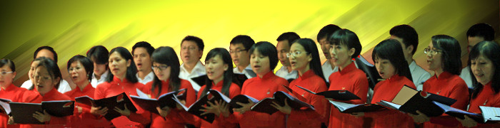
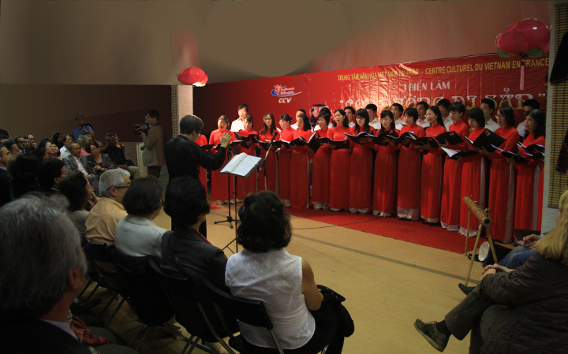
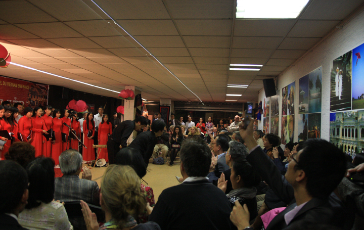

<!--
title: Tuần lễ văn hóa do FICEP và TTVH tổ chức 23.09.2011
author: Nguyễn Tích Kỳ
status: completed
-->

  

Sau buổi trình diễn 23.09.2011. **Tuần lễ Văn hóa quốc tế do Hội đoàn FICEP** (Forum des Instituts Culturels à Paris) phối hợp tổ chức cùng với **Trung Tâm Văn Hóa Việt Nam tại Paris**.

**Hợp ca Quê Hương** rất hân hạnh đã được mời mở đầu sinh hoạt năm 2011 – 2012 tại Trung Tâm Văn Hóa Việt Nam tại Paris.

 **Hợp Ca Quê Hương** chuẩn bị bước vào năm sinh hoạt 2011-2012.

Sau  những ngày hè thư giãn, có người đã về thăm gia đình tại VN, có người đã đi thăm bạn bè đang học tập tại những quốc gia lân cận, kể cả các em mới tốt nghiệp ra trường, cũng như đa số phải lao đi tìm « công việc dịp hè, hoặc một công việc dài hơi » nhằm đỡ phần nào gánh nặng kinh tế cho gia đình. Hầu hết tất cả các thành viện đang lần lượt trở vế nếp sống quen thuộc cuối tuần của *Hợp Ca Quê Hương*. Tuy một vài người còn vắng mặt tiếp, tục chỉnh đốn cuộc sống.

Năm nay, *Hợp ca Quê Hương* có thêm những gương mặt mới, người trẻ có, người đã lập gia đình có, hành trang của họ là đam mê và lửa. Toàn bộ mới cũ  hăng say  học bài, ôn bài.  Qua một tháng luyện tập, tôi nhìn nhận thấy *Hợp ca Quê Hương* đang đi vào năm mới với một sự cố gắng và một niềm tin có chất rất quyết định.

Tôi xin dừng lại vài phút trên điểm này, nhắc nhở :  – «Quá trình và hiện tại sinh hoạt của *Hợp ca Quê Hương* rất «có lửa », ta hãy duy trì và luôn củng cố sự kiện này, « kỷ cương » là một điều cần phải có, không bao giờ đồng nghĩa với « sự gò bó ». 

Trình diễn hôm thứ sáu 23.09.2011 đã dẫn dắt tôi trở về với cảm giác của buổi trình diễn đầu tiên (rất ấn tượng 02.09 Quốc Khánh tại Đại sứ quán).

Hôm nay, chúng ta đã đưa hết tâm hồn vào **Trường ca Sông Lô** hòa cùng tiếng piano nhịp nhàng của Thế Anh. Rất ngạc nhiên khi tiếng đàn bầu trầm bổng của Minh Anh mở đường, đưa chúng ta trở về với những giòng sông này, nơi đất Tổ. Tuy giọng hò của Việt Hà còn chập chững nhưng đã hết mình với bài «**Ta đi tới**» của nhà thơ Tố Hữu. Đến bài «**Du kích sông Thao**» thì hầu hết khán thính giả kể cả những người nước ngoài, họ chan hòa với nhịp mái chèo của người du kích Sông Thao của ngày nào.

Toàn bộ các em *Hợp ca Quê Hương* đã hát với tấm lòng, với trái tim bỏng cháy.

  

Cảm ơn chị Ngân Hà đã dìu dắt các em vững bước trên ngưỡng cửa của sự đam mê, đi vào thế giới âm thanh, dĩ nhiên có gì là tuyệt đối 100% đâu, văn ôn võ luyện vẫn luôn phải là kim chỉ Nam của HCQH.

Bình thường, tất cả các các dàn Hợp xướng khác, Nhạc trưởng (chef d’orchestre) và Trưởng hợp ca (chef de chœur), đều là những người được đào tạo có sách vở, và có thể xác định là người chuyên nghiệp.

Riêng *Hợp ca Quê Hương* của chúng ta, thì toàn bộ từ Nhạc trưởng (chef d’orchestre) đến thành viên tất tần tật đều là nghiệp dư , « vừa đi vừa học » , mà động cơ cùng yếu tố quyết định vẫn là sự đam mê nguồn nhạc kinh điển và ý nghĩa  VN. Chúng ta hãy nên tự hào điểm này.

Sau đây là một vài « cảm nghĩ nong » của khán thính giả  :

* «*Nghe mấy người hát, tôi cảm thấy nổi da gà*»

* «*Các em hát rất đạt, chỉ tiếc nơi trình diển không có đủ không gian*»

Đại sứ Dương Chí Dzũng và phu nhân:

* «*Rất hay và rất ấn tượng*»

Anh Giám đốc Trung Tâm Văn Hóa Lê Hồng Chương:

* «*Thành công lắm, mãi không chán, khi chúng ta có một sân khấu tương xứng thì còn hay hơn nữa*»

Khán thính giả Pháp nói:

* «*Chúng tôi đã xem và nghe nhiều dàn Hợp xướng chuyên nghiệp. Các bạn rất xứng đáng, không thua kém họ đâu*»

* «*Chúng tôi tuy không hiểu tiếng việt, nhưng sự đồng cảm giữa Nhạc trưởng và dàn Hợp xướng đã giúp cho chúng tôi hiểu ý của bài hát. Chúng tôi rất xúc động*»

  

Lướt qua vài nhận xét đó, chúng ta có thể kết luận: buổi trình diễn hôm 23.09.2011  đã thành công.  Chúng ta có quyền vui sướng. Nhưng, không được tự mãn. Phải luôn tâm niệm « Trình diễn lần sau, phải đạt hơn lần này. »

Một suy nghĩ xẹt qua cho buổi trình diễn sắp tới ngày thứ bảy 01.10 do Ngọc tổ chức, mục đích quyên tiền giúp VN (Ngọc là người chơi đàn piano đã từng giúp *Hợp ca Quê Hương* trong giai đoạn khó khăn.) Anh ta có yêu cầu sự hợp tác của *Hợp ca Quê Hương*.

Tôi hi vọng chúng ta sẽ có mặt đầy đủ.                                                               Những thành viên mới của hôm nay sẽ là thành viên gương mẫu của ngày mai. Những thành viên của hôm qua sẽ luôn luôn là cột trụ của *Hợp ca Quê Hương*.  Và tất cả các thành viên luôn có sứ mạng xây đắp, bảo vệ, duy trì và giữ lửa cho *Hợp ca Quê Hương*.

TK

25/09/2011
