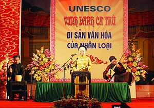

<!--
title: CA TRÙ ĐÃ TRỞ THÀNH DI SẢN THế GIỚI
author: Nguyễn Tích Kỳ
status: completed
-->

**Sau Quan họ Bắc Ninh đúng 1 ngày, hôm nay, Ca Trù của Việt Nam được UNESCO ghi danh vào Danh sách di sản văn hóa phi vật thể cần được bảo vệ khẩn cấp.**

**Xin giới thiệu thông tin Hợp Ca Quê Hương vừa nhận được từ TS. Lê Thị Minh Lý, Phó Cục trưởng Cục Di sản văn hóa gửi về từ Abu Dhabi – nơi đang diễn ra kỳ họp của UNESCO.**

**(Lễ công bố diễn ra 14.45 giờ (giờ Việt Nam tức 10.45 giờ địa phương) ngày 1/10/2009, tại Abu Dhabi, Các Tiểu vương quốc A rập thống nhất)**

Theo Công ước UNESCO 2003, các di sản văn hóa phi vật thể đại diện của các quốc gia sau khi được đề cử, công nhận sẽ đăng ký vào hai danh sách di sản của nhân loại đó là danh sách Đại diện và danh sách Cần bảo vệ khẩn cấp và được bảo vệ ở cấp độ quốc tế. Di sản từ danh sách này có thể chuyển sang danh sách khác căn cứ vào hiện trạng, sức sống của di sản. Có thể do chưa nhận thức được hết ý nghĩa sâu sắc của điều 17 Công ước 2003 đối với việc thiết lập danh sách di sản văn hóa phi vật thể cần được bảo vệ khẩn cấp mà hầu hết các quốc gia quan tâm nhiều hơn đến danh sách dại diện. Năm 2009, có tới 111 hồ sơ của 34 quốc gia là ứng viên của Danh sách Đại diện nhưng chỉ có 15 hồ sơ của 9 quốc gia đăng ký vào danh sách khẩn cấp.

Năm nay, trong lần xét chọn đầu tiên kể từ khi Công ước có hiệu lực, Việt Nam đã quyết định đề cử Ca trù vào danh sách di sản văn hóa phi vật thể cần được bảo vệ khẩn cấp bởi vì mặc dầu đã được phục hồi trong năm năm gần đây nhưng nguy cơ thất truyền những bài bản, thể cách của Ca trù xưa đang đặt ra như là một thách thức không dễ gì giải quyết. Việt Nam đã được UNESCO đánh giá cao vì đã có tầm nhìn tòan diện đối với việc bảo vệ di sản. Đợt 1 đề cử Quan họ – đại diện; Ca Trù – khẩn cấp và đợt sắp tới (2010-2011) Hội Gióng – đại diện và Hát Xoan – khẩn cấp.

12 ứng viên di sản phi vật thể đã lọt vào vòng chung kết được công nhận trong đó có Ca Trù của Việt Nam. Cũng như ở danh sách đại diện Trung Quốc lại dẫn đầu về số lượng đề cử: có 4 di sản; Mông cổ 3 và Mexico 2. Truyền thống truyền khẩu và các tập quán xã hội liên quan đến tín ngưỡng, tâm linh là những loại hình di sản ưu tiên ở danh sách này. Sử thi và những di sản của các dân tộc thiểu số đang là câu hỏi đặt ra cho Việt Nam.

Việc thẩm định di sản bảo vệ khẩn cấp khá khắt khe. Mỗi hồ sơ có một tổ chức chuyên môn phi chính phủ và một chuyên gia đánh giá độc lập được UNESCO mời thẩm định và «phản biện» kín. Chúng tôi bất ngờ và vui mừng được biết GS.TS Ngô Đức Thịnh, thành viên Hội đồng di sản văn hóa quốc gia, người chủ trì công trình nghiên cứu cấp nhà nước về Sử thi Tây Nguyên được mời đánh giá hồ sơ Sử thi của Mông Cổ.

Hồ sơ Ca Trù nhận được báo cáo đánh giá từ Hội đồng Âm nhạc quốc tế, bà Gisa Janichen vàông Barley Norton, chuyên gia độc lập người Anh. Họ đã từng đến Việt Nam nghiên cứu Ca Trù trong nhiều năm. Trước đó chúng ta không hề biết thông tin này. Chúng tôi đã nhận được 20 trang báo cáo đánh giá và khuyến nghị về bảo vệ di sản Ca trù. Tại hội nghị của Ủy ban Liên Chính phủ, các chuyên gia đã trình bày báo cáo thẩm định và các thành viên ủy ban nhận xét, có ý kiến đánh giá từng di sản. Hội nghị dành 3 tiếng đồng hồ cho 12 hồ sơ này. Hồ sơ Ca trù được đánh giá như sau:

- Ca trù đã trải qua một quá trình phát triển ít nhất từ thế kỷ 15 đến nay, được biểu diễn trong không gian văn hóa đa dạng gắn liền, ở nhiều giai đoạn lịch sử khác nhau. Ca trù thể hiện một ý thức về bản sắc và sự kế tục trong nghệ thuật biểu diễn, có tính sáng tạo, được chuyển giao từ thế hệ này sang thế hệ khác thông qua các tổ chức giáo phường. Những giáo phường này đã duy trì các cộng đồng có quan hệ mật thiết, tạo nên nét đặc trưng cho Ca trù. Mặc dù trải qua nhiều biến động lịch sử, xã hội những Ca trù vẫn có một sức sống riêng bởi giá trị của nghệ thuật đối với văn hóa Việt Nam.

- Mặc dù Việt Nam đã có nhiều cố gắng và có sự hỗ trợ của một số tổ chức quốc tế trong việc bảo vệ Ca trù song sức sống của Ca trù hiện nay vẫn chưa phải ở mức cao và vẫn cần phải được bảo vệ hơn nữa để phát triển khả năng tồn tại. Việc duy trì thường xuyên và chất lượng nghệ thuật là vấn đề đặt ra đối với công việc bảo vệ Ca Trù. Cần phải nângcao nhận thức về Ca Trù để Ca trù có có thêm nhiều công chúng, có vị thế trong xã hội bởi vì đã từng bị quên lãng từ những năm 50 -80. Cần hỗ trợ các nghệ nhân lớn tuổi truyền dạy và khuyến khích những ca nương, kép đàn trẻ học hỏi và tham gia truyền dạy.

- Kế hoạch hành động để bảo vệ trong hồ sơ được trình bày khá tổng thể và có tính khả thi. Các báo cáo thẩm định cũng chỉ ra cho chúng ta nhiều biện pháp cụ thể, nhỏ mà hữu ích. Sự ủng hộ và hỗ trợ của các cơ quan nhà nước cũng góp phần đảm bảo sức sống của Ca trù ở các thành phố và những vùng nông thôn.

- Hồ sơ đã có sự tham gia đề cử của nhiều bên liên quan cũng như việc có bằng chứng đầy đủ về sự đồng thuận, tự nguyện và có hiểu biết đầy đủ của các cộng đồng.

- Ca Trù đã được kiểm kê và thuộc lĩnh vực quản lý chuyên môn của Viện Âm nhạc, Bộ Văn hóa Thể thao và Du lịch, điều này cho thấy trách nhiệm và cam kết của quốc gia đối với việc bảo vệ di sản.

Như vậy là, sau 4 năm chờ đợi, kể từ khi Chính phủ cho quyết định sẽ đệ trình UNESCO công nhận di sản Quan họ và Ca trù (khi đó còn danh hiệu là Kiệt tác) nay điều mong đợi đã trở thành hiện thực. Hai di sản văn hóa phi vật thể của Việt Nam đã được toàn thế giới công nhận là Di sản của Nhân loại. Nhận vinh dự tự hào này càng nhận thức sâu sắc hơn lợi ích, trách nhiệm và nghĩa vụ của mỗi người, của toàn xã hội trong việc bảo vệ tài sản văn hóa quý báu mà cha ông ta đã để lại./.

***TS. Lê Thị Minh Lý***

*Thứ Năm, 01/10/2009 15:03*

*(Từ Abu Dhabi)*

