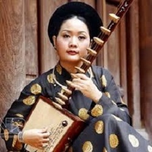
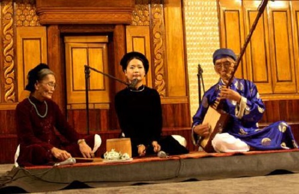

<!--
title: NGHỆ NHÂN THẾ GIỚI ĐƯA CA TRÙ VÀO PHỐ CỔ
author: Nguyễn Tích Kỳ
status: completed
-->

**NGHỆ NHÂN THẾ GIỚI ĐƯA CA TRÙ VÀO PHỐ CỔ**

*Thứ năm, 20/10/2011*

**Đào đàn Phạm Thị Huệ vừa được công nhận danh hiệu Nghệ nhân thế giới của tổ chức World Master. Với danh hiệu mới, Giáo phường Ca trù Thăng Long do chị làm chủ nhiệm cũng mạnh dạn đưa ca trù vào trình diễn trong phố cổ Hà Nội.**

Phạm Thị Huệ xưa nay vẫn được biết đến với danh xưng Đào đàn độc nhất vô nhị của làng ca trù. Vốn là giảng viên Khoa Nhạc cụ truyền thống của Học viện Âm nhạc Quốc gia Việt Nam, Phạm Thị Huệ từng nhiều năm theo học đàn đáy của nghệ nhân Nguyễn Phú Đẹ và học hát ca trù với ca nương Nguyễn Thị Chúc. Cho đến nay, chị vẫn là nghệ nhân duy nhất trong lịch sử ca trù Việt vừa hát ca trù vừa chơi đàn đáy. Năm 2005, chứng kiến hình ảnh đào đàn Phạm Thị Huệ làm lễ “Mở xiêm áo”, GS Trần Văn Khê đã phải thốt lên là như tố nữ trong tranh dân gian bước ra cuộc đời…

Duyên may đến với Phạm Thị Huệ khi Giáo phường Ca trù Thăng Long tham gia Lễ hội Di sản văn hóa phi vật thể được tổ chức tại Hàn Quốc tháng 6/2011. Ấn tượng với tiếng đàn tùng dênh và giọng hát ứ ử, nảy hạt đâu ra đấy đầy mê hoặc của Phạm Thị Huệ, một nghệ nhân của Hàn Quốc ngỏ lời đề nghị chị tham gia tổ chức phi chính phủ này.

Về nước được ít hôm, Huệ hồ hởi làm hồ sơ gửi tổ chức World Master. Bên cạnh bảng trích yếu lý lịch hoạt động gần chục năm với Ca trù, hai đĩa phim của Huệ được tổ chức này đánh giá cao. Đó là một bộ phim về Giáo phường Ca trù Thăng Long do VTV sản xuất và một phim tài liệu ngắn do Đài Truyền hình NHK của Nhật Bản làm về đào đàn Phạm Thị Huệ. Đầu tháng 9/2011 vừa qua, Phạm Thị Huệ nhận được giấy chứng nhận World Master ghi danh tên tuổi vào danh mục Nghệ nhân thế giới của tổ chức này.

Phạm Thị Huệ cho biết: “Hiện tổ chức World Master ghi danh 85 nghệ nhân trên toàn thế giới, trong đó có 3 người Việt Nam”. Bên cạnh Phạm Thị Huệ, hai nghệ nhân Việt Nam được tổ chức này chính thức trao danh hiệu này là NSND Xuân Hoạch – đàn Nguyệt và NSƯT Kim Chung – múa dân gian, đều là thành viên của Nhà hát Ca múa nhạc Việt Nam. Vừa mới được vinh danh nên Huệ chưa biết mình có những quyền lợi và nghĩa vụ gì khi tham gia tổ chức này nhưng với chị được giao lưu, học hỏi với những nghệ nhân trình diễn Văn hóa phi vật thể của nhiều nước chính là cơ hội để quảng bá ca trù Việt Nam với bạn bè thế giới.

  
*Đào đàn Phạm Thị Huệ cùng với 2 người thầy*

Danh hiệu Nghệ nhân thế giới không chỉ là phần thưởng xứng đáng cho những đóng góp của Phạm Thị Huệ trong những năm qua với ca trù, mà còn là động lực để Phạm Thị Huệ đi tiếp với Di sản được UNESCO đưa vào danh mục cần được bảo vệ khẩn cấp này. Hiện Huệ là Chủ nhiệm Giáo phường Ca trù Thăng Long với gần 20 đào nương, kép đàn, quan viên. Đa phần thành viên của Giáo phường Ca trù Thăng Long đều là những người trẻ tuổi nhưng hoạt động của Giáo phường vẫn luôn được công chúng và giới nghiên cứu văn hóa đánh giá cao nhờ sự dìu dắt của hai “cây đa cây đề” là nghệ nhân dân gian Nguyễn Phú Đẹ và Nguyễn Thị Chúc. Là Giáo phường Ca trù đầu tiên xưng danh này trong thời hiện đại, nhóm của Huệ đã cống hiến cho ca trù nhiều hoạt động tiêu biểu như: Đưa ca trù trở lại với không gian hát cửa đình, tổ chức đêm ca trù tưởng nhớ ngày mất của danh ca Quách Thị Hồ, làm lễ “mở xiêm y” đầu tiên…

Tới đây, Giáo phường Ca trù Thăng Long do đào đàn trẻ tuổi này làm chủ nhiệm sẽ mạnh dạn đưa ca trù vào phố cổ Hà Nội để trình diễn, truyền dạy và phục vụ khách du lịch. Thực ra, những năm gần đây Giáo phường Ca trù Thăng Long đã thử nghiệm đưa ca trù trở lại không gian hát cửa đình khi thường xuyên tổ chức các đêm trình diễn và truyền dạy ca trù tại các đình – đền ở Hà Nội như đình Cống Vị, đình Giảng Võ…

Gần đây, Giáo phường chuyển về sinh hoạt thường xuyên tại Đền Quán Đế – số 28 Hàng Buồm, Hà Nội. Điểm diễn này một mặt vẫn “thân quen” với Giáo phường vì đều là không gian hát cửa đình nhưng mặt khác đặt ra cho các ca nương, đào đàn trẻ cơ hội tiếp cận với khách du lịch trong và ngoài nước khi tham quan phố cổ.

Đào đàn Phạm Thị Huệ cho biết: “Mỗi đêm diễn, Giáo phường thu phí 100.000 đồng với khán thính giả người Việt và 10 USD dành cho khách nước ngoài”. Nguồn thu đó cũng tạm đem đến cho Giáo phường kinh phí nho nhỏ để duy trì hoạt động. Nhưng để ca nương, kép đàn và quan viên ca trù thực sự sống được với nghề, Giáo phường quyết định dấn thân đi thêm bước nữa. Vậy là từ tháng 9/2011, Giáo phường Ca trù Thăng Long khai trương thêm điểm diễn mới tại Nhà cổ 87 Mã Mây, Hà Nội.

Ngoài những bạn trẻ Việt Nam quan tâm đến ca trù, đối tượng khán thính giả chính mà Giáo phường hướng tới khi trình diễn ở đây chính là khách du lịch, người nước ngoài. Ngặt nỗi, kiếm được một thuyết minh viên vừa am hiểu ca trù lại có ngoại ngữ tốt không phải dễ nên hiện Huệ vừa đánh đàn đáy vừa hát ca trù lại kiêm luôn MC của chương trình. Ước muốn của Nghệ nhân thế giới Phạm Thị Huệ vào lúc này vì thế chỉ đơn giản là sớm có được một thuyết minh viên đồng hành với con đường khó khăn mà chị và Giáo phường Ca trù Thăng Long đã chọn – đưa ca trù vào phố cổ Hà Nội.

Anh Bảo

