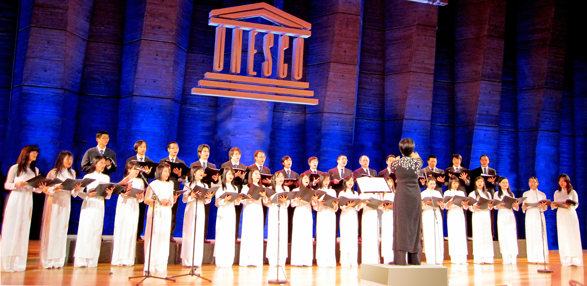
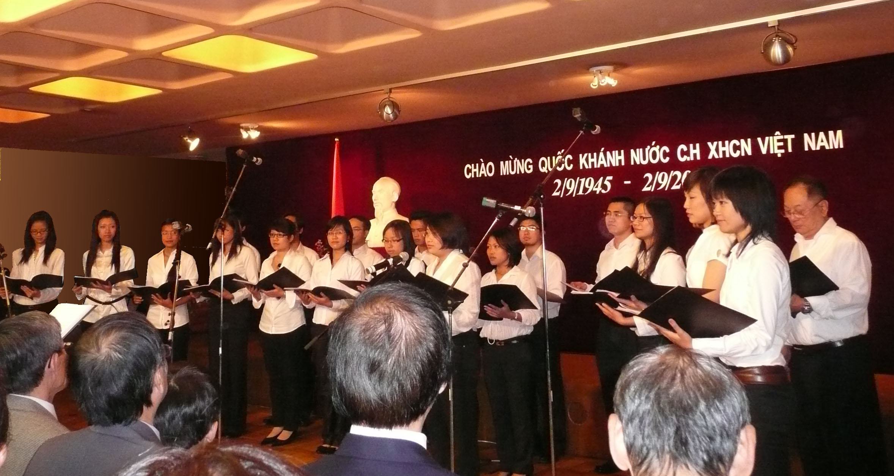
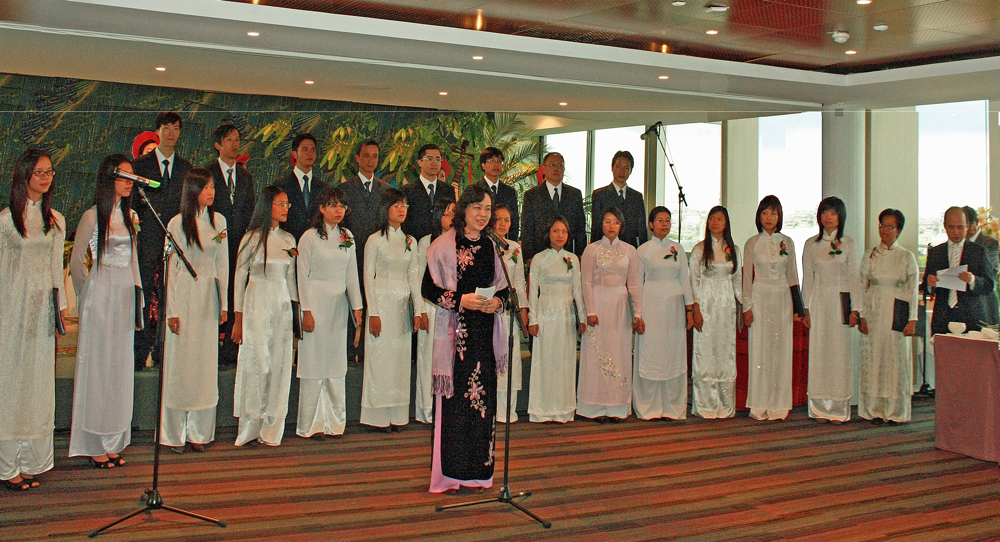
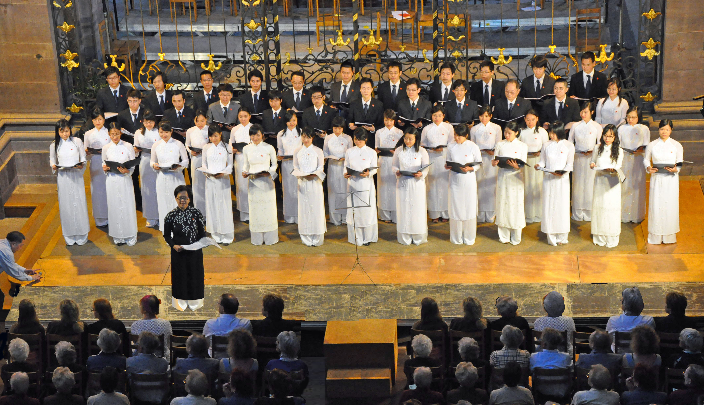
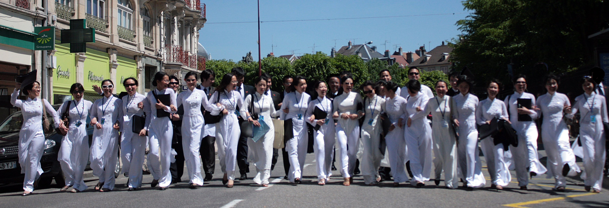

<!--
title: Nguyên Đại sứ Việt Nam tại Paris gửi từ Hà nội
author: Nguyễn Tích Kỳ
status: completed
-->

**Những ngày qua, Hợp ca Quê hương nhận được nhiều điện và thư của bạn bè, người thân và quý khán thính giả gần xa, chúc mừng thành công của HCQH tại FIMU-Belfort 2010.**

**Dưới đây, Ban biên tập xin giới thiệu toàn văn bức thư của Ông Nguyễn Đình Bin  Nguyên Ủy viên Ban chấp hành Trung ương Đảng, Nguyên Thứ trưởng Thường trực Bộ Ngoại giao, Nguyên Chủ nhiệm Ủy ban Quốc gia về Người Việt Nam ở nước ngoài, Nguyên Đại sứ Đặc mệnh Toàn quyền của Việt Nam tại Pháp.**

*Hà Nội, ngày 01-6–2010*

Kính gửi :

      Ban Lãnh đạo và toàn thể thành viên  Hơp ca Quê Hương Paris, Cộng hòa Pháp.

      Tôi vừa được thưởng thức các tiết mục mà Hợp ca Quê Hương (HCQH) vừa biểu diễn tại Liên hoan Âm nhạc Quốc tế  FIMU ở Belfort, Pháp. Mặc dù chỉ là download từ trên mạng xuống qua cái máy tính đã cũ của tôi, tôi cũng không nén nổi xúc động, thả hồn theo những giọng hát tuyệt vời của các bạn. Tôi tưởng  như đang được thưởng thức biểu diễn của một dàn hơp xướng chuyên nghiệp! Và thật sung sướng, tự hào khi nghe những tràng vỗ tay dồn dập, dường như không dứt của khán giả dành cho HCQH, sau mỗi lần giọng ca của các bạn vừa dứt.

      Tôi được biết trước đó, HCQH cũng đã có những buổi biểu diễn rất thành công trên sân khấu của Tổ chức UNESCO, ở  Đại sứ quán nước ta tại Paris…, đem tiếng hát Việt Nam đến với nhiều người con đất Việt đang xa xứ, cũng như bạn bè Pháp và quốc tế.

       Tôi thật sự ngạc nhiên và cảm phục khi biết rằng HCQH chỉ mới tròn một tuổi và phần lớn thành viên chỉ là các giọng ca nghiệp dư, chưa hề được huấn luyện qua bất cứ trường, lớp nào. Càng ngạc nhiên và cảm phục hơn khi biết rằng HCQH hoàn toàn tự lực cánh sinh. Chỉ với tình yêu quê hương Việt Nam, lòng đam mê đối với âm nhạc, đặc biệt là nền âm nhạc của dân tộc,  vượt qua mọi khó khăn đời thường của một sinh viên, thực tập sinh, nghiên cứu sinh, viên chức quốc tế…, lại cư trú ở nhiều nơi, các bạn vẫn tìm được thời gian để gặp nhau, tổ chức, dàn dựng chương trình, khổ luyện, …và phải tự trang trải mọi chi phí cho các hoạt động của HCQH!  Vậy mà HCQH đã viết nên những trang rất đáng nể trọng trong tiểu sử còn non trẻ của mình.

      Đặc biệt,  biểu diễn rất thành công của HCQH vừa qua tại Liên hoan Âm nhạc Quốc tế FIMU ở Belfort, thử thách đầu tiên  của các bạn tại một liên hoan âm nhạc quốc tế, và với sự tham gia này của HCQH,  cũng là lần đầu tiên, ngọn cờ đỏ sao vàng được dương cao và tiếng hát cách mạng , đậm đà bản sắc Việt Nam được cất vang trên sân khấu FIMU danh tiếng , trước hàng nghìn khán, thính giả và nghệ sỹ của trên 130 đoàn cùng tham dự, được chọn lọc từ trên 30 nước, là một dấu son đỏ thắm trên chặng đường phát triển khởi đầu của HCQH. Có thể nói các bạn không chỉ đang góp phần đem lại những cảm thụ thẩm mỹ cho nhiều đồng bào đang xa xứ và bạn bè quốc tế ,  mà còn đang trở thành những sứ giả của nền âm nhạc dân tộc Việt Nam, góp phần làm rạng danh cho Tổ quốc, góp phần xây đắp, thắt chặt thêm quan hệ hữu nghị và hợp tác giữa nhân dân ta và nhân dân các nước khác. Là người đã từng làm việc trong ngành ngoại giao và làm công tác với người Việt Nam ở nước ngoài, tôi hiểu sâu sắc,  rất trân trọng và thực sự cảm phục các thành công và đóng góp ban đầu này của HCQH.

  
*Tất cả Hình ảnh:  Tuyết & Đăng*

      Từ đáy lòng, tôi xin nhiệt liệt chúc mừng toàn thể thành viên HCQH. Xin chân thành cảm ơn các bạn và chúc các bạn phát huy những thành tựu đã đạt được, tiếp tục gặt hái nhiều mùa hoa, trái ngày càng thắm sắc, ngát hương và ngọt ngào hơn. Đặc biệt, tôi muốn bày tỏ những tình cảm chân thành và những lời chúc tốt đẹp nhất tới hai kiến trúc sư-linh hồn chính của HCQH, chị Ngân Hà và anh Tích Kỳ. Tôi được biết anh, chị cùng nhiều bà con khác, đã từng hăng hái hoạt  động trong phong trào Việt kiều yêu nước với một truyền thống rất vẻ vang và đáng tự hào tại Pháp, trong đó có phong trào văn nghệ nổi tiếng.

      Giờ đây, cũng với lòng nhiệt huyết đối với quê hương, đam mê đối với âm nhạc, anh, chị đã và đang đem hết tài năng, kinh nghiệm, động viên, dẫn dắt… những người trẻ cùng chí hướng xây dựng nên và tiếp tục phát triển HCQH.

     Một lần nữa, xin các bạn hãy nhận những lời chúc mừng, hoan nghênh, cảm ơn và cảm phục, cùng những lời cầu chúc tốt đẹp nhất từ  một fan đã lớn tuổi của HCQH ở quê nhà!

*Chào thân ái,*  
*Nguyễn Đình Bin*
                                
*Hà Nội*  
*01.06.2010*

