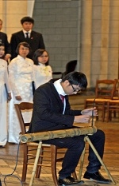

<!--
title: Phản ảnh « nóng » đêm trình diễn tại Église Notre Dame Alfortville.10 mars 2012
author: Nguyễn Tích Kỳ
status: completed
-->

**Trình diễn tại Église Notre Dame Alfortville.10 mars 2012** 

 

   

  

  

  

   

 

 
**A** -Lời khen « nóng » của khán giả thì chúng ta rất thành công. HCQH đã đem lại cho họ những ngạc nhiên rất  thú vị.

**B**- Lời khen « nóng » của tu sĩ trách nhiệm nhà thờ, người có kinh nghiệm tổ chức trình diễn Hợp xướng tại nơi này. – ” HCQH hát rất đạt, tuy ngôn ngữ bất đồng. Nhưng ông đã cảm nhận, tiếp thu dược được tình cảm của những bài trường ca và rất hân hoan được biết những nhạc cụ dân tộc VN.”

**C** – Lời khen « nóng » của trách nhiệm hành chính thị trấn Alfort-ville. – “ HCQH rất xứng đáng vị trí cầm cờ trong cuộc trình diễn văn hóa này, và họ hi vọng còn nhiều dịp được gần gũi, tiếp xúc với HCQH. Họ rất ấn tượng đến nhạc cụ dân tộc, cây đàn bầu, cây đàn tranh đã gây nhiều ấn tương.”

 

  

 **D** - Lời khen « nóng » của anh Chương Chủ nhiệm Trung Tâm Văn Hóa VN tại Pháp. Anh rất hài lòng về chất lượng của buổi trình diễn. HCQH đã giới thiệu một chương trình dung hòa được những bài Hợp xướng kinh điển VN và một số nhạc cụ truyền thống đặc thù của dân tộc. Rất hay và xứng đáng.”

**Đ** -Lời khen « nóng » của Ban tổ chức ARAC-Văn Canh Hội đoàn tổ chức. Họ rất khâm phục sự đa dạng và công phu luyên tập của HCQH. Mà còn hứa hẹn và yêu cầu HCQH gặp  mặt, cơ hội khác.

Khi kết thúc buổi trình diễn, ban tổ chức có nhã ý muốn thù lao HCQH. Ban trách nhiệm HCQH nhận định họ là một tổ chức phi chính phủ, phi lợi nhuận đã « cơm nhà vác tù và hàng tổng » giúp đỡ các em VN nạn nhân chất độc da cam. HCQH đã từ chối thù lao nhằm tăng thêm phần đóng góp,  giúp đỡ cho trẻ em VN.

 

 

*Rút kinh nghiệm nhìn từ hậu trường :*

Tuyên dương sự năng nổ và cố gắng của các em.
Nhất là những em « mới toanh » hành trang chỉ có dăm ba lần tập, đã cố gắng hết mình. Chú mách riêng cho những em chưa thuộc bài khi ta vướng thì nhép không nên ngậm miện đứng nhìn. Khán gỉa họ để ý thấy ngay đấy (một khán giả đã phản ảnh) . Đồng phục là một hình thức tôn trọng khán giả và cũng là một nét hài hòa đối với đồng đội, nên ý thức việc này. Chớ để có tình trạng « con sâu làm rầu nồi canh ».
Chú xin phân biệt những trường hợp *hát chưa chuẩn và hát lí nhí* :
+ Thuộc bài nhưng vì giọng không đủ mạnh để hòa đồng, giúp ích cho đồng đội.

+ Không thuộc bài, không nên chỉ cắm cúi tập trung đọc, nên liếc nhìn nhạc trưởng. ít nhất phải theo dõi nhịp điệu của bài hát.

+ Thuộc giai điệu hát to muốn giúp đồng đội. Nhưng đôi khi bắt giai điệu sai, bị cuống. (Trường hợp này nên ngưng phát âm ngay, tập trung nghe rồi mới tiếp nối hát, trước nhỏ sau to, khi mình cảm nhận thấy giọng mình « quyện » với bè.)

Rất  khích lệ các thành viên  « cũ » đã trở về với đơn vị.

**Đồng phục** có nghĩa là từ **quần áo đến huy hiệu và logo trên bìa đen**. Không nên coi thường khía cạnh này. Chú muốn lưu ý, không để có hiện tương mỗi lần đi trình diễn là một lần thất lạc hoặc quên hết cái này đến cái nọ. Càng là thành viên lâu đời thì càng phải  có trách nhiệm và gương mẫu cho người mới.
Xin chân thành tôn vinh và khích lệ anh em Bass và Ténor đã tự động luyện thanh và ôn bài.     Kết qủa rất rõ rệt.
Nếu chúng ta tiếp thu phương thức này thì tuyệt vời, tôi biết chúng ta có nhiều khả năng  thực hiện. Bằng chứng là đa số các em tuy là « mới toanh », trong một thời gian ngắn đã tiếp thu được nhiều bài như vậy.

Nói vậy không có nghĩa đã ” trả bài”" tức là **hát hay**.

Chúc các em một cuối tuần vui vẻ.

*NTK*

*Paris 12. 03. 2012*
