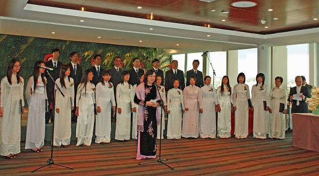
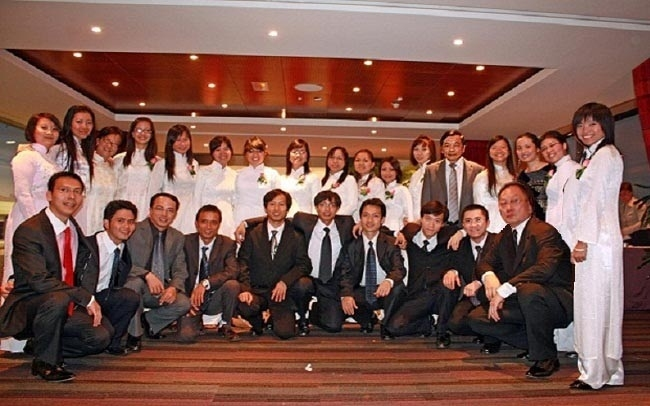
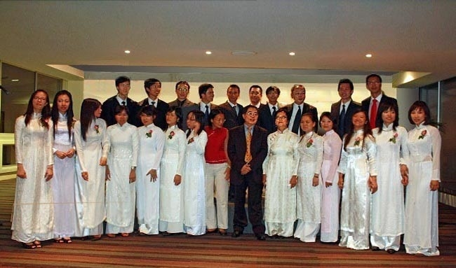
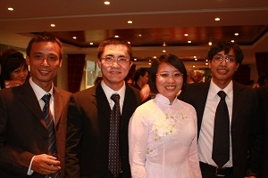
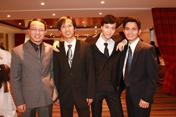
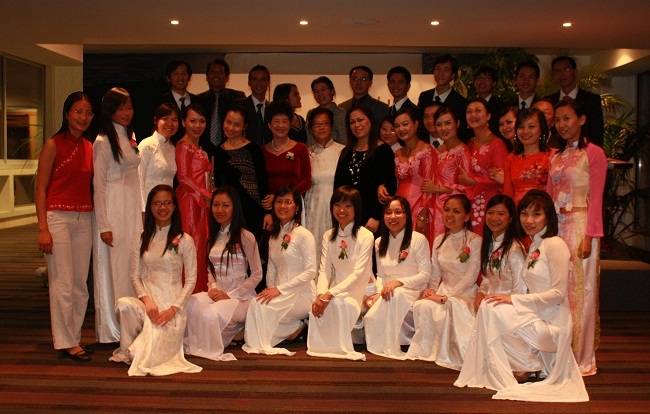

<!--
title: Lần đầu HCQH trình diễn tại UNESCO 14.septembre 2009
author: Nguyễn Tích Kỳ
status: completed
-->

**TTXVN – Tối 14/9/2009  Phó Chủ tịch Ủy ban Nhân dân thành phố Hà Nội Ngô Thị Thanh Hằng và Đại sứ Việt Nam bên cạnh UNESCO Văn Nghĩa Dũng đã tổ chức tiệc chiêu đãi tại trụ sở của Liên hợp quốc (UNESCO) ở thủ đô Paris.**

Buổi chiêu đãi được tổ chức nhân kỷ niệm 999 năm Thăng Long-Hà Nội và chào mừng kỳ họp thứ 182 Hội đồng chấp hành của UNESCO.
Phát biểu tại buổi lễ, Phó Chủ tịch thành phố Hà Nội nhắc lại lịch sử hình thành Thăng Long-Hà Nội cách đây gần 1.000 năm, vai trò của thủ đô Hà Nội là trung tâm chính trị, văn hóa, kinh tế trong suốt nhiều thập kỷ qua. Ngày nay, Hà Nội còn là thành phố đứng đầu Việt Nam về diện tích (3.300km²) và đứng thứ hai về dân số (trên 6 triệu dân).
Phó Chủ tịch thành phố Hà Nội nhấn mạnh: “Nhân dân Việt Nam nói chung và Hà Nội nói riêng luôn tự hào về lịch sử nghìn năm văn hiến, với những nét văn hóa đa dạng và độc đáo – nơi lưu giữ những di tích lịch sử, văn hóa, nghệ thuật vô giá. Trong quá trình phát triển và hội nhập, Hà Nội vẫn giữ những nét thâm nghiêm cổ kính và được tô điểm thêm bởi các công trình hiện đại, là điểm đến an toàn cho đầu tư, du lịch của bạn bè từ khắp năm châu”.

Nhân dịp này, bà Ngô Thị Thanh Hằng nhắc lại sự kiện cách đây 10 năm, Hà Nội được UNESCO trao tặng danh hiệu “Thành phố vì Hòa bình”, và bày tỏ vui mừng trước việc UNESCO quyết định tham gia kỷ niệm 1.000 năm Thăng Long-Hà Nội, sẽ được tổ chức vào năm 2010.

 

Đại sứ  Đặc mệnh toàn quyền Lê Kinh Tài chung vui với dàn HCQH 

 

Đại sứ bên canh UNESCO  Văn Nghĩa Dũng
 
   

  

  
HCQH và đoàn Cỏ Lạ 
 
*Antony 2009*

*TK*