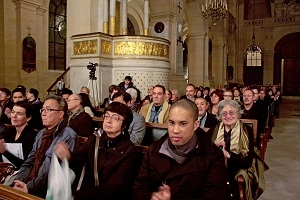

<!--
title: Nhân Đại Lễ 1000 năm Thăng Long-Hà Nội Hợp Ca Quê Hương phối hợp với Ủy ban vì làng hữu nghị Vân Canh của Pháp tại St Louis des Invalides . 08/Nov/2010
author: Nguyễn Tích Kỳ
status: completed
-->
***Phối hợp với Ủy ban vì làng hữu nghị Vân Canh của Pháp và
Phòng ký ức di sản và tài liệu của Bộ Quốc phòng Pháp 
tại St Louis des Invalides
 Paris ngày 08 /11/ 2010.***

*Tối 18-11, tại Bảo tàng quân đội Pháp ở thủ đô Paris, trong khuôn khổ kỷ niệm 1.000 năm Thăng Long Hà Nội, Ủy ban vì làng hữu nghị Vân Canh của Pháp phối hợp Phòng ký ức, di sản và tài liệu của Bộ Quốc phòng Pháp tổ chức buổi biểu diễn ca nhạc và hòa nhạc ủng hộ các trẻ em của làng hữu nghị Vân Canh. Buổi hòa nhạc được tổ chức phối hợp với Hợp ca Quê Hương và sự đóng góp đặc biệt của nhạc sỹ guitare cổ điển Thanh Hằng. 
Tại nhà thờ Saint Louis Điện Invalid, nơi đặt mộ của Hoàng đế Napoleon.*
 
  

*Photo de Tuyết*

   

*Photo de Tuyết* 

    

*Photo de Tuyết*

  

*Lăng mộ Napoléon nhà thờ Saint Louis des Invalides.   photo Nam.*  

    
  

*Photo de Tuyết*

  

*photo Tuyết*
