<!--
title: Hợp tác với ESCP Europe (École supérieure de commerce de Paris) 22/05/2012
author: Nguyễn Tích Kỳ
status: completed
-->

**Với chủ đề năm 2011 “Văn hóa Việt Nam”**

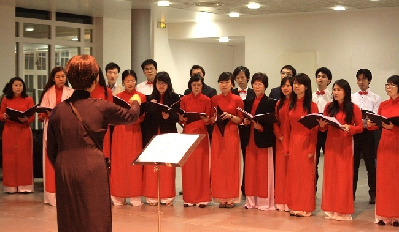  

Điểm nhấn của hoạt động gây quỹ lần này là chương trình ca nhạc đặc sắc của các bạn thanh niên, sinh viên Việt Nam đang học tập tại Pháp sinh hoạt trong Hội sinh viên Việt Nam và Hợp ca Quê hương.
Bạn bè Pháp và quốc tế đặc biệt yêu thích các tiết mục từ hát dân ca, hát đồng ca, múa dân tộc, các tiết mục hòa tấu đàn tam thập lục, đàn bầu…qua sự thể hiện tự tin và chuyên nghiệp của gần 60 anh chị em diễn viên.
Hầu hết các bạn rất vui khi được tham gia chương trình, qua đó giới thiệu với bạn bè Pháp và quốc tế hình ảnh một Việt Nam giàu truyền thống văn hóa và cũng rất nhân ái, bao dung, không ngăn cách bởi màu da hay biên giới.
Cheer Up được thành lập năm 2003, với 16 hội thành viên bao gồm nhiều trường đại học kỹ thuật và kinh tế trên cả nước Pháp. Với hơn 300 tình nguyện viên được đào tạo và hỗ trợ, hiệp hội đã giúp đỡ 4.000 thanh niên mắc ung thư hướng mình về tương lai trong các dự án.
Hoạt động thường xuyên của tình nguyện viên các hội là những chuyến thăm tới các bệnh viện, kêu gọi sự tham gia nhiệt tình của các tình nguyện viên bên ngoài, tổ chức các sự kiện chống ung thư./.
*(TTXVN/Vietnam+)*

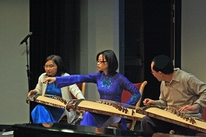  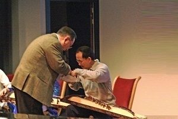  
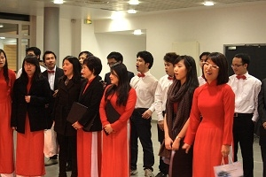  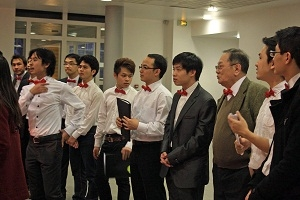  
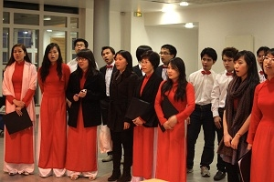  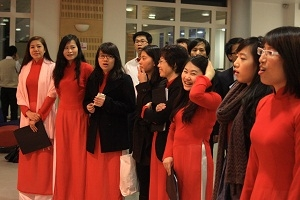  
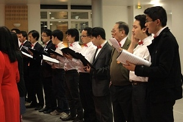  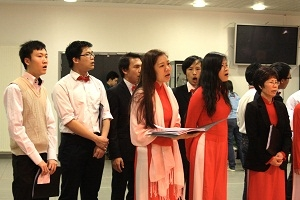  
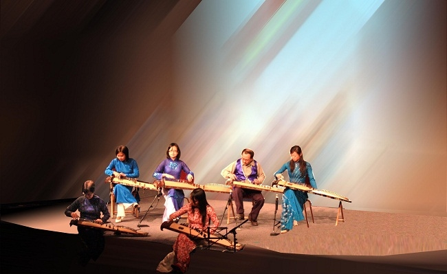  
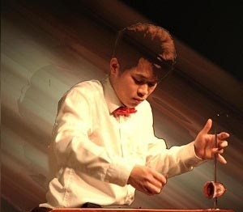  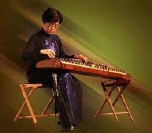  
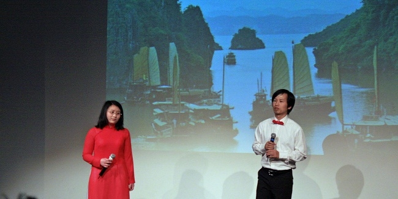  
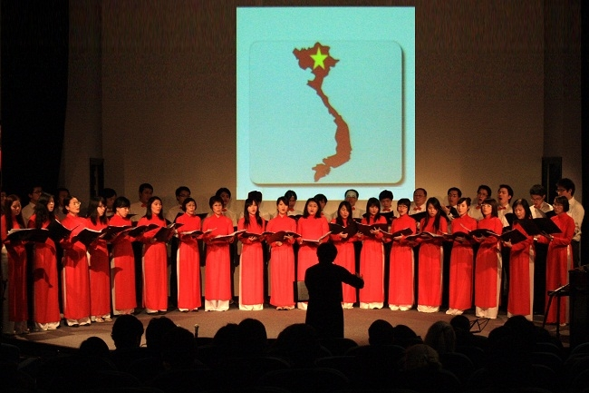  
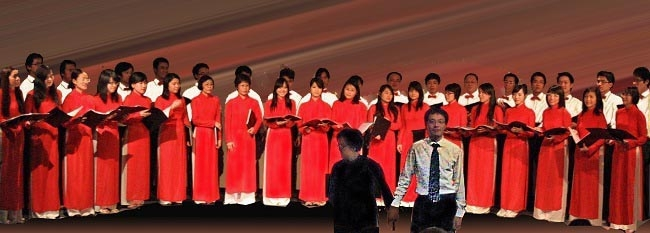  

**Lời cảm ơn của Ban Tổ chức**

Vậy là sau bao nhiêu ngày luyện tập vất vả, chúng ta đã hoàn thành chương trình văn nghệ một cách tốt đẹp! Các bạn bè trong CheerUp ESCP Europe và trường học đều hết sức khen ngợi phần trình diễn của Hợp ca.

Đặc biệt, cá nhân mình và Cheer Up ESCP Europe gửi lời cảm ơn chân thành nhất đến sự nhiệt tình giúp đỡ của Hợp ca, đóng góp cho sự thành công của sự kiện chống ung thư lần này.

Vì không có email liên lạc của đội đàn tranh, con xin nhờ cô Ngân Hà gửi lời cảm ơn đến các nghệ sĩ đã tham gia tiết mục đàn tranh, giúp giới thiệu nét văn hoá dân tộc Việt nam đến các bạn bè quốc tế.

Con cảm ơn cô chú đã lo lắng cho các tiết mục được chu đáo, cảm ơn các bạn đã nhiệt tình ủng hộ chương trình!
Hẹn gặp lại cả nhà vào buổi tập tới!

*Hương Giang*