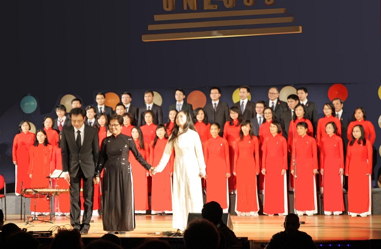
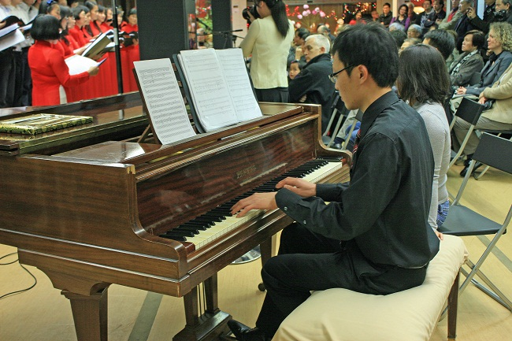
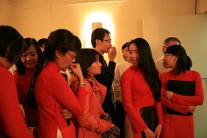

<!--
title: Tạm biệt Thế Anh 22.12.2012
author: Nguyễn Tích Kỳ
status: completed
-->

***Tạm biệt Thế Anh***

*Tối hôm qua thứ bảy 22/12/2012 tại Trung Tâm Văn Hóa (CCV).
Chúng ta đã chung vui với Thế Anh một người bạn đã cùng HCQH đồng hành, từng chia xẻ ngọt bùi với HCQH. Cuối tháng này Thế Anh sẽ lên đường trở về VN sau một thời gian thực tập tốt đẹp.*
 
*Nói gì khi chia tay, khi ta biết trên chặng đường còn lại của HCQH sẽ vắng bóng một người.*

*Ba năm, chung một con đường, một đam mê **« Áo anh rách vai, quần tôi có vài mảnh vá, miệng cười buốt giá, chân không giày, thương nhau tay nắm lấy bàn tay…** và chúng ta đã vượt qua nhiều gập ghềnh trong dựng xây một HCQH của hôm nay.*

*Tan hợp, hợp tan đó là quy luật.*  
*Tuy vậy, nhưng trong bộ nhớ của mỗi chúng ta, của HCQH , của Cô chú sẽ luôn tồn đọng  những gì tốt đẹp nhất của thời xây dựng HCQH.*

*Tạm biệt nhé Thế Anh.  
Chú tạm nhờ mấy hàng này để nói với thế Anh những gì muốn nói. Vì  tối hôm qua, khi gặp mặt Chú không biết nói nên lời.  
Hẹn gặp lại,  
TK*

*Thân gửi Cô Chú và mọi người trong gia đình HCQH,  
Ngày mai Thế Anh sẽ lên đường rời Paris.  
3 năm sống ở Pháp cũng là thời gian TA được gắn bó với những chặng đường phát triển của hợp ca. Mỗi kết quả đạt được của nhóm, dù ít hay nhiều đều làm TA cảm thấy tự hào, vì đó là sự đóng góp nhiệt tâm và nỗ lực thật sự của mỗi chúng ta. Không khí thoải mái nhiệt tình trong các buổi tập, cảm giác hồi hộp trước mỗi buổi diễn, niềm vui khi hoàn thành một tác phẩm … những kỷ niệm đó sẽ còn theo mãi.*  

*Hợp ca cũng là nơi TA được làm quen với những người bạn mới, để mỗi khi ngồi với nhau là say sưa ca hát, chia sẻ buồn vui của những năm tháng Paris khó quên.  
TA xin gửi lời cảm ơn và tạm biệt đến Cô Chú và toàn thể hợp ca.
Hy vọng rằng đây sẽ luôn là nơi khởi đầu và cất giữ của những kỷ niệm thật đẹp.  
Chúc Hợp ca tiếp tục phát triển và đạt được nhiều thành công trong tương lai.  
Chúc mọi người sức khoẻ và hạnh phúc trong năm mới 2013.  
Bonne année à tous et à bientôt !  
Amitiés,  
Thế Anh*

  

