<!--
title: Sinh nhật HCQH 1 tuổi 25.04.2010
author:  Nguyễn Tích Kỳ
-->

**Thành lập Hợp ca Quê Hương được một năm**  
*viết bởi BĐT*
 
Trong năm 2009, với hàng loạt chương trình biểu diễn tại Đại Sứ Quán Việt Nam tại Pháp, tại UNESCO, và tại Trung Tâm Văn hóa Việt Nam tại Pháp, HCQH đã đem lại cho cộng đồng người Việt và giới thiệu đến bạn bè quốc tế dòng nhạc kinh điển Việt Nam.
 
Chủ nhật 26-04-2010 vừa qua kỉ niệm đúng một năm thành lập Hợp ca Quê Hương (HCQH).  
Buổi lễ được tổ chức trong bầu không khí ấm cúng, giản dị nhưng không kém phần trang trọng tại Trung Tâm Văn Hóa Việt Nam tại Pháp với sự có mặt đông đảo bà con và khách quý.
 
Một năm qua, với những bài hát bất hủ như “Người Hà nội” của Nguyễn Đình Thi, “Du kích Sông Thao” của Đỗ Nhuận, “Trống cơm”- dân ca quan họ Bắc Ninh... được chuyển soạn và phối âm của Viết Chung” “Choeur des esclaves” của Verdi, “Bình minh ca” của J.Goldsmith… HCQH đã gây được sự chú ý tích cực trong giới nghệ sĩ và chuyên gia của dòng nhạc giao hưởng trong nước.  

Phát biểu tại buổi lễ, ông Nguyễn Tích Kỳ, một người sáng lập HCQH, phát biểu:  
“Từ niềm đam mê đến sự may mắn gặp gỡ em M.Hà, em H.Thu và nhạc sĩ piano N.Anh, HCQH đã bắt nguồn khiêm tốn với 18 em bao gồm sinh viên, thực tập sinh, viên chức quốc tế và Việt kiều tại Pháp. Những buổi tập đầu tiên tại nhà của tôi rồi tiếp tục lan ra nhà văn hóa của thị xã Antony. May mắn thay, cùng thời điểm này, Trung Tâm Văn Hóa VN được thành lập. HCQH trở về “đất ta” và lớn lên từ đó. Một năm đã qua, hôm nay HCQH đã có 58 thành viên và một số tác phẩm kinh điển VN và quốc tế.”
 
Bà Nguyễn Ngân Hà, người trách nhiệm tổng quản nghệ thuật và đối ngoại HCQH bổ sung:
“Nhân dịp Đại lễ 1000 năm Thăng Long-Hà Nội, HCQH sẽ phối hợp với dàn nhạc giao hưởng và dàn Hợp xướng của UNESCO (bao gồm các viên chức của các quốc gia thành viên như Mỹ – Anh - Đức – Pháp...  Chúng tôi sẽ trình diễn bằng tiếng Việt tác phẩm “Người Hà Nội” của Nguyễn Đình Thi. Đây là  một sự kiện quan trọng, một đóng góp ý nghĩa. Đài truyền hình quốc gia Việt Nam VTV4 sẽ ghi hình.  
Bên cạnh đó, sinh hoạt trong năm 2010 còn có :
* Trình diễn tại nhà thờ Les Invalides cùng với dàn nhạc của Les gardes répubicainne
* Tham gia Lễ hội âm nhạc FIMU (Festival internationnal de la musique universitaire)
* Tham gia Lễ hội Nước tại Trinité/mer (Festival des baies du monde)”
 
Sau đây là một số hình ảnh chúng tôi đã ghi lại.
 
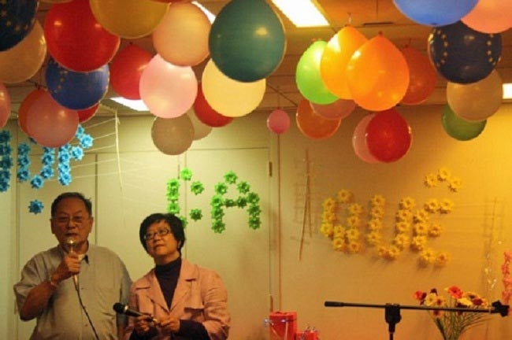  
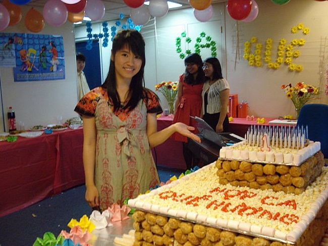  
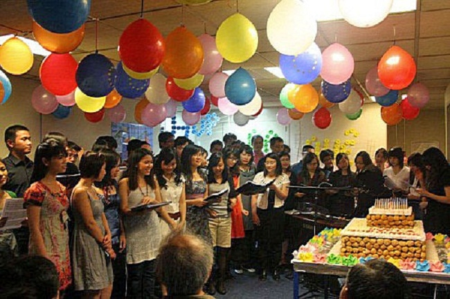 
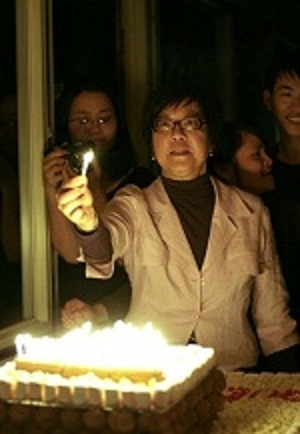 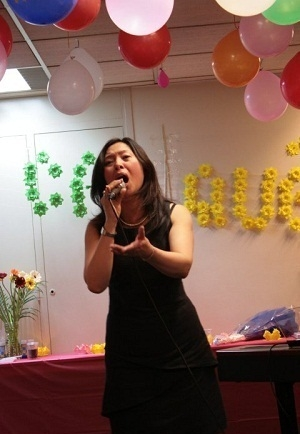  
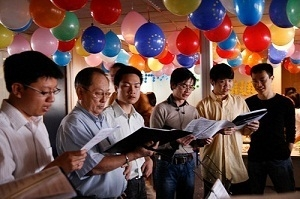 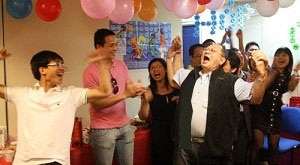  
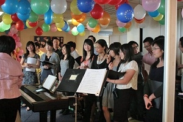 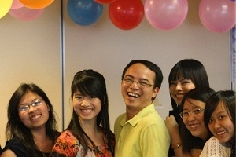  
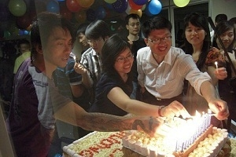 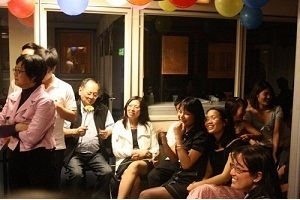  
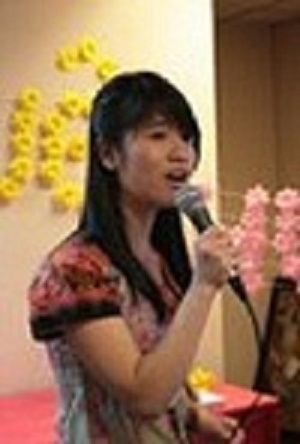 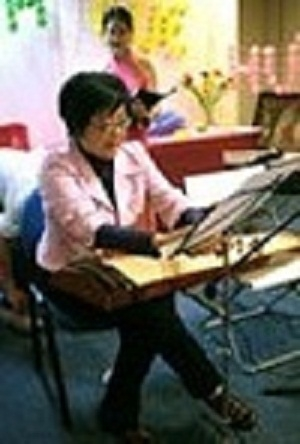  
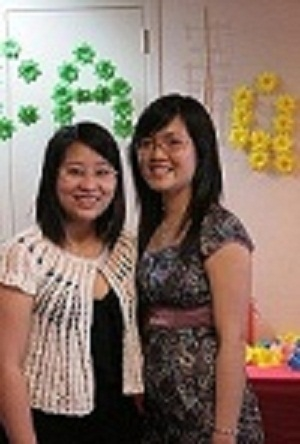 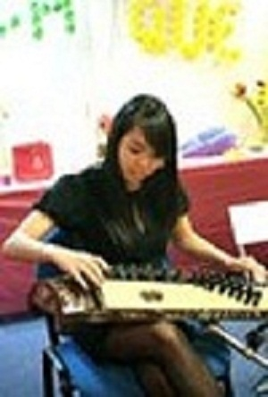
