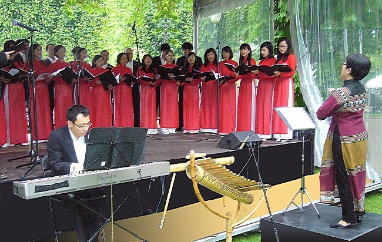
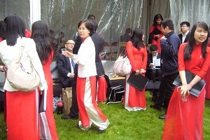
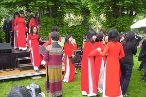
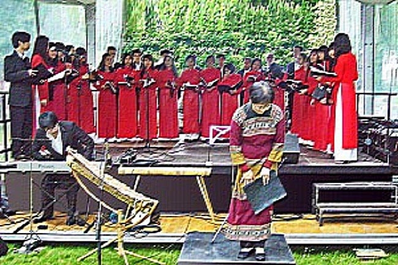

<!--
title: Tọa đàm do Đại Sứ Quán VN - Trung Tâm Văn Hóa VN tại Paris và Thị trấn Choisy-le-roi tổ chức
author: Nguyễn Tích Kỳ
-->

**Tọa đàm do Đại Sứ Quán VN và Thị trấn Choisy-le-roi tổ chức, 19.05.2012**

Một buổi tọa đàm đã diễn ra tại thị trấn Choisy-le-roi trùng đúng ngày sinh nhật Bác 19/05/2012 do Đại Sứ Quán Việt Nam tại Pháp & Trung Tâm văn hóa Việt Nam tại Pháp phối hợp tổ chức tại thị sảnh của thị trấn Choisy-le-roi.

HCQH được bàn giao trách nhiệm phần văn nghệ từ 15g đến 17g. Suốt tuần, thời tiết khá ấm, quang đãng. Nhưng giờ chót dự báo thời tiết của tổng đài truyền hình thông báo: Buổi chiều ngày Chủ Nhật 19/05/2012 sẽ mưa to.

Còn gì lo sợ hơn khi buổi trình diễn ngoài trời của HCQH đúng ngày mưa to gió lớn. Mặc dù những không gian triển lãm dành cho các Hội đoàn, khán đài và sân khấu đều có mái vải che mưa.

Trời mưa thì sẽ rất bất lợi cho hệ thống âm thanh, nhạc cụ và nhất là nhạc cụ tre nứa.  Đồng phục áo dài rất đẹp, nhưng mưa thấm ướt thì trông chả ra gì. Hơn nữa, trình diễn trong điều kiện mưa gió như vậy thỉ sức khỏe của các em và nhạc trưởng sẽ bị ảnh hưởng không nhỏ.

Nếu mưa to, HCQH sẽ phải ngưng trình diễn đây là một điều bất khả kháng.  
Nếu chỉ mưa lai rai, chỉ đủ ướt áo, thì quyết định sao?  Quan khách có còn đến dự không? Chắc chắn, trời mưa thì công viên cũng sẽ vắng quần chúng. Trong bối cảnh đó, tuy vẫn bình tĩnh động viên các em, nhưng thực tình cô chú cũng rất lo.

Ban tổ chức bắt đầu công việc chỉnh chuẩn hệ thống âm thanh và thử sân khấu toàn bộ chương trình HCQH và hai em sinh viên của Hội sinh viên tham gia chương trình. Đúng theo tinh thần « khi trình diễn trước quần chúng, phải chuẩn bị thật kĩ ; khi bước lên sàn diễn phải hàng ngũ chỉnh tề, thể hiện sự tôn trọng cao nhất đối với khán thính giả ». Hy vọng các em đã không quên những điều này. Thời điểm này là lúc các đoàn đại biểu tham dự hội nghị đi dùng cơm trưa.

HCQH bắt đầu duyệt lại chương trình trước trước giờ trình diễn.

Em Thanh Tâm tuy đang học ở tỉnh, năm cuối của luận án, cũng tranh thủ đến đúng ngày giờ, cho buổi trình diễn chiều hôm nay. Cũng như Tâm, nhiều em khác đã linh động gói gém thời gian đi làm, để có mặt đúng giờ. Trong ánh mắt của mọi người tôi chỉ đọc thấy một niềm tin, một quyết tâm hoàn thành nhiêm vụ. Tôi rất xúc động không nghe một tiếng than phiền, một đòi hỏi nào từ các em. Mặc dù giờ ăn trưa đã qua từ lâu. Tất cả các em thật là giản dị và đáng quý. Sau khi thử âm thanh xong, sắp xếp nhạc cụ và thêm vài lời dặn dò thì đã gần đến giờ trình diễn. Vậy chỉ còn đủ thời gian cho các em lót dạ bằng khúc bánh mì, ấm bụng trước khi khai hội. Ăn bánh mì xong mới thấy khát nước. May thay, anh Chương – Giám đốc TTVH đã đi « khuân » mấy chai nước về tiếp tế kịp thời. Cảm ơn anh.

 

Lần trình diễn này, HCQH đã trình làng một vài khía cạnh đặc trưng của nhạc cụ tre nứa, với tài năng độc tấu và diễn xuất Minh Anh. Minh Anh đã được xướng tên với tư cách là người giành chiến thắng trong cuộc thi Jeunes Talents 2012 vừa qua. Nhưng có thể nhiều người chưa biết rằng thành viên trẻ HCQH này vốn là một thủ khoa của khoa Lý-Sáng-Chỉ của Học viện Âm nhạc Quốc gia Việt Nam. Chơi thành thạo và điêu luyện piano và ít nhất 4 loại nhạc cụ dân tộc, Minh Anh đã đoạt nhiều huy chương vàng trong nhiều hội diễn văn hóa nghệ thuật của Hà Nội và toàn quốc.

Trong lần trình diễn này, Minh Anh sẽ giới thiệu nhạc cụ Ching’ram (trong gia đình nhạc cụ sylophonne) và giao lưu với khán giả Pháp bằng bản độc tấu Au Champs élysées. Chứng kiến tài năng của Minh Anh, ông thị trưởng thị xã Choisy rất hân hoan, pha chút ngạc nhiên thú vị. Ông và khán giả đã không ngớt vỗ tay.

Đây cũng là lần đầu tiên một nhạc cụ độc đáo mang tên Tra-ngô của đồng bào miền núi phía Bắc, Minh Anh và HCQH giới thiệu trước khán thính giả Pháp. Đặc thù của nhạc cụ này là mỗi nhạc công chỉ sử dụng được một nốt nhạc, giống như hình thức biểu diễn Cồng Chiêng Tây Nguyên vậy. Nhạc cụ tre nứa này cũng khá phổ biến trong các quốc gia lân cận VN, thuộc về khối văn minh tre nứa.  

HCQH đang nhích lại gần một ước mơ thầm kín. Đó là hình thành một không gian nhạc dân tộc với kho tàng nhạc cụ cổ truyền, làm phong phú thêm hình ảnh nghệ thuật của HCQH. Chặng đường phía trước còn dài, còn nhiều gian nan và thử thách, nhưng với lòng quyết tâm và tình đoàn kết thì mọi việc đều có thể.

Buổi trình diễn vừa qua, những người tin tưởng về tâm linh đã quả quyết rằng Bác đã phù hộ để HCQH hoàn thành nhiệm vụ một cách trọn vẹn. Có thể thế lắm chứ, bằng chứng là khi HCQH thu dọn xong hết, khi ra về thì trời mới đổ mưa, mưa rào, và cứ thế mưa kéo dài cho đến hết cả tuần…

Chúng ta có thể khiêm tốn kết luận, buổi trình diễn đã thành công tốt đẹp.

TK  
23.05.2012