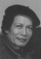

<!--
title: Lòng trắc ẩn
author: Nguyễn Tích Kỳ
status: draft
-->

## Đỗ Đức     

1- Ngày còn ở nhà, tôi làm thịt gà vịt không thấy ngại, tay chẳng run. Nghe thấy ai đó nói không dám cắt tiết một con gà mình bụng bảo dạ rằng sao nhát thế.

Rồi đến một ngày kia đi qua đường công viên Thống Nhất thấy người ở thôn quê đem những chú chim giẽ đã vặt trụi lông, buộc túm chân treo ở ghi đông xe rao bán. Có lúc còn thấy họ lúi húi ngồi vặt nốt lông những con còn lại. Những túm lông trắng ném ra bay lùm xùm, cuộn xoáy một góc đường như cơn lốc của ma cụt đầu. Con chim nhỏ bé tội nghiệp chỉ còn giãy dụa một cách bất lực. Lại nhìn thấy những con trụi lông đỏ hỏn run run trong cái rét chập chờn của ngày tháng Mười, tự nhiên thấy lòng chùng xuống thương cho số phận những con chim quen sống tự do đen đủi bị sập bẫy. Lúc ấy với chúng trời xanh cao lồng lộng đẹp đẽ nhường nào chỉ còn là kí ức cuối cùng trong đời, thấy lòng tự nhiên chùng xuống. Một nỗi buồn tâm thế chảy u ám trong người.

Rồi một lần ngồi nhặt cua làm bữa riêu thấy những con cua xô nhau chạy trong chậu để tránh bị bắt, hai mắt giương lên ngơ ngác. Khi bị bóc mai, chúng run lên lần cuối  từ giã cõi đời, hai con mắt đột nhiên đờ đẫn gãy gập xuống,  những chiếc càng cứng cỏi bỗng nhiên buông xuôi, các chân con rúm ró, có cái tự rụng ra khỏi thân. Đó là cơn đau đớn cuối cùng của một kiếp phù du.

Tôi kể chuyện đó cho một nguời bạn. Bạn tôi không bàn thêm mà chỉ chậm rãi bảo có lẽ thế là mình đã già rồi, có già mới yếu đuối thế.

Tôi lờ mờ chìm theo suy ngẫm của bạn, phải chăng mình đã già thật.

2- Khu tôi ở có một Chủ tịch huyện. Chủ tịch còn khá trẻ. Bố anh ta là một lão thành cách mạng. Thời kháng chiến ông đã từng ăn cơm tù đế quốc. Rồi ông về hưu với vị trí của một thường vụ Tỉnh ủy. Tài sản của ông để lại chính là uy tín để cho  cậu con trai thăng tiến lên đến chức vụ kể trên. Ngỡ là nối nghiệp cha, nhưng từ đấy cũng là lúc gia đình ông rơi vào cảnh giông bão khi ông biết  thằng con trai đã làm những chuyện kéo bè kết cánh, ăn của đút, kiếm chác như điên, bất chấp tất cả. Có lần ngồi bên ông già tuổi ngoài tám mươi đầy tâm sự, tự nhiên tôi cảm thấy ông giống hệt con chim giẽ đang bị vặt từng cái lông tự hào khí phách một thời mà giờ bất lực không làm gì được. Ngẫm ra nó đang kinh doanh trên thành quả của ông. Ông đau thực sự. Để chứng minh cho tấm lòng son sắt của mình ông chỉ còn mỗi cách từ nó. Tưởng rằng làm thế rồi nó sẽ thay đổi, nhưng nó chỉ nhìn ông cười ruồi, chấp nhận luôn lời cảnh cáo cuối cùng của bố. Nó bảo ông ấy từ cũng được, già rồi lẩm cẩm!

3- Săn bắt vô lối, khi thiên nhiên cạn kiệt những chú chim trời thì kẻ săn mồi sẽ sống bằng gì? Khi tham nhũng kết bầy đàn xâu xé những đồng tiền xương máu của dân thì xã hội còn gì…Có câu trả lời của một kẻ tham nhũng như thế này: Sống là phải thế thôi. Trong đám người đó có kẻ đã qua cái tuổi ngũ thập tri thiên mệnh và cả loại lục thập thuận nhĩ cũng đang nghĩ thế và muốn làm hơn thế. Đó là những người đã đi vào một phần tuổi già mà còn thế. Tôi đâm nghi ngờ, phải chăng bạn tôi đã nhầm khi cho rằng biết thương xót một sinh linh bé nhỏ, hoặc thân phận của những  người nghèo, và bảo đó là do người ta đã  già. Chẳng nhẽ lòng trắc ẩn lại là của riêng người già?

15/10/2001

Có dịp, tôi sẽ giới thiệu người bạn họa sĩ giấy Dó này nhé.
 
## Đôi lời về bản thân  Đỗ Đức …

Tôi quê ở Bắc Ninh, một tỉnh nằm trên châu thổ sông Hồng, giáp với thủ đô Hà Nội hiện nay, một thời là đất kinh kì.

Nhưng tôi lại được sinh ra ở Thái Nguyên cách Hà Nội một trăm cây số về phía Bắc. Đó là vùng trung du núi đất, ở xen kẽ với đồng bào các dân tộc như Tày, Nùng, Caolan, Sán chay, Dao. Nên với tôi, núi rừng sông suối là ngôi nhà lớn, cuộc sống của người miền núi là cuộc sống của tôi.

Sau này tôi mới nhận ra lối nghĩ và cách sống của người ở nơi tôi được sinh ra đã ăn sâu vào trong tôi một cách tự nhiên như cây cỏ trên nền đất ấy. Nghĩa là chỉ tin cái quan sát thấy, chỉ nói những điều đã rút ra được từ trong lăn lộn với cuộc sống, không thể nào khác được.

Là một họa sĩ đồ họa, việc thường xuyên in tranh khắc nên tiếp xúc nhiều với dó, nhưng ban đầu tôi cũng chưa biết đến sức manh của chất liệu này. Tôi chỉ bắt đầu để ý đến việc vẽ trên dó khi xem bức kí họa bằng mực nho của cố họa sĩ Nguyễn Trọng Hợp. Ông đã vẽ buông một mái đao của chùa Bút Tháp (Bắc Ninh) trên dó. Bức kí họa đó tôi được xem tại nhà ông khi tôi theo học tại trường đại học. Nhìn cách thâm diễn (vẽ kĩ) bằng mực nho tôi vô cùng ngạc nhiên về sức biểu cảm của giấy. Khi cứng cáp, khi mềm mại, màu và nét chỗ buông chỗ chặn hút vào không gian và nhẹ nhàng tan vào thinh không. Tôi xem như bị thôi miên. Mãi sau này tôi mới nhận ra Ông chính là người khai tâm cho tôi về chất liệu này, mặc dù ông rất ít vẽ trên dó. Đó thật là những cơ duyên.

Tôi bắt tay vào vẽ trên dó. Giấy dó lúc đó cũng khá rẻ lại không khó kiếm. Nhưng khi vẽ mới thấy để đạt được vẻ đẹp hấp dẫn như thày tôi đã làm thì cũng không dễ. Đã không ít tờ giấy dó bị loại bỏ ngay sau khi đặt bút.. Nhưng đó chỉ là phần kĩ năng. Kĩ năng có thể rèn luyện được nếu có sự kiên trì. Để có một bức tranh đẹp, đem đựợc mĩ cảm đến với người xem là phải thổi được hồn vào trong nét vẽ thì khó hơn nhiều

Tôi cũng biết mình có một khoảng trống rất lớn về lí luận. Mọi việc tôi làm trong sáng tác đều xuất phát từ quan sát rồi từ từ nghiền ngẫm để tổng kết để tìm cách nhận ra qui luật khách quan của sự vật dù đó cũng có thể cũng chỉ là tương đối.

Vẽ gì và vẽ như thế nào mới thực là sự thách thức cam go. Tôi vẽ về miền núi và dân tộc thiểu số do được tiếp cận với đời sống văn hóa của họ. Những giá trị văn hóa đó đã chinh phục tôi. Mỗi chuyến đi về miền rừng là một lần tìm kiếm và tích lũy các giá trị sống trong mỗi dân tộc. Đó là những câu chuyện trong tranh dân gian (cả trong tranh thờ cúng), trong bộ sắc phục và sau đường kim mũi thêu trên những tấm thổ cẩm. Đó là toàn bộ đời sống tinh thần sâu kín được cất giấu dưới màu sắc và đường nét. Những sản phẩm vật chất hữu hình đó chứa đựng rất nhiều giá trị tinh thần của những thế hệ đi trước đã tạo ra nó.

Vẽ dó là nhuộm giấy bằng màu. Vẽ thế nào để khi vẽ xong bức tranh người ta còn thấy mặt giấy và xơ giấy. Đó là quan niệm ứng xử của riêng tôi với chất liệu này. Tranh lụa người ta cũng làm như vậy nhưng lụa còn công đoạn rửa chuốt cho thớ lụa ăn đều màu và nếu có lỡ tay vẫn còn cơ hội sửa chữa. Nhưng với dó thì không thế. Vẽ dó nếu quá tay xuống mực thì hầu như phải vứt bỏ tờ giấy. Vẽ dó phải như người luyện kiếm, nhát bút phải thuần thục, linh cảm lấy mực trên đầu ngọn bút phải chính xác. Để được vậy vẽ dó phải tĩnh tâm như người nhập thiền, tập trung cao độ nhưng phải buông lỏng cảm xúc như vô thức thì nét mới mềm, màu mới nhuần nhuyễn, mới chuyển tải được nhưng gì bạn đã định trong đầu.

Một sáng tạo nhỏ

Khi xem bức tranh dân gian Đông hồ công việc nhà nông, đó là bức tranh kể chuyện. Nghệ nhân dân gian đưa lên mặt tranh công việc làm ruộng từ gieo mạ, cấy, gặt và phơi phóng, rồi xay xát lấy gạo nấu cơm tôi phát hiện ra nghệ nhân đã đưa vào cùng một mặt phẳng rất nhiều không gian, và thời gian (từ gieo mạ đến thu hoạch).

Suy nghĩ về lập thể không gian trong ý tưởng và thể hiện không gian theo lối nhìn cổ điển xuất hiện. Và thêm vào đó, kết hợp với lối nhìn camera đã cho tôi ý tưởng vẽ tranh có nhiều phần và kết nối chúng lại với nhau thành một nội dung đồng nhất. Đó là vào năm 1993.

Cho đến bây giờ thì tôi hoàn toàn yên tâm về sự suy ngẫm sáng tạo của mình.

Mở không gian cho tranh luôn là mong ước của mỗi họa sĩ, đó là các không gian gần xa, không gian tâm linh, không gian vật chất, không gian ảo. Còn thời gian vì thế mà cũng được mở theo hợp lí và gắn kết không gượng gạo.

Bức tranh vẽ theo lối này thì sông và biển, vũ trụ và trái đất, khoảng cách địa lí không còn là trở ngại cho những suy tư mà họa sĩ muốn bộc lộ lên cùng một mặt phẳng.
Tôi hoàn toàn yên tâm với sáng tạo này. 

30/5/2009  
Đỗ Đức