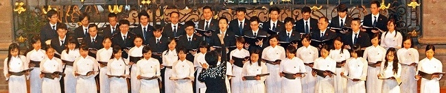
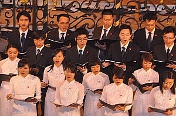

<!--
title: Fimu - Liên hoan Âm nhạc quốc tế tại Belfort
author: Nguyễn Tích Kỳ
-->
Hợp ca Quê Hương trình bày nhiều tiết mục văn nghệ đặc sắc, nói về quê hương, đất nước Việt Nam.

Trong chương trình tham dự Liên hoan âm nhạc quốc tế Belfort lần này, Hợp ca Quê Hương trình bày nhiều tiết mục văn nghệ đặc sắc, nói về quê hương, đất nước Việt Nam.

 

 

Dàn Hợp ca Quê Hương của người Việt tại Pháp vừa có các buổi biểu diễn đặc biệt vào tối 23 và 24/5 tại Nhà hát lớn của thành phố Belfort (ở phía Đông nước Pháp) trong khuôn khổ Liên hoan âm nhạc Quốc tế Belfort. Trong chương trình tham dự Liên hoan âm nhạc quốc tế Belfort lần này, Hợp ca Quê Hương trình bày nhiều tiết mục văn nghệ đặc sắc, nói về quê hương, đất nước Việt Nam. Đó là những bài hát, bản nhạc như: Du kích sông Thao, Người Hà Nội, Trống cơm… Những tiết mục của dàn Hợp ca Quê Hương thu hút sự chú ý của đông đảo công chúng Pháp cũng như bè bạn quốc tế tham dự Liên hoan.

 

 

 

 

 

 

Đây là lần đầu tiên dàn Hợp ca Quê Hương tham gia Liên hoan Âm nhạc Quốc tế được tổ chức tại thành phố Belfort (thuộc vùng Franche-Comté). Năm nay, Liên hoan Âm nhạc Quốc tế Belfort có sự tham gia của hơn 100 nhóm nhạc và khoảng 2.500 nghệ sĩ trẻ đến từ hơn 30 nước.

 

Hợp ca Quê Hương được thành lập vào đầu năm ngoái 2009, với các thành viên là những sinh viên, nghiên cứu sinh, người Việt đang làm việc tại Pháp. Đây là tập hợp của những người yêu âm nhạc, với tình yêu quê hương. Họ luôn mong muốn được góp phần nhỏ bé của mình vào việc kết nối cộng đồng, cổ vũ và quảng bá hình ảnh đất nước Việt Nam với các bạn Pháp và quốc tế. Ngay từ khi ra đời, Dàn Hợp ca Quê Hương đã nhận được sự đánh giá cao của cộng đồng người Việt tại pháp và các bạn Pháp cũng như quốc tế. Dàn Hợp ca quê hương đã có những tiết mục đặc sắc, ấn tượng tại Pháp trong kỷ niệm Quốc Khánh, kỷ niệm 999 năm Thăng Long-Hà Nội, Tết nguyên đán, kỷ niệm Ngày sinh Bác Hồ…

 

Hợp ca Quê Hương đang có kế hoạch kết hợp với Dàn hợp xướng của UNESCO để cùng trình diễn tác phẩm Người Hà Nội vào dịp Đại lễ 1.000 năm Thăng Long – Hà Nội. Hiện nay, Hợp ca Quê Hương đã và đang tích cực xây dựng các tiết mục biểu diễn với những bài hát, như: Du kích sông Thao, Trường ca sông Lô, Hội trùng dương, Việt Nam quê hương tôi, Tiếng hát giữa rừng Pác Bó và chùm ca khúc về Bác Hồ, Tình ca, Trống cơm, …

Hợp ca Quê Hương còn có kế hoạch dàn dựng và biểu diễn một số tác phẩm của các nhạc sĩ nổi tiếng thế giới như: Bach, Verdi,…/.

HCQH  
05 / 2010