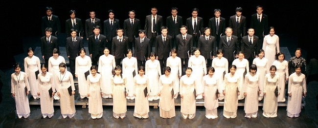
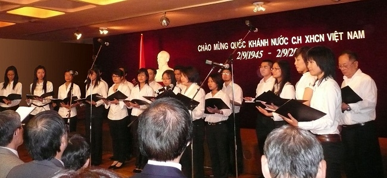
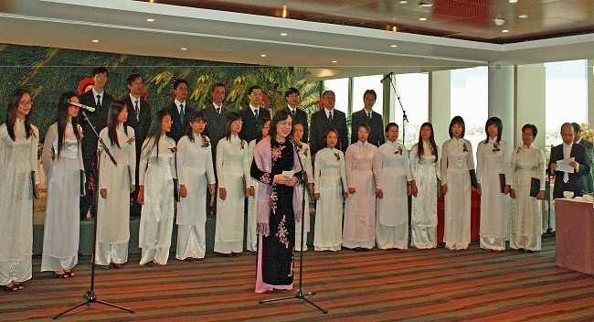
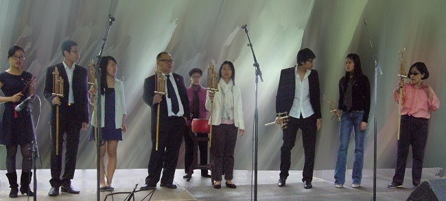
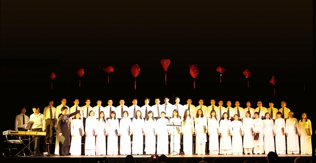

<!--
title: Nơi chắp cánh những ước mơ
author: TMH
-->

Được tự mình hát lên và tôn vinh những giai điệu của Quê hương và những bản hùng ca đi cùng năm tháng của nền ca khúc cách mạng Việt Nam luôn là niềm đam mê cháy bỏng của rất nhiều người con đất Việt đang sinh sống, học tập và làm việc tại nước ngoài. 

Xây dựng một dàn hợp xướng với đầy đủ sự đam mê của các thành viên, sự chau chuốt về chuyên môn nghệ thuật hướng tới tính chuyên nghiệp, bền vững, đồng thời có sự tương tác năng động với cộng đồng người Việt tại chỗ, cộng đồng trong nước và với các tầng lớp nhân dân nước bạn, luôn là niềm mơ ước lớn lao từ rất nhiều năm nay của nhiều thế hệ người Việt trên đất Pháp nói riêng và châu Âu nói chung.

  

Cho tới một ngày mùa xuân của năm 2009, niềm mơ ước rất mực thanh tao ấy đã trở thành hiện thực khi các sinh viên, nghiên cứu sinh, viên chức quốc tế người Việt tại Pháp tự tìm đến với nhau từ sự cộng hưởng trong nỗi niềm đau đáu hướng về Quê hương, trong tình yêu bất tận dành cho âm nhạc và trong nguồn cảm hứng dâng trào trước hình ảnh Hà Nội, trái tim của Tổ quốc, thủ đô ngàn năm văn hiến mà cả nước cũng như cộng đồng quốc tế sẽ long trọng kỷ niệm 1000 năm tuổi trong năm 2010, một năm đầy ắp những sự kiện trọng đại của đất nước. Sự gần gũi, song trùng trong đam mê đã khiến các thành viên của Hợp ca Quê Hương không hẹn mà gặp. Và khi đã gặp nhau rồi thì sự đam mê của từng cá nhân được nhân lên gấp bội và trở thành niềm khát khao chung được chia sẻ, được truyền tới cho người người những nét đẹp của văn hóa Việt, con người Việt, của quê hương Việt Nam. Dù chưa một lần nói ra nhưng từ trong sâu thẳm của trái tim, họ, những thành viên của Hợp ca Quê Hương, ý thức trách nhiệm của mình giống như những sứ giả văn hóa, những đại sứ thiện chí về văn hóa, âm nhạc, góp phần nhỏ bé của mình vào việc kết nối cộng đồng, cổ vũ và quảng bá hình ảnh đất nước trong con mắt và trái tim của bạn bè quốc tế.

  

Ra mắt khán giả lần đầu tiên vào đúng dịp kỷ niệm Quốc khánh mồng 2 tháng 9 tại Đại sứ quán Việt Nam tại Pháp, Hợp Ca Quê Hương đã nhận được sự cổ vũ nồng nhiệt của các cán bộ, nhân viên sứ quán và bà con Việt Kiều tại Pháp. Ngay sau đó, Hợp Ca Quê Hương đã được dịp thể hiện mình trước cộng đồng ngoại giao quốc tế tại Pháp khi tham gia **Lễ kỷ niệm 999 năm Thăng Long-Hà Nội tại trụ sở Tổ chức Giáo dục, Khoa học và Văn hóa của Liên hợp quốc (UNESCO) do Ủy ban Nhân di Thành phố Hà Nội và Phái đoàn thường trực của Việt Nam bên cạnh UNESCO tổ chức vào ngày 14 tháng 9 vừa qua.**

  

Với tác phẩm kinh điển **Người Hà Nội** của **Nguyễn Đình Thi**, chuyển soạn cho hợp xướng bốn bè có nhạc đệm, Hợp ca quê hương đã nhận được sự trận trọng và ngợi khen của bạn bè quốc tế. Hợp xướng Người Hà Nội, tiết mục đầu tay của Hợp Ca Quê Hương, cũng ngay lập tức nhận được những lời khen ngợi, động viên chân tình của đông đảo các nghệ sĩ tên tuổi và cả những nhà phê bình văn nghệ, những người am hiểu về nghệ thuật hát hợp xướng.

**NSND Thanh Hoa** cho biết cô “rất bất ngờ và xúc động vì Quê Hương hát hay quá”. Giọng ca huyền thoại của Việt Nam còn cho biết cô sẵn sàng hỗ trợ cho Hợp ca Quê Hương về mặt chuyên môn và quảng bá hình ảnh. Gửi lời chúc mừng tới Hợp ca Quê Hương.

**Nghệ sỹ Ái Vân**, nữ nghệ sỹ với đẳng cấp quốc tế, thanh sắc vẹn toàn của tân nhạc Việt Nam đã viết rằng, “lâu lắm rồi tôi mới nghe đi nghe lại, nghe một cách thật chú tâm và được thưởng thức một cách trọn vẹn Người Hà Nội. Tôi chỉ còn biết dành những lời khen ngợi cho Quê Hương. Ở xứ người mà các bạn thực hiện được một tác phẩm lớn một cách xuất sắc như vậy thật đáng khâm phục”.

Nhà báo **Trương Quý** thì dành cho Quê Hương một nhận xét rất hàm súc “khi phong trào văn nghệ quần chúng đã phát triển đến như vậy thì nền văn nghệ của Việt Nam sẽ sớm tìm được vị thế xứng đáng của nó”.

Các nghệ sỹ tên tuổi khác như **Lệ Quyên**, **Ánh Tuyết**, **Cao Minh**. Nhạc sỹ **Nguyễn Thiện Đạo** và nhiều chuyên gia thanh nhạc và phê bình âm nhạc nổi tiếng của Việt Nam cũng nhanh chóng gửi tới Quê Hương những lời động viên, cổ vũ nồng nhiệt cùng với những góp ý quý giá về chuyên môn. Sau thành công bước đầu với hợp xướng Người Hà Nội, Hợp ca Quê hương đang tiếp tục trau truốt tác phẩm này. Đồng thời, với sự ủng hộ của Ủy ban Nhân dân Thành phố Hà Nội và Phái đoàn đại diện thường trực của Việt Nam bên cạnh UNESCO, H*ợp ca Quê hương có kế hoạch kết hợp với Dàn hợp xướng của tổ chức UNESCO để cùng trình diễn tác phẩm này vào dịp **đại lễ 1000 năm Thăng Long- Hà Nội**, một sự kiện mà Đại hội đồng UNESCO sẽ sớm thông qua nghị quyết cùng phối hợp kỷ niệm với Việt Nam vào năm 2010*.

Ngoài ra, ban hợp ca này cũng đang tích cực xây dựng ngân hàng tiết mục biểu diễn với những tác phẩm thanh nhạc bất hủ của Việt Nam như **Người Hà Nội** / **Du kích sông Thao** / **Trường ca sông Lô** / **Hội trùng dương** / **Việt Nam quê hương tôi** / **Tiếng hát giữa rừng Pác Bó**  và chùm ca khúc về **Bác Hồ**, song song với những tác phẩm dân ca hoặc mang màu sắc dân ca như **Trống cơm** … v.v.

Với tinh thần cởi mở, tôn trọng sự đa dạng văn hóa, sự đối thoại giữa các nền văn hóa thông qua âm nhạc, trên bước đường nghệ thuật tương lai của mình, Hợp ca Quê hương cũng ấp ủ kế hoạch dàn dựng và biểu diễn các tác phẩm thanh nhạc kinh điển của nền âm nhạc bác học thế giới như một số tác phẩm của **Bach**, **Verdi**, **Bizet**. Chặng đường từ ước mơ đến hiện thực của Hợp ca Quê hương, nói rộng ra là của cộng đồng người Việt tại Pháp, chỉ có thể lý giải được bằng tình yêu quê hương, đất nước, sự gắn bó cộng đồng và tình yêu dành cho nghệ thuật. Với xuất phát điểm chỉ có chưa tới mười người, sau gần nửa năm sinh hoạt với phương pháp làm việc nghiêm túc, cầu thị, hướng tới sự chuyên nghiệp, Hợp Ca Quê Hương đã trở thành một dàn hợp xướng hứa hẹn nhiều triển vọng và ngày càng thu hút sự tham gia đông đảo của các bạn trẻ Việt Nam tại Pháp và châu Âu.

Hợp ca Quê Hương đã giúp họ biến ước mơ thành hiện thực và chính Quê hương sẽ chắp cánh cho ước mơ của họ bay cao hơn, xa hơn. Như niềm tin của **Đại sứ Văn Nghĩa Dũng**, Trưởng phái đoàn thường trực Việt Nam bên cạnh UNESCO, Đại diện cá nhân Chủ tịch nước tại Tổ chức Quốc tế Pháp ngữ, bày tỏ trong thư gửi tới Hợp ca Quê hương : *“với tinh thần luôn hướng về Tổ quốc, phát huy sáng tạo và sự dày công tập luyện, các tác phẩm mà Hợp ca Quê Hương đang thực hiện sẽ ngày càng hoàn thiện với chất lượng cao, góp phần xứng đáng vào các hoạt động văn hóa của cộng đồng và đất nước”*.

Người ghi nhận Hà My  
Paris 2010