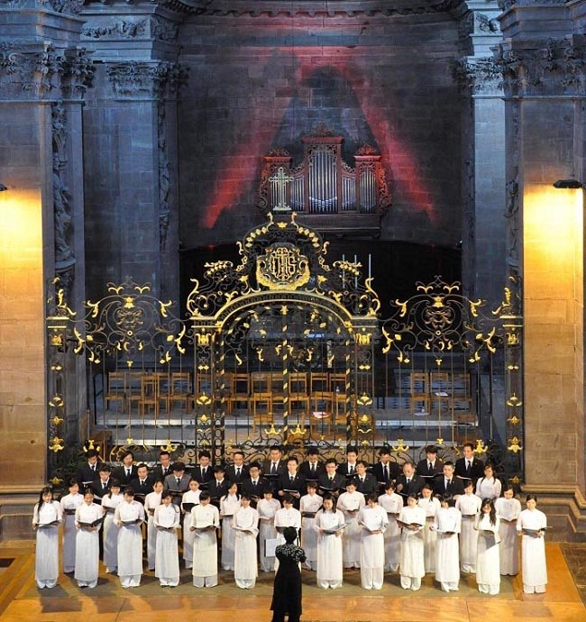
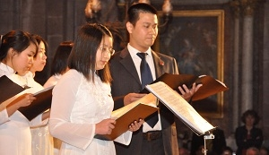
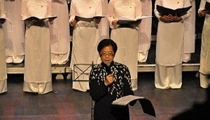
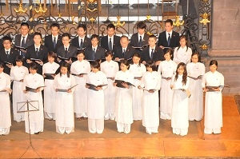
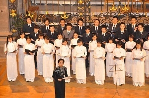
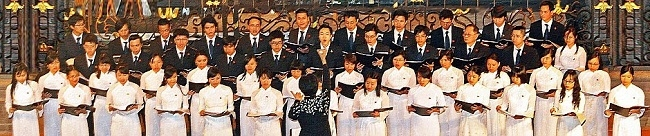
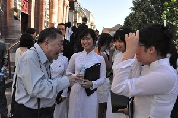

<!--
title: FIMU 23.05. 2010
author: Nguyễn Tích Kỳ
status: completed
-->

**FIMU 23.05. 2010**
 
Liên hoan âm nhạc quốc tế FIMU (Festival international de musique universitaire) tại Belfort vùng Frache-Comté miền Đông nước Pháp.
Festival tập trung 27000 nhạc công và ca sĩ đến từ Ý. Đức. Anh quốc. Bồ đào Nha. Tây ban Nha. Mỹ. Nhật. Trung quốc. Hung. Tiệp. Châu Mỹ latinh và châu Phi…
Hơn 30 quốc gia tham dự. Khoảng 75000 khán giả.
 
Hợp ca Quê Hương trình diễn tại Cathédrale St Christophe. Belfort.  

  
photo Tuyết  
    
Photo H.Đăng  
  
Photo H.Đăng  
    
photo Tuyết  

  
Photo H.Đăng  
 
 
Cảm nhận…
Con chào cô chú và cả nhà,
Tối nay nhân lúc cả nhà mình ra ngoài dạo chơi, con thì ở lại khách sạn tranh thủ hoàn thành nốt mấy việc riêng, con thấy thế là mình có “cơ hội” viết bức thư đầu tiên về cảm xúc với chuyến đi Belfort của nhà mình rồi ^_^
Hôm nay con đã rất tự hào và xúc động đứng trong đội ngũ Hợp ca Quê Hương, mặc áo dài truyền thống và đeo huy hiệu cờ đỏ sao vàng biểu diễn trên sân khấu FIMU cho các bạn bè quốc tế nghe. Đây chắc chắn là một hình ảnh đẹp mà suốt đời này con không bao giờ quên !
………………………………….
……………Hợp ca Quê Hương của chúng ta đã đi qua một chặng đường dài để đến được ngày hôm nay, và chắc chắn sẽ còn những bước phát triển hơn nữa…… Con xin cảm ơn cô Ngân Hà là người luôn tâm huyết và luôn phải “tất bật” với từng bước đi của Hợp Ca… cảm ơn chú Tích Kỳ là trụ cột tinh thần của nhóm…
Cảm ơn Hợp ca Quê Hương đã cho mình được sống trong bầu không khí thân ái, trẻ trung và luôn vui tươi….
Có thể nói, con rất hạnh phúc vì dù là sống xa quê hương nhưng con lại vẫn đang được ở giữa lòng Quê Hương :) 
Hôm nay, con thấy mình không thể không nói ra những cảm xúc biết ơn của mình với toàn bộ Hợp ca.
Chúc cho Hợp ca mình ngày có thêm nhiều thành công!
Hương Giang  
23 mai 2010 à 22:12
 