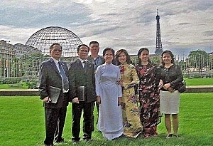
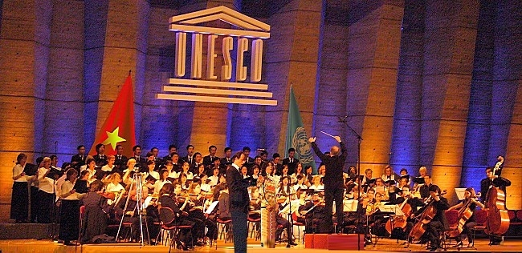

<!--
title: Đại Lễ 1000 năm Thăng Long – Hà Nội tại UNESCO tháng 10 / 2010
author: Nguyễn Tích Kỳ
status: completed
-->

   
Photo HCQH

**Hướng về Đại Lễ 1000 năm Thăng Long – Hà Nội
         Hòa điệu văn hóa, khát vọng hòa bình 
                 Tại UNESCO tháng 10 / 2010**  
Cùng thời điểm, ngày Chủ nhật 01/08/2010 vào lúc 08:21:56 AM.
Việt Nam đã tổ chức cầu truyền hình Hà Nội – Viêng Chăn – Paris/Unesco :
” Hướng về 1000 năm Thăng Long – Hà Nội hòa điệu văn hóa, khát vọng Hòa Bình “
Tại điểm cầu Paris, dàn Hợp ca Quê Hương thể hiện tác phẩm “Người Hà Nội” của Nguyễn Đình Thi.
     
Photo H.Đăng  
   
Photo H.Đăng  
   
Photo H.Đăng  
   
Photo H.Đăng  
   
Photo H.Đăng  
   
Photo H.Đăng  
     
Trích đoạn bài phỏng vấn chị Nguyễn Ngân Hà về sự hợp tác giữa Hợp Ca Quê Hương với Dàn nhạc Giao Hưởng và dàn Hợp xướng của UNESCO cho Đại Lễ 1000 năm Thăng Long-Hà Nội.  
  
   
  
    
Photo H.Đăng  
**Huy Thắng** – Chị đã làm thế nào để thuyết phục ông nhạc trưởng của dàn Hợp xướng và dàn nhạc giao hưởng UNESCO cũng như các thành viên tham gia vào buổi hoà nhạc mừng thủ đô ngàn tuổi ?
**Ngân Hà** – Là một thành viên lâu năm của dàn Hợp xướng của UNESCO, tôi biết rằng phương châm hoạt động của dàn Hợp xướng này là nhằm hướng đến sự giao lưu giữa các nền âm nhạc, dùng âm nhạc làm cầu nối bạn bè. Khi được biết Đại hội đồng UNESCO sẽ thông qua nghị quyết cùng phối hợp kỷ niệm với Việt Nam Đại lễ 1.000 năm Thăng Long – Hà Nội, vào năm 2010. Tôi và một và một người bạn đồng nghiệp đã nghĩ ngay đến kế hoạch kết hợp Hợp ca Quê Hương với dàn hợp xướng của UNESCO để cùng trình diễn tác phẩm Người Hà Nội. Cả hai chúng tôi muốn, nhân danh là người Việt, cán bộ làm việc tại UNESCO và sống trên đất Pháp, đóng góp một phần nhỏ bé của mình vào lễ hội này. Nhân tố quan trọng này khiến chúng tôi quyết tâm thuyết phục ngài nhạc trưởng Jorge Lozano-Corres (người Mê hi cô), các thành viên dàn hợp xướng của UNESCO, các thành viên của HCQH nhu cầu cần luyện tập bài Người Hà Nội. Và cũng đồng thời có sự động viên khuyến khích của lãnh đạo UBND Thành phố Hà Nội. Thành thật mà nói, sự kết hợp này là một ví dụ điển hình cho sự hoà nhập của cộng đồng người Việt ở nước ngoài. Từ trước đến nay, chưa từng có một sự kiện âm nhạc Việt nam nào mà lại có sự tham gia của đông đảo của bạn bè quốc tế đến vậy. Đây cũng có lẽ lần đầu tiên một bài hát về Hà Nội được nhiều người không phải người Việt nam hát đến vậy. Thành công của phương thức hợp tác mới mẻ này khiến tôi và các thành viên Hợp ca Quê Hương rất phấn khích. Hơn nữa, chương trình này lại càng có ý nghĩa khi Hoàng thành Thăng Long được UNESCO chính thức công nhận là di sản thế giới và bài trường ca Người Hà nội đang được phát sóng nhiều lần trên đài truyền hình VTV4 Việt nam.
 
Huy Thắng đại diện thường trực Báo Nhân dân tại Paris .
 
**Góp ý của thành viên HCQH**

Cả nhà thân mến,
Sẽ không cần phải nói nhiều về chuyến đi Belfort vừa mới đây, bởi chắc chắn rằng chuyến đi đó ít nhiều đều để lại cho mỗi người những cảm xúc nhất định. Đã có nhiều niềm tin và hy vọng rằng chuyến đi nhiều kỷ niệm đó sẽ là lực đẩy mạnh mẽ cho Hợp ca trong những chương trình sau đó thể hiện tình đoàn kết và tài năng của mọi thành viên.Và quả thật đó là niềm tin đúng đắn bởi Hợp ca là tập hợp của những niềm đam mê tình nguyện, không có một chút ép buộc…
Thực tế từ sau chuyến Belfort, lực lượng tham gia các buổi tập chuẩn bị cho buổi ghi hình của VTV4 cứ giảm dần. Bản thân mình không phải là thành viên ban điều hành, cũng chỉ tham gia được Hợp ca thời gian ngắn nữa thôi, cũng thấy lo lắng rất nhiều. Và mình cũng biết rằng những người như cô Ngân Hà, chú Kỳ, và những thành viên trong ban điều hành còn lo lắng gấp bội.
Chắc hẳn mọi người hiểu rất rõ ý nghĩa của chương trình lần này.
Một lễ kỷ niệm 1000 ngàn năm của Thủ đô có lẽ trong cuộc đời mỗi chúng ta chỉ được duy nhất một lần được chứng kiến. Và may mắn hơn nhiều nhiều triệu người Việt, chỉ được chứng kiến, chúng ta đang có cơ hội để được tham gia trực tiếp vào lễ kỷ niệm đó, trên cương vị là những người Việt ở nước ngoài hướng về quê hương từ cách xa hàng ngàn km, một vinh dự không phải ai cũng có được.
Những người như cô Hà, chú Kỳ, đã và đang làm hết sức để Hợp ca có được một sự đóng ghóp thật ý nghĩa vào lễ kỷ niệm đó. Và công sức đó sẽ là công dã tràng nếu chỉ có ít thành viên chúng ta hưởng ứng, tham gia.
Vẫn biết mỗi người còn quá nhiều việc phải làm, vẫn biết những khó khăn của cuộc sống xa nhà đang là gánh nặng cho mỗi thành viên, nhưng hy vọng rằng mỗi thành viên của Hợp ca sẽ luôn vì cái chung, tham gia đầy đủ để chương trình được trọn vẹn.
Và cũng hy vọng rằng những lo lắng này chỉ là thừa, hy vọng ngày mai sẽ có nhiều người viết mail trả lời rằng mình rỗi hơi đi lo lắng vì đương nhiên tất cả đều tham gia đầy đủ.
Nhưng dù sao cũng vẫn muốn viết ra cảm xúc nhất thời đó….
Vũ Mạnh Tân
11/06/10
 