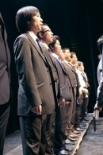
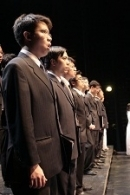
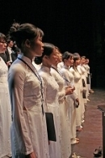
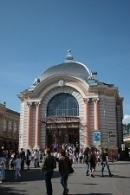
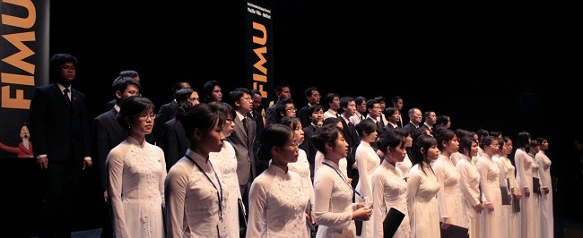
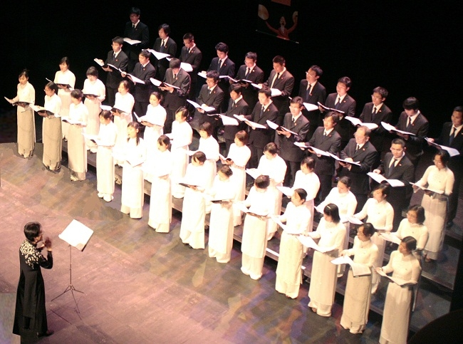
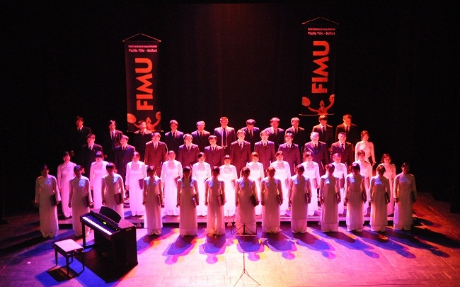

<!--
title: FIMU 24.05. 2010
author: Nguyễn Tích Kỳ
status: completed
-->

**FIMU 24.05. 2010**
 
Liên hoan âm nhạc quốc tế FIMU (Festival international de musique universitaire)
tại Belfort vùng Frache-Comté miền Đông nước Pháp.  
 
**Hợp ca Quê Hương trình diễn tại Théatre de la ville de Belfort.**  
 
  
  
Photo H.Đăng  
  
Photo H.Đăng  
  
Photo H.Đăng  
 
Tờ báo **LE PAYS Week-end**  tường thuật
 
L’ensemble vocal Quë Huong a fait un tabac hier dans une cathédrale Saint-Christophe pleine à craquer. Les choristes sont tous d’origine vietnamienne, mais résident temporairement en région parisienne pour leurs études. L’ensemble, formé en avril 2009, compte désormais 53 membres et maîtrise déjà parfaitement son sujet.
Dans son répertoire, des morceaux du répertoire classique ou populaire vietnamien.
**« Nous voulons faire découvrir la culture de notre pays, raconte la chef de chœur, Nganha Nguyen. Mais nous vivons en France, donc nous reprenons aussi votre répertoire. »** Pour preuve, cet extrait de la bande originale des Choristes auquel personne ne s’attendait.
ÉCOUTER Aujourd’hui à 14 h au Théâtre du Granit.
……………..
 
 Cảm nhận…
Đã 24 giờ kể từ khi xe đưa đoàn Hợp ca Quê hương trở về Paris, nhưng cảm xúc về những ngày ngắn ngủi ở Belfort như vẫn còn nguyên vẹn. Dường như những xúc cảm ấy quá ấn tượng, nên đã chẳng thể phai nhạt sau 1 ngày làm việc mệt mỏi.
Sẽ không thể quên được những giây phút luyện tập tại khách sạn Ibis trước buổi diễn mà không khí đã có lúc trở lên căng thẳng, có lẽ là bởi áp lực của những sứ giả Việt muốn mang văn hoá của người Việt gửi đến bạn bè quốc tế. Để rồi, những phút giây vỡ oà tại nhà thờ lớn Saint Christope, khi những thông điệp văn hoá Việt được bạn bè quốc tế đón nhận một cách trân trọng và nồng nhiệt bằng nhưng tràng vỗ tay tưởng chừng không dứt, bằng những lời chúc mừng, hỏi thăm sau buổi diễn. Đã có lúc, những giọt nước mắt của niềm vui, của niềm hạnh phút không thể kìm nén đã lăn trên đôi má rạng ngời, dẫu rằng, mỗi thành viên của Hợp ca đều hiểu những gì mình thể hiện trong buổi diễn chưa được tròn vẹn…
Và, những thông điệp văn hoá ấy lại một lần nữa được gửi tới bạn bè quốc tế một cách tinh tế hơn, tròn vẹn hơn tại nhà hát opera của thành phố, nơi mà một lần nữa, cảm xúc về đất nước, về tinh thần dân tộc được thăng hoa đến tận cùng trong “ngày về chiến thắng”.
Sẽ không thể quên những khoảnh khắc mây xuống phố của những tà áo dài Việt Nam trong cái nắng rạng ngời. Có lẽ, các bạn sẽ không thể hình dung được các bạn đẹp đến thế nào đâu trong mắt bạn bè quốc tế, bởi với chúng tôi, những người dường như đã quá quen với hình ảnh chiếc áo dài đôi lúc còn thấy ngỡ ngàng.
Cũng sẽ chẳng thể quên những giây phút bên nhau, những câu chuyện cười, những câu đố vui, những trò nghịch ngợm, những màn hát đối…. đã làm cho quãng đường trên xe dường như ngắn lại. Sẽ không thể quên bài hát về quê hương của mỗi thành viên được cất lên cho đến tận những thời khắc cuối cùng của chuyến đi.
Một ngày mới đã bắt đầu. Những lo toan của cuộc sống, công việc, học hành thi cử đã lại bắt đầu. Belfort sẽ lùi dần vào ngày hôm qua. Nhưng những kỷ niệm Belfort sẽ trở thành những ký ức đẹp trong mỗi thành viên của Hợp ca Quên hương, để mỗi khi nhắc lại kỷ niệm ấy như vẫn còn nguyên vẹn….hôm qua, hôm nay và cả ngày mai.  
VTM  
26.05.2010