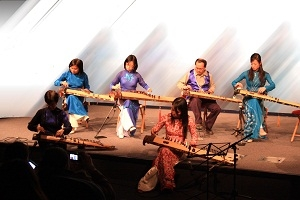
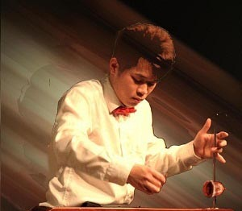

<!--
title: École supérieure de commerce de Paris 18.03.2011
author: Nguyễn Tích Kỳ
-->

Hợp tác với ESCP Europe (École supérieure de commerce de Paris) gây quỹ cho Trẻ em bị ung thư

**Théâtre của ESCP Europe  18.03. 2011**
 
Với chủ đề năm 2011 “Văn hóa Việt Nam”

Điểm nhấn của hoạt động gây quỹ lần này là chương trình ca nhạc đặc sắc của các bạn thanh niên, sinh viên Việt Nam đang học tập tại Pháp sinh hoạt trong Hội sinh viên Việt Nam và Hợp ca Quê hương.
Bạn bè Pháp và quốc tế đặc biệt yêu thích các tiết mục từ hát dân ca, hát đồng ca, múa dân tộc, các tiết mục hòa tấu đàn tam thập lục, đàn bầu…qua sự thể hiện tự tin và chuyên nghiệp của gần 60 anh chị em diễn viên.
Hầu hết các bạn rất vui khi được tham gia chương trình, qua đó giới thiệu với bạn bè Pháp và quốc tế hình ảnh một Việt Nam giàu truyền thống văn hóa và cũng rất nhân ái, bao dung, không ngăn cách bởi màu da hay biên giới.
Cheer Up được thành lập năm 2003, với 16 hội thành viên bao gồm nhiều trường đại học kỹ thuật và kinh tế trên cả nước Pháp. Với hơn 300 tình nguyện viên được đào tạo và hỗ trợ, hiệp hội đã giúp đỡ 4.000 thanh niên mắc ung thư hướng mình về tương lai trong các dự án. 
Hoạt động thường xuyên của tình nguyện viên các hội là những chuyến thăm tới các bệnh viện, kêu gọi sự tham gia nhiệt tình của các tình nguyện viên bên ngoài, tổ chức các sự kiện chống ung thư.

(TTXVN/Vietnam+)
 
 

 

 

 
## Thư gửi đến các em HCQH sau lần trình diễn tại Théatre ESCPEurope
 
Các em thân thương (cùng các em HCQH ở phương xa vẫn ngày ngày , cập nhật)
Hôm nay 19/03/2011 nhà hát quảng trường ESCP Europe. Vang tiếng hát HCQH,  
Trăng chiều êm ái quyến rũ của Đặng hữu Phúc đến Tổ quốc tươi đẹp (Chœur des esclaves) của Verdi rồi đến hùng ca Du kích Sông Thao đã ôn lại chặng đường của những người đã làm nên lịch sử.
Những em mới đến với HCQH cũng say sưa hòa nhịp cất tiếng với tất cả tấm lòng. Từ ánh mắt của các em tôi đã cảm nhận được sự tự hào và đam mê.
 
Cảm ơn ban tổ chức và em Hương Giang em không chỉ là thành viên của HCQH mà còn gánh vác một phần trách nhiệm của tổ chức hôm nay..
Hương Giang ơi, làm việc thì bao giờ cũng vấp váp, có vấp váp mới trưởng thành, đây là quy luật.
 
Cảm ơn những người bạn ban nhạc cổ đã đến giới thiệu với bạn bè quốc tế cây đàn tranh, cây đàn bầu đặc thù của nền âm nhạc thuần túy Việt Nam. Các em đã trình bày với ngón đàn tuyệt hay với một tâm hồn rất Việt.
Em Thế Anh một tài năng trẻ « tiếng dương cầm sẽ còn vang vọng mãi đâu đây…»
Em Quỳnh Nga đã cho thấy thế nào là « Diễu hành thời trang » đã chuyển biến trong giây phút một không gian bình thường trở thành lộng lẫy. Quỳnh Nga qủa là một cô tiên có cái đũa thần.
Những giọng ca không chỉ để lĩnh xướng cho HCQH mà còn là những giọng đơn ca, song ca rất đặc sắc.
Cảm ơn các em đã có nhiều « tài ».
 
Sự đóng góp của các em và thành công này có nghĩa là HCQH phải ngày càng vững chắc hơn đấy nhé. Xin đừng « ngủ trên tự mãn ».

Hẹn các em thứ bảy 26/03 chúng ta « tiếp tục tập như thường lệ nhé »
Chú TK
20.03.2011
 
## Thư cảm ơn của Ban Tổ chức
 
Vậy là sau bao nhiêu ngày luyện tập vất vả, chúng ta đã hoàn thành chương trình văn nghệ một cách tốt đẹp! Các bạn bè trong CheerUp ESCP Europe và trường học đều hết sức khen ngợi phần trình diễn của Hợp ca.
Đặc biệt, cá nhân mình và Cheer Up ESCP Europe gửi lời cảm ơn chân thành nhất đến sự nhiệt tình giúp đỡ của Hợp ca, đóng góp cho sự thành công của sự kiện chống ung thư lần này. 
Vì không có email liên lạc của đội đàn tranh, con xin nhờ cô Ngân Hà gửi lời cảm ơn đến các nghệ sĩ đã tham gia tiết mục đàn tranh, giúp giới thiệu nét văn hoá dân tộc Việt nam đến các bạn bè quốc tế.
Con cảm ơn cô chú đã lo lắng cho các tiết mục được chu đáo, cảm ơn các bạn đã nhiệt tình ủng hộ chương trình!
Hẹn gặp lại cả nhà vào buổi tập tới! 
 
Ban Tổ chức
Hương Giang
19.03.3011