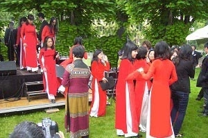
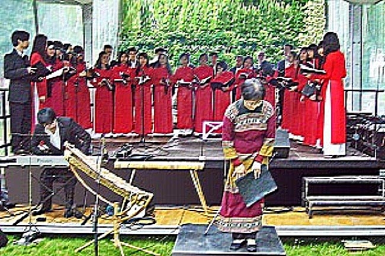

<!--
title: Ngày giao lưu và hữu nghị các Hội đoàn tại Thị trấn Choisy-le Roy. 19. 05. 2012
author: Nguyễn Tích Kỳ
status: completed
-->

***Đại Sứ Quán VN–CCV- và Thị Trấn Choisy-le-Roy tổ chức Ngày giao lưu & hữu nghị các Hội đoàn tại Thị trấn Choisy-le Roy. 19. 05. 2012***

***Trình diễn tại công viên  của thị trấn Choisy-le-Roy***

Ngày 19/05/2012 kỷ niệm 40 năm tình đoàn kết giữa Việtnam và Choisy- le-roy. Đại Sứ Quán VN & Trung Tâm văn hóa VN đã phối hợp cùng thị trấn Choisy–Le-Roy tổ chức tại Tòa thị sảnh  Choisy- le-roi một buổi tọa đàm giao lưu – hữu nghị.

Cuộc tọa đàm hôm nay được tổ chức trùng ngày với sinh nhật của Bác kính yêu. 

 
photo Tuyết 

HCQH phụ trách phần văn nghệ từ 15g đến 17g, trong chương trình sẽ có thêm vài tiết mục đơn ca của ban văn nghệ Hội sinh viên (UE).

Suốt  tuần, đẹp trời, thời tiết tốt quang đãng và có nắng ấm .    

Nhưng đến chiều thứ sáu thì dự báo thời tiết thông báo : buồi chiều ngày Chủ Nhật 19/05/012 sẽ mưa to gió lớn. Còn gì lo sợ hơn, mưa to, HCQH sẽ phải ngưng trình diễn. Nếu chỉ mưa lún phún, đủ ướt áo, thì quyết định sao? mặc dù nơi quan khách ngồi, và sân khấu cũng như những gian hàng triển lãm dành cho các Hội đoàn đều có mái vải che.

   

Trời mưa sẽ bất lợi cho hệ thống âm thanh, nhạc cụ tre nứa và áo dài trong mưa thì trông chả ra gì và sức khỏe của các em và nhạc trưởng sẽ ra sao ? Quan khách có còn đến dự không ? Và điều chắc chắn, công viên sẽ vắng bóng quần chúng.Hình dung bối cảnh này, tuy vẫn bình tĩnh, tiếp tục động viên các em, nhưng trong lòng cô chú rất lo. Chúng tôi rà duyệt toàn bộ chương trình, chỉnh hệ thống âm thanh  đúng theo tinh thần « khi trình diễn trước quần chúng, phải chuẩn bị chu đáo, khi bước lên sàn diễn phải hàng ngũ trang phục chỉnh tề vật dụng đầy đủ, thể hiện sự tôn trọng khán thính giả cao nhất ».

 

Hôm nay. Nhiều em  đã linh động gói gém thời gian đi làm để có mặt đúng giờ. Tôi không nghe một tiếng than phiền, một lời phê bình. Trong ánh mắt của mọi người chỉ đọc thấy một niềm tin, một quyết tâm hoàn thành nhiêm vụ.  Thật giản dị và đáng trân trọng. 

 

Rà duyệt xong, chỉ còn đủ thời gian lót dạ bằng khúc bánh mì đem theo. Ăn xong mới thấy khát nước. May thay, anh Chương – Giám đốc TTVH một người nghệ sĩ kinh nghiệm đã đi « khuân » mấy chai nước về tiếp tế.

Minh Anh trình làng một nhạc cụ tre nứa. Xin giới thiệu thành viên trẻ này, vốn là một thủ khoa đầu của khoa Lý-Sáng-Chỉ của Học viện Âm nhạc Quốc gia Việt Nam. Em rất thành thạo và điêu luyện piano và ít nhất 4 loại nhạc cụ dân tộc. Minh Anh đã đoạt nhiều huy chương vàng trong nhiều hội diễn văn hóa nghệ thuật của Hà Nội và toàn quốc.

 

Minh Anh giới thiệu và giao lưu bằng nhạc cụ Ching’ram (gia đình của nhạc cụ sylophonne) bài Au Champs élysées). 

ông thị trưởng thị xã Choisy và Đại sứ rất hân hoan và thú vị. Các vị  đã không ngớt vỗ tay hưởng ứng. 

Lần đầu tiên nhạc cụ Tr’angô của đồng bào vùng Tây-Bắc  VN được giới thiệu tại đây. Đặc thù của nhạc cụ này là mỗi nhạc công chỉ sử dụng được một nốt nhạc, giống như hình thức Cồng Chiêng Tây Nguyên. Trải qua sự kiện thời tiết yên lành của chiều ngày nay. Người tín ngưỡng tâm linh quả quyết rằng lần trình diễn này đã được Bác đã phù hộ cho HCQH hoàn thành nhiệm vụ một cách trọn vẹn. Có thể thế đúng là vậy, tôi cũng tin là vậy vì chỉ đến lúc HCQH thu xếp ra về thì trời mới đổ mưa, mà mưa to… và cứ thế mưa liên tục cả tuần… 

Chúng ta có thể khiêm tốn kết luận, buổi trình diễn đã thành công tốt đẹp.

TK   Antony 21.05.2012
