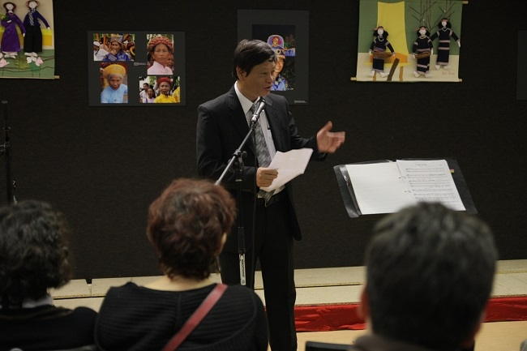
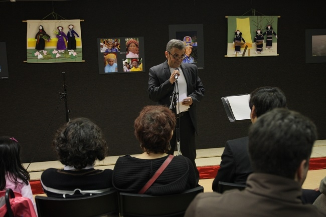
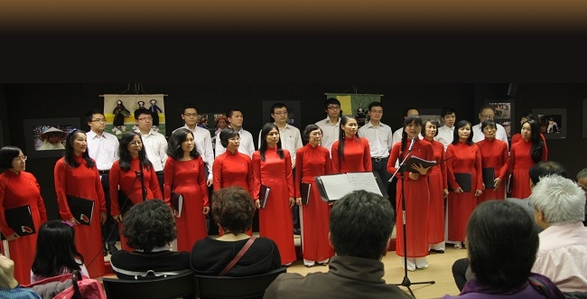

<!--
title: Triển lãm của Gérard Mamy và cuộc chia tay với Thế anh 22 .12 . 2012
author: Nguyễn Tích Kỳ
status: completed
-->

***Sự có mặt Thế Anh và lần trình diễn triển lãm hình ảnh về  vùng trung du Việt Nam của Gérard Manmy Tại Trung Tâm Văn Hóa  22 / 12 / 2012*** *Photo H.Đăng*

  
*Anh Đỗ Đức Long Phó GĐ Trung Tâm VH Việt tại Paris. Giới thiệu triển lãm của một người bạn chí tình với VN Gérard Manmy*

  
*Lời cảm ơn của Gérard Mémy*
  
*Chương trình biểu diễn*  
*Ca ngợi Tổ quốc  -  Hồ Bắc*  
*Minh Anh giới thiệu và tình diễn một nhạc cụ dân tộc Trangn’gô*  
  

 ***Trước khi lên đường Thế Anh đã gửi đến mọi người trong gia đình HCQH.***  
 *Ngày mai Thế Anh sẽ lên đường rời Paris. 3 năm sống ở Pháp cũng là thời gian TA được gắn bó với những chặng đường phát triển của hợp ca. Mỗi kết quả đạt được của nhóm, dù ít hay nhiều đều làm TA cảm thấy tự hào, vì đó là sự đóng góp nhiệt tâm và nỗ lực thật sự của mỗi chúng ta. Không khí thoải mái nhiệt tình trong các buổi tập, cảm giác hồi hộp trước mỗi buổi diễn, niềm vui khi hoàn thành một tác phẩm … những kỷ niệm đó sẽ còn theo mãi. Hợp ca cũng là nơi TA được làm quen với những người bạn mới, để mỗi khi ngồi với nhau là say sưa ca hát, chia sẻ buồn vui của những năm tháng Paris khó quên. TA xin gửi lời cảm ơn và tạm biệt đến Cô Chú và toàn thể hợp ca. Hy vọng rằng đây sẽ luôn là nơi khởi đầu và cất giữ của những kỷ niệm thật đẹp. Chúc Hợp ca tiếp tục phát triển và đạt được nhiều thành công trong tương lai.  
Chúc mọi người sức khoẻ và hạnh phúc trong năm mới 2013.  
Bonne année à tous et à bientôt !  
Amitiés,  
Thế Anh  
22.12.2012*

***Sau đây, những lời chúc từ Singapor cho SN 4 tuổi  HCQH  .***

***Con chào chú,  
Chú dạo này có khỏe không ạ. Vậy cũng là gần 3 tháng kể từ hôm con gặp cô chú ở Việt nam rồi đấy Con đã đi làm được 1 tháng rồi, con làm cho một công ty viễn thông ở Sing. Công việc cũng tốt, giai đoạn đầu con khá bận vì có nhiều thứ mới. Con đang cố gắng thích nghi dần. Con đọc thư của chú về sinh nhật Hợp ca năm nay, lại nhớ đến những lần sinh nhật trước của nhóm. Cũng may mắn là con đã được dự 3 lần,  mỗi lần lại có những kỷ niệm riêng. Bây giờ nhóm mình có nhiều nguoi mới chú nhỉ, chắc con cũng không biết . Đến bây giờ, hàng tuần thứ 7 con vẫn còn thói quen là phải bắt  tàu vào Paris để đi tập. Rồi những lần đến nhà cô chú ăn uống và hát karaoke nữa. Nhà hiện tại của con có một cái đàn, con để trên đó ảnh của hợp ca và tấm thiệp mọi ngừoi viết tặng để nhìn hàng ngày. Cuộc sống ở Sing hiện đại ngăn nắp, nhưng cái không khí, tình người ở Paris  thì có lẽ không nơi nào có được. Nhân dịp Hợp ca thêm một tuổi, con chúc cho nhóm mình luôn vững vàng và gắn bó. Hy vọng cuối tuần này mọi người sẽ có một buổi tụ tập thật vui. Nếu có ảnh thì chú gửi cho con nhé. Minh gửi lời hỏi thăm cô chú, chúc cô chú sức khỏe thật tốt ạ. Thỉnh thoảng chú viết cho con mấy dòng cập nhật tình hình nhé.   
 Thế Anh  25.04.2013***