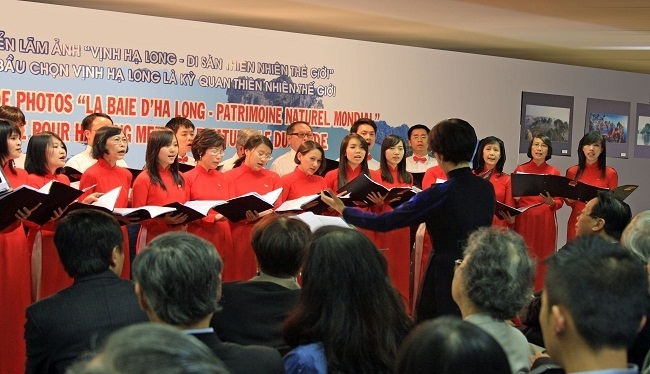
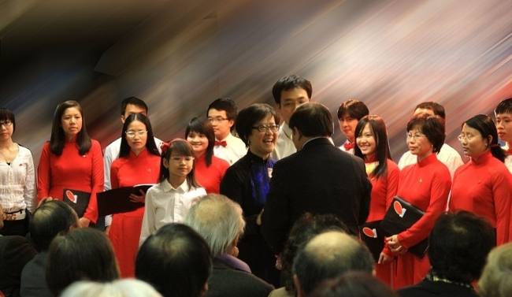
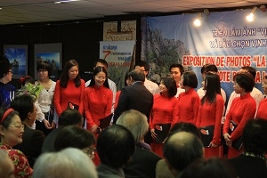
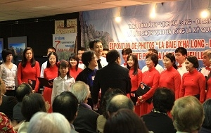

<!--
title: Triển lãm Vịnh Halong – HCQH chào mừng Bộ trưởng VHTT&DL 5.05.2012
author: Nguyễn Tích Kỳ
status: completed
-->

***Triển lãm Vịnh Halong***  
***Đón tiếp Bộ trưởng Hoàng xuân Anh  Bộ VHTT- DL***  
***TTVH 05.05.11***  

 

 

  

*Photo H.Đăng*

***Sau đây, mới nhận được ý kiến tâm huyết của Cẩm Tú Boulais. Chú gửi đến các cho em tham khảo nhận xét của một một thành viên chỉ đến với HCQH một mùa ngắn ngủi. Vì lý do gia đình và 3 em nhỏ, Cẩm Tú vẫn hy vọng trở về với HCQH một ngày gần…*** 

***(bản dịch)***
*Thứ tư. 11/05/2011 11:59*  

*Thân chào toàn thể các bạn,  
Nhiệt tình của các bạn đã chứng minh được, động cơ căn bản và chính nó đã là yếu tố quyết định cho sự đồng hành của chúng ta.*  
*Các bạn cho phép tôi được góp ý về buổi trình diễn vừa qua ngày (05/05/11)*  
*Trước tiên, tôi muốn nhấn mạnh yếu tố quyết định cho sự thành công và  huy hoàng của một dàn hợp xướng là sức mạnh truyền cảm của phối và hòa âm của nó.*  
*Mực độ điều chỉnh trầm bổng, cân đối, chín mùi hòa quyện với nguồn tình cảm của tác giả, đã đến từ sự cảm nhận của nhạc trưởng, chính là người có trách nhiệm dẫn dắt dàn hợp xướng.*  
*Người nhạc trưởng có trách nhiệm và bổn phận hướng dẫn diễn tấu của từng bè và nhịp điệu chung, nhằm thể hiện được ý tưởng của tác giả và độ nhạy cảm của từng nốt nhạc.*  
*Để đóng góp vào công trình này, mỗi chúng ta cần phát âm rõ ràng,  chuẩn mực, đúng nhịp điệu, phù hợp với sắc thái và tinh thần của bản nhạc. Diễn tấu của mỗi thành viên phải tôn trọng khuôn khổ chuẩn mực và sự điều chỉnh của nhạc trưởng.*  
*Con đường đi đến đỉnh cao của nghệ thuật rất khó khăn và vất vả. Có ít nhiều khoảng cách giữa hay và tuyệt vời. Nhưng xóa bỏ không gian này không phải là một chuyện dễ làm. Nó đòi hỏi một nỗ lực không nhỏ của mỗi chúng  ta, phải đi từ tập quán ca hát thường ngày của mỗi chúng ta, để đưa nó vào sự hòa đồng với đồng ca của tập thể, cuối cùng phải dung hòa nó dưới sự hướng dẫn và điều khiển của nhạc trưởng.*  
*Buổi trình diễn ngày 05/05/11, nói riêng về bè alto (bè mà tôi có góp phần chung bước) Tôi mạnh dạn nhận định là bè alto đã hát một cách ngập ngừng, nhịp điệu đôi khi chưa vững…phát âm rất tương đối ( nhất là những thành viên không có tập quán sử dụng tiếng Việt, trong đó có tôi).*  
*Tôi thiết nghĩ nói chung,  bè alto nói riêng còn phải trau chuốt nhiều hơn nữa…….*  

*Cẩm Tú Boulais*  

*thứ tư 11.05.2011.   11:45*