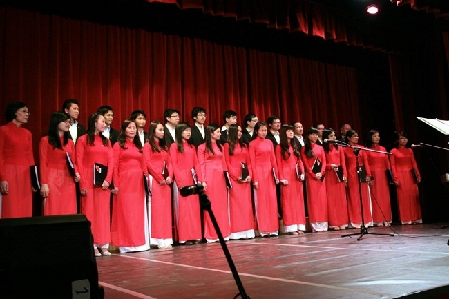
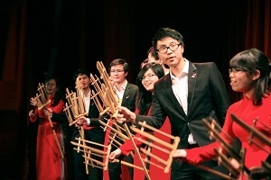
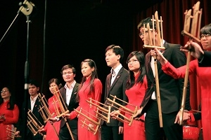

<!--
title: Giao lưu văn hóa Journée Culture du Monde Gertz-Armainvilliers. 23, 24 /03/2013
author: Nguyễn Tích Kỳ
-->

Tuần lễ Giao lưu văn hóa Journée Culture du Monde tại Thị Trấn Gertz-Armainvilliers. 23, 24/03/2013.

Chúng ta mới kết thúc buổi trình diễn tại Gretz-Armainvilliers một thị trấn phía Bắc, xa Paris khoảng 40km.

Nhân dịp tuần lễ 23 / 24 /03/2013 với chủ đề « Ngày Giao Lưu văn hóa quốc tế » bao gồm Hội thảo – Triển lãm mỹ nghệ – ca múa  - ẩm thực v.v…

Quốc gia tham dự  : Thái lan – Campuchéa – Mã Lai – Bouthan – và Việt Nam.

* Đại sứ VN Dương Chí Dũng trồng một cây lưu niệm trong vườn cây tại Val des Dames 
* Nhà sử học Pháp Alain Ruscio nói chuyện về  « Vietnam và con người ».
* Nhà Xã hội học Jean de Bannes chủ tịch Hội đoàn Akhal Teke France nói chuyện về giống ngưạ huyền thoại Akhal Teke của  Turkménistan. 

Đoàn thể tham dự :
* Việt võ Đạo trình diễn võ thuật
* Phượng ca trình diễn một khía cạnh nhạc dân tộc  
* Nhóm múa thanh niên VN sinh trưởng tại Pháp múa vũ điệu « Sông Hồng và Cửu Long » .
* Hợp ca Quê Hương kết thúc buổi giao lưu văn hóa.                                                                                                    

Tuy HCQH mới đi qua đợt hợp tác với HNVNTP thực hiện Tết cổ truyền Qúy Tỵ tại UNESCO.Hôm nay bạn mời HCQH đáp ứng một chương trình dài 60’ .Thời gian chuẩn bị chương trình tương đối ngắn. Trước sự kiện này chúng ta có thể tự hào tinh thần chiến đấu của HCQH.

Sơ lược chương trình :  
* Mở màn với hợp xướng « Ca ngợi Tổ quốc » của Hồ Bắc
* kế tiếp tiếp với « Trăng chiều » của Đặng hữu Phúc 
* Em Trung hiếu đơn ca một bài tình ca miền thượng « mùa Xuân về trên sông Dakrông » của Tố Hải. 
* M.Anh Giới thiệu nhạc cụ Tra n’gô thuộc gia đình nhạc gõ của vùng Đông-Nam-Á. và tập thể tre nứa biểu diễn bài Inh la ơi.  
Đây là lần đầu tiên cây đàn Tra n’gô xuất hiện tại tại đây và M.Anh giao lưu thêm một bài nhạc Pháp, « Ma Normandie » của Fédéric Bérat.  
 

* Dàn Hợp xướng tiếp tục với bài « Tiếng hát Biên thùy » 4 chương  của Tô Hải bao gồm: 
  * Chương Một : Núi rừng hùng vĩ của Tổ quốc.
  * Chương Hai : Tiếng hát của chiến sĩ biên phòng.   
  * Chương Ba : Tiếng gọi của Quê Hương.  
  * Chương bốn : Bảo vệ lao động – kiến thiết Tổ quốc.                                                                                                                                                                     

Khi giới thiệu nhạc cụ Việt Nam không thể nào quên giới thiệu cây Đàn Bầu đặc trưng của VN.. 

* và sau đó M. Anh trình diễn « Lên ngàn » của Hoàng Việt. 
* Khi Hợp xướng cất tiếng ca bài « Tổ quốc tươi đẹp » là một bản dịch sang tiếng Việt từ Opéra Nabuco một Opéra nổi tiếng của Guiseppe Verdi, mà toàn dân Ý chiêm ngưỡng như một bài quốc ca thứ hai của nước Ý vậy. Tràng pháo tay hầu như vô tận.                           
* HCQH kết thúc với bài « Việt nam quê hương tôi » của Đỗ Nhuận mà chính con trai của ông là Đỗ Hồng Quân  phối nhạc. 

HCQH đã trọn vẹn với lời hứa và công việc. Chúng ta có thỏa mãn 100% với những gì đã làm, đã thực hiện không? xin khiêm tốn trả lời : ta có thể làm tốt hơn và hoàn thiện hơn.

Bạn rất chu đáo đối với chúng ta, họ nói rất hài lòng đã đặt tin tưởng vào đúng người, đúng việc, đúng chỗ . Từ dịch vụ xe cộ, đến miếng ăn, nước uống, thâm chí bục đứng cho các em Nam, bạn rất chu đáo. Riêng phần âm thanh, tôi nghĩ chắc chắn là trong tương lai bạn sẽ cải thiện điều kiện thật tương xứng với sân khấu và không gian họ đang có. Chúng ta rất thông cảm, khó khăn và vấp váp của bạn.

Chúc các em một cuối tuần vui vẻ.  
TK  
Antony 24.03.2013