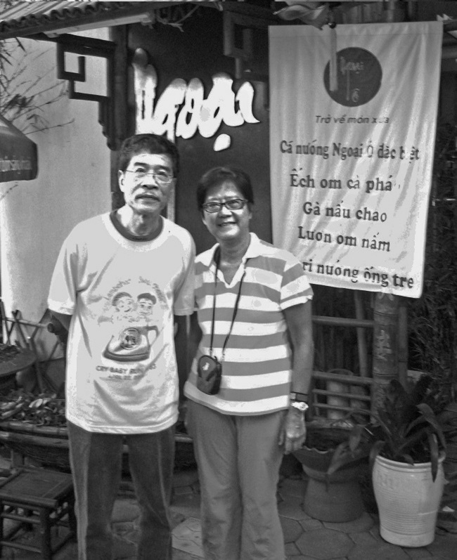
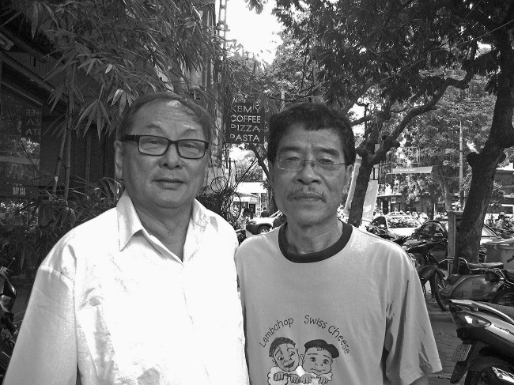
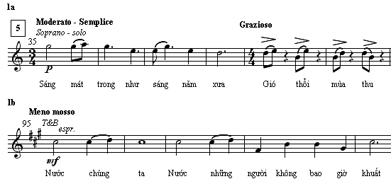
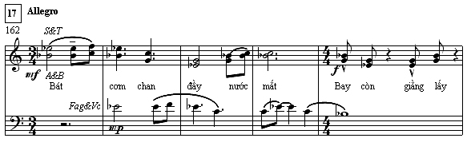
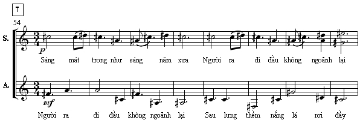
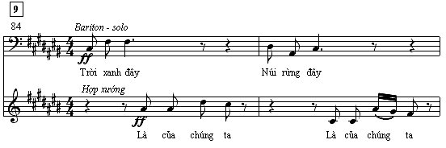
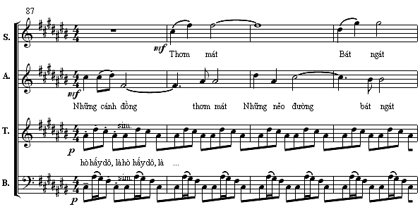
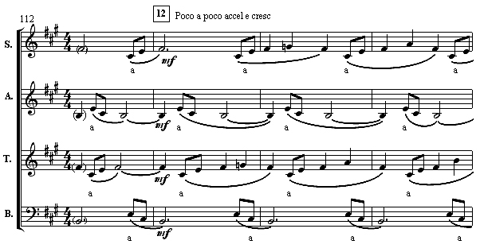

<!--
title: Buổi hoà nhạc Ngày Âm nhạc 3-9 của Hội Nhạc sĩ Việt Nam tại Nhà hát Lớn
author: Đạt
-->

27.08.2013

Kính gửi anh Đặng Hữu Phúc,

Với tư cách một người điều hành Ban Hợp Ca Quê Hương và cũng là người bạn đời của Ngân Hà. Chúng tôi rất cảm kích tình cảm và sự chia sẻ của anh đã dành cho chúng tôi và Ban Hợp Ca Quê Hương. Tôi đã có dịp gặp anh tại Hà nội năm 2011.

Thưa anh, chúng tôi đành chỉ được dự thính buổi hòa nhạc chất lượng này từ xa, sẽ được chuyển tải qua kênh truyền hình quốc tế của Việt Nam, anh ạ. Con đường nhệ thuật mênh mông và dài vô cùng tận, nhưng những tác phẩm âm nhạc với chất lượng nghệ thuật chuẩn mực cao sẽ luôn trường tồn với thời gian bất chấp thăng trầm của thời trang, đúng không anh. 

Xin trân trọng tặng anh tấm hình lưu niệm với Ngân Hà năm 2011 tại Hà nội.

Và tôi
Xin chân thành gửi đến anh lời chúc của một « fan không điều kiện » nghệ sĩ Đặng Hữu Phúc, thêm một thành công lớn buổi hoà nhạc Ngày Âm nhạc 3-9 của Hội Nhạc sĩ Việt Nam tổ chức tại Nhà hát Lớn Hà nội.
Chúc anh dồi dào sức khỏe và nhiều niềm vui.
Nguyễn Tích Kỳ
Hợp Ca Quê Hương
---
De : “Dang Huu Phuc” <phucnhacsy@yahoo.com>  
Date : jeu. 29/08/2013 16:29  
Objet : Chúc anh chị vui và mạnh khoẻ  
Xin cảm ơn anh Tích Kỳ và chị Ngân Hà. Chúc anh chị vui và mạnh khoẻ  

http://hoinhacsi.org/?q=taxonomy/term/1/830

---

De : “Dang Huu Phuc” <phucnhacsy@yahoo.com>  
Date : 25 août 2013 16:33  
Objet : Chuyển tiếp: Đất nước  

Mời các bạn đến dự buổi hoà nhạc Ngày Âm nhạc 3-9 của Hội Nhạc sĩ Việt Nam tại Nhà hát Lớn. Sẽ biểu diễn bản hợp xướng Đất Nước của Đặng Hữu Phúc, thơ Nguyễn Đình Thi, do chính ĐHP chỉ huy dàn Hợp xướng và Dàn nhạc nhà hát GH Nhạc vũ kịch VN (Có thêm dàn Hợp xướng trương Đại học sư phạm nghệ thuât trung ương tham gia)

Sau đây là bài viết về bản HX Đất nước của Nguyễn Thị Minh Châu

 “TÔI NHỚ NHỮNG NGÀY THU ĐÃ XA…”

Bài thơ Đất nước được khởi đầu khi nhà văn Nguyễn Đình Thi còn ở tuổi 24.
Hợp xướng Đất nước được định hình khi nhà soạn nhạc Đặng Hữu Phúc còn chưa bước sang tuổi 20.
Có một khoảng cách 25 năm giữa hai thời điểm trên – tính từ năm 1948 khi “người thơ” rời Hà Nội cháy khói lửa ngụt trời chưa được bao lâu để dấn thân vào cuộc kháng chiến trường kì, cho đến năm 1973 khi “người nhạc” vừa từ nơi sơ tán trở về với một Hà Nội thương tích đầy mình sau những trận mưa bom B52. Suốt một phần tư thế kỉ ấy đất nước chưa hề ngớt “súng nổ rung trời giận dữ”. Song mãi còn đó những “sáng mát trong” với niềm tin yêu bất diệt của tuổi trẻ, tuổi đôi mươi, tuổi của chính tác giả thơ và tác giả nhạc vào lúc họ thăng hoa cùng Đất nước.

Bài thơ Đất nước đã làm tốn bao nhiêu giấy mực của giới bình luận văn chương, của những cây bút chuyên nghiệp cũng như nhiều thế hệ thầy trò các trường phổ thông. Họ bàn về tính trữ tình thơ mộng mà hùng hồn hào sảng, về cái riêng sâu thẳm hòa dần vào cái chung lớn lao, về tính hoành tráng của nội dung khiến bài thơ mang tầm vóc một trường ca thu nhỏ, về sự độc đáo và mới mẻ trong nghệ thuật biểu hiện câu chữ góp phần cho bài thơ trở thành tác phẩm để đời…
Có những rung cảm xao xuyến, những chiêm nghiệm âm thầm, những hứng khởi mạnh mẽ và sáng bừng niềm tự hào chủ quyền dân tộc. Có những tiềm ẩn đường nét giai điệu trong dấu giọng và tiết tấu trong nhịp thơ, có những khung cảnh đa sắc rất gần với hội họa và những khuôn hình đầy tính phóng sự của nhiếp ảnh, có cả những góc nhìn ngược sáng hoặc mờ chồng không gian và thời gian rất gần với ngôn ngữ điện ảnh. Với tất cả những gì có thể tìm thấy ở đây, Đất nước được coi là một bài thơ lớn của một nhà thơ lớn.

Phổ nhạc cho tác phẩm tầm cỡ như thế quả là thử thách ghê gớm, nhất là đối với một sinh viên năm thứ hai trung cấp sáng tác. Đặng Hữu Phúc đã bỏ qua thể loại ca khúc “ngon ăn” và dễ phổ cập, để chọn hợp xướng bốn bè và dàn nhạc giao hưởng, một thể loại không dễ viết, ít có điều kiện dàn dựng, lại rất kén người nghe.

Và đây, Đất nước đã được “chuyển thể” sang ngôn ngữ âm nhạc nhiều bè và tính giao hưởng được thấy ngay từ bản phổ đầu tiên với phần đệm piano.

Trước hết phải kể đến tính đa dạng trong một tổng thể thống nhất, mà nói theo cách các nhà âm nhạc học, đó là sự tương phản cùng nguồn giữa các chủ đề âm nhạc. Bạn hãy trôi theo dòng chảy âm thanh tới các cung bậc cảm xúc khác nhau:

Dịu dàng, duyên dáng, thanh thoát, giai điệu “Sáng mát trong như sáng năm xưa” cất lên ở giọng nữ cao rồi hòa vào dòng chảy êm đềm của hợp xướng nữ [thí dụ 1a].

Chắc khỏe, mạnh mẽ, rộn ràng, giai điệu “Mùa thu nay đã khác rồi” của giọng nam trầm dẫn dắt vào không gian sống động theo nhịp điệu hò dô tập thể.

Trầm lắng, bi hùng là giai điệu “Nước chúng ta, nước những người chưa bao giờ khuất” [thí dụ 1b].
Thí dụ 1:

Đau đớn, xót xa trên nền nhạc run rảy, bất an là giọng nam trầm với lối hát nói đầy kịch tính: "Dây thép gai đâm nát trời chiều".
Uất hận, giận dữ là khi toàn bộ dàn hợp xướng cùng quả quyết “Bát cơm chan đầy nước mắt” [thí dụ 2]. Thí dụ 2:

 Đối chiếu các đường nét giai điệu, hẳn bạn nhận thấy sự tương đồng giữa các chủ đề khác nhau về tính cách. Đặc biệt, hợp xướng “Bát cơm chan đầy” còn được các nhạc cụ phụ họa bằng giai điệu “Sáng mát trong như sáng năm xưa”. Tiếp đến câu hát gãy khúc uất ức “Bay còn – giằng lấy” có thể được coi là biến dạng từ nét nhạc ngắt hơi hít thở hương cốm mới “Gió – thổi – mùa – thu” [so sánh thí dụ 1a và thí dụ 2]. Song, trái ngược với cảm xúc mùa thu êm ả của phần trình bày, đây tựa như phần tái hiện động với cao trào ầm ầm súng nổ ở dàn nhạc và dõng dạc tiếng thét: "Xiềng xích chúng bay không khóa được…", để sau đó các bè tầng tầng lớp lớp như nước vỡ bờ dồn dập dâng lên đỉnh điểm khúc khải hoàn "rũ bùn đứng dậy sáng lòa".

Đến đây có thể hiểu vì sao tính giao hưởng với các thủ pháp phát triển phức điệu, hòa thanh và phối khí lại được lựa chọn cho việc diễn giải một cách đa dạng các chủ đề âm nhạc kể trên.
Vai trò dàn nhạc được khẳng định ngay từ khúc mở đầu. Từ những âm thanh tinh khôi trong lành, bức tranh không lời về mùa thu được gắn kết với các giai điệu “Nước chúng ta” ở điệu tính thứ trong âm sắc kèn đồng và “Sáng mát trong” mang màu sắc trưởng ở kèn gỗ và dàn dây. Những nét nhạc ở hai tông màu tối – sáng là những khía cạnh khác nhau của một hình tượng đều được trình tấu lần đầu ở dàn nhạc. Còn khi cất lên ở giọng hát, chúng luôn được bao bọc bởi nhạc cụ với âm sắc, cường độ và mật độ khác nhau, cùng các thủ thuật đúp bè, đối bè, phụ họa…

Tư duy nhiều bè còn được biểu hiện qua cách phổ thơ linh hoạt, không chạy theo ngôn từ, không bị trói buộc vào sự minh họa lời thơ bằng một tuyến giai điệu duy nhất.

Các câu trong cùng khổ thơ có lúc được đặt chồng lên nhau, tạo nên hai bè độc lập với nhau cả nhạc và lời: “Người ra đi đầu không ngoảnh lại” được lồng với câu trước “Sáng mát trong như sáng năm xưa” hoặc câu sau “Sau lưng thêm nắng lá rơi đầy” [thí dụ 3].
Thí dụ 3:

 Câu thơ còn được bẻ đôi thành những lời đối đáp tựa như lối hò xướng – xô trong dân gian: giọng nam lĩnh xướng “Trời xanh đây” và “Núi rừng đây” để hợp xướng hùng hồn đáp lại “Là của chúng ta” [thí dụ 4].
Thí dụ 4:

Màn hò lao động ở đây thật ấn tượng nhờ nền trì tục “là hò hấy dô” của hợp xướng nam và những điểm nhấn vuốt lên của bè nữ cao để mở rộng không gian cho các từ “thơm mát, bát ngát” [thí dụ 5].
Thí dụ 5:

 Ý nhạc còn được phát triển tự do hơn bởi thủ pháp vocal ở cả bốn bè hợp xướng, trong đó thấy rõ tính phức điệu ở các cặp bè đuổi nhau theo chiều ngang (canon) và các hạt nhân đảo ảnh nhau theo chiều dọc [thí dụ 6].
Thí dụ 6:

 Có lần nhạc sĩ Đặc Hữu Phúc nói, đại ý “lời thơ tuyệt vời sẽ vượt thời gian, còn phần nhạc thì phải đợi người nghe đánh giá”. Thời gian sẽ trả lời và công chúng sẽ đánh giá chỉ khi tác phẩm được vang lên, mà đưa tác phẩm quy mô lớn đến với người nghe lại là một chuyện không nhỏ.
Xin trở lại với vài con số liên quan đến thời gian và việc dàn dựng tác phẩm:
Bài thơ Đất nước hoàn chỉnh vào năm 1955, tức là sau 7 năm.

Hợp xướng Đất nước hoàn chỉnh với tổng phổ chuyển soạn phần piano sang dàn nhạc giao hưởng hai quản vào năm 2009 và được Nhà hát Nhạc vũ kịch công diễn tại Nhà hát Lớn trong chương trình chào mừng Quốc khánh cũng cùng năm đó, nghĩa là sau 36 năm.

Năm nay, 2013, Đất nước lại vang lên trong chương trình chào mừng Ngày Âm nhạc 3-9 của Hội Nhạc sĩ Việt Nam tại Nhà hát Lớn. Sự kiện này tình cờ trúng vào 65 năm tuổi của bài thơ và 40 năm tuổi bản hợp xướng, đồng thời còn đúng dịp kỉ niệm 10 năm ngày mất của nhà văn Nguyễn Đình Thi và tròn 60 năm tuổi đời của nhà soạn nhạc Đặng Hữu Phúc.

Nguyễn Thị Minh Châu  
24-8-2013