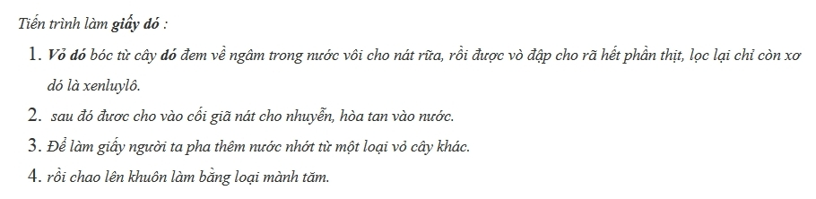
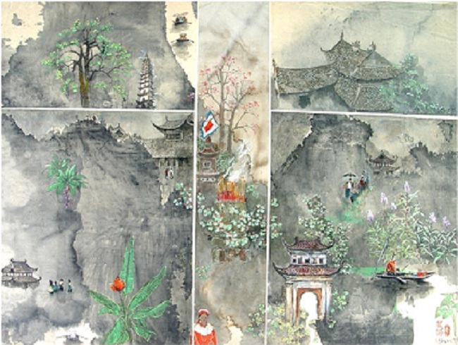

<!--
title: Giấy Dó và tranh giấy Dó
author: Nguyễn Tích Kỳ
status: completed
-->

#  GIẤY DÓ

***Giấy dó** là loại giấy đặc biệt của Việt Nam.*  
***Giấy dó** được chế tác thủ công từ vỏ của cây dó, một loại cây thân gỗ có nhiều trên rừng núi Việt Nam.*  
*Nhựa trong rễ **cây dó** cổ thụ trăm năm, đọng lại cho trầm, một loại hương liệu quí đắt hơn vàng.*

***Giấy dó** một lớp goi là **dó đơn**, nặng chừng 20gram/m2.  
nhiều lớp gọi là **kép**.
Tờ giấy dó, có thể hai lớp hoặc có khi dày đến bảy lớp.  
Giấy có thể bóc ra nhiều lớp.  
Tùy theo ý muốn người xử dụng.   
Giấy được tẩy rửa bằng cách ngâm nước vôi nên sợi xennlulo không bị xâm hại.  
Giấy dó tốt có màu trắng ngà, mịn mặt  
Giấy dó dùng để viết chữ nho, làm văn bản. Nó còn được gọi là « **giấy Nam** ». Giấy Nam mỏng một lớp đó là dó đơn  
Người ta gấp đôi tờ giấy lại đóng sách để viết hoặc dùng giấy đó in các văn bản khắc của nhà chùa.
Giấy **Vân Đằng** (mây bay) là loại giấy **dó** thửa (đặt hàng), khổ to vẽ mây thếp bằng vàng, bạc, để dùng cho nhà vua hạ sắc phong.  
Vì chế tác không có chất tẩy mạnh nên giấy khá bền vững.  
Nó không bị tự hủy nếu luôn được giữ khô ráo.*

*Những **sắc phong** còn cất giữ được ở các đình làng, để trong ống gỗ từ thời Lê, Nguyễn, Tây Sơn tính ra cũng ba bốn trăm năm bầy giờ giở ra trông vẫn mới nguyên.  
Những bản kinh phật khắc gỗ in trên **dó** hiện còn cất giữ trong các chùa vẫn hằn nguyên nét chữ và hình minh họa (kèm theo ở phần trên) là một minh chứng khách quan về sự bền vững của giấy.*

*Có **dó** rồi, nhưng để in tranh người ta làm ra giấy **dó điệp**.
Giấy dó điệp là giấy dó được quét một lớp hồ trộn với bột vỏ con điệp lên bề mặt để in tranh.*

Có **dó** rồi, nhưng để in tranh người ta làm ra giấy dó điệp.  
Giấy **dó điệp** là giấy dó được quét một lớp hồ trộn với bột vỏ con **điệp** lên bề mặt để in tranh.

***Điệp** là vỏ một loài nhuyễn thể sống ở vùng nước lợ. Con **điệp** chết, vỏ ngâm dưới nước lâu năm dần mục nát, đọng lại thành từng lớp trầm tích. Người ta khai thác vỏ điệp đó lên, lọc bỏ lớp cặn, cho vào cối giã lấy ra thứ bột trắng ngà lấp lánh sắc xà cừ. Người đem bột đó nắm thành từng nắm to, phơi khô cất giữ.*

*Khi cần làm **dó điệp** thì dùng dao thái **điệp** xuống nồi hồ loãng rồi khoắng lên. Dùng chổi thông quét hồ trộn **điệp** đó lên mặt **dó**.*

*Cuối cùng đem áp tờ giấy lên tường nhà hong nắng cho khô rồi bóc ra cất đi dùng dần.  
**Dó điệp** là giấy làm riêng chỉ để in tranh **Đông Hồ**.  
Kích cỡ giấy Trước đây chỉ 20x30cm hoặc 25×35.  
Loại nhỏ nhất 15×25 còn được gọi là lá mít.* 

Ngoài dùng viết chữ và in tranh, giấy **dó** còn dùng để bồi mặt nạ, đắp con giống,
Trên đầu cột ở các cổng đình thường có con sấu (con vật linh, giống con chó nhỏ, hàm nghê, đứng hoặc phủ phục trên đỉnh cột, hướng ra ngoài như để gác cổng) được bồi từ **giấy bản** (đây là loại giấy ít dó, pha nhiều bột giấy).

Người ta còn dùng bọt mật, nước mật mía trộn với vôi đã tôi để vài năm dẻo quánh, đã lọc sạch cặn, rồi nhào quấy cho kĩ để tạo thành một loại keo phết lên giấy **dó**, bồi dần từng lớp.
Những con vật đáp bằng giấy, phơi mưa nắng, mà vẫn bền vững hàng trăm năm.
Trước đây giấy dó chưa thành vật liệu trong hội họa mà chỉ dùng đế in (tranh dân gian Đông Hồ). Cũng có một số họa sĩ đã dùng **giấy dó** để kí họa lấy tài liệu, nhưng chỉ là thử chơi mà không để ý nhất là khi khổ **giấy dó** còn nhỏ .

Khoảng ba mươi năm (sau 1975) trở lại đây, giấy dó được một số họa sĩ ở Hà Nội dùng thử để vẽ tranh và dần dần phát hiện ra tính ưu việt của chất liệu này. Do nhiều người vẽ và có những bức tranh đẹp. nên dần được mọi người biết đến. Giấy dó được chú ý và dần trở nên có giá trị. Thuật ngữ tranh **giấy dó** được hình thành. Khi Việt Nam giao lưu với thế giới, khách du lịch đến nhiều và tìm mua tranh **giấy dó** cũng là nguồn kích thích mạnh.Thế là một số họa sĩ đã lựa chọn dó, chuyên sáng tác trên chất liệu này.

Từ đấy hội họa Việt Nam hình thêm một chất liệu mới cho sáng tác là giấy dó. Khi có nhu cầu thị trường, giấy dó được người sản xuất nới rộng khuôn khổ lên 50×70, 60×80 và 80x120cm.
Vẽ trên dó người ta có thể dùng bột màu hoặc one goat.
Nhưng phải dùng loại dó dày kép 4 hoặc 5 trở lên. Cách vẽ này thường bít kín mặt giấy.
Còn dùng màu nước (aquaren), mực nho và thêm các màu lấy từ thiên nhiên như nước vỏ cây vang, cây nhội, củ nâu, nước chè, cà phê, hoa hiên, quả dành v v…
vẽ kiểu nhuộm dần, vẽ xong còn thấy mặt giấy thì có thể dùng lọai dó mỏng một lớp. Vẽ xong nhìn mặt tranh trong trẻo.
Với tôi đó là cách khai thác được cao nhất giá trị của **Dó**.

*Tranh vẽ trên giấy dó bền vững với thời gian. Dó giữ được màu, để càng lâu màu càng thắm.    
Là loại giấy dễ thấm nước nên cùng với thời gian, các hạt màu li ti thẩm thấu sang nhau tạo thêm sắc quí cho tranh.*

*ĐỖ ĐỨC*

  
***Chùa Hương**. Tranh giấy Dó - Đỗ Đức*

