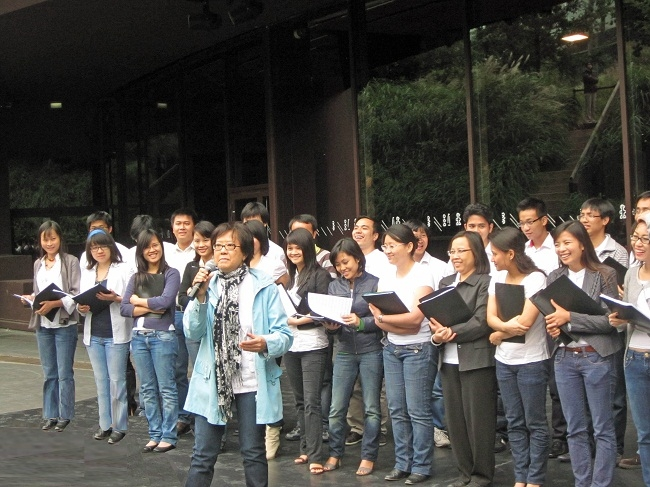
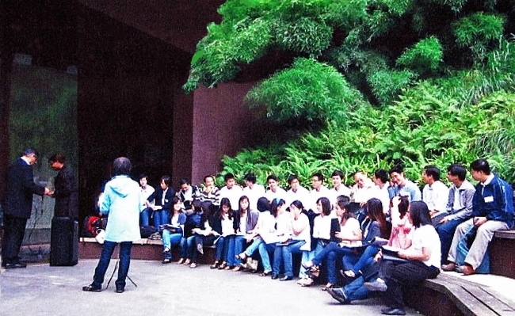
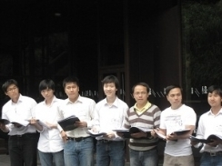
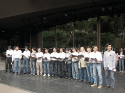
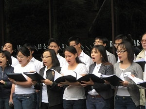
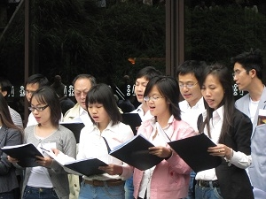
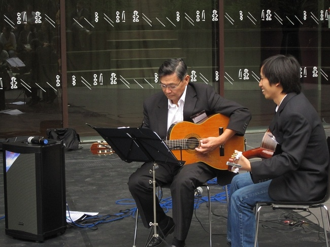
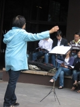
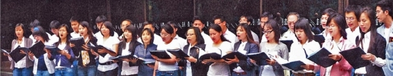

<!--
title: Kinh nghiệm buổi tập ngoài trời có khán giả Quai Branly 19.08.2010
author: Nguyễn Tích Kỳ
-->
Khó khăn vượt qua, từ buổi tập ngoài trời có khán giả tại Bảo Tàng Quai Branly 19.08.2010

Toàn bộ HCQH không nói ra lời, nhưng rất lo lắng vì chưa bao giờ tập luyện ngoài trời, hơn nữa với sự có mặt của khán giả như hôm nay.

Khi chị nhạc trưởng giới thiệu : « Thưa qúy vị, hôm nay không phải là một buổi trình diễn, mà chỉ là một buổi tập bình thường của Hợp ca Quê Hương đặc điểm là sự có mặt của qúy vị. Mong quý vị châm chước những vấp váp có thể » thật  giản dị, hiền lành mà vững chắc như những bước chân của người nông dân, buổi sáng ra đồng.

Buổi tập, được ôn lại « Nhạc rừng của Hoàng Việt » « Tự nguyện của Trương Quốc Khánh » bài « Du kích Sông Thao của Đỗ Nhuận » và chuyển tiếp bằng một ca khúc giao lưu « Nabucco của Guiseppe Verdi » đã chuyển ra tiếng Việt.
Rất không khí với những tràng vỗ tay sôi động, càng thêm hương phấn cho buổi tập trước công chúng này.

Tốp ca nam tiếp nối với bài « Bác đang cùng chúng cháu hành quân của Huy Thục » và « Đêm Trường Sơn nhớ Bác của nhạc Trần Chung – thơ của Nguyễn Trung Thu». Đến bài « Người Hà Nội của Nguyễn Đình Thi » tôi rất hồi hộp lo ngại vì các em mới đi nghỉ hè về, thời gian ôn bài khá tượng trưng.

Tôi sung sướng đến sững sờ, các em vẫn bổng trầm, phong độ.
Hình như bài này đã đi vào máu của các em rồi thì phải.

 

Khi vang lên « Làng tôi xanh bóng tre, từng tiếng chuông ban chiều…của Văn Cao » bình dị và thích hợp với hoàn cảnh. Các em say sưa trình bày, bè nam cao (ténor) rất mượt mà hòa quyện với bè trầm (basse), thật là bất ngờ mà cũng rất ấn tượng. Tôi thầm nghĩ, trong khó khăn các em đã lớn lên rồi.

Mùa này, HCQH sẽ có thêm Thanh Dũng một cây đàn Guitare cùng với Quốc Việt cũng một cây guitare của giọng nam cao (ténor). Chúng ta sẽ còn nhiều bất ngờ với hai tay đàn guitare này.
Những tràng pháo tay không ngớt, khán giả bình tĩnh chờ đợi, một tiếng đồng hồ đã trôi qua, không một ai đứng dậy ra về. Chúng tôi vui mừng đến ngỡ ngàng.
Chị nhạc trưởng một lần nữa cảm ơn khán thính giả.

Tôi vui mừng, trước sự quyết tâm và gắn bó của các em đã giúp HCQH vượt qua chướng ngại đáng kể… 
và thầm hát « quê hương là chùm khế ngọt… »
 
NTK
19.08.2010
 
## Thư cảm ơn của Bảo Tàng Branly 

Envoyé : jeudi 2 septembre 2010 11:58
À : Nguyen, Nganha; 
Objet : Bilan Scènes Ouvertes au musée du quai Branly – été 2010
 
Bonjour à tous,

Je tiens à vous remercier très chaleureusement pour votre participation aux premières Scènes Ouvertes au musée du quai Branly.

Le musée et le public ont pu apprécier vos propositions, menées avec enthousiasme et professionnalisme tout au long de l’été. Chacune de vos interventions a permis au public de découvrir d’autres facettes des cultures représentées au musée, les retours que j’ai eu, de la part du public, comme des agents présents lors de vos prestations, ont été très positifs.

Je vous à tous une très bonne continuation,

Bien à vous,
Elodie Rivoire

Chargée de médiation tout public  
Direction des publics
musée du quai Branly  
222 rue de l’Université – 75343 Paris Cedex 07  
Tel : 01.56.61.70.07  
Fax : 01.56.61.71.33
 