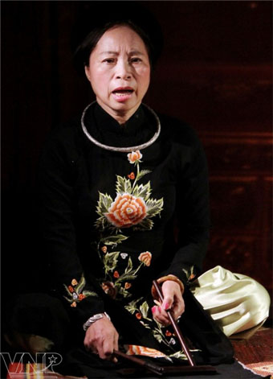
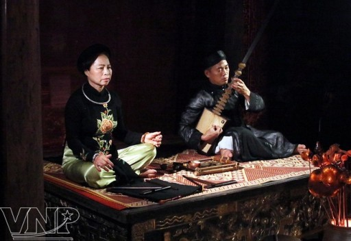
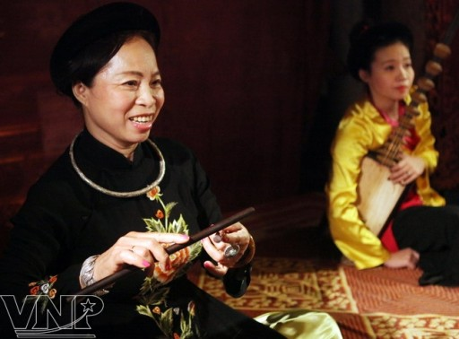
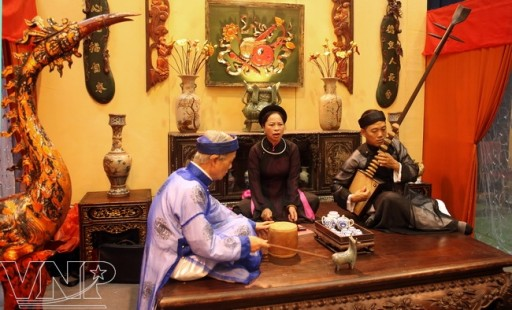
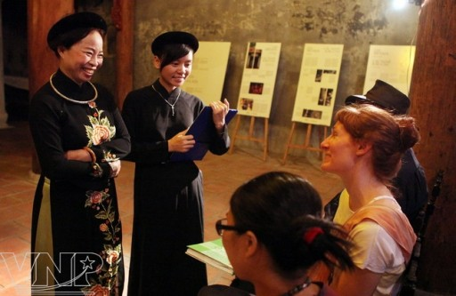
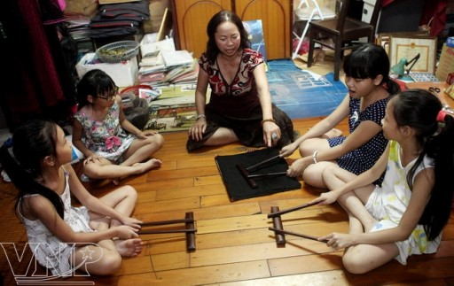
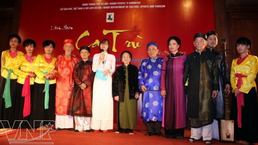

<!--
title: Bạch Vân ba mươi năm giữ lửa Ca Trù
author: Nguyễn Tích Kỳ
status: completed
-->

*Thứ tư, 18/09/2013, 09:22:50 AM*
    
*Gần 30 năm đắm đuối theo nghề, hi sinh cả hạnh phúc riêng tư, nghệ sỹ Bạch Vân, người đào nương nối tiếng bậc nhất đất Hà thành, đã góp sức làm sống lại ca trù, di sản văn hóa thế giới nổi tiếng của Việt Nam.
Vào một buổi tối, tại ngôi đình cổ Kim Ngân ở số 42-44 phố Hàng Bạc (Hà Nội), đêm diễn của Câu lạc bộ Ca trù Hà Nội diễn ra như thường lệ. Ngay giữa chánh điện, một người đào nương trạc ngoài 50 tuổi, nét mặt đượm buồn, mình mặc áo dài nhung, ngồi xếp bằng chỉn chu trên chiếu, hai tay nhịp nhàng gõ phách và đắm đuối hát. Cạnh đó là một kép đàn và một quan viên ngồi đệm đàn và giữ nhịp cho tiếng hát của người đào nương.*

  
*Bao nhiêu năm nay, đào nương Bạch Vân gắn bó với những đêm ca trù ở đình Kim Liên trong khu phố cổ Hà Nội*

*Đêm càng về khuya, giọng hát mộc của người đào nương hòa cùng tiếng đàn đáy, nhịp trống chầu như càng lay động lòng người, gợi nhớ về hình ảnh của một đêm hát cửa đình xưa kia.
Người đào nương tài danh ấy chính là Bạch Vân, người đã gắn bó với ca trù gần 30 năm nay. Bà sinh năm 1957, quê ở Thanh Chương, Nghệ An. Sinh ra trong một gia đình có tinh thần Nho giáo truyền thống, nên ngay từ nhỏ, bà đã được cha hướng dẫn cách ngâm thơ Đường, mẹ dạy cho cách hát những khúc dân ca xứ Nghệ.
Bạch Vân bắt đầu học ca trù vào những năm 80 của thế kỷ trước. Con đường dấn thân vào nghiệp ca trù của bà cũng lắm gian nan. Gần chục năm trời, bà cất công đi tìm và nghiên cứu các tài liệu cổ nói về ca trù; lặn lội tìm gặp các nghệ nhân nổi danh trong làng ca trù xưa ở Hà Nội, Hải Dương, Nghệ An, Hà Tĩnh… để “tầm sư học đạo”.
Bà may mắn được các nghệ nhân nổi tiếng trong làng ca trù Việt Nam như cụ Quách Thị Hồ, cụ Nguyễn Thị Phúc, cụ Chu Văn Du và cụ Phó Thị Kim Đức mở lòng truyền nghề.
Nhờ đó mà Bạch Vân học được ở các cụ mọi kỹ thuật của ca trù, từ những cách cơ bản như lấy hơi, nhả chữ, chuốt phách… cho đến những kỹ thuật khó, những bài hát cổ, rồi đến cả cách thể hiện thần thái trong khi biểu diễn.
Đắm đuối với nghệ thuật ca trù, Bạch Vân bàn với người thầy của mình là cụ Chu Văn Du, Phó quản ca giáo phường Khâm Thiên xưa, thành lập Câu lạc bộ Ca trù Hà Nội.
Năm 1991, Câu lạc bộ ra đời với gần 200 hội viên, trở thành câu lạc bộ ca trù đầu tiên ở Việt Nam. Từ khi có Câu lạc bộ, Bạch Vân dồn hết tâm sức để mở mang, phát triển nó. Bà tự bỏ tiền túi tổ chức các buổi biểu diễn miễn phí, đích thân đi mời và đưa đón các nghệ nhân tới biểu diễn. Bà còn mở cả lớp dạy ca trù dành cho lớp trẻ. Không những thế, Bạch Vân còn giúp Cục Nghệ thuật Biểu diễn của Bộ Văn hóa, Thể thao & Du lịch tổ chức Liên hoan Ca trù, tổ chức các buổi hội thảo về ca trù.
Đặc biệt, bà đã đóng góp nhiều công sức cũng như tài liệu giúp Cục Di sản Văn hóa hoàn thiện hồ sơ về di sản ca trù để đệ trình lên UNESCO, để rồi năm 2010, ca trù chính thức được UNESCO công nhận là Di sản Văn hóa Phi vật thể cần được bảo vệ khẩn cấp.
Không chỉ học hỏi kinh nghiệm từ các nghệ nhân đi trước, nghệ sỹ Bạch Vân còn tìm tòi nghiên cứu học tập bằng con đường chính thống. Bà đã bảo vệ thành công luận án thạc sĩ về ca trù tại Viện Nghiên cứu Văn hóa và sắp tới sẽ bảo vệ luận án tiến sĩ tại Học viện Khoa học Xã hội.
Với những đóng góp không mệt mỏi cho nền nghệ thuật ca trù, năm 2012, nghệ sĩ Bạch Vân vinh dự được Nhà nước phong tặng danh hiệu Nghệ sĩ Ưu tú. Mặc dù đã dành được nhiều thành công cũng như danh hiệu cao quý nhưng nghệ sỹ Bạch Vân vẫn đắm đuối với sự nghiệp bảo tồn và phát triển của ca trù, bởi hơn ai hết bà hiểu rằng, ca trù là di sản cần được bảo vệ khẩn cấp của nhân loại./.*

***Ca trù hay còn gọi hát ả đào, là loại hình nghệ thuật âm nhạc thính phòng truyền thống của Việt Nam, xuất hiện vào khoảng cuối thế kỉ XV đầu thế kỷ XVI và phát triển mạnh vào những năm 30 của thế kỷ trước. Ca trù là sự phối hợp độc đáo và đỉnh cao giữa thi ca và âm nhạc, từng là một loại hình âm nhạc trong cung đình, được giới quý tộc và trí thức yêu thích. Năm 2009, ca trù được UNESCO công nhận Di sản Văn hóa phi vật thể cần được bảo vệ khẩn cấp.***

*Bach Vân, une figure du chant des courtisanes (Ca trù)*

***Bạch Vân**, une des fameuses chanteuses du **Ca trù de Thăng Long** (Hanoi actuelle), a passé près de 30 ans et même sacrifié son bonheur privé pour la relance du **Ca trù (« chant des courtisanes »)**, reconnu patrimoine culturel immatériel de l’humanité par l’UNESCO.*

*Une soirée, nous sommes venus dans l’ancienne maison communale de Kim Ngân, 42-44 rue Hàng Bac, à Hanoi, où se tenait un spectacle de Ca trù organisé par le Club de Ca Trù de Hanoi. Une chanteuse au visage triste portant une robe de velours était assise sur une natte au milieu de la salle. Elle jouait avec passion du phach (sorte de castagnettes de bambou) et chantait des paroles mélodieuses. Bien qu’âgée d’environ 50 ans, sa voix était parfaite. A côté d’elle se trouvait un accompagnateur et un percussionniste, qui aident à garder le rythme du chant.*
*Plus la soirée avançait, plus la voix de la chanteuse était enivrante. Les douces et délicates mélodies, les sons de l’instrument day et du tambour châu recréaient la véritable essence du Ca trù et rappelait l’image d’un spectacle à la cour royale d’antan.*
Bach Vân est attachée au Ca trù depuis près de 30 ans. Né en 1957 dans une famille confucianiste du village de Thanh Chuong, province de Nghê An, elle a appris très tôt à réciter des poèmes Tang par son père et à chanter des chansons folkloriques du pays de Nghe An par sa mère.

*Bach Vân a commencé à chanter le Ca trù dans les années 1980 et depuis, sa vie est attachée à cet art vocal. A ses débuts, Bach Van a été confrontée à d’énormes difficultés qui, cependant, ne l’ont pas découragée. Elle a recherché des documents anciens et appris les techniques de chant auprès d’artistes chevronnés de Hanoi, Hai Duong et Hà Tinh. Et ses nombreux efforts ont été récompensés. Ses professeurs ont été Quach Thi Hô, Nguyên Thi Phuc, Chu Van Du et Pho Thi Kim Duc.*
*« Le Ca trù, aussi appelé chant a dao, est une forme d’art traditionnel de musique de chambre apparu à la fin du XVe siècle et au début du XVIe siècle, développé dans les années 1930. Le Ca trù, combinaison unique de poésie et de musique, était joué à la cour royale, et était très prisé de l’aristocratie et de l’intelligentsia. En 2009, il a été reconnu par UNESCO comme « patrimoine culturel immatériel nécessitant une sauvegarde d’urgence »*
*Elle est à l’initiative de la création du club de Ca Trù de Hanoi avec l’espoir de dynamiser ce chant. En 1991, le club a été officiellement créé avec près de 200 membres, devenant ainsi le premier du genre au Vietnam. Depuis, Bach Vân a fait de grands efforts pour le développer. Elle a même payé de sa poche des spectacles gratuits et elle a invité des artistes. Pour assurer la relève, Bach Vân a ouvert des cours pour les jeunes et a aidé le Département des Arts du spectacles, relevant du ministère de la Culture, des Sports et du Tourisme, à organiser des festival et colloques sur le Ca trù.*

*Surtout, elle a réalisé et recueilli des documents pour aider le Département du Patrimoine culturel à compléter le dossier du Ca trù afin de le soumettre à l’UNESCO qui a reconnu officiellement en 2009 cette forme de chant traditionnel comme un patrimoine culturel immatériel nécessitant une sauvegarde d’urgence.Bach Vân a aussi soutenu avec succès une thèse de maîtrise à l’Institut de recherche sur la culture et est en train de préparer une thèse de doctorat à l’Institut des Sciences sociales. Pour ses grandes contributions, ellea reçu le titre d’«Artiste Emérite».*

  
*Depuis d’une trentaine d’années, Bach Vân se produit dans la maison communale Kim Ngân, dans le vieux quartier de Hanoi.*

  
*Plus de la moitié de sa vie, elle a sacrifié son bonheur personnel à sa passion, le Ca trù.*

  
*Échanges entre Bach Vân et des spectateurs étrangers à la maison communale Kim Ngân.*

 

   
*Elle enseigne aussi son art aux enfants.*

  
*Bach Vân et des artistes célèbres au festival de Ca trù de Hanoi, en 2012.*

*Article: Vinh Hung – Photos: Trinh Van Bô*  
*Source VNP*

