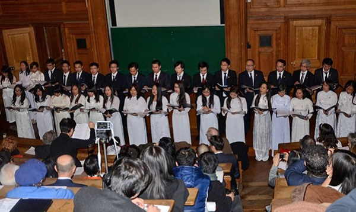

<!--
title: Hợp Ca Quê Hương tại giảng đường Đại Học Sorbonne
author: Tich Ky
-->

BÍCH HÀ/PARIS (VIETNAM+) LÚC : 19/01/14 09:35

*“Hợp ca Quê hương” biểu diễn các bài hát cách mạng hào hùng tại giảng đường Đại học Sorbonne. (Ảnh: Bích Hà/Vietnam+)*
 
*Tối 18/1, tại giảng đường trường Đại học Paris Panthéon-Sorbonne, tại thủ đô Paris, ***“Hợp ca Quê hương”*** đã trình diễn chương trình nghệ thuật đặc sắc với nhiều tiết mục được dàn dựng công phu mang đậm hương vị Việt Nam, để lại những cảm xúc sâu lắng cho người xem và được bạn bè Pháp đón nhận nồng nhiệt.
Đây là hoạt động chào mừng thành công của hội thảo ***“Pháp-châu Âu-Việt Nam từ năm 1954”*** vừa diễn ra trong ba ngày từ 16-18/1 tại Paris.
Chương trình gồm một số tiết mục đồng ca các bài hát cách mạng như “Việt Nam quê hương tôi”, “Giai điệu Tổ quốc”, “Du kích sông Thao”…, các giai điệu dân ca quen thuộc và một số tiết mục biểu diễn nhạc cụ dân tộc.
40 thành viên của dàn hợp xướng là những giọng ca không chuyên, nhưng “Hợp ca Quê hương” vẫn chinh phục người xem bởi chất lượng nghệ thuật khá cao nhờ quá trình luyện tập bền bỉ. Khán giả Pháp còn đặc biệt bị thu hút bởi trang phục áo dài truyền thống duyên dáng của các thiếu nữ trong dàn hợp xướng.
Thật khó để diễn tả cảm xúc của các khán giả Việt Nam khi những bài hát kinh điển của nền âm nhạc cách mạng được vang lên một cách hào hùng trong giảng đường trường đại học Sorbonne danh tiếng có trên 300 năm tuổi. “Một cảm giác vừa xúc động vừa tự hào”, một khán giả tâm sự.*
 
*Theo bà **Nguyễn Ngân Hà**, phụ trách dàn hợp xướng và cũng là người chỉ đạo nghệ thuật, các thành viên của “Hợp ca Quê hương” chủ yếu là các bạn sinh viên đang sinh sống và học tập tại Paris và các vùng phụ cận, họ tham gia luyện tập và biểu diễn một cách hoàn toàn tự nguyện. 
Đa số chưa qua trường lớp đào tạo âm nhạc, nhưng họ có chung niềm say mê là giới thiệu văn hóa Việt Nam với công chúng Pháp và có chung tình yêu quê hương đất nước.*  
*Bà Nguyễn Ngân Hà cũng cho biết được thành lập năm 2009, “Hợp ca Quê hương” đã tham gia nhiều sự kiện lớn như kỷ niệm 1000 năm Thăng Long-Hà Nội, các festival hợp xướng tại nhiều nước trên thế giới và đều để lại dấu ấn.  
Nhân Năm giao lưu Việt Nam-Pháp 2014, đội hợp xướng đang nỗ lực luyện tập để có thể giới thiệu và quảng bá nhiều hơn nữa nền âm nhạc đặc sắc của Việt Nam đối với công chúng và bạn bè Pháp./.*
  
L’Ensemble vocal Quê Hương s’est produit dans la soirée du 18 janvier dans l’Amphi de Gestion de l’Université Paris I Panthéon-Sorbonne, à Paris.
 
*Au programme : les œuvres de la musique traditionnelle et révolutionnaire du Vietnam. Le spectacle a laissé de profondes émotions chez le public et a été reçu chaleureusement par les amis français.*
*Il s’agit d’une activité en l’honneur du succès du colloque international  **« La France, l’Europe et le Vietnam depuis 1954 »**  qui s’est déroulé du 16 au 18 janvier à Paris.
L’Ensemble vocal Quê Hương s’est consacré essentiellement à l’interprétation des œuvres vocales sacrées de la révolution vietnamienne, à savoir “Viet Nam quê hương tôi” (Vietnam mon pays, du compositeur Đỗ Nhuận), “Giai điệu Tổ quốc” (Mélodie de mon pays, du compositeur Trần Tiến), “Du kích sông Thao” (Les partisans du fleuve Thao, du compositeur Đỗ Nhuận), pour ne citer qu’elles.*
*Le chœur se composait d’une quarantaine de choristes amateurs. Cependant, l’Ensemble vocal Quê Hương a conquis les spectateurs par la bonne qualité artistique grâce à les nombreuses et longues répétitions effectuées pour préparer l’événement. Les spectateurs français ont été attirés particulièrement par la tunique cintrée grâcieuse des filles membres de l’Ensemble. Il n’est pas facile de décrire les émotions des spectateurs vietnamiens au moment où les chants révolutionnaires résonnent sous les voûtes de l’amphithéâtre de la prestigieuse université de la Sorbonne.*
 
*Selon **Mme Nguyễn Ngân Hà**, chef de chœur, les membres de l’Ensemble vocal Quê Hương sont pour la plupart des étudiants vietnamiens faisant leurs études à Paris et dans ses environs. Ils font des répétitions et participent à des représentations de façon bénévole. Bien que n’étant pas des chanteurs professionnels, ils ont tous à coeur de présenter la culture vietnamienne au public français, eux qui se sont réunis en raison de leur fibre patriotique.*
*Fondé en 2009, l’Ensemble vocal Quê Hương a participé à de grands événements : la célébration du Millénaire du Thang Long-Hanoi à l’Hôtel des Invalides, les divers festivals de concerts dans le monde… Là où il s’est produit, il a laissé de profondes émotions. A l’occasion de l’Année croisée du Vietnam en France 2014, l’Ensemble vocal Quê Hương” effectue un travail intensif afin de mieux faire connaître au public français les œuvres musicales originales du Vietnam.   -VNA*
 
 
 
 
