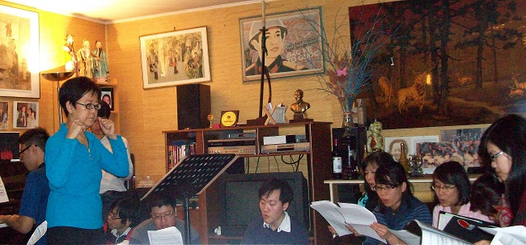
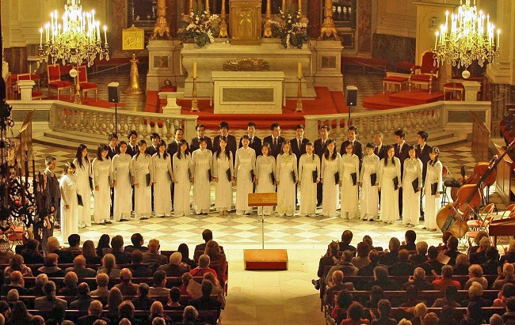

<!--
title: Hợp ca Quê hương – Tiếng lòng của những người con ở xa Tổ quốc
author: Tich Ky
-->

#Hợp ca Quê hương – Tiếng lòng của những người con ở xa Tổ quốc

13:10 | 28/01/2014

*(ĐCSVN)* – **Họ là những người Việt sinh sống tại Pháp ở các độ tuổi khác nhau, ngành nghề khác nhau, cùng hợp nhau lại vào mỗi dịp cuối tuần để cất vang lời ca tiếng hát về quê hương, đất nước. Đó chính là những con người bình dị, làm nên “Hợp ca Quê hương”. **

**Có một dàn hợp ca như thế!**

Khi tôi đang nung nấu những ý định cho bài viết của mình về một dàn hợp ca của cộng đồng người Việt Nam tại Pháp, chuyên hát những ca khúc về cách mạng, về quê hương, đất nước, thì tôi may mắn liên lạc được với vợ chồng cô chú Nguyễn Tích Kỳ và Nguyễn Ngân Hà qua một người bạn. Đó là hai trong số những người có đóng góp nhiều nhất trong việc sáng lập nên “Hợp ca Quê hương”.

Cô Nguyễn Ngân Hà (áo xanh) cùng các thành viên trong Hợp ca trong một buổi tập tại nhà (Ảnh do Hợp ca Quê hương cung cấp)
Cô Nguyễn Ngân Hà được sinh ra tại Pháp. Đến năm 2 tuổi, cô được gia đình đưa về Việt Nam. Sau đó, đến năm 12 tuổi, cô trở lại nước Pháp và sống chủ yếu tại Pháp từ đó cho đến bây giờ. Cô có 31 năm làm việc tại Tổ chức Giáo dục, Khoa học và Văn hóa của Liên hiệp quốc (UNESCO) và nay đã nghỉ hưu được 2 năm.

Về ý tưởng thành lập “Hợp ca Quê hương”, cô Hà kể: Trong thời gian cô làm ở UNESCO, cô có quen một người bạn – đó là một người rất say mê và hiểu biết về nền âm nhạc Việt Nam. Người bạn này đã giới thiệu cho cô chú một số bạn sinh viên Việt Nam thích ca hát. Rồi tất cả về nhà cô ăn cơm, hát hò cho vui, sau đó mọi người bắt đầu tập bài “Người Hà Nội”. Đó là bước khởi động cho việc thành lập “Hợp ca Quê hương” (gọi tắt là Hợp ca) vào tháng 4/2009 sau đó. Bởi vậy, việc thành lập Hợp ca hoàn toàn bắt nguồn từ cá nhân cô chú và một vài người bạn, chứ không có cơ quan hay tổ chức nào hỗ trợ. Ban đầu, nhóm không có chỗ tập nên tập luyện ngay tại nhà cô chú. May mắn là chỉ vài tháng sau đó, Đại sứ quán Việt Nam tại Paris tổ chức mừng Quốc khánh 2/9, nhóm đã được mời đến dự. Trong phần văn nghệ, cả nhóm đã hát bài “Người Hà Nội”. Từ đó, nhóm được bà con kiều bào chú ý đến, Đại sứ quán và Trung tâm văn hóa Việt Nam đã hỗ trợ nhóm về địa điểm tập.

Sau đó, đến năm 2010, vào dịp khu di tích lịch sử Hoàng thành Thăng Long được công nhận là di sản văn hóa thế giới và Việt Nam tổ chức Đại lễ 1000 năm Thăng Long – Hà Nội, Hợp ca Quê hương được mời đi biểu diễn ở nhiều nơi, trong đó có nhiều địa điểm là tiêu biểu cho văn hóa Pháp như Nhà Thờ Invalides, Bảo tàng Quai Branly,… Khi biểu diễn tại những nơi như vậy, mỗi thành viên của nhóm không chỉ hát bằng tình yêu quê hương mà còn bằng cả sự tự hào về dân tộc, tự hào khi mang được hình ảnh của Việt Nam đến với bạn bè thế giới. Bài “Người Hà Nội” sau đó được phát đi phát lại nhiều lần trên kênh VTV4. Đây là một sự khích lệ, động viên rất lớn đối với mọi thành viên trong nhóm.

Cho đến nay, số thành viên ghi tên trung bình tại Hợp ca là khoảng 40 người, có thời điểm lên đến 50 – 60 người. Số người có mặt tại các buổi biểu diễn thường là khoảng 30 người. Tính từ khi thành lập, Hợp ca đã có trên 25 buổi biểu diễn.

**Tiếng hát của tình yêu đất nước và tự hào dan tộc**

Chia sẻ về những khó khăn của Hợp ca Quê hương, cô Ngân Hà cho biết: Số sinh viên tham gia thay đổi liên tục do các bạn tham gia một thời gian sau đó trở về Việt Nam. Chỉ có một số bạn học xong tìm được việc làm tại Pháp và các anh chị em kiều bào định cư lâu dài tại Pháp là tham gia dài hạn được. Trong khi đó, các bạn sinh viên thì còn bận học, hoặc phải đi làm, khó có mặt đều đặn mỗi tuần. Hợp ca luôn có người mới, nên phải tập luyện sao cho người mới học nhanh để kịp các bạn đã biết bài hát, trong khi cũng phải làm sao để các bạn đã biết không thấy chán và nhiệt tình giúp các bạn mới.

Một buổi biểu diễn của Hợp ca Quê hương năm 2010 tại Paris nhân dịp kỷ niệm 1000 năm Thăng Long – Hà Nội (Ảnh do Hợp ca quê hương cung cấp)
Bản thân cô Hà, là người điều khiển, dạy hát nhưng lại là nghiệp dư nên nhiều lúc cô tự thấy mình làm chưa tốt. Ngoài người chơi đàn piano, thì các thành viên trong Hợp ca đều không được đào tạo chuyên nghiệp về lĩnh vực âm nhạc nên việc tập luyện và biểu diễn cũng gặp không ít khó khăn.

Bên cạnh đó, Hợp ca hoạt động mà không có trợ cấp, đi diễn thì rất ít khi có thù lao. Bởi vậy, để Hợp ca duy trì tốt đòi hỏi cần có sự nỗ lực không nhỏ của mọi thành viên, đặc biệt là của những người đứng đầu.

Lịch biểu diễn cũng khá phức tạp vì có nhiều tổ chức quốc tế mời Hợp ca đi dự trong phạm vi châu Âu. Nhiều lời mời đã không thực hiện được do vấn đề kinh phí di chuyển và ngày giờ phù hợp với tất cả thành viên trong đoàn.

Chú Nguyễn Tích Kỳ chia sẻ, cô chú và những người thành lập ra Hợp ca thấy đây là một điều cần thiết cho cộng đồng người Việt Nam tại Pháp. Bởi họ rất thiếu hình thức sinh hoạt văn hóa, văn nghệ này. Ngay cả với những thực tập sinh và sinh viên Việt Nam đang du học tại Pháp, nhiều người trong số họ khi gia nhập Hợp ca quê hương mới biết đến “Tiếng hát biên thùy” (Tô Hải), “Hồi tưởng” (Hoàng Vân), “Du kích sông Thao” (Đỗ Nhuận),…

Bạn Tuấn Đạt – một thành viên trong Hợp ca chia sẻ: “Mình tình cờ biết đến Hợp ca Quê hương qua một người bạn cách đây 2 tháng. Từ đó cứ buổi chiều thứ bảy hàng tuần mình và mọi người lại tập trung tại Trung tâm Văn hóa Việt Nam tại Paris để tập hát. Hợp ca Quê hương tập và biểu diễn những bài hát ca ngợi về quê hương, đất nước, con người Việt Nam cũng như ca ngợi những năm tháng chiến tranh hào hùng của dân tộc. Mình thấy rằng, Hợp ca Quê hương là nơi mọi người vui vẻ trao đổi về âm nhạc cũng như những tình cảm dành cho quê hương. Không những vậy, đây cũng là nơi mọi người có thể giúp đỡ nhau trong cuộc sống, sinh hoạt. Nhờ vậy, mà những người Việt Nam xa xứ như bọn mình có thể gần gũi, thân thiết nhau hơn”.

Vượt qua những khó khăn về điều kiện tập luyện, biểu diễn, Hợp ca Quê hương đã lấy cảm hứng từ lòng yêu nước, từ khí thế cách mạng như trong phần giới thiệu trên trang web của mình (*http://hopcaquehuong.org/*): “Ngày ấy, khi ở trong nước, cả dân tộc đang dồn hết sức mình cho cuộc kháng chiến vệ quốc thần thánh, giành độc lập và thống nhất cho Tổ quốc, thì trên khắp thế giới, trong đó có Pháp, bà con Việt kiều cũng biểu thị tinh thần yêu nước sục sôi, ngày đêm ngóng trông về nơi quê hương còn đang chìm trong khói lửa. Tinh thần ái quốc, lòng khát khao hòa bình và tự do cho đất nước được bà con hiện thực hóa bằng vô vàn hình thức đóng góp khác nhau, trong đó có phong trào văn nghệ đúng với tinh thần “tiếng hát át tiếng bom”.

Khí thế ấy, tinh thần ấy đã truyền nhiệt huyết cho các thành viên của dàn Hợp ca hôm nay, để họ cất cao tiếng hát. Và đó không chỉ là những lời ca, tiếng hát đơn thuần. Đó còn là tiếng lòng của những người con ở xa, luôn hướng về Tổ quốc thân yêu…./.

**Kiều Giang**
