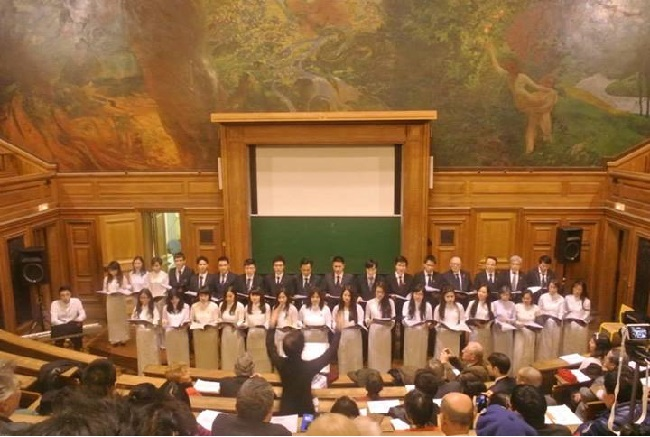

<!--
title: Có một Dàn Hợp ca Quê hương tại Paris
author: Tich Ky
-->

Có một Dàn Hợp ca Quê hương tại Paris

(LĐCT) – Số 4 HIỆU CONSTANT (TỪ PARIS, PHÁP) - 6:9 PM, 25/01/2014

Hợp ca Quê hương nhân dịp kết thúc Hội thảo Quốc tế về các mối quan hệ Pháp, Châu Âu và Việt Nam từ năm 1954 tại Đại học Sorbonne 1- Panthéon .
 
 
Trong những năm gần đây, mỗi khi nhận được giấy mời tham dự hay thông báo  về các sự kiện diễn ra tại Paris có liên quan đến Việt Nam, tôi thường thấy thấp thoáng  dòng tên Hợp ca Quê hương.

Lần này, nhân dịp kết thúc “Hội thảo Quốc tế về các mối quan hệ Pháp, Châu Âu và Việt Nam từ năm 1954”, diễn ra tại Paris vào các ngày 16, 17, 18.1.2014, Đoàn được mời tham gia. Dưới vòm nhà cao vời vợi và hết sức lộng lẫy với các bức tranh tường từ nhiều thế kỷ trước của một amphithéatre (phòng học) thuộc Trường Đại học Sorbonne 1- Panthéon, tiếng hát của các ca sĩ cất lên thật xúc động. Có lẽ tôi không phải là người duy nhất thấy khóe mắt mình rưng rưng cay cay khi được nghe ca khúc “Việt Nam quê hương tôi” của Đỗ Nhuận. Rồi các ca khúc cứ nối tiếp nhau. Mỗi khi kết thúc một phần đoàn lại được khán giả tặng cho những tràng vỗ tay cổ vũ hết sức nồng nhiệt. Khi tan cuộc, tôi nấn ná hỏi chuyện các ca sĩ.

Hợp ca Quê hương chính thức thành lập vào mùa xuân năm 2009, thành viên đều là nghiệp dư gồm sinh viên, nghiên cứu sinh và một số anh chị cô bác Việt kiều tại Pháp. “Chúng tôi tìm đến đây  trước hết là vì ham mê hát, sau đó là để tìm sự đồng cảm, cùng nhau chia sẻ những khoảng khắc xa quê hương giữa những người xa xứ…”, tôi được Ngọc Ánh, một người tham gia ngay từ những ngày đầu đoàn mới thành lập và đồng thời cũng là MC của đoàn tâm sự.

Ngọc Ánh sang Pháp đã gần bảy năm, trước là sinh viên và hiện giờ đã đi làm. Sau khi nghe tôi xuýt xoa về độ truyền cảm, độ gây xúc động của các bạn qua lời ca trong các ca khúc, Ngọc Ánh nói tiếp: “Hồi đầu đoàn hợp ca của chúng tôi chỉ có hơn mười người, và thường tập hát tại nhà cô Ngân Hà, mãi sau này mới được tập ở Nhà Văn hóa, và mọi người biết và đến Hợp ca Quê hương chỉ là do truyền tai nhau…”.

Chị Ngân Hà mà Ánh nói chính là Nhạc trưởng. Khi xem đoàn biểu diễn, chúng tôi không khỏi ngỡ ngàng trước trình độ chuyên nghiệp của chị khi điều khiển dàn đồng ca, dẫu qua tìm hiểu tôi được biết chị thành lập dàn Hợp ca Quê hương này cũng chỉ là do niềm đam mê. Chị rất chăm lo cho dàn hợp ca và tiêu chí thành lập đoàn của chị là tập trung những người hay hát và thích hát chứ không nhất thiết là phải theo học âm nhạc tại các trường hoặc viện âm nhạc… Và cho dù có đi biểu diễn hay không thì thường vẫn là một tuần một lần, nhóm tập trung tại Nhà Văn hóa Việt Nam tại quận 13 để tập hát.

 Là dân nghiệp dư, nhưng thầy trò dàn Hợp ca quê hương đã dàn dựng thành công nhiều bài hát cũng như dân ca Việt Nam, ngoài ra còn có “Hồi tưởng” của Hoàng Vân, “Choeur des esclaves” trong vở opéra “Nabucco” của Verdi được dịch ra tiếng Việt…

Chỉ qua mấy năm, với dàn đồng ca nghiệp dư, chị và các bạn trong đoàn của mình đã chinh phục được khá đông khán giả Việt kiều cũng như bạn bè quốc tế. Ngọc Ánh hồ hởi kể: “Hợp ca Quê hương đã đi biểu diễn khá nhiều nơi, cụ thể là chúng tôi đi tham gia Liên hoan Âm nhạc quốc tế được tổ chức tại thành phố Belfort (miền đông nước Pháp – PV). Đây là một liên hoan có sự tham gia của hơn 600 ban nhóm nhạc và khoảng chừng 2.500 nghệ sĩ trẻ đến từ hơn ba chục quốc gia. Hồi đó đông lắm, đoàn của mình gần sáu mươi người mà phần lớn toàn sinh viên. Đợt đó, chúng tôi được tài trợ xe và một phần tiền khách sạn và tiền ăn, đoàn đã  thu hút được khá đông khán giả đến xem”. Rồi Ánh còn cho biết đoàn đã được biểu diễn tại thềm đền Invalides, một chốn được gọi là “thâm cung bí sử” của quân đội Pháp.

Là một nam ca sĩ khá cần mẫn với vẻ mặt tươi tắn trong dàn đồng ca, Xuân Tuấn bảo: “Hợp ca thường dàn dựng hát các loại nhạc chính thống về quê hương đất nước và con người Việt Nam. Chính vì thế mà hầu hết các bạn tham gia đều thích. Tôi tham gia trước hết bởi yêu âm nhạc và thích những bài hát đó…”. Tuấn cũng cho biết đến đây để có thể gặp gỡ bạn bè cũng là điều đương nhiên.

Có người nói Hợp ca quê hương như là một xã hội thu nhỏ, mỗi người một tính cách, Tuấn vào đây được tiếp xúc với rất nhiều người, và mỗi người một vẻ, giống như đang được sống trong một xã hội Việt Nam thực sự.

Khi hỏi một câu mà gần như người việt xa xứ nào cũng muốn nói, muốn hỏi nhau nhưng đôi khi ngần ngại đó là: Sắp Tết rồi có về “quê” không? Quốc Đạt, một “lính mới” trong dàn nhạc và vẫn đang còn là sinh viên bẽn lẽn: “Mấy năm rồi tôi không được về ăn Tết, nên khi Tết được đi hát phục vụ các bạn cũng là dịp để quên nỗi nhớ nhà và được sống trong bầu không khí ấm áp, sẻ chia…”. Cả ba người đều thú thật rằng hồi ở Việt Nam rất hiếm khi được đi nghe hát, giả sử có dịp thì cũng không được xem chương trình như các bạn trình diễn tại Paris.

Trước câu hỏi khi đi biểu diễn trước khán giả quốc tế đông đảo như vậy thì cảm thấy thế nào, Quốc Đạt thổ lộ: “Tôi thấy tự hào khi được đem bài hát Việt Nam đến với các bạn Pháp và khi hát thì tôi cực kỳ tập trung, sao đó để diễn cảm thật tốt nội dung bài hát đến khán giả. Để các bạn ngoại quốc dù không hiểu lời nhưng nghe nhạc và nhìn phong thái biểu cảm sẽ hiểu ca khúc được tốt hơn…”.

Xuân Tuấn cho rằng bức thông điệp mà Hợp ca Quê hương muốn chuyển tải thông qua những bản nhạc nhằm giới thiệu quê hương đất nước con người Việt Nam đến bạn bè thế giới thì cũng rất hiệu quả. Dàn hợp ca Quê hương đã góp phần cho bạn bè quốc tế thấy hình ảnh trực tiếp hơn, rõ hơn và theo Tuấn: “Qua những đợt biểu diễn của dàn hợp ca thì hoàn toàn có thể thúc đẩy sự tò mò của bạn bè quốc tế để họ muốn tìm hiểu nhiều hơn về đất nước và con người Việt Nam”.

Các bạn tâm sự rằng dẫu Hợp ca Quê hương chỉ mang tính nghiệp dư thì các bạn sẽ vẫn theo đến cùng, đến lúc nào hết đam mê hát mới thôi.

Chia tay các bạn ra về trong tiết trời đông Paris lành lạnh. Tôi thấy tiếc mái vòm cao vời vợi và đầy những bức tranh tường kia, hình như nó vẫn đang ôm giữ nhưng lời ca ngân vang: “Bạn ơi hãy đến quê hương chúng tôi…” của Đỗ Nhuận, hoặc “Tôi nghe giai điệu Tổ quốc tôi/ Hùng thiêng trong tiếng chiêng đồng…” của Trần Tiến . Tôi bỗng thấy ấm lòng lạ, và thầm chúc cho Hợp ca Quê hương ngày càng phát triển và đem đến cho khán giả nhiều chương trình phong phú.

 

 