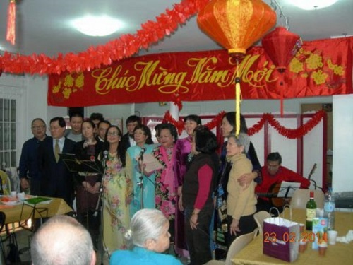
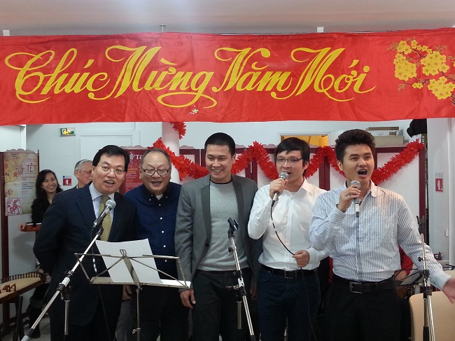

<!--
title: Tết Công nhân 2014 tại trụ sở của HNVNTP
author: Tich Ky
-->

Hằng năm, mỗi dịp xuân về, cộng đồng người Việt tại Pháp lại nô nức đón chào năm mới. Trong số những cái Tết được tổ chức thì Tết của hội Công Nhân luôn là một điểm nhấn độc đáo bởi lẽ đó là cuộc gặp gỡ của một thế hệ những người con đất Việt yêu nước, đã định cư lâu năm tại Pháp và là sự giao lưu trong một bầu không khí nồng ấm của tình cảm gắn bó thân tình anh em.

Tết Công Nhân năm nay được tổ chức một cách chu đáo. Những món ăn rất ngon, đậm đà bản sắc ẩm thực Việt đã được chuẩn bị từ trước từ những đầu bếp đảm đang. Căn phòng được trang trí không cầu kỳ nhưng lại rất tinh tế với những đèn, hoa… đủ để gợi lên một không khí ấm cúng.

Không kiểu cách, không màu mè, mà trái lại, sự bình dị, chất phác của các bác trong buổi gặp mặt đầu xuân ấy luôn luôn thường trực trong những lời phát biểu, những câu nói đùa giữa mọi người. Có lẽ, với các bác, tất cả mọi người ở đấy đều là anh em với nhau, luôn luôn gắn bó nhau. Vì thế, buổi gặp mặt này giống như một buổi sum họp của một gia đình sau một năm vất vả, lo toan cho công việc thường ngày vậy.

Đến với tết Công Nhân, ta mới thấy hết được nét trẻ trung của các bác qua những tiết mục văn nghệ. Không ngại tuổi tác, với sẵn niềm vui đầu xuân khi gặp mặt anh em, các bác đã trình diễn những tiết mục ca hát, ngâm thơ rất thú vị. Từ vọng cổ miền Nam cho đến quan họ miền Bắc, qua sự thể hiện của các bác sao mà đáng yêu đến thế !

   

       *Giao lưu văn nghệ thật vui vẻ với sự tham gia của Đại sứ Dương Chí Dũng và mọi người*

   

Tết Công Nhân năm nay ngoài những giọng ca lớn tuổi của các bác, còn có sự tham gia, giao lưu của một số bạn trẻ đến từ Hợp Ca Quê Hương. Chính vì thế, không khí của buổi gặp mặt đầu xuân càng thêm phần vui vẻ khi không còn một khoảng cách nào giữa các thế hệ, mà chỉ còn là tình thương chan hòa giữa những con người Việt Nam với nhau. Và, sự hòa đồng ấy càng rõ nét hơn qua phần giao lưu của Đại sứ Dương Chí Dũng với tất cả mọi người. Đại sứ cũng trò chuyện thân tình với mọi người, cũng hòa giọng hát « Năm anh em trên một chiếc xe tăng », « Việt Nam quê hương tôi » cùng mọi người. Tình cảm của dân Việt từ bao đời nay vẫn vậy, vẫn luôn yêu thương và gắn kết với nhau. Thật đáng quý biết bao !