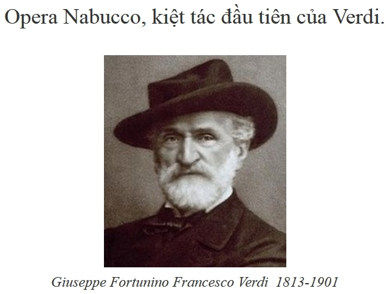

<!--
title: Opera Nabucco, kiệt tác đầu tiên của Verdi.
author: Nguyễn Tích Kỳ
status: completed
-->

  
*Vo Duy sưu tầm*

*Ngày 12 tháng 3 năm 2011, nhân lễ kỉ niệm 150 năm ngày thống nhất nước Ý, vở **opera Nabucco**, kiệt tác đầu tiên của **Verdi**, được dàn dựng tại nhà hát thủ đô **Teatro dell’Opera**, Rome dưới đũa chỉ huy của **Riccardo Muti** – một trong những nhạc trưởng tài năng nhất của Ý trong thế hệ này.*

*Hoàn thành vào ngày 9 tháng 3 năm 1842 tại Milan dựa trên vở kịch **Nabuchodonosor** (1836) của **Auguste Anice-Bourgeois và Francis Cornue**, vở opera 4 cảnh của Verdi là một tác phẩm mang cả tính chất nghệ thuật lẫn chính trị: Nó mô tả thời kỳ nô lệ của những người Do Thái tại xứ Babylone được ghi chép trong Kinh Thánh. Điểm nhấn của vở opéra , bài hát “Va, pensiero » trong cảnh thứ 3, đã trở thành bài hát của những người nô lệ bị áp bức. Tại nước Ý vào những năm 1840, dưới thời đại thống trị và đàn áp của đế chế Habsbourg, bài hát này đã được sử dụng như quốc ca cho cuộc đấu tranh chống áp bứt, và nó đã đồng hành cùng quá trình giải phóng dân tộc cho đến khi nước Ý được thống nhất.*

*Buổi biểu diễn ngày 12 tháng 3 năm 2011 vừa qua trở thành một sự kiện văn hóa gây chấn động, vượt ra khỏi tinh thần của một buổi lễ kỷ niệm thông thường. Trước khi vở opéra bắt đầu, Gianni Alemanno, thị thưởng thành Rome, đã bước lên sân khấu và thông báo về những cắt giảm ngân sách không thương tiếc của quỹ hỗ trợ phát triển văn hóa của chính phủ. Bên cạnh đó, thủ tướng đương thời Berlusconi cùng bè phái lại dính vào không biết bao nhiêu vụ ăn chơi bê bối, xa hoa.*
 
*Trong tình hình kinh tế-chính trị ngày một đi xuống của nước Ý, Riccardo Muti, bằng âm nhạc tuyệt vời của Verdi, đã nhân sự kiện này để bày tỏ lòng tiếc nuối vô hạn những di sản vĩ đại của văn hóa Ý đang dần dần mai một. Ông đã tuyên bố một cách thẳng thắn với chính quyền và giới tinh hoa rằng nước Ý cần phải có một hành động trước khi bản hợp xướng ” Va, pensiero” trong vở opera tuyệt tác này sẽ trở thành “khúc nhạc đưa đám” cho cả nền văn hóa tồn tại hàng ngày năm của nước Ý.  Sự kiện chính trị trong một khuôn khổ văn hóa này đã góp phần khiến Sylvio Berlusconi và động bọn trở nên điêu đứng và khó khăn hơn.*

*Điều gì đã thực sự xảy ra tại nhà hát Roma vào cái đêm 12 tháng 3 hôm ấy?*

*Vị nhạc trưởng gốc Napoli hồi tưởng lại trong tạp chí Times: “Vở opéra đã được mở màn trong sự hưởng ứng nhiệt liệt của khán giả. Khi khi chúng tôi bước vàobài hát  “Va pensiero” nổi tiếng , ngay lập tức tôi cảm nhận không khí trong khán phòng trở nên căng thẳng. Có những điều mà bạn không thể mô tả được, chúng ta chỉ có thể cảm nhận được thôi. Trước đấy, tất cả khán giả đều im lặng để thưởng thức kiệt tác này. Khi những nốt nhạc đầu tiên của bản « Va, pensiero » vang lên, sự im lặng ấy muốn vỡ ào trong cảm xúc. Người ta có thể cảm nhận được sự sôi sục mãnh liệt trong từng mạch máu của khán giả bị tác động bởi lời than khóc của những người nô lệ  Do Thái : « Oh mia patria, si bella e perduta! » (Ôi tổ quốc ta ơi, tổ quốc tươi đẹp và đã không còn nữa !) Họ bắt đầu nghĩ rằng: “Tất cả mọi thứ làm nên sự vĩ đại của đất nước chúng ta trong quá khứ đã mất rồi”.*

*Trước khi hợp xướng thật sự kết thúc, một vài khán giản đã hét lên : « Bis, bis ! ». Sau đấy cả khán phòng vỡ òa với những khẩu hiệu yêu nước : « Nước Ý muôn năm, Verdi muôn năm ! ». Thậm chí có những khán giả ngồi trong cao đã ném những mãnh giấy với dòng chữ : « Muti, nghị sĩ của sự sống », « Tổng thống Naples muôn năm ».
« Tôi hơi do dự khi cho các nghệ sĩ diễn lại bài hát này, mặc dù tôi đã từng làm một lần như thế ở La Scala của Milan vào năm 1986, cũng với chính tác phẩm này. Với tôi, một vở opéra phải được diễn ra mạch lạc từ đầu đến cuối. Tôi không muốn làm điều này, trừ khi nó có một ý nghĩa đặc biệt nào đấy »-Muti thuật lại.
Tuy nhiên khán giả đã đánh thức lòng yêu nước và tự hào dân tộc trong Muti. Bằng một cử chỉ hơi khoa trương, vị nhạc trưởng vẫn ngồi trên ghế và quay lại, đối mặt với khán giả và thủ tướng Berlusconi. Ông tuyên bố : Vâng, nước Ý là vĩnh hằng. Nhưng… Tôi chỉ còn sống được hơn 30 năm. Là một người Ý và có dịp đi nhiều nơi trên thế giới, tôi thật sự cảm thấy xấu hổ với những điều đang diễn ra trên đất nước chúng ta.  Vì vậy tôi đồng ý cho các nghệ sĩ diễn lại bài hát « Va pensiero ». Điều này không chỉ đơn giản để thỏa mãn niềm yêu nước mà tôi cảm nhận được. Nhưng bởi vì ngay đêm nay, khi tôi chỉ huy hợp xướng hát « Ôi đất nước của tôi, xinh tươi vã đã mất », tôi thiết nghĩ, nếu chúng ta cứ tiếp tục như thế, sớm muộn chúng ta sẽ khai tử cho nền văn hóa và lịch sử vĩ đại của nước Ý. Và rồi chúng ta sẽ có thể hát như những người nô lệ Do Thái : « Ôi đất nước của tôi, xinh tươi và đã mất rồi ! «. Vào 9 tháng 3 năm 1842, Nabucco chính là vở opera đã thúc giục những con người Ý đứng lên tiến hành cuộc cách mạng chống lại người Áo để dành lại tự do và độc lập. Tôi hi vọng buổi lễ kỉ niệm 150 năm ngày thống nhất nước Ý này, Nabucco sẽ không phải là bản hành khúc tang lễ cho nền văn hóa của chúng ta.”
Sau đấy Muti mời toàn bộ khán giả cùng hát với dàn hợp xướng. “Tôi nhìn thấy từng tốp người đứng dậy. Rồi cả khán phòng của nhà hát thành Rome đều đứng dậy. Cả dàn hợp xướng cũng đứng hết lên. Đó là một khoảnh khắc thực sự màu nhiệm trong nhà hát”.
Câu chuyện không dừng lại ở đó. hai ngày sau đêm diễn, chính bộ trưởng Bộ Ngân Khố quốc gia đã đến gặp Muti, cùng nói chuyện với ông và tuyên bố rằng, chính phủ sẽ cố gắng tìm cách tháo gỡ những những vấn đề thực trạng của văn hóa Ý, cụ thể là hỗ trợ kinh phí để duy trì các hoạt động văn hóa, đặc biệt là nhà hát.
« Và đêm diễn ấy không chỉ đơn thuần là vở opéra Nabucco, nhưng nó trở thành một lời tuyên bố mạnh mẽ của nhà hát thủ đô đến những chính trị gia »*

*«Hãy bay đi, trên đôi cánh vàng kia*  
*những nghĩ suy không thể giam cầm được,*  
*Về đậu lại dưới triền đồi thoải dốc,*  
*nơi tỏa hương dịu ngọt, đất mẹ của ta.*  
*Chào đôi bờ sông Jordan hiền hòa.*  
*Chào những ngọn tháp Zion xưa cũ.*  
*Ôi còn đâu , tổ quốc ta xinh đẹp rực rỡ.*  
*Ôi kỉ niệm thân thương, tan nát trái tim.*  
*Này đàn hạc của những vị tiên tri*  
*sao ngươi không hát gì bên rặng liễu.*  
*Hãy gọi ký ức trong lòng ta đang say ngủ*  
*và nhắn nhủ, thời gian trôi qua rồi.*  
*Ôi thành Jerusalem yêu mến của tôi*  
*nghĩ về nó mà muốn òa lên khóc.*  
*Xin Chúa trời ban cho con một khúc đồng vọng,*  
*để đức hạnh chiến thắng mọi khổ đau.”*  

***«Nguồn tổng hợp từ báo Le monde»***  

<iframe width="560" height="315" src="https://www.youtube.com/embed/gaXE0v0bJoE" frameborder="0" allowfullscreen></iframe>

Tác phẩm **HCQH** đã trình diễn **"Opéra Nabuco"** Sáng tác Tại :   Gertz-Armainvilliers/ UNESCO/ Trung Tâm văn hóa Việt Nam tại Paris /École Supérieure de Commerce de Paris/  

**Có thể xem /nghe :**

<iframe width="560" height="315" src="https://www.youtube.com/embed/_v0Nyhft15c" frameborder="0" allowfullscreen></iframe>

