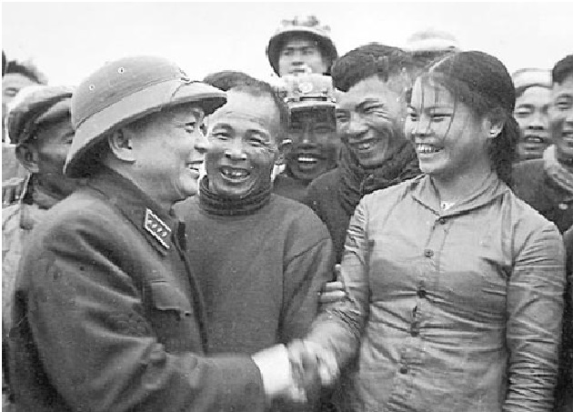

<!--
title: Anh Văn
author: Tich Ky
-->

  
 Anh VĂN
 

Tôi từng  nghe bố kể
Hai lần anh Văn qua nhà
Cùng đoàn cán bộ.
 
Lần ấy, nhà thịt gà
Mẹ bưng gửi lên một bát
Vì các ông ăn chỉ canh khoai lang
Rắc xuống vài hạt muối
 
Người cần vụ nhận bát thịt gà rang
Nhập vào mâm cơm đạm bạc
Nhưng xong bữa, vẫn còn nguyên bát thịt
 
Anh Văn bảo rằng
Bác dặn rồi, không đụng đến cái kim sợi chỉ của dân
Cảm ơn gia đình đã đối xử như người thân
Nhưng kỉ luật là kỉ luật.
 
Mắt mẹ tôi cay qua làn khói bếp
Nhìn núi xa đang hành tiến trập trùng
Núi xa kia như những cán bộ ba cùng
Kháng chiến thành công là chắc.
 
Mẹ tôi bằng tuổi anh Văn
Hôm nay bà còn đó
Chẳng biết trên quê còn có ai nhắc nhở
Để bà nhớ về năm xưa
Bát thịt gà rang bưng lên hôm đó
Mời đoàn cán bộ có anh Văn
Anh cùng cả đoàn từ chối không ăn
Nhớ lời Bác,  giữ cho cách mạng
Sạch như dòng suối giữa rừng.
 
Anh VĂN
Hôm nay tôi vẫn muốn gọi ông như thế
Như bố mẹ tôi từng gọi anh Văn
Người như anh không bao giờ chết
Sống mãi cùng non song đất nước
Vì anh là VĂN!
 
 
                Đôngngàn
         Hà nội 07.10.2013
 
