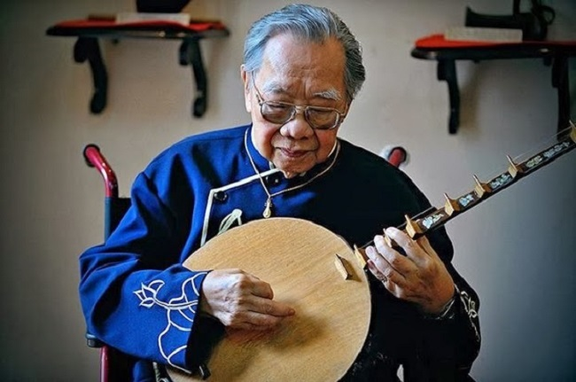

<!--
title: QUÁ TRÌNH HÌNH THÀNH VÀ PHÁT TRIỂN ĐỜN CA TÀI TỬ NAM BỘ
author: Nguyễn Tích Kỳ
status: completed
-->

  
*Cố GSTS Trần văn Khê*

**I. QUÁ TRÌNH HÌNH THÀNH – GIÁ TRỊ NGHỆ THUẬT – Ý NGHĨA CỦA ĐỜN CA TÀI TỬ ĐỐI VỚI DÂN NAM BỘ**

***1. Quá trình hình thành :***

Đờn ca tài tử là một sinh hoạt văn nghệ thuộc loại thính phòng (một nghệ thuật do một nhóm nhỏ nghệ sĩ biểu diễn cho một nhóm nhỏ thính giả, không gian ấm cúng của một căn phòng trong tư gia, chớ không phải trong một hội trường lớn, hay trên một sân khấu hoành tráng cho đông đảo thính giả).

Đầu tiên dân miền Nam nước Việt cần một thú tiêu khiển và cũng để thoả mãn một nhu cầu sáng tác nghệ thuật nên có một loại nhạc bắt nguồn từ những dân ca miền Nam phối hợp với dàn đờn cây của nhạc Lễ làm thành một bộ môn nhạc tiêu khiển đặc biệt miền Nam nước Việt.

Vào cuối thế kỷ XIX nghệ sĩ Đờn ca Huế trong phong trào Cần Vương đã rời miền Trung vào Nam. Trên đường đi họ dừng chân ở Quảng Bình, Quảng Trị, Quảng Nam. Từ đó tiếng đờn, giọng ca xứ Huế mang thêm chút hương vị xứ Quảng như điệu “Lưu thuỷ thục giang” qua giai đoạn “Lưu thuỷ Quảng” mới trở thành “Lưu thuỷ đoản” miền Nam ; “Phú lục Huế” chuyển hơi thành “Phú lục Quảng”, rồi khi vào Nam bài “Phú lục chấn” chỉ còn đôi chút của “Phú lục Huế”. Tiếng đờn miền Trung khi vào miền Nam không còn giữ nguyên chất mà đã thay đổi rất nhiều, có bài bản còn trùng tên, nhưng giai điệu đã khác xa, điển hình như 2 bài “Nam Ai Huế” và “Nam Ai miền Nam”.

Quan sát môi trường, con người và nếp sống miền Nam, chúng ta sẽ rõ tại sao bài bản không còn giữ được chuẩn, đó là do người đờn, người ca không muốn giữ nguyên si bài bản như thầy đã dạy, mà luôn có đôi nét thêm thắt thay đổi, tô điểm, đưa một chút ‘ta’ vào trong ‘chúng ta’
Nam bộ là tên gọi phía cực nam Việt Nam, thay cho tiếng gọi Nam kỳ, sau khi nước nhà thống nhứt, là một vùng đất đỏ basalte nặng trĩu phù sa, một vùng chằn chịt kinh rạch, sông ngòi, vùng mà trước kia hoang dại “ma thiêng nước độc”, một “nơi nhiều sông rạch bùn lầy, muỗi kêu như sáo thổi, đỉa lội lầy như bánh canh”. Những người Việt từ miền Bắc xa xôi, miền Trung kinh kỳ, đến đây lập nghiệp, một vùng đất mới, đồng ruộng phì nhiêu, một vựa lúa, một vườn trái cây, có nhiều sản vật phong phú, đa dạng, nên “đến đây thì ở lại đây, trăm năm bám rễ, xanh cây không về”. Họ là những người “tứ chiến” năng động, nhạy bén, dám nghĩ, dám làm, sẵn sàng tiếp nhập với dân bản xứ, giản dị, cởi mở, hào hiệp, hiếu khách, có một nền dân ca dồi dào, với nhiều câu ca dao trữ tình, câu hò điệu lý duyên dáng, bài vè dí dỏm, một nền nhạc lễ bắt nguồn từ nhạc cung đình miền Trung, giản dị hoá, dân gian hoá, rất độc đáo với “Phe Văn, Phe Võ”, với tiếng trống “đánh sáng, đánh tối”, “tiếng âm, tiếng dương”, tiếng “bồng” sôi động, bồng hai, bồng ba, bồng thét, “tiền bần hậu phú”, đã tạo nên một không gian văn hoá Nam bộ đặc thù, phát triển không ngừng đến ngày nay.

Do lòng luôn luôn thương nhớ cội nguồn, nên mặc dầu trong đờn ca tài tử có rất nhiều điệu, nhiều giọng, nhiều hơi, nhưng các các điệu các hơi diễn tả nỗi u buồn, được người ca và người nghe thích thú, say mê trong diễn tấu, miệt mài trong thưởng thức.

Trong những người theo phong trào Cần Vương vào Nam truyền bá nhạc Huế cho người học nhạc miền Nam, các nghệ nhân còn nhắc lại tên ông Nguyễn Tòng Bá chuyên dạy đờn Nguyệt (Kìm) và đờn Tranh ; Ông Nguyễn Liên Phong dạy đờn Độc huyền (Bầu) ; Ông Trần Quang Thọ dạy đờn Tỳ Bà.

Ông Nguyễn Quang Đại, người Tỉnh Quảng Nam, con thứ ba trong gia đình nên người dân Nam bộ thường gọi là ông Ba Đại hoặc Ba Đợi, ông đến vùng Chợ Đào Tỉnh Long An mở lớp dạy đờn ca. Từ đó lối đờn ca nghiêm trang của nhạc Thính phòng và Cung đình Huế đã được nhiều người trong Nam học hỏi và đã trở nên gần gũi với dân chúng hơn.

Cùng một lúc với nền ca nhạc từ Huế đi vào người nhạc sĩ miền Nam còn tiếp cận với nhạc lễ theo phe Văn (gồm 4 cây đờn Cò lên dây khác nhau) hình thành nên bộ môn nghệ thuật Đờn ca Tài tử Nam bộ ngày nay.

***Định nghĩa chữ  “đờn tài tử”:***

Phần đông khi nhắc đến Đờn Tài tử thì cho rằng lối nhạc đó không sâu sắc chuyên nghiệp mà mang tính cách giản dị của dân gian hay “a ma tơ” (theo chữ Pháp “amateur”) của những người nghiệp dư. Thực ra “Tài tử” có nghĩa là người có tài (dập dìu tài tử giai nhân … Tài tử giai nhân tế ngộ nan). Người đàn Tài tử không dùng tài nghệ của mình làm kế sinh nhai. Khi nào thích đàn thì họp nhau tại nhà một người trong làng rồi cùng nhau đàn chơi, ai biết đàn ca cũng có thể tham gia được, có thể đờn ca suốt đêm không chán. Nhưng khi không thích đờn thì dầu cho có ai đem tiền muôn bạc vạn đến bảo đờn rồi thưởng thì các nghệ nhân tài tử cùng nhứt định không đờn. Tuy không phải nhà nghề nhưng trình độ nghệ thuật của nghệ nhân Tài tử không thấp. Họ thường tập luyện rất công phu, phải theo thầy học từ chữ nhấn, chữ chuyền, rao sao cho mùi, sắp chữ sao cho đẹp và tạo cho mình một phong cách riêng. Muốn trở thành người đàn Tài tử đúng nghĩa phải trải qua thời gian tập luyện khá công phu.

***2. Giá trị nghệ thuật :***

Tuy qui luật trong nghệ thuật Đờn ca Tài tử không viết thành văn bản nhưng những người điệu nghệ đều biết rõ và tuân thủ rất nghiêm túc.

***2.1. Dàn nhạc :***

Trong Đờn ca Tài tử tiếng đờn quan trọng hơn cả tiếng ca, khác với trong nghệ thuật ca Trù, ca Huế thì người ca nương là chánh, tiếng đờn là phụ. Dàn đờn gồm có đờn Kìm (Nguyệt) giữ tiếng đờn chân phương và cho nghe âm thanh trầm ấm trong nhà nghề gọi là tiếng Thổ ; đờn Tranh nhờ dây sắt có tiếng đàn lánh lót nên phát thành tiếng Kim ; đờn Cò có cung kéo vuốt ve thành tiếng dịu ngọt ; đờn Độc huyền (Bầu) nỉ non như xoáy vào tim ; sau năm 1930 có thêm ghita phím lõm, tuy là một nhạc khí gốc từ Tây Ban Nha nhưng nhờ người Việt khoét cần giữa 2 phím để người đờn có thể nhấn – rung thể hiện được tất cả cách tô điểm nhạc truyền thống Việt Nam. Có thể đờn 1 cây gọi là độc tấu, thường thì song tấu đờn Kìm và đờn Tranh và thêm cây đờn Cò gọi là tam tấu. Nếu dàn nhạc có 4-5 cây thường gọi là tứ tuyệt – ngũ tuyệt.

***2.2. Cách lên dây :***

Mỗi cây đờn đều có cách lên dây đặc biệt theo tiếng gọi nhà nghề là hò nhứt, hò nhì, hò ba, hò tư … dây Bắc, dây Nam, dây Oán, … rất phong phú và phức tạp.

Còn nhiều chi tiết nhưng trong phạm vi một bài tham luận tôi không thể đi vào chi tiết và kể hết được.

***2.3. Những thủ pháp cần biết để tô điểm chữ nhạc :***

Đại khái có 3 cách đờn căn bản người nhà nghề gọi là rung – nhấn – mổ. Nhưng trong chi tiết có chữ phải rung nhẹ, rung mạnh, nhấn nhảy, nhấn rung, nhấn chầy … Đờn Kìm chữ nhấn hay được gọi là nhấn có gân. Đờn Tranh chữ nhấn hay được gọi nhấn sâu sắc, mượt mà.

***2.4. Ngôn ngữ Âm nhạc :***

Rất tinh vi, mỗi chữ nhạc không có độ cao tuyệt đối hay độ cao tương đối cố định nhưng tuỳ theo điệu thức hoặc kỹ thuật đờn mà có một cao độ khác nhau : tiếng đờn non là cao độ thấp một chút, tiếng đờn già là cao độ cao một chút, không cố định là một quãng tám hay quãng tư, độ cao thấp do thầy dạy và học trò làm theo. Nếu nhấn quá cao hay quá thấp thì bị lạc hơi.

Muốn diễn tả tình cảm Đờn ca Tài tử có nhiều điệu thức khác nhau, trong giới nhà nghề thường gọi là Hơi : hơi Bắc vui tươi khi đờn phải mổ các chữ hò xang xê liu và rung hai chữ xự cống ; hơi Quảng nhộn nhịp như hơi nhạc Quảng Đông thì đờn hò xang xê liu phải rung và xự cống phải mổ ; hơi Xuân thanh thản thì phải nhấn đặc biệt chữ xang, vuốt lên xê rồi trở lại xang ; hơi Ai buồn nên rung chữ xang trước rồi nhấn nhẹ lên xê mà không trở lại xang.

Chỉ nói sơ qua như thế các bạn đã thấy rằng muốn đờn tài tử cho đúng điệu phải biết nhấn chữ xang theo 4 cách khác nhau đó.
Nhịp – phách thì chỉ có nhịp một, nhịp đôi, nhịp tư, nhịp tám, nhịp mười sáu mà không có nhịp ba, nhịp sáu. Nhịp mạnh gọi là nhịp, nhịp nhẹ gọi là láy. Gõ Song lang hay gõ nhịp ngay tiếng đờn gọi là nhịp nội, ngoài tiếng đờn gọi là nhịp ngoại (khác cách gọi nhịp chánh diện, nhịp nội, nhịp ngoại trong ca nhạc Huế).

***2.5. Cách đờn :***

Trước khi vào bản thuộc hơi nào, nhạc công đờn ca tài tử luôn có câu rao theo hơi đó. Câu Rao theo truyền thống miền Nam khác hẳn với những bài Dạo của miền Trung, những bài này Dạo khách, Dạo nam có một nét nhạc cố định, học trò học rồi mỗi lần trước khi vào bài thì đờn những câu dạo theo Thầy dạy mà không thay đổi. Câu Rao miền Nam phóng túng hơn nhiều. Mỗi người thầy có một cách Rao, lúc đầu dạy học trò, thì học trò đờn theo thầy, nhưng khi học trò đến một mức nghệ thuật tương đối khá cao, thầy cho phép học trò tạo những câu Rao đặc biệt cho mình. Người đờn khi bắt đầu Rao, một mặt dẫn người thính giả đi lần vào điệu, vào hơi để nghe bản đờn. Đồng thời khi Rao cũng là lúc thử cây đàn có phím nào chênh lệch hay không, dây đàn cứng quá hay mềm quá không, để lúc biểu diễn nhờ chữ nhấn mà làm cho tiếng nhạc hoàn chỉnh hơn. Giống như người kỵ mã trước khi cỡi ngựa biểu diễn cần phải biết chứng con ngựa mình đang cỡi.

Câu rao thể hiện được bản chất của người đờn. Khi hoà đờn chung không bao giờ đờn cùng một bản, mỗi nhạc khí có một cách sắp chữ riêng, trong khi biểu diễn tất cả nhạc công đều biết cách phối khí tập thể tại chỗ, lại có những đoạn ngẫu hứng, sáng tạo trong lúc biểu diễn. Nhờ vậy, một bản đờn không bao giờ làm nhàm chán người nghe vì được biến hoá thiên hình vạn trạng. Trong Đờn tài tử có một nguyên tắc thẩm mỹ học chân phương – đờn hoa lá.

***3. Ý nghĩa của Đờn ca Tài tử đối với người dân Nam bộ :***

Đối với người dân Nam bộ, Đờn tài tử là một thú tiêu khiển, đem cái vui cho mình và cho người chung quanh, có thể đờn chơi một mình và chừng đó tiếng đờn như một người bạn chí thân, lúc buồn cũng có thể trút vào tiếng đờn để nỗi buồn vơi đi, khi vui thì tìm bạn hoà đờn, chơi vài bản, trong lúc đờn cũng có cách phá với nhau cho vui để xem người bạn mình có chắc nhịp hay không. Đờn ca tài tử thường được dùng trong các lễ hội hoặc tiệc cưới, ngày nay trong những đám tang thường có những dàn nhạc Đờn ca tài tử phụ lực với phe Văn của dàn nhạc lễ để làm nhẹ bớt không khí buồn thảm của tang gia.

Mọi tầng lớp của xã hội miền Nam, từ những quan lại, công chức cao cấp đến những người lao động, thợ hớt tóc, anh chèo đò … đều có thể trở thành những người sành điệu Đờn ca tài tử và khi vào chung một dàn nhạc thì người nào đờn hay được tôn trọng nhứt, cách xử sự giữa những người cùng đàn rất dân chủ.

Trong các bộ môn âm nhạc truyền thống, Đờn ca tài tử được nhiều người ưa thích và tham gia nhất.

***II. TÌNH HÌNH PHÁT TRIỂN – CÁCH GÌN GIỮ VÀ PHÁT TRIỂN ĐỜN CA TÀI TỬ***

Nhạc tài tử được phát triển mạnh ở miền Nam một phần là nhờ có khá nhiều lò dạy được mở ra ở khắp lục tỉnh và Sài Gòn. Đầu tiên, chỉ có những gia đình khá giả mới đủ tiền mời thầy ở các tỉnh khác về nhà để dạy. Vào những năm của thập kỷ 40 và 50, các lò dạy mới bắt đầu phổ biến, nhất là tại Sài Gòn, do các nghệ sĩ từ tỉnh lên phụ trách. Những lò nổi tiếng thời bấy giờ như các lò của nghệ sĩ Chín Phàng (từ Long An), Hai Đậu (từ Tiểu Cần, Trà Vinh), Năm Lòng và Năm Được (từ Cần Giuộc). Các lò lớn nhất, nhiều uy tín, và đào tạo nhiều danh ca danh cầm nhất có thể kể đến là lò Văn Giỏi và Tấn Đạt. Các nghệ nhân nổi tiếng như Sáu Thới, Năm Xem, Ba Đồng, Út Lăng, Tư Huyện, Tư Tụi, Sáu Thoàn, Văn Vĩ, Mười Đờn, Năm Vinh, Ba Trung, Sáu Xiếu và Nguyễn Văn Thinh cũng có nhiều đóng góp cho việc phát triển nàỵ.

Trong những năm gần đây, chính quyền địa phương các tỉnh và huyện ở miền Nam đã cố gắng khôi phục lại các lớp dạy đờn ca tài tử cũng như tổ chức các liên hoan đờn ca tài tử cấp tỉnh hoặc liên tỉnh. Ở hải ngoại cũng đã và đang có nhiều cố gắng khôi phục lại thể loại nhạc thính phòng này của Việt Nam, nhưng hầu hết vẫn còn rời rạc và thiếu sự bảo trợ về mặt tổ chức cũng như tài chánh …

Do chịu ảnh hưởng của sự du nhập nhạc Tây phương, các phương tiện thông tin hiện đại và một số nhận thức sai lạc của người dân về đờn ca tài tử nên thể loại nhạc thính phòng đặc sắc của Việt Nam này đang mất lần tính chính thống. Nhiều nơi đã thay đổi không gian thính phòng của đờn ca tài tử để diễn viên hòa nhạc và hòa ca trong không gian sân khấu – nơi mà người nghe và người diễn bị tách biệt. Nhiều chương trình nặng phần trình diễn, chú trọng nhiều đến phần ca hơn là hòa đàn. Thậm chí người ca hoặc người đàn còn học thuộc lòng các bài bản ký âm theo phương Tây một cách chi tiết ; và do đó làm mất đi tính ứng tác, tính ngẫu hứng đặc trưng của nghệ thuật đờn ca tài tử truyền thống.

Xuất phát từ việc nhận thức được tầm quan trọng của nhạc đờn ca tài tử trong nền âm nhạc truyền thống Việt Nam nói riêng và văn hóa Việt Nam nói chung, ngày nay đã có khá nhiều nhà nghiên cứu dân tộc nhạc học ở trong và ngoài nước đang tìm cách sưu tầm và hệ thống hóa các bài bản của nhạc tài tử, nghiên cứu thang âm điệu thức, phương pháp ký âm … Một số nhạc sĩ cũng đang tìm cách sáng tác thêm các bài bản mới để góp phần vào số lượng bài bản đang thịnh hành hiện nay.

Từ lâu Nhạc Viện Hà Nội – Huế và Tp.HCM đều có dạy Âm nhạc truyền thống cả 3 miền theo phong cách ký âm phương Tây. Các sinh viên tuy biết qua Âm nhạc cả 3 miền nhưng với cách dạy bài bản theo đô rê mi thì sinh viên chỉ biết được nét nhạc chính xác, nhưng khi gặp gỡ nghệ nhân Đờn ca tài tử thì không biết cách phối khí tập thể tại chỗ và ngẫu hứng trong lúc biểu diễn. Do đó, sinh viên Nhạc viện muốn sinh hoạt trong xã hội đều phải tìm nghệ nhân học riêng. Trong lúc nước nhà còn chìm trong khói lửa, bao nhiêu nghị lực đều để vào việc chống ngoại xâm, văn hoá bị chìm trong bóng tối, sau ba chục năm chiến tranh số thanh niên biết Đờn ca tài tử càng ít. Khi hoà bình lập lại các Sở Văn hoá Thông tin tuần tự tổ chức lại việc học Đờn ca tài tử và nhiều nơi đã bắt đầu thành lập những Câu lạc bộ, trong đó thành viên có dịp học đờn ca và biểu diễn. Lần lần số Câu lạc bộ tăng lên, những dàn Đờn ca tài tử tập họp những người mộ điệu nhưng khi biểu diễn thì lại quá chú trọng về việc đờn đúng hơi đúng nhịp nhưng mỗi người tự đờn bè của mình mà không có tinh thần chơi đờn tài tử như xưa, không còn những câu buông, câu bắt, vào nhịp ra nhịp … người đờn chung trong một dàn nhạc như đối thoại với nhau mà tất cả ngồi đờn nét mặt nghiêm túc, để lúc dứt bản nhận được tràng pháo tay và đôi khi một phong bì, như vậy thì Đờn tài tử trong giai đoạn phát triển gần đây đã mất chất tài tử mà biến thành một tiết mục biểu diễn trên sân khấu hoặc trong các Đài phát thanh truyền hình Đờn ca tài tử đã bị sân khấu hoá.

Các Công ty Du lịch cũng tạo ra những dàn nhạc tài tử để phục vụ du khách, phần lớn là người nước ngoài. Trong vòng 15 phút làm sao có thể biểu diễn Đờn tài tử cho ra hồn, cho xuất thần được ? Khách đến nghe cũng không phải người đồng điệu, chỉ là một người xa lạ khám phá một lối nhạc mà họ chưa nghe bao giờ với một tính tò mò tìm hiểu thì việc tổ chức rất nhiều dàn nhạc như vậy chỉ nhắm vào số lượng, còn chất lượng càng kém đi rất nhiều.

Tôi cùng thông cảm hoàn cảnh khó khăn của những người chơi Đờn ca tài tử. Trong xã hội ngày nay trước hết cũng phải lo cơm ăn áo mặc rồi mới tới việc phụng sự nghệ thuật.

Sau khi được Unesco nhìn nhận là một Di sản Phi vật thể đại diện nhân loại, Đờn ca tài tử không thể phát triển theo chiều hướng hiện nay. Các nghệ nhân, nhứt là những người cao niên cần được chánh quyền, các Cơ quan hữu trách … chăm sóc để đem hết hiểu biết của mình truyền lại cho giới trẻ, các nghệ nhân nên được tôn vinh như một Di sản quí. Người nghệ nhân tận tuỵ với Âm nhạc truyền thống ở Nhựt được huy hiệu “Quốc Gia Chi Bảo”, ở Ấn Độ được vinh danh “Padma Shri” và hưởng lộc đến cuối đời. Trong nước ta cũng có những danh hiệu “Nghệ sĩ nhân dân”, “Nghệ sĩ ưu tú” … nhưng mấy khi nghệ nhân dân gian được phong những danh hiệu đó ? Hội văn nghệ dân gian hằng năm có phát bằng “Nghệ nhân dân gian” cho những nghệ nhân tận tuỵ với nghề, chứ không thể giúp nghệ nhân sanh sống nhờ tài nghệ của mình, thường thì các nghệ nhân phải kiếm một nghề khác để sống, việc dạy nhạc Dân tộc không đủ để trang trải các chi phí trong cuộc sống.

Nên phổ biến Đờn ca tài tử không phải chỉ trong những cuộc lễ hội, mà có thể tổ chức những buổi Đờn ca tài tử có giải thích cho học sinh các Trường Tiểu học, Trung học.

Các phương tiện truyền thông nên dành một số thời gian thuận lợi để giới thiệu Đờn ca tài tử. Báo chí cũng nên có một trang dành riêng cho sự trao đổi giữa nghệ nhân, nghệ sĩ và người hâm mộ Đờn ca tài tử.
Các xưởng đóng đờn ngoài việc tạo ra những nhạc khí cao cấp vừa đẹp vừa có âm điệu tốt, nên tạo ra những nhạc khí trung bình với mức giá phải chăng để người mới vào nghề hoặc những học sinh mới tập sự có thể mua được.

Những doanh nghiệp lớn có thể tổ chức hàng năm những cuộc liên hoan Đờn ca tài tử để các Câu lạc bộ từ nhiều Tỉnh gặp nhau, trao đổi kinh nghiệm. Dân chúng có dịp thưởng thức tài nghệ của nhiều nhạc sĩ và coi đó là một phương tiện giải trí có tính cách văn hoá.
Công việc giữ gìn, phát triển và phổ biến Đờn ca tài tử không phải chỉ riêng những người chuyên môn, mà mọi người, nhứt là chánh quyền nên chung tay, tạo mọi điều kiện thuận lợi và dân chúng cũng nên hưởng ứng bằng cách tham dự những buổi sinh hoạt đó.

***Bình Thạnh, ngày 08/04/2014***  
***GSTS Trần Văn Khê***  

