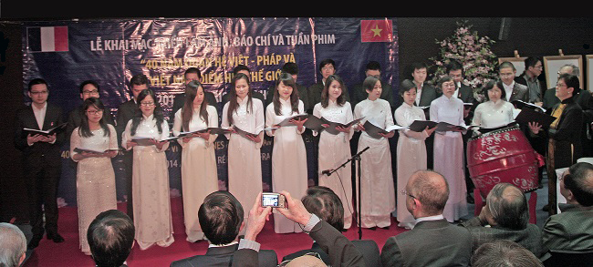
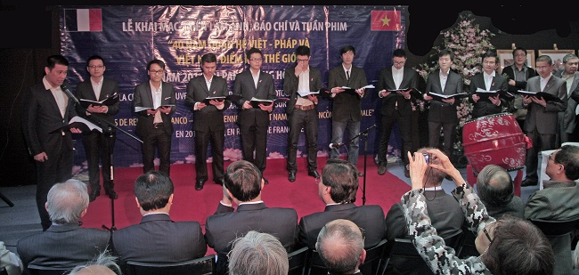

<!--
title: 2014-05-06 40 năm quan hệ Việt-Pháp và Việt Nam, điểm hẹn Thế giới tại Paris
author: Tich Ky
-->

 * 40 năm quan hệ Việt-Pháp và Việt Nam, điểm hẹn Thế giới 
 * Đón tiếp Bộ trưởng Bộ thông tin truyền thông Nguyễn Bắc Son 

Dư âm của buổi biểu diễn ngày thứ 7 26.04.2014 trong dịp khai mạc triển lãm ảnh, báo chí và tuần phim “ 40 năm quan hệ Việt-Pháp và Việt Nam, điểm hẹn Thế giới “ của năm 2014 tại Paris. Và sự đón tiếp Bộ trưởng Bộ thông tin truyền thông Nguyễn Bắc Son như vẫn còn đọng lại trong tâm tưởng mỗi người với một niềm vui vẻ, hân hoan.

Buổi diễn thành công đã đánh dấu sự trưởng thành của Hợp Ca Quê Hương trên con đường đưa âm nhạc chính thống Việt Nam tới gần hơn với công chúng trong và ngoài nước.

Sau buổi diễn, những lời khen tặng từ chính Bộ trưởng Nguyễn Bắc Son đã nói : « Chúng tôi rất hoan nghênh tập thể HCQH, tuy xa quê nhà nhưng vẫn một lòng thủy chung với đất nước. Tại đây, tôi chỉ có huy hiệu có khắc hình của Chủ tịch Hồ Chí Minh kính yêu, tôi xin trân trọng tặng Chị Ngân Hà cùng tập thể HCQH ».

Cũng như thông điệp đã được gửi từ Đại sứ Dương Chí Dũng : « Xin chúc mừng HCQH, tôi thật sự xúc đống được sống trong tình yêu thương tha thiết với biển đảo, quê hương qua lời ca tiếng hát của HCQH Xin cảm ơn anh chị và các bạn thành viên. Hẹn sớm gặp laị »

…và những lời khen từ Đại sứ bên cạnh Unesco Dương Văn Quảng và Chủ nhiện Trung Tâm văn hóa việt Nam tại Pháp Lê Hồng Chương. Cũng như đa số khán thính giả Pháp/Việt kiều là một nguồn khích lệ lớn đối với tập thể Hợp Ca Quê Hương , để chúng ta cố gắng hơn nữa, vững tin hơn nữa, tiếp tục công việc mà chúng ta đã và đang làm.

Thật tự hào khi chúng ta được cất lên tiếng hát quê hương với bài dân ca « Trống Cơm ».

Và, càng tự hào hơn khi mà dáng vóc của Tổ Quốc hiện lên thật ngạo nghễ qua giai điệu hào hùng của « Tổ Quốc gọi tên mình » nhạc Đinh Trung Cẩn thơ Nguyễn Phan Quê Mai và « Giai điệu Tổ Quốc » của nhạc sỹ Trần Tiến do tốp ca nam trình diễn.
